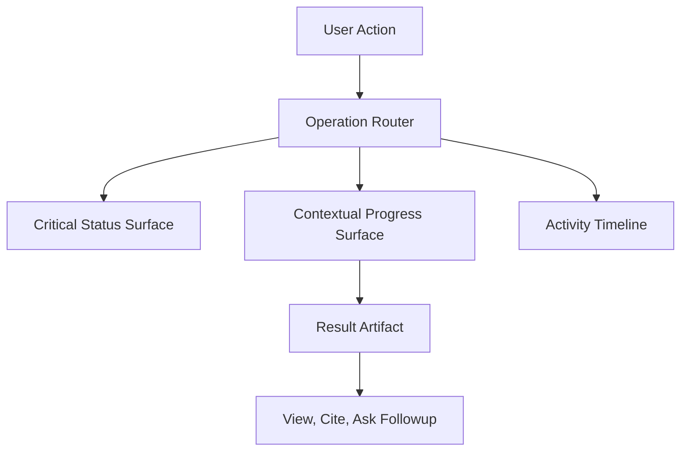
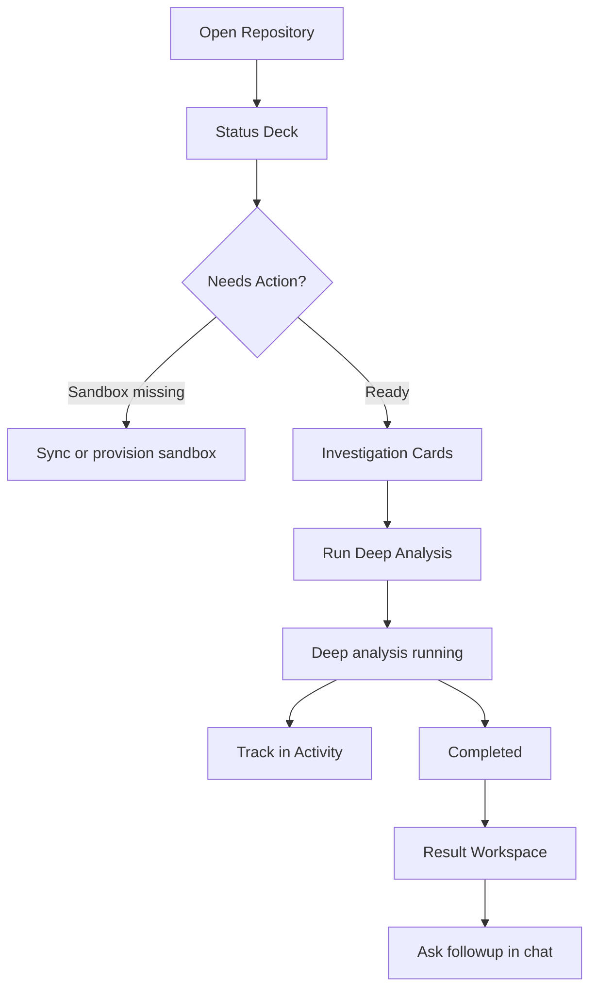

# Background Operations UX Redesign

## Design Direction
採用「industrial command center」方向：冷靜、精準、可觀測，但不壓迫使用者。核心不是顯示所有 job，而是回答三個問題：

- 這個 repo 現在能不能用？
- 有哪些我剛啟動的事情正在跑？
- 完成後結果在哪裡、下一步可以做什麼？

視覺上避免 generic popover。改成有層次的 repository operating surface：repo header 給能力狀態，右側 workspace 給 artifact/result，底部或側邊 activity rail 給完整背景活動。

## New Information Architecture

## Surface 1: Repository Status Deck
取代目前零散的 top bar 狀態。放在 repository workspace 上方，像一張 compact command card。

內容分三個槽：

- `Repository intelligence`：import/sync/indexing 狀態，顯示 `Ready`、`Syncing`、`Indexing`、`Failed`。
- `Live sandbox`：sandbox 是否 ready、expired、starting、failed，直接影響 Sandbox chat / Deep Analysis / Failure mode。
- `Deep analysis`：latest result + active job 狀態，例如 `Not run yet`、`Running focused inspection`、`Completed 12m ago`、`Failed`。

這一層只顯示會影響使用者下一步能力的背景工作，不顯示 webhook、lease recovery、chunk persistence。

涉及檔案：
- [src/components/top-bar.tsx](src/components/top-bar.tsx)
- [src/components/repository-shell.tsx](src/components/repository-shell.tsx)
- [convex/repositories.ts](convex/repositories.ts)

## Surface 2: Operation Launchers
把「Run deep analysis」從三點選單提升成具體工作卡，不再像隱藏功能。

建議在 repo workspace 有一個 `Investigate` 區塊：

- `Deep Analysis`：針對整個 repo 產出 reusable intelligence。
- `Architecture Diagram`：針對目前 thread/repo 產生結構圖。
- `Failure Mode Scan`：針對 subsystem 做 sandbox-backed risk analysis。
- `Capture ADR`：從目前對話沉澱決策。

每張卡需要清楚標示：

- 需要什麼前置條件：repo indexed、sandbox ready、thread attached。
- 會產生什麼結果：repository artifact 或 thread artifact。
- 預期時間/成本感：例如 `Usually takes a few minutes`。
- 若已有 active job，卡片進入 running state，不讓使用者重複啟動。

涉及檔案：
- [src/components/deep-analysis-dialog.tsx](src/components/deep-analysis-dialog.tsx)
- [src/components/artifact-panel.tsx](src/components/artifact-panel.tsx)
- [src/hooks/use-repository-actions.ts](src/hooks/use-repository-actions.ts)

## Surface 3: Activity Timeline
取代目前 generic `JobsPopoverButton` 的 debug-like list。設計為可打開的 activity timeline，使用人類可讀的 operation labels。

例：

- `Importing repository` instead of `import`
- `Deep analysis` instead of `deep_analysis`
- `Assistant reply` instead of `chat`
- `Failure mode scan` instead of raw kind/stage

Timeline row 應該包含：

- readable title
- status chip
- stage description
- started/finished time
- failure reason
- result CTA：`View analysis`、`Open artifact`、`Retry sync`

這層是「可查看」，但不應該主動打擾。badge 只計算 user-relevant active jobs，不包含系統維護型工作。

涉及檔案：
- [src/components/jobs-popover-button.tsx](src/components/jobs-popover-button.tsx)
- [src/components/job-row.tsx](src/components/job-row.tsx)
- [convex/repositories.ts](convex/repositories.ts)

## Surface 4: Artifact Workspace
右側不只是 artifact list，而是「Results workspace」。把 artifacts 分成兩個層級：

- Repository intelligence：`manifest`、`deep_analysis`，跨 thread 可重用。
- Thread outputs：`architecture_diagram`、`adr`、`failure_mode`，跟目前 conversation 綁定。

Deep analysis 完成後應該被高亮為 newest repository intelligence，並提供：

- `View analysis`
- `Ask about this analysis`
- `Use in chat context` 的可見提示

目前 [src/components/artifact-panel.tsx](src/components/artifact-panel.tsx) 已有 kind dispatcher，可以延伸成分區 renderer，而不是單一垂直列表。

## Interaction Flow

## Implementation Phases

Phase 1: Make existing UX clearer without layout upheaval
- Add readable job labels and better stage copy.
- Add success feedback after deep analysis starts.
- Add active deep analysis status to repo detail response.
- Add `View analysis` CTA when latest deep analysis artifact exists.

Phase 2: Replace jobs popover with Activity Timeline
- Build `ActivityTimeline` component.
- Map raw jobs to user-facing operation models.
- Group jobs by active / recent / failed.
- Add result links for jobs with artifacts.

Phase 3: Introduce Repository Status Deck
- Move import/sync, sandbox, and deep analysis status into one top-level repo status surface.
- Reduce hidden actions in the three-dot menu.
- Make disabled states explain themselves inline.

Phase 4: Rebuild Artifact Panel as Results Workspace
- Split repository intelligence from thread outputs.
- Add custom renderers for `deep_analysis`, `adr`, and `failure_mode`.
- Add follow-up actions from artifacts into chat.

## UX Rule Of Thumb

- If a background operation changes whether the user can use a capability, show it in the Status Deck.
- If the user explicitly started it, show contextual progress where they started it.
- If it only matters for audit/debug/history, put it in Activity Timeline.
- If it produced knowledge, surface the artifact as a result, not as a completed job row.
