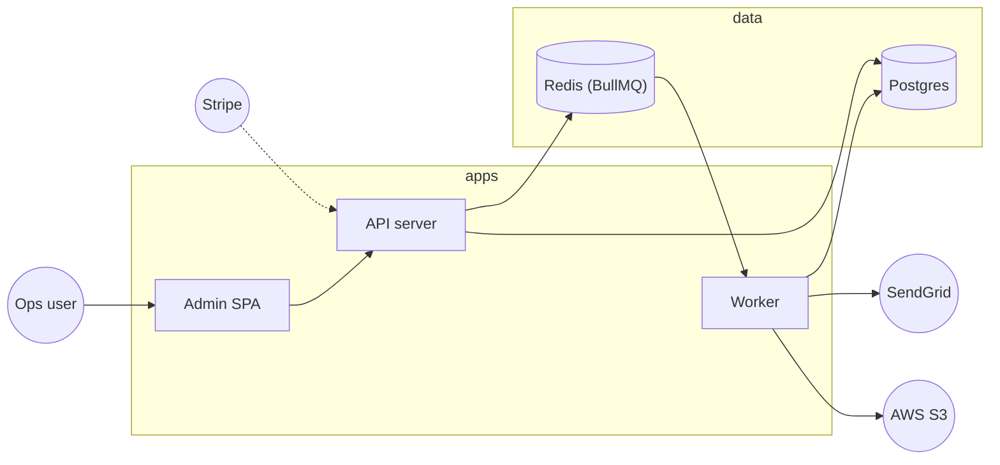

# Architecture Diagram

This diagram covers the request and event paths of acme-billing as they appear in code. It deliberately omits operational paths (metrics, log shipping) — those live in the Operations Overview.

## Legend

- Solid arrows (`-->`) are in-process or in-cluster calls.
- Dotted arrows (`-.->`) cross a network boundary into an external service.
- Rectangles are application processes; cylinders are data stores; circles are external services.
- The `apps` subgraph groups the three runnable apps; the `data` subgraph groups the persistence layer.

## Reading guide

- `apps/api/src/index.ts` — Express entry point, backs the `api` node.
- `apps/worker/src/index.ts` — BullMQ worker boot, backs the `worker` node.
- `apps/admin/src/main.tsx` — Vite entry, backs the `admin` node.
- `apps/api/src/stripe/webhook.ts` — origin of the `stripe -> api` dotted edge.
- `apps/worker/src/jobs/dunning.ts` — origin of the `worker -> sendgrid` dotted edge.
- `apps/worker/src/reports/revenue.ts` — origin of the `worker -> s3` dotted edge.
- `packages/db/src/schema.ts` — schema behind the `postgres` cylinder.
