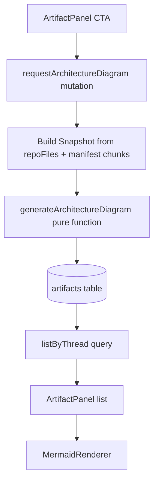

# Architecture Diagram Artifact System Design

## Purpose

This document explains the system design behind architecture diagram artifacts, including:

- deterministic backend generation
- bounded rendering complexity
- thread-scoped artifact access
- resilient frontend rendering and recovery

The goal is to keep diagram generation predictable under growth, while making failures isolated and recoverable.

## Why This Is System Design

This feature is not only a UI addition. It defines stable cross-layer boundaries:

1. **Domain boundary**: architecture diagrams are first-class artifacts with ownership and parent invariants.
2. **Compute boundary**: diagram generation is a pure function over a repository snapshot.
3. **Capacity boundary**: output complexity is capped so rendering and storage stay bounded.
4. **Failure boundary**: render failures stay local to one artifact card and can recover on source change.

## Design Goals

The design optimizes for:

1. deterministic output for the same repository snapshot
2. bounded cost for backend reads and frontend rendering
3. strict owner-scoped access to thread artifacts
4. low coupling between Convex transaction concerns and graph-generation logic
5. extensibility for future artifact kinds (FMA, deployment overview, etc.)

## Chosen Architecture

### 1) Mutation as orchestration layer

`requestArchitectureDiagram` owns:

- identity checks (`thread` and `repository` ownership)
- snapshot assembly from bounded repository data
- artifact persistence (`kind = architecture_diagram`)

It does **not** own graph heuristics.

### 2) Pure generator as domain engine

`generateArchitectureDiagram(snapshot, depth)` is intentionally pure:

- no database access
- no runtime side effects
- deterministic ordering and stable node-id allocation

This makes snapshot testing meaningful and keeps design logic independently evolvable.

### 3) Public query with owner checks

`artifacts.listByThread` is the public read API:

- validates viewer ownership
- returns bounded newest-first artifacts for a thread

Internal artifact-store queries remain private and are not exposed directly to the client.

### 4) Kind-dispatch rendering in UI

`ArtifactPanel` uses a renderer map by artifact kind:

- `architecture_diagram` -> `MermaidRenderer`
- fallback renderer for unknown kinds

This keeps panel shell logic stable while allowing future specialized renderers.

## Key Invariants

### Parent invariant for artifacts

An artifact must belong to at least one parent (`threadId` or `repositoryId`).

### Correct module-depth edge target

Entrypoint edges must connect to the **actual rendered service container**:

- service node when no submodule exists
- service subgraph when submodules exist

This avoids ghost nodes and preserves graph correctness.

### Global cap for file-depth nodes

File-depth rendering uses both:

- per-group cap
- global cap

Both service files and root files share the same cap strategy so final output remains bounded.

### Error-boundary recovery invariant

Mermaid rendering errors are isolated per card and must recover when `source` changes.  
The boundary resets its error state on source updates.

## Capacity and Performance Strategy

### Backend

- `repoFiles` snapshot read is bounded (`take(REPO_FILE_LIMIT)`).
- external dependency extraction from manifest chunks is bounded.
- generated external dependency nodes are capped with overflow indicator.

### Frontend

- Mermaid is lazy-loaded (`import('mermaid')`) to avoid polluting initial bundle.
- rendering uses strict security mode.
- failure fallback prevents one bad diagram from breaking the panel.

## Maintainability Decisions

1. **Pure function boundary** keeps domain logic testable and refactor-friendly.
2. **Shared cap helper** prevents duplicated truncation logic drifting apart.
3. **Renderer map pattern** supports new artifact kinds with minimal blast radius.
4. **Focused tests on invariants** protect graph correctness and boundedness during future iterations.

## Tests That Guard the Design

The architecture diagram tests cover:

- stable snapshots for each depth (`service`, `module`, `file`)
- deterministic output across repeated invocations
- module-depth entrypoint linkage for services without submodules
- file-depth global cap behavior when root files exist
- external dependency truncation behavior

These tests protect long-term contracts rather than incidental implementation details.

## Result

The current design provides:

- deterministic and bounded diagram generation
- correct graph semantics across depth modes
- resilient UI behavior under malformed diagram output
- a clean extension point for additional artifact types

This is a system-design concern because it establishes durable boundaries and invariants across data model, compute pipeline, and user-facing rendering.
