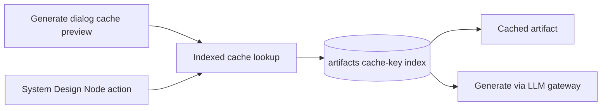

# System Design Generation

## Why this exists

Design Docs generation (implemented internally as System Design generation) is a
background job that writes selected reusable Markdown artifacts
(`readme_summary`, `architecture_overview`,
`architecture_diagram`, `data_model_overview`, `api_surface_overview`,
`deployment_overview`, `security_overview`, `operations_overview`) into the
repository's Library so later Library Ask and Discuss replies can cite them.
Each artifact is produced by a sandbox-grounded LLM session — the prompt list
lives in `convex/lib/systemDesignPrompts.ts` and the matching folder tree is
seeded at repository import time.

A full eight-template publication runs roughly seven to ten minutes end-to-end. That is long
enough to bump against the Convex action timeout, expensive enough that
identical re-runs must not re-charge the user, and varied enough that failures
can come from the sandbox, the provider transport, the model output itself, or
our own backend. The design therefore needs three properties up front:
**idempotency** (the same input produces no extra LLM spend), **observability**
(every attempt is recorded so cost and quality can be measured) and
**auto-resume** (an action that runs out of clock can pick up where it left
off without losing the kinds that already finished).

A separate per-repository dedup keeps two callers from racing the same
publication — the second caller appends any newly selected templates to the
active job rather than spawning a parallel run.

## How it works

The entry-point mutation is `requestSystemDesignGeneration`
(`convex/systemDesign.ts`). It validates repository ownership, feature
entitlements, the selected kind set, the optional `(provider, modelName)` pair,
and the optional reasoning-effort override through the System Design planning
helpers in `convex/lib/systemDesignPlanning.ts`. New jobs bake
`provider`/`modelName`/`reasoningEffort` onto the `jobs` row so resumes and
cache probes use the same model fingerprint as the original request. The job
carries `selections` so a resume can recover the original request.

Before consuming request-rate buckets or inserting a new row, the mutation
checks `findActiveLibrarySystemDesignJob` (`convex/systemDesign.ts`). If a
queued/running `system_design` job already exists for the repository, the
mutation appends newly selected templates that are not already queued/generated
and returns that job's id. Per-repository dedup is intentional: the scope key
is the repository, not the user, so a future shared-repository model inherits
the behaviour automatically.

Only a new job consumes the per-user System Design request bucket and the
Daytona global request bucket. It then ensures the default internal System
Design folder tree exists, enqueues a `system_design` job with an initial lease,
patches the locked model choice onto the row, and schedules
`systemDesignNode.runSystemDesignGeneration`.

The action `runSystemDesignGeneration` (`convex/systemDesignNode.ts`) performs
the orchestration. After a one-time sandbox preparation through
`prepareSandboxLibraryGeneration` / `ensureSandboxReady` (which reports each
stage back through `updateGenerationProgress`), it iterates the selected
templates serially and re-reads the job selections between generated docs so
new selections appended to the active job can be picked up. Each selected kind
is delegated to `runSystemDesignKind` in `convex/systemDesignKindRun.ts`.

### Per-kind lifecycle

For each selected kind, `runSystemDesignGeneration` refreshes the job lease and
then calls `runSystemDesignKind`. The kind-run module owns the following
per-kind lifecycle:

1. **Refresh the lease.** `refreshGenerationLease`
   (`convex/systemDesign.ts`) extends `leaseExpiresAt` by
   `SYSTEM_DESIGN_JOB_LEASE_MS` so the stale-job sweep does not preempt the
   action while it is still making progress.
2. **Cache probe.** When `forceRegenerate` is `false` and the repository has a
   `lastSyncedCommitSha`, the kind runner calls `findCachedArtifact`
   (`convex/systemDesign.ts`) with the full tuple `(repositoryId, kind,
   alignedImportCommitSha, generatedByProvider, generatedByModel,
   promptVersion)`. The lookup uses the exact compound
   `artifacts.by_repo_kind_commit_provider_model_promptVersion`
   index and returns the newest matching artifact. A match short-circuits the
   LLM call entirely: the run status becomes `cached_hit` and the cached
   artifact id flows into the same Publication Settlement seam used by
   generated output. There is no separate cache table — the artifact itself is
   the cache.
3. **Usage reservation and cost pre-check.** `assertKindCostBudget`
   (`convex/systemDesign.ts`) calls
   `reserveSandboxLibraryGenerationBudget`, which performs the sandbox daily
   cap pre-check and reserves the viewer's usage-budget estimate when that
   policy is active. Cap denials are classified as `transport_rate_limit` by
   the kind-run failure classifier so the banner can reuse the provider
   rate-limit copy.
4. **Gateway call.** `generateViaGateway` is invoked with the locked
   `(provider, modelName)` from `getJobModelChoice`
   (`convex/systemDesign.ts`), the kind's prompt suffixed with the step
   budget reminder (`budgetSuffix` in `convex/lib/systemDesignPrompts.ts`),
   and `stopWhen: stepCountIs(config.stepBudget)`. Tools are the same
   `read_file`/`list_dir`/`run_shell` factory the chat path uses, bound to the
   sandbox returned by `ensureSandboxReady` so per-kind LLM passes consume
   `prepared` directly with no extra DB hit.
5. **Quality gate.** `validateRequiredSections`
   (`convex/lib/systemDesignPrompts.ts`) checks the markdown contains every
   H2 section listed in `EXPECTED_SECTIONS` for the kind. For
   `architecture_diagram` the kind runner additionally runs `validateMermaidBlock`
   to confirm at least one fenced ` ```mermaid ` block. Failure sets
   `runStatus = "quality_rejected"` and records the missing sections.
6. **Publication Settlement.** `finalizeKindPublication`
   (`convex/systemDesign.ts`) receives one terminal outcome from the kind-run
   module: `cached_hit`, `generated`, `quality_rejected`, or `failed`. The
   settlement module validates that the repository is still owned by the
   requester, still active, and attached to a running `system_design` job with
   a live lease before writing any artifact or kindRun row.

   - `cached_hit` validates that the cached artifact still belongs to the same
     owner, repository, and kind, inserts a `cached_hit` kindRun with
     `artifactId`, and skips cost settlement because the artifact was paid for
     by its original generation. It does not patch the cached artifact's
     `kindRunId`.
   - `generated` resolves the destination folder from
     `SYSTEM_DESIGN_KIND_TO_FOLDER`, replaces the prior artifact of the same
     kind in that folder through the low-level artifact write helper, inserts
     a `succeeded` kindRun with the new `artifactId`, settles actual usage and
     cost using `systemDesign:${jobId}:${kind}:${startedAt}`, then patches the
     new artifact's `kindRunId` back-reference.
   - `quality_rejected` and `failed` insert kindRun rows without artifacts and
     settle actual usage/cost when available. Failed outcomes with a
     `failureLog` also append `jobs.kindFailures`.

   If the active write target disappeared after paid LLM output was produced
   (repository archived/deleted, job no longer running, or lease expired), the
   module settles actual usage/cost for non-cache outcomes but writes no
   artifact, kindRun, or job failure. An inactive `cached_hit` aborts without
   settlement.
7. **Per-kind metrics.** `emitMetric` calls surface
   `systemdesign_kind_duration_ms`, `systemdesign_kind_steps_used`,
   `systemdesign_kind_cost_usd`, `systemdesign_kind_tokens`, and
   `systemdesign_kind_failed` so the observability stream carries the same
   shape per kind. Cache hits emit `systemdesign_kind_cache_hit` separately.

After each kind finishes (success, cache hit, or fail), the action re-reads the
current job selections, then calls
`updateGenerationProgress` to push the `n/total` stage label and
`completedCount/totalCount` ratio to the UI subscription.

### Idempotency key

The artifact's `(repositoryId, kind, alignedImportCommitSha,
generatedByProvider, generatedByModel, promptVersion)` tuple is the cache
key. Both the Generate dialog cache preview and the Node action share the
same indexed lookup helper, so preview and execution agree on what counts as
a hit:



Same commit and same provider, model, and prompt version means
`findCachedArtifact` finds the newest matching row and the next run is free.
Rows missing any cache metadata field do not count as hits, which keeps
pre-cache historical artifacts conservative. Bumping any component invalidates
the cache: a new commit re-runs against the fresh tree, a different provider
re-runs because the fingerprint moves, a `promptVersion` bump in
`SYSTEM_DESIGN_PROMPT_VERSIONS`
(`convex/lib/systemDesignPrompts.ts:212`) re-runs every kind whose prompt was
edited. The snapshot test `promptShape.test.ts` fails the suite when a
prompt edit lands without a matching version bump, so prompt churn cannot
silently invalidate caches.

### Step budget and model pinning

`STEP_BUDGET_BY_KIND` (`convex/lib/systemDesignPrompts.ts:293`) ships uniform
at 20 across every kind. The budget is enforced both as `stopWhen:
stepCountIs(...)` and via the `budgetSuffix` instruction appended to the
system prompt. The bundle of `(prompt, promptVersion, expectedSections,
stepBudget)` is read once per kind through `getKindRunConfig`
(`convex/lib/systemDesignPrompts.ts:310`) so a stale read against a partial
update cannot mix configs.

The `(provider, modelName)` pair is picked once at
`requestSystemDesignGeneration` time and stored on `jobs.provider` /
`jobs.modelName`. Every kind reads it back via `getJobModelChoice` so a
stale-recovery resume picks up exactly the same pair — the cache key stays
consistent across attempts. Different jobs may use different providers; within
one job all kinds use the same.

## Failure modes & recovery

### Action timeout and auto-resume

An eight-kind run at roughly 90 seconds per kind sums to about 12 minutes,
which exceeds the Convex action ceiling. When the action dies mid-run, the
job row's lease expires and the every-5-minute stale-recovery sweep
(`opsNode.reconcileStaleInteractiveJobs`) hands the row to
`recoverStaleSystemDesignJob` (`convex/systemDesign.ts:459`).

That mutation collects every `systemDesignKindRuns` row for the job and
splits selections by terminal status using `KIND_RUN_TERMINAL_STATUSES`
(`convex/systemDesign.ts:74`):

- If at least one kind remains and `resumeAttempts < MAX_RESUME_ATTEMPTS`
  (default 2), the row is patched back to `queued`, `resumeAttempts` is bumped,
  the lease is refreshed, and the action is re-scheduled with the same
  selections and `forceRegenerate: false`. On the resume the cache probe at
  step 2 short-circuits every already-completed kind, so the new attempt only
  pays for the missing ones.
- If no kind is left or the resume cap has been hit, `failStaleActiveJob`
  marks the row failed with either `STALE_SYSTEM_DESIGN_RESUME_EXHAUSTED_MESSAGE`
  or `STALE_SYSTEM_DESIGN_JOB_ERROR_MESSAGE`. The cap is a loop guard: a job
  that keeps stalling is signal of a deeper bug rather than something the
  retry loop should absorb forever.

`quality_rejected` is treated as terminal for resume purposes. Re-running the
same `(prompt, model, commit)` is overwhelmingly likely to reproduce the same
rejection — escape requires bumping `promptVersion` or picking a different
model. `failed` is intentionally *not* terminal so a transient transport blip
on attempt N still has a shot on attempt N+1.

### Per-kind failure taxonomy

`convex/lib/systemDesignFailures.ts` owns the persisted
`SystemDesignFailureReason` literals. The same taxonomy Module exports the
schema-safe validator used by `jobs.kindFailures[].reason` and
`systemDesignKindRuns.failureReason`, so adding a new reason has one schema
seam instead of separate schema / mutation copies.

Runtime reasons come from two paths. `classifySystemDesignKindRunError`
(`convex/lib/systemDesignFailureClassification.ts`) translates exceptions into
transport/source/infra reasons, while the quality gate records
`output_quality` directly when generated text fails required-section or Mermaid
validation. The active persisted reasons are:

- `live_source_unavailable` — `SandboxPreparationError` reached the per-kind
  catch (the sandbox or repository data was missing or unreachable). Should
  not normally reach this branch because sandbox prep failures are caught
  higher up, but kept defensively.
- `model_empty_output` — the model returned no usable text, either via the
  zero-length-trim branch or the legacy `empty document` substring match.
- `transport_rate_limit` — either `LlmRateLimitError` (gateway-level RPM or
  concurrency denial) or `APICallError` with status 429 (provider exhausted
  retries inside `withLlmRetry`). The cost-cap throw also folds into this
  bucket so the banner copy works without sniffing the error class.
- `transport_other` — non-429 `APICallError` (5xx, network without status,
  other 4xx).
- `output_quality` — not returned by `classifySystemDesignKindRunError`; set by
  the explicit quality-gate branch when `validateRequiredSections` or
  `validateMermaidBlock` rejects otherwise non-empty model text. The rejected
  sections are persisted on the kindRun row's `missingSections` field.
- `infra` — the catch-all for anything else (Convex mutation crash, schema
  validation, our-side bug). Engineering is paged through the standard
  `logErrorWithId` path.

Per-kind failures are isolated. The catch builds a `failed` publication
outcome with the classified `failureReason` and optional failure log; the
Publication Settlement module appends `jobs.kindFailures` when that log is
present, inserts the failed kindRun row, settles actual usage/cost when
available, and the for-loop continues to the next kind. Only
sandbox-preparation failure at the top of the action fails the whole job.

### Banner mapping

`SystemDesignStatusBanner`
(`src/components/system-design-status-banner.tsx:50`) subscribes to
`getLatestSystemDesignJob` and renders one of three branches. For failures it
calls `describeRepositoryGuideFailure`
(`src/lib/repository-guide-failures.ts`), which deduplicates the
`kindFailures[].reason` set and renders the matching copy from
`REASON_TEXT_BY_KIND`:

- `transport_rate_limit` → "The provider rate-limited the run. Wait a couple
  of minutes…"
- `output_quality` → "Some design docs came back without the required content.
  Retrying usually fixes this — open the details if it persists."
- `transport_other` → generic transport / 5xx copy with an error-id pointer.
- `infra` → "An internal error stopped the run. Engineering has been
  notified…"
- `live_source_unavailable` → "Live access to the repository wasn't available
  when this ran. The next attempt will prepare it first."
- `model_empty_output` → "The model didn't produce a complete design doc. The
  next attempt may succeed."

When multiple reasons appear, the banner falls back to `REASON_TEXT_MIXED`.
The retry button preserves the original job's `(provider, modelName)` when
both are present, so a "Generate N documents" click runs against the same
pair the original attempt used — important for cache continuity.

### Concurrent regeneration

Cross-user races against the same repository are eliminated by the
per-repository dedup in `requestSystemDesignGeneration` — a second
in-flight call appends newly selected templates to the existing job instead of
starting a second publication.

## Future evolution

- **Per-kind step-budget differentiation.** `STEP_BUDGET_BY_KIND` ships
  uniform at 20 until the eval harness produces enough data to show certain
  kinds (typically `architecture_diagram` or `data_model_overview`) need a
  different ceiling. The bundle layout in `getKindRunConfig` already isolates
  the step budget per kind, so changing values is a one-line table edit.
- **Per-kind model overrides.** Today the job's `(provider, modelName)` is
  uniform across every kind. The catalog passthrough
  (`listAvailableModels`) and the dialog's picker already support selecting
  alternate models; per-kind overrides become viable once the eval data shows
  systematic per-kind quality differences between models.
- **Mid-kind resume.** The current auto-resume granularity is per-kind because
  the AI SDK does not expose a step-level resume API. Revisit only if
  provider APIs change.
- **`@convex-dev/workflow`.** Was considered as the orchestrator and rejected.
  The artifact-cache-as-checkpoint pattern already achieves equivalent
  robustness at per-kind granularity, and a workflow runtime would add a
  second persistence layer for state the cache key already encodes.
