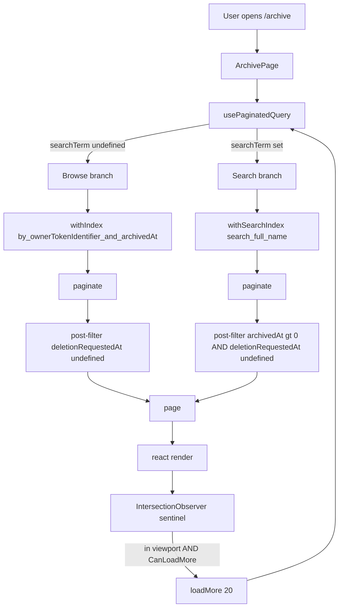

# Archive Listing System Design

## Purpose

This document explains how the `/archive` page lists archived repositories at SaaS scale: cursor-paginated infinite scroll for browsing, full-text search with the same pagination contract, and a five-state UI state machine that keeps loading, empty, and no-match conditions distinct.

The scope is the data path from `convex/repositories.ts:listArchivedRepositories` through `convex/schema.ts:repositories.searchIndex("search_full_name")` to `src/pages/archive.tsx`. It is not a redesign of archive/restore/delete mutations or of repository tenant isolation.

## Problem Statement

The archive view has three properties that pull the design in different directions:

- **Volume is unpredictable.** A power user with many imports can accumulate hundreds or thousands of archived rows over time. A naive `.collect()` or even a 200-row `.take()` cap eventually breaks: the page becomes a 15,000+ pixel scroll with no way to find a specific repo.
- **The list is a destination, not a hot path.** Users visit it occasionally to restore something or to reclaim disk space, then leave. Optimization budget should match that — correct and predictable, not aggressively tuned for sub-100ms hot loops.
- **Archive/restore mutations need to feel live.** A user who clicks "Restore" expects the row to disappear without a manual refresh. Reactivity is non-negotiable for the browse path.

A single `useQuery` returning all rows handles small archives but fails on the first two points. A pure paginated query handles volume but makes search a second-class feature. A purely client-side filter on a paginated browse list can never search rows that haven't been loaded yet.

## Solution Constraints

- **Convex is the only backend.** Subscriptions are reactive; there is no separate request/response layer to add caching against.
- **Convex paginated search queries are non-reactive.** This is a platform-level limitation: search-index pagination cannot subscribe to mid-query data changes.
- **Tenant isolation is mandatory.** Every read must scope by `ownerTokenIdentifier`; the search index needs the same guarantee, not just an index range.
- **No new schema field for archive state.** Adding a denormalized `isArchived: boolean` would require a migration plus careful maintenance in archive/restore/delete mutations. The existing `archivedAt` timestamp is sufficient if the query handler post-filters correctly.
- **Mobile is a first-class viewport.** Page-level scroll, sticky header, full-width inputs and buttons, no horizontal overflow.

## Alternatives Considered

### React Query on top of Convex

Use `@tanstack/react-query` for the pagination cache and call Convex via the HTTP query API. **Rejected** because Convex queries are reactive subscriptions, not request/response. React Query's cache invalidation and `useInfiniteQuery` cursor protocol fight against the live subscription model — `useQuery` already de-dupes, caches, and re-subscribes; layering a second cache adds incoherence without adding capability.

### Pagination only, search filtered client-side

Paginate browsing; do `String.includes` on whatever pages have loaded. **Rejected** because search becomes silently incomplete: "I archived `acme/payments-old` last year" returns nothing until the user has manually scrolled deep enough to load that page. SaaS-grade search must reach rows the user has never seen.

### Substring search via `.filter()` on the regular index

Skip the search index, scan the `by_ownerTokenIdentifier_and_archivedAt` index page-by-page, and apply a JS substring check in the handler. **Rejected** for two reasons. The Convex guidelines explicitly forbid `.filter()` in queries because the cost grows with table size. And the latency for matching rows in the deep tail of a large archive becomes unbounded — a user searching `"old-thing"` could trigger an effective full scan.

### Denormalized `isArchived` boolean as a search-index filter field

Add `isArchived: v.boolean()`, maintain it from archive/restore/delete mutations, list it in `searchIndex.filterFields`. Search results are then exact at the index layer with no post-filter. **Rejected for now** because the migration cost (backfill plus mutation edits plus rollout coordination) outweighs the benefit at current scale. The chosen post-filter design preserves correctness; the upgrade is straightforward if telemetry later shows the search index missing deep-archive results.

### Search index plus paginated query with handler-level post-filter (chosen)

Use `withSearchIndex("search_full_name", q => q.search(...).eq("ownerTokenIdentifier", id))` for search and `withIndex("by_ownerTokenIdentifier_and_archivedAt")` for browse. Both end in `.paginate(args.paginationOpts)`. The handler post-filters for `archivedAt > 0` and `deletionRequestedAt === undefined`. The frontend uses `usePaginatedQuery` and IntersectionObserver-driven infinite scroll.

## Core Decision

`listArchivedRepositories` is a single paginated query with two execution branches selected by whether `searchTerm` is set:

| Branch  | Index used                                  | Reactivity                | Order            |
| ------- | ------------------------------------------- | ------------------------- | ---------------- |
| Browse  | `by_ownerTokenIdentifier_and_archivedAt`    | Reactive (live updates)   | `archivedAt` desc |
| Search  | `search_full_name` (text)                   | Non-reactive (per Convex) | Relevance        |

Both branches return the same `{ page, isDone, continueCursor }` shape, so the frontend uses one `usePaginatedQuery` call regardless of mode. The cursor advances against the underlying scan, not against the post-filtered output, which means a page may surface fewer rows than `numItems` but pagination still terminates correctly via `isDone`.

## Architecture

## Implementation

### Schema — `convex/schema.ts`

A `searchIndex("search_full_name", { searchField: "sourceRepoFullName", filterFields: ["ownerTokenIdentifier"] })` is added to the `repositories` table. The filter field is what enforces tenant isolation at the index layer; without it, search would scan across all users' rows and post-filter would be doing access control, which is the wrong layer.

The index is intentionally generic — it does not encode "archived" — because filter fields support equality only. Encoding archive state would require a denormalized boolean and a migration. Keeping the index generic and post-filtering in the handler makes the index reusable by future surfaces (e.g., a global repo search) without further schema change.

### Backend query — `convex/repositories.ts:listArchivedRepositories`

The query takes `paginationOpts: paginationOptsValidator` and `searchTerm: v.optional(v.string())`. The handler:

1. Calls `requireViewerIdentity` to get the caller's `tokenIdentifier`.
2. If `searchTerm.trim()` is non-empty, runs the search branch: `withSearchIndex(...).paginate(...)` then post-filters for archived + non-deleted.
3. Otherwise runs the browse branch: `withIndex(...).order("desc").paginate(...)` then post-filters for non-deleted.

Post-filtering happens on the materialized page only — never inside the index range — so it does not bypass the Convex guideline against `.filter()`. The cursor is opaque to post-filtering: subsequent `loadMore` calls receive `continueCursor` from the underlying scan, not from the filtered result, so pagination remains correct even when post-filter trims many rows from a single page.

### Frontend — `src/pages/archive.tsx`

`usePaginatedQuery(api.repositories.listArchivedRepositories, { searchTerm }, { initialNumItems: 20 })` drives the view. When `searchTerm` changes, Convex's client restarts pagination; the previous results are discarded and `status` returns to `"LoadingFirstPage"`.

Infinite scroll uses an `IntersectionObserver` watching a 1-pixel sentinel rendered after the last list item. The observer is configured with `rootMargin: "320px 0px"` so `loadMore` fires before the user reaches the visible bottom — the next page is already in flight by the time the existing rows finish scrolling past. The observer is keyed only on `canLoadMore`; the `onLoadMore` callback is held in a stable ref to avoid tearing down and rebuilding the observer on every render.

### View state machine

Five terminal states, deterministically derived from `(isSearching, isLoadingFirstPage, isExhausted, archived.length)`:

| Condition                                                     | View                                                               |
| ------------------------------------------------------------- | ------------------------------------------------------------------ |
| Not searching, first page loading, no rows yet                | Full skeleton (description placeholder + 4 row placeholders)       |
| Not searching, exhausted, zero rows                           | Empty-archive hero (large icon, title, copy, "Back to chat" CTA)   |
| Searching, first page loading                                 | Search-pending card with spinner                                   |
| Searching, settled, zero rows                                 | No-matches card (echoes the query, "Clear search" button)          |
| Otherwise                                                     | Description + search input + list + sentinel + footer state        |

The footer state is itself a small machine: spinning "Loading more" while `isLoadingMore`, "End of archive · N repositories" once `isExhausted` and the list grew past the initial page, otherwise nothing.

## Tenant Isolation Invariants

- The search index includes `ownerTokenIdentifier` as a filter field. The handler always calls `q.eq("ownerTokenIdentifier", identity.tokenIdentifier)` against the search index — no other code path is allowed.
- The browse index begins with `ownerTokenIdentifier`, so the index range itself enforces isolation; the post-filter never has to.
- Both branches resolve `identity` from `requireViewerIdentity`, which throws on missing auth. There is no anonymous read path.

`convex/repositories.archive.test.ts` includes a multi-tenant search test: two users archive a repo with the same name, and a search by user A returns only user A's row.

## Failure Modes

- **Search index has not finished building.** A newly deployed search index can take a moment to populate. During that window, search returns empty pages. The view renders the no-matches state, which echoes the query — an honest, not-broken-looking signal. Browse mode is unaffected because it uses an existing regular index.
- **Convex paginated search returns the page before all post-filter matches surface.** Because post-filter excludes some rows, a page of `numItems` raw matches may yield fewer post-filtered matches. The user sees a slightly shorter page; the sentinel triggers `loadMore` once that shorter page settles, so the experience remains continuous. Worst case, multiple consecutive shrunken pages compress the visual scroll, but the sentinel keeps loading until `isDone`.
- **`loadMore` invoked while the previous batch is still loading.** Convex's client deduplicates this — concurrent `loadMore` calls collapse into a single fetch. The IntersectionObserver may briefly fire twice on rapid scroll, which is harmless.
- **Searching a deep-tail name that the search index ranks below the result limit.** Convex search indexes return results ranked by relevance up to a fixed limit. A name that appears thousands of rows down for a power user with ~50,000 active repos may not surface even though it exists. **This is a real but bounded edge case.** Mitigation if observed: add the denormalized `isArchived` filter field (the migration described in "Alternatives Considered") so search ranks only among archived rows.
- **Network dies mid-pagination.** `usePaginatedQuery.status` flips to a paused state. The footer shows nothing, the sentinel keeps observing but `canLoadMore` is false. When the connection returns, status flips back and the next intersection resumes loading. No retry logic is needed in the page itself.

## Performance Considerations

- **Initial page is 20 rows.** Each row is small (~100px), so first paint covers ~2,000 pixels — enough to fill a typical mobile viewport with one row of overscroll, which means the user is unlikely to see the sentinel during the first interaction at all.
- **Subsequent pages are also 20 rows.** Constant page size keeps cursor advancement predictable and avoids amplifying memory pressure on long sessions.
- **No virtualization.** A user scrolling through 1,000 archived repos creates 1,000 DOM nodes, which is well within React's comfort zone for a non-interactive list. Adding `react-window` or similar would interact awkwardly with the IntersectionObserver and the page-level scroll container; the cost is not justified at this scale.
- **No debounce on the search input.** `usePaginatedQuery` re-issues a query on each `searchTerm` change, which is acceptable because Convex de-duplicates rapidly-superseded subscriptions and post-filter cost is bounded by `numItems`. If subscription churn becomes visible in telemetry, a 150ms debounce around `setQuery` is a one-line change.

## Test Plan

### Backend (`convex/repositories.archive.test.ts`)

1. **Browse pagination across cursors.** Seeds five archived repos with strictly increasing `archivedAt`; pages of 2 return `[4,3]`, `[2,1]`, `[0]`; `isDone` flips on the third page.
2. **Listings honour archive state.** A first page returns the archived row only; `listRepositories` excludes it.
3. **Search returns archived matches and excludes active ones.** Three repos sharing a name prefix; an active match is deliberately seeded to confirm post-filter rejects it.
4. **Search excludes pending-deletion repos.** A repo with both `archivedAt` and `deletionRequestedAt` set must not appear.
5. **Search isolates results to the calling user.** Two users with identically-named archived repos; user A's search returns only user A's row.

### Frontend

The page is intentionally not unit-tested at the React level — the value is in the integration of `usePaginatedQuery` with IntersectionObserver, which is hard to fake meaningfully under jsdom and easy to verify by hand. Behavior is covered by manual checks for the five view states and the sentinel-driven load-more transition. If automated coverage becomes necessary, `jsdom` supports `IntersectionObserver` polyfills and Convex's testing utilities can drive `usePaginatedQuery` end-to-end.

## Residual Risk And Tradeoffs

- **Risk reduced:** Archive scales from a few rows to thousands without UI degradation. Search is a first-class operation, not a client-side filter on whatever happens to be loaded. Browse stays reactive across archive/restore/delete mutations.
- **Tradeoff introduced:** Search results are non-reactive (Convex platform limitation). If a user archives a new repo while another tab has a search open, the new repo will not appear until the search is re-issued. The product framing — search is bursty, browse is ambient — makes this tradeoff acceptable.
- **Tradeoff introduced:** Search ranking depends on Convex's text-index relevance model. Power users with large active repos may, in theory, miss deep-tail archived matches. The fallback path (denormalized filter field) is documented above and is a small, well-scoped change when needed.

## Out Of Scope

- Archive/restore/delete mutations — covered by the existing repository lifecycle docs.
- Repository tenant isolation as a general invariant — covered by `auth-and-access.md` and `domain-and-data-model.md`.
- Global cross-user repository search — explicitly excluded; the search index is owner-scoped by filter field.
- Archive sorting controls (e.g., "oldest first", "by name") — not currently a user-facing need; the index supports adding them without further schema change.
- Bulk select / bulk restore / bulk delete — not implemented; would require a separate transaction-batching design given Convex mutation document limits.
