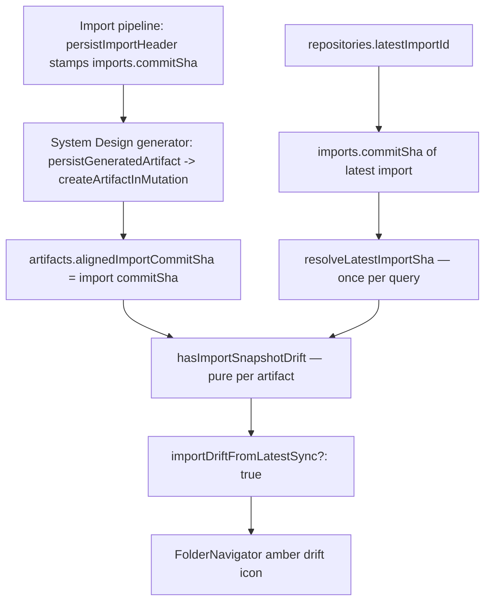

# Artifact Import Drift System Design

## Purpose

This document explains how Systify tells the user that an artifact's prose was
written against an older import of the repository than the one currently
indexed, and why that signal is a single stored SHA compared at read time
rather than a stored flag or a content-level reconciliation.

## The Problem

An `artifacts` row (a `readme_summary`, an `architecture_overview`, a
user-authored Library note) is written once, against the repository tree as it
existed at some import. The repository keeps moving: the user syncs, a new
import lands, `repoFiles` / `repoChunks` are re-indexed from a newer commit.
The artifact's markdown does not move with it.

The product needs to surface "this was written against an older snapshot"
without:

- claiming the artifact is *wrong* — the prose may still be accurate
- conflating this with sandbox verification freshness, which is a different axis
- storing a flag that a second writer has to keep reconciled with the SHAs

## Two Independent Freshness Axes

Artifacts carry two unrelated staleness signals. They must not be merged.

| Axis | Source fields | Question it answers |
| ---- | ------------- | ------------------- |
| **Sandbox verification freshness** (`freshness`) | `lastVerifiedAt` | "Was this checked against a live sandbox, and how long ago?" |
| **Import snapshot drift** (`importDriftFromLatestSync`) | `alignedImportCommitSha` vs latest import SHA | "Has the repository been re-imported since this was written?" |

An `architecture_overview` artifact can be sandbox-verified (`fresh`) and *also*
drifted from the latest import — the two are orthogonal. The UI surfaces them
as separate indicators.

## Chosen Design



### One stored field on the artifact

`artifacts.alignedImportCommitSha` is the only persisted state this feature
adds. It is the commit SHA of the import snapshot the artifact's prose was
anchored to. The System Design generator stamps it on every artifact row it
writes: `persistGeneratedArtifact` (`convex/systemDesign.ts`) forwards the
`alignedImportCommitSha` argument straight through to `createArtifactInMutation`
(`convex/artifactStore.ts`), which sets it on the inserted `artifacts` row.
The import pipeline itself (`persistImportHeader`) writes zero artifact rows —
it only stamps `commitSha` on the `imports` row, and the generator reads that
value when it produces the artifact.

Re-runs of the same kind do not patch the existing row in place. The generator
finds the prior artifact for that `(repositoryId, folderId, kind)`, deletes it
through `deleteArtifactInternal` (so `artifactChunks` cascade with it), and
inserts a fresh row carrying the new `alignedImportCommitSha`. There is no
artifact patch path — only delete-then-insert — so the SHA is always the SHA
of the import the prose was actually generated against.

It is intentionally optional. Legacy artifacts written before this field
existed simply have no value, and produce no drift signal — silence, not a
false positive.

### Comparison is computed at read time

`importDriftFromLatestSync` is not stored. The repository-scoped artifact
queries (`listByRepositoryWithFreshness`, `listMetadataByRepositoryWithFreshness`
in `convex/artifacts.ts`) derive it on each read:

```ts
function hasImportSnapshotDrift(artifact, latestImportSha): boolean {
  if (!artifact.alignedImportCommitSha || !latestImportSha) return false;
  return artifact.alignedImportCommitSha !== latestImportSha;
}
```

The flag is only ever `true` or absent — never `false`. The queries spread it
in conditionally (`...(hasImportSnapshotDrift(...) ? { importDriftFromLatestSync: true } : {})`)
so the wire payload stays minimal and the absent case is unambiguous.

### The latest import SHA is resolved once per query

`repositories.latestImportId → imports.commitSha` is a per-query constant: it
is the same for every artifact in a repository-scoped listing. `resolveLatestImportSha`
fetches it **once**, before the artifact loop. `hasImportSnapshotDrift` is then
a pure function — no `ctx.db` access per artifact.

This is the load-bearing performance rule. An earlier shape resolved the latest
import inside the per-artifact loop, which re-read the same `imports` row up to
`ARTIFACTS_PER_REPOSITORY_LIMIT` (200) times for a single subscription push.
`listMetadataByRepositoryWithFreshness` backs the Library tree subscription —
a hot path — so the per-row read had to go.

### UI surface

`FolderNavigator` (`src/components/folder-navigator.tsx`) renders an amber
`ArrowsClockwiseIcon` (Phosphor v2 naming) next to the artifact title when
`importDriftFromLatestSync` is set, with a tooltip explaining the artifact's
aligned revision differs from the latest sync. It is a low-weight cue, not a blocking state — the artifact
still opens and reads normally.

## Why the Signal Is Coarse

The comparison is repo-wide: *any* new import flags *every* anchored artifact,
even if the commit that triggered the re-import touched files completely
unrelated to that artifact. This is a deliberate v1 trade-off.

A precise signal — "did the code this artifact actually describes change?" —
needs path scope per artifact plus a way to diff file trees between two
imports. That is a separate feature (see Future Work). The coarse signal is
cheap, honest, and never claims more than "the repository moved since this was
written."

## Why `importDriftFromLatestSync` Is Derived, Not Stored

A persisted drift boolean would need at least two writers: the import finalize
step (to set it on existing artifacts when a new import lands) and the artifact
writers (to clear it). Two writers means the flag can disagree with the SHAs —
"drift = true but the SHAs match", with no SSOT to repair from.

Deriving it from `alignedImportCommitSha` and the latest import SHA keeps the
SHAs as the single source of truth. There is no flag to migrate when the rule
changes, and no reconciliation job. This mirrors the `hasRemoteUpdates` decision
in the Repository Remote Freshness Check design.

## Why Not Content-Level Reconciliation

"Is the artifact's prose still accurate?" is a semantic question — it cannot be
answered by comparing SHAs. Attempting it would mean re-running analysis on
every import, which defeats the point of artifacts as durable, reusable prose.
Import drift deliberately answers only the structural question and leaves
accuracy to sandbox verification and to the user's judgement.

## Trade-Offs

### What this design accepts

- the signal is coarse: unrelated commits still flag an artifact as drifted
- a repository that is never re-imported never shows drift, even if its remote moved
- artifacts without `alignedImportCommitSha` are permanently silent until a writer fills it

### What this design avoids

- no stored flag to reconcile against the SHAs
- no per-artifact database read on the Library tree subscription path
- no semantic re-analysis on import
- no coupling to sandbox verification freshness

## Future Work — Path-Scoped Drift

The precise version of this feature would record, per artifact, which code
areas its claims concern, and only flag drift when files under those areas
actually changed between the aligned import and the latest one.

This was scoped out of v1 deliberately, and the placeholder schema field for it
was removed rather than shipped empty. A complete implementation needs all of:

1. **A writer** — realistically only `system_design` generation jobs, which
   know which paths they inspected. Repo-wide overview artifacts
   (`readme_summary`, `architecture_overview`) have no meaningful path scope.
2. **A reader** — drift computation that diffs `repoFiles` (already
   import-scoped via `repoFiles.importId`) under those path prefixes between
   the aligned import and the latest import, within Convex read limits.
3. **UI** — a way to distinguish precise drift from the coarse signal.

When that feature is built, the per-artifact path-scope field returns together
with its writer and reader in one coherent change — not as standalone schema
scaffolding.

## Result

Import drift is one optional SHA on the artifact row, stamped by the System
Design generator (`persistGeneratedArtifact` -> `createArtifactInMutation`)
from the import's `commitSha`, and compared at read time against a
latest-import SHA that is resolved once per query. Every UI state is derived
from those SHAs; there is no stored flag, no reconciliation, and no
per-artifact read on the hot subscription path.
