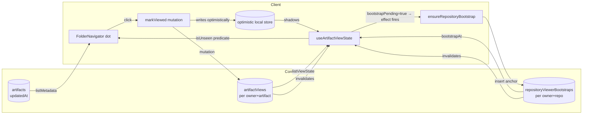

# Artifact View State System Design

## Purpose

This document explains how Systify tracks which artifacts the signed-in
viewer has already opened, so the Library navigator's "changed since you
last looked" dot can disappear the moment the user clicks an artifact and
re-appear when the artifact's content changes.

The feature looks trivial — a coloured dot next to a row — but the
behaviour it has to support spans devices, surfaces, and a "I came back
from a 3-day weekend" timescale. The design below explains why the state
lives where it does, how the dot is computed, and why the chosen layout
avoids the obvious-but-wrong shortcuts.

## The Problem

The Library navigator lists every artifact produced for a repository.
Users come back to it after generating new design documents, after a chat
turn revised an existing artifact, or after returning from a break. Without an
"unread" signal the user has no way to know **which** rows have new
content — the list looks the same as the last time they saw it.

The dot has to satisfy four shape-of-the-world requirements:

1. **Appears when an artifact is created or edited after the viewer last
   opened it.** A System Design generation that produces five new
   documents should light up five dots; editing one of them later should
   light its dot again.
2. **Disappears on activation.** Clicking the row, switching to its tab,
   or navigating to its URL should all clear the dot — the user has now
   "seen" the latest version.
3. **Survives device, browser, and storage clearing.** A user who
   generated an artifact on their laptop yesterday should see the same
   dot on their phone today, until they actually open it.
4. **Doesn't flood after rollout.** Users with months of pre-existing
   artifacts must not see the entire navigator light up the first time
   they load the page after the feature ships, since they have already
   read those artifacts through other surfaces.

Requirements 1–3 are about being a faithful reflection of the user's
attention. Requirement 4 is the trap — naive designs satisfy 1–3 but
fail 4 in a way that is loud and irrecoverable.

## Design Goals

In priority order:

1. **Correctness.** The dot must reflect a real property of the data:
   "the most recent user-facing change post-dates the viewer's last
   activation".
2. **Cross-device continuity.** The viewer's read state follows the
   viewer, not the device — Systify users sign in via WorkOS and run the
   app on multiple machines.
3. **Instant dismissal.** The dot must disappear the moment the row is
   clicked, with no perceived round-trip latency.
4. **No flood on rollout.** Existing artifacts created before the feature
   was available must be treated as "already seen" by default; only
   genuinely new edits should light up.
5. **One subscription, no joins under contention.** Adding the feature
   must not cause the artifact-list subscription to invalidate every
   time the viewer clicks anything.

## Why Naïve Approaches Were Rejected

### Reject 1 — localStorage with a per-browser bootstrap timestamp

The first working version stored a `{ bootstrap, viewed: { artifactId →
ms } }` map in `localStorage`, keyed by repository. The `bootstrap`
timestamp was captured on first ever access to the repo and acted as the
fallback for artifacts without an explicit view record.

This satisfied 1, 3, 4 and was zero round-trip — but failed (2)
completely. A user who generates an artifact on their laptop, then opens
the iPad an hour later, sees zero dots: the iPad has its own
`localStorage`, its own bootstrap (= "now on iPad"), and no record of
the artifact created earlier. The "I haven't seen this yet" signal
silently disappears across devices.

It is the right answer for genuinely device-local state (the open-tab
strip, collapsed-folder state) but the wrong place for an
attention-tracking signal that *follows the viewer*.

### Reject 2 — A `lastViewedAt` field on `artifacts` itself

Adding `lastViewedAt: v.optional(v.number())` directly to the `artifacts`
table is one fewer table than the chosen design. It fails as soon as
artifacts grow a viewer dimension: if a repository ever has more than
one viewer, "last viewed" becomes ambiguous (whose view?), and every
write contends on the same row.

It also conflates two concerns — content and per-viewer attention —
that change at very different rates. Editing an artifact and viewing it
should not race on the same row's OCC retry budget.

### Reject 3 — Server-side `isUnseen` on the artifact list

The server could compute `isUnseen: boolean` per artifact and bundle it
into the existing `listMetadataByRepositoryWithFreshness` query.

This produces a smaller payload (no view map sent to the client) but
breaks invariant (5): any `markViewed` mutation invalidates the
artifact-list subscription, because the joined value changed. A user
clicking through ten tabs would invalidate the entire 200-row artifact
list ten times, even though only a single boolean changed per click.
Keeping the two concerns in two queries lets Convex invalidate the
small one without recomputing the large one.

### Reject 4 — `bootstrap = repository._creationTime` with no anchor row

A simpler version of the fallback skips the anchor table entirely and
uses the repository's `_creationTime` as the floor below which
artifacts are treated as "already seen". For a fresh repository it
gives the right answer: seed artifacts land at repo-creation time, so
their `lastChanged ≤ bootstrap` and no dots show.

It collapses on rollout. A repository imported six months before the
feature ships has many artifacts whose `lastChanged > _creationTime` —
the viewer generated them through chat or Generate System Design over
those six months. On first load after rollout, every one of them
satisfies the dot condition, and the navigator drowns the user in
false unread signals. The viewer has, in fact, "seen" all of them
through other surfaces; the fallback just has no way to know that.

The fix is the chosen design: an explicit per-(viewer, repository)
anchor row, written the first time the viewer opens the Library. The
anchor's timestamp is "the moment the viewer arrived", which is the
honest floor regardless of how old the repository is.

## Chosen Design



The system is two queries (artifact list + view state), three
mutations (`markViewed`, `ensureRepositoryBootstrap`, plus the
existing artifact CRUD touching `updatedAt`), one helper hook, and
two new tables. Each piece owns exactly one concern.

### Storage layout

`convex/schema.ts` adds two tables.

**`artifactViews`** records per-(viewer, artifact) "I have opened this"
timestamps. At most one row per pair; absence means "never opened".

```ts
artifactViews: defineTable({
  ownerTokenIdentifier: v.string(),
  repositoryId: v.id("repositories"),
  artifactId: v.id("artifacts"),
  viewedAt: v.number(),
})
  .index("by_ownerTokenIdentifier_and_repositoryId", [...])
  .index("by_ownerTokenIdentifier_and_artifactId", [...])
  .index("by_artifactId", [...]),
```

**`repositoryViewerBootstraps`** records per-(viewer, repository) "first
time I opened this Library" anchors. At most one row per pair. Once
written, never updated.

```ts
repositoryViewerBootstraps: defineTable({
  ownerTokenIdentifier: v.string(),
  repositoryId: v.id("repositories"),
  bootstrapAt: v.number(),
}).index("by_ownerTokenIdentifier_and_repositoryId", [...]),
```

All four indexes carry one concrete access pattern, all on the hot
path:

| Index | Used by | Why |
|---|---|---|
| `artifactViews.by_ownerTokenIdentifier_and_repositoryId` | `listViewStateByRepository`; `cascadeDeleteRepository` | Returns every view record the viewer has for the repo with one indexed scan. |
| `artifactViews.by_ownerTokenIdentifier_and_artifactId` | `markViewed` upsert | `.unique()` lookup decides insert-vs-patch in a single index probe. |
| `artifactViews.by_artifactId` | `deleteArtifactInternal` cascade | When a single artifact is deleted, find and clean up its view records without scanning. |
| `repositoryViewerBootstraps.by_ownerTokenIdentifier_and_repositoryId` | `ensureRepositoryBootstrap`; `listViewStateByRepository`; `cascadeDeleteRepository` | All three operations look up the single row for `(viewer, repo)`. |

`updatedAt` was added to the `artifacts` table at the same time so the
"last user-facing change" can be expressed as `max(_creationTime,
updatedAt ?? 0)`. It is `optional` because rows that predate the field
have no recorded edit timestamp; consumers fall back to `_creationTime`
in that case, which is the conservative default ("treat the row as if
it was last touched at creation").

### The `isUnseen` rule

Computed on the client, per artifact:

```ts
if (state === undefined || state.bootstrapPending) return false;
const lastChanged = Math.max(artifact._creationTime, artifact.updatedAt ?? 0);
const viewedAt = state.views[artifact._id] ?? state.bootstrap;
return lastChanged > viewedAt;
```

The fallback for unviewed artifacts is the per-(viewer, repository)
**anchor timestamp**, surfaced by the query as `bootstrap`. The anchor
is the wall-clock time at which the viewer first opened this
repository's Library — set by `ensureRepositoryBootstrap`, persisted in
`repositoryViewerBootstraps`, and never updated thereafter. This means:

- An artifact that existed when the viewer first arrived has
  `lastChanged < bootstrap` → no dot. ✓
- An artifact created or edited after first arrival but never opened
  has `lastChanged > bootstrap` → dot. ✓
- An artifact the viewer has opened has `lastChanged ≤ viewedAt` until
  someone edits it; the edit bumps `updatedAt`, which lights the dot
  again. ✓

The decision to keep this computation on the client (not server) is
load-bearing: it lets `markViewed` invalidate only the small view-state
query, never the artifact-list query.

### Bootstrap lifecycle

The anchor row does not exist when the feature first encounters a
`(viewer, repository)` pair. `listViewStateByRepository` handles this
by returning a **placeholder** with a `bootstrapPending: true` flag:

```ts
if (bootstrapRow) {
  return { bootstrap: bootstrapRow.bootstrapAt, views, bootstrapPending: false };
}
return { bootstrap: repository._creationTime, views, bootstrapPending: true };
```

The client reacts to `bootstrapPending: true` in two coupled ways:

1. **Suppress all dots** for that render. The `bootstrap` field is a
   placeholder, not the truth — using it would light up every
   post-import artifact, which is exactly the "flood on rollout" bug
   this design exists to prevent.
2. **Fire `ensureRepositoryBootstrap`** in a `useEffect`. The mutation
   does an indexed lookup and inserts the anchor row at `Date.now()`
   if one is missing. The mutation is idempotent — concurrent mounts,
   StrictMode double-invokes, and a query re-fire during the round-
   trip all resolve to the same row.

When the mutation commits, Convex automatically invalidates the
view-state subscription. The next query result carries the real
`bootstrapAt`, `bootstrapPending: false`, and dots compute against the
correct floor.

The pending window is bounded by one Convex round-trip on first-ever
mount per repository. Subsequent loads — and other devices belonging
to the same viewer — see the persisted anchor immediately, with no
pending state.

### Mutation contract

`markViewed({ artifactId, repositoryId })`:

- Authenticates the viewer and reads the artifact.
- Silently no-ops if the artifact is missing or unowned — the navigator
  can race a delete, and a user-visible error for a state-only write is
  worse than silently dropping the click.
- Throws if `args.repositoryId !== artifact.repositoryId`. This catches
  client bugs that would otherwise poison the wrong per-repo
  subscription's optimistic store.
- Upserts via the `by_ownerTokenIdentifier_and_artifactId` index. A
  fresh row is inserted on first view; subsequent views patch the same
  row's `viewedAt`. Idempotent — repeated calls are equivalent to a
  single call at the most recent timestamp.

Including `repositoryId` in the args (despite the server being able to
derive it from the artifact) lets the optimistic updater live at module
scope without closure-capturing the per-render `repositoryId`. The cost
is one redundant id in each request payload; the benefit is a stable
function reference for `withOptimisticUpdate`.

### Optimistic update

The mutation is wrapped in `withOptimisticUpdate` so the dot disappears
synchronously, before the server round-trip completes:

```ts
function applyMarkViewedOptimistic(store, args) {
  const queryArgs = { repositoryId: args.repositoryId };
  const existing = store.getQuery(api.artifactViews.listViewStateByRepository, queryArgs);
  if (!existing) return;
  if ((existing.views[args.artifactId] ?? 0) >= Date.now()) return;
  store.setQuery(api.artifactViews.listViewStateByRepository, queryArgs, {
    ...existing,
    views: { ...existing.views, [args.artifactId]: Date.now() },
  });
}
```

The updater is defined at module scope (not inside the hook) so its
reference is stable across renders. Convex reconciles automatically
when the server response arrives; if the request fails, the optimistic
write is rolled back and the dot reappears.

### Activation entry points

The dot has to dismiss for any way the user can "see" an artifact, not
just one. Two surfaces own activation:

| Surface | Activation source | Where `markViewed` fires |
|---|---|---|
| Library shell (Document column) | URL change, tree click, tab strip activation, keyboard shortcut | `useEffect` on `tabs.activeArtifactId` |
| Artifact panel (chat right rail) | Row click → `onOpenInReader` | Inside the click handler |

The Library shell uses `useEffect` because activation can happen
without a click (URL navigation, keyboard `Cmd+1..9`). The artifact
panel uses the click handler because that is the only entry. Both
ultimately call the same hook's `markViewed` and end up writing the
same `artifactViews` row.

### Loading and pending suppression

`isUnseen` returns `false` in three transient states:

1. `state === undefined` — the view-state subscription is still
   resolving on initial mount, or the surface has no repository
   (Home).
2. `state.bootstrapPending === true` — the bootstrap anchor has not
   been written yet; `state.bootstrap` is a placeholder. Suppressing
   here is what stops the rollout flood.
3. (No explicit case) — once both `state !== undefined` and
   `!bootstrapPending`, dots compute normally.

(1) covers the initial-load flash; (2) covers the first-ever-open
flash. Both windows are bounded by a single Convex round-trip on a
single-purpose subscription, so they are imperceptible under normal
network conditions and absent on warm revisits.

## Performance Characteristics

**Initial load.** Two parallel Convex subscriptions: the existing
artifact list and the new view-state list. The view-state query reads
the bootstrap row (one) plus at most one view row per artifact the
viewer has opened in this repo; capped at the same ~200 the artifact
list is capped at, the payload is single-digit KB. Both subscriptions
warm from Convex's client cache on revisits, so a returning user pays
no round-trip cost.

**First-ever open per repository.** One additional
`ensureRepositoryBootstrap` mutation per (viewer, repo) pair, ever.
It is an index lookup + at most one insert, fired from a `useEffect`
without blocking the user. After the round-trip the query re-fires
and the navigator switches from "all dots suppressed" to the real
state in one frame.

**Per click.** One `markViewed` mutation: an indexed lookup
(`by_ownerTokenIdentifier_and_artifactId`) followed by one `patch` or
`insert`. The mutation only invalidates the view-state subscription;
the artifact list is undisturbed.

**Optimistic latency.** Zero perceived. The dot disappears synchronously
on click; the server confirmation arrives later and matches.

**Cascade delete.** Two paths.
- Single-artifact delete (`deleteArtifactInternal`): paginates view-
  record cleanup at 100 rows per batch via `by_artifactId`. Since at
  most one view row exists per `(owner, artifact)`, the loop runs
  once and the pagination machinery is defensive overhead.
- Repository delete (`cascadeDeleteRepository`): drains both
  `artifactViews` and `repositoryViewerBootstraps` via the owner-
  scoped repo index in the same batched-pagination pattern the
  cascade already uses for sibling tables.

**Write amplification.** None. Every index on the two new tables is
justified by a single concrete query in this document; there are no
eagerly-maintained derived columns and no triggers.

## Trade-offs and Known Limitations

**Optimistic write uses client `Date.now()`.** If the client clock
diverges from the server clock by more than the time between an edit
and a view, the optimistic update could briefly compute the wrong
`isUnseen`. In practice, clock skew is sub-second and the dot
reconciles correctly when the server response lands. A pedantic
robustification would write `Number.MAX_SAFE_INTEGER` optimistically
(guaranteed to clear the dot regardless of clock skew) and let the
server reconcile to the real timestamp.

**Thread-only artifacts are not tracked.** `markViewed` throws on
artifacts without a `repositoryId`. The Library navigator and the chat
artifact panel only surface repo-scoped artifacts, so this is
invisible today, but extending the feature to thread-only artifacts
would require either making `repositoryId` optional in `artifactViews`
or adding a parallel `threadViews` table with its own anchor mechanism.

**No "mark all as read" affordance.** The dot dismisses one artifact
at a time. Adding a bulk action is a one-mutation, one-index-scan
change when the need arises; the schema already supports it.

## When to Revisit

- Thread-only artifact surfaces (e.g. an inline reader in chat) need
  the same dot — extend the schema to allow `repositoryId` to be
  optional in `artifactViews`, or introduce a parallel `threadViews`
  table with its own bootstrap mechanism. The bootstrap analogue per
  thread is `thread._creationTime` only on the most-conservative path;
  the right design likely mirrors this one and adds a
  `threadViewerBootstraps` row.
- The artifact-per-repo cap rises above ~1000 — split
  `listViewStateByRepository` into a paginated form and switch the
  client to a server-derived `isUnseen` boolean for inactive rows,
  trading invalidation granularity for payload size.
- A user reports the optimistic `Date.now()` window mis-firing on a
  badly-skewed clock — switch the optimistic write to
  `Number.MAX_SAFE_INTEGER` and let the server reconcile to the real
  timestamp.
