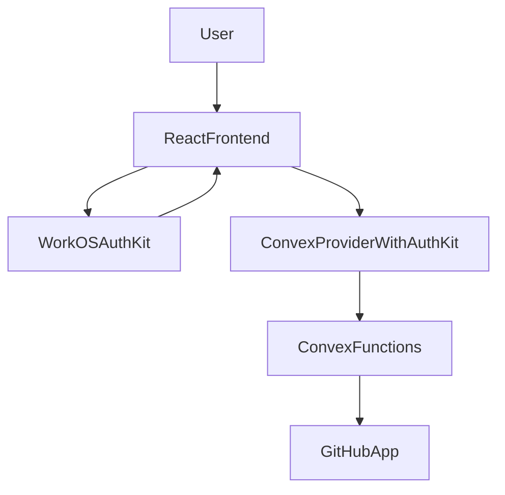

# Auth And Access

## Purpose

This document explains how Systify connects WorkOS, Convex, and the GitHub App, and describes where authentication and access control are enforced across the current system.

## Authentication Boundary Overview

## Frontend Identity Flow

### 1. WorkOS AuthKit creates the user session

The frontend wraps the application with `AuthKitProvider` in `src/main.tsx` and uses:

- `VITE_WORKOS_CLIENT_ID`
- the current browser origin to build `/callback`

WorkOS is the source of the browser-side sign-in experience.

### 2. Convex uses the WorkOS token

Systify does not treat local WorkOS state as the application's source of truth for auth. Instead, it passes the WorkOS access token into Convex through `ConvexProviderWithAuthKit`.

This wrapper has two responsibilities:

- adapt the WorkOS hook to the `useAuth` interface expected by `ConvexProviderWithAuth`
- surface `authError` when token fetching fails so the UI can ask the user to refresh

The frontend auth boundary can therefore be summarized as:

- WorkOS: produces sign-in state and an access token
- `ConvexProviderWithAuthKit`: attaches that token to all Convex requests
- `ProtectedLayout`: protects `/chat` via `useConvexAuth()`
- `LandingRoute`: redirects authenticated users from `/` to `/chat`

## Backend Authentication

### Convex custom JWT

`convex/auth.config.ts` configures WorkOS as Convex's custom JWT provider. The key validation parameters are:

- issuer: `https://api.workos.com/user_management/${WORKOS_CLIENT_ID}`
- algorithm: `RS256`
- jwks: `https://api.workos.com/sso/jwks/${WORKOS_CLIENT_ID}`

In other words, backend sign-in is not determined by local frontend state. It is determined by whether Convex accepts the JWT.

### `requireViewerIdentity()`

Most backend entry points begin by calling `requireViewerIdentity(ctx)`. The helper is small, but it standardizes the security assumptions:

- unauthenticated access is rejected immediately
- all later data access assumes that a verified `identity` is already available

## Authorization Pattern

### Never trust a frontend-provided user id

The current backend design does not rely on a frontend-provided `userId` for authorization. It always derives the current user from `ctx.auth.getUserIdentity()`.

This is one of the most important authorization rules in the system.

### Use `tokenIdentifier` as the owner key

Tables generally store resource ownership in `ownerTokenIdentifier` and validate against `identity.tokenIdentifier`. This means:

- the repository layer is owner-scoped
- threads, messages, and installations are also owner-scoped
- queries and mutations typically perform an owner check after loading the document

This pattern is more stable than using email or display name and prevents users from impersonating others by forging ids.

### Frontend route guards are not the only security layer

`ProtectedLayout` and `LandingRoute` are UX guards, not the sole access-control mechanism. Actual security still depends on:

- Convex auth configuration
- `requireViewerIdentity()`
- document ownership checks

So even if someone bypasses the frontend route guard, the backend will still reject unauthorized access.

## How the GitHub App Relates to User Identity

Systify does not ask users to provide a GitHub personal access token. Instead, it manages repository access through GitHub App installations.

### Installation flow

1. A signed-in user calls `initiateGitHubInstall`.
2. The backend generates a random state and stores it in `githubOAuthStates` together with the frontend origin that started the flow.
3. The user is redirected to the GitHub App installation page.
4. After installation, GitHub redirects back to `/api/github/callback`.
5. The callback validates and consumes the state.
6. The backend fetches installation details from the GitHub API.
7. The installation is written into `githubInstallations`.
8. If a stored frontend origin exists, the callback redirects back to it.
9. If GitHub calls back without a usable state, the HTTP endpoint returns an explicit error response instead of guessing a frontend URL.
10. If installation succeeds but no return target is available, the endpoint returns a small success page instead of a misleading server error.

### Why `githubOAuthStates` exists

This table exists for callback CSRF protection rather than long-term business data. It stores:

- `state`
- `ownerTokenIdentifier`
- `returnTo`
- `expiresAt`
- `consumed`

Only after the state is successfully validated does the system know which signed-in user this installation should be bound to.

### Installation state synchronization

GitHub webhooks synchronize installation state back into Convex, including:

- `deleted`
- `suspend`
- `unsuspend`

As a result, `githubInstallations` is not just a callback record. It is the local projection of currently usable GitHub permissions.

## Repository Access Control

### Check the GitHub installation before import

Before creating an import or sync, the system first checks whether the current signed-in user has an active installation. If not, the request is rejected immediately.

### Check repository access again inside the import flow

Even if the user has already connected GitHub, the import flow still calls the GitHub API again before fetching the repository snapshot to confirm:

- whether the installation can access the target repository
- whether the repository is actually public or private

This check fails fast (one API round trip) when the repository is not actually accessible, so an unreachable repo never gets as far as the tree / blob fetches. The same probe is reused by the on-demand sandbox path (`ensureSandboxReady`) before any sandbox-grounded reply or System Design generation provisions a Daytona sandbox, so a user who lost access to a repository between import and sandbox activation gets the same actionable error without burning sandbox cost.

## Deep Mode And Permissions

Deep mode availability is driven more by sandbox state than by auth, but using deep mode still requires:

- being signed in
- passing the repository ownership check
- having a currently usable sandbox for that repository

So deep mode is constrained by both auth and runtime resource boundaries.

## Environment Variable Split

### Frontend env

These values are exposed to the browser:

- `VITE_CONVEX_URL`
- `VITE_WORKOS_CLIENT_ID`

### Convex runtime env

These values must exist only in the Convex runtime. This list intentionally matches `integrations-and-operations.md`:

- `WORKOS_CLIENT_ID`
- `GITHUB_APP_ID`
- `GITHUB_APP_SLUG`
- `GITHUB_APP_PRIVATE_KEY`
- `GITHUB_APP_WEBHOOK_SECRET`
- `OPENAI_API_KEY`
- `OPENAI_MODEL`
- `DAYTONA_API_KEY`
- `DAYTONA_API_URL`
- `DAYTONA_TARGET`
- `DAYTONA_AUTO_STOP_MINUTES`
- `DAYTONA_AUTO_ARCHIVE_MINUTES`
- `DAYTONA_AUTO_DELETE_MINUTES`
- `DAYTONA_CPU_LIMIT`
- `DAYTONA_MEMORY_GIB`
- `DAYTONA_DISK_GIB`
- `DAYTONA_POST_CLONE_BLOCK_NETWORK`

This separation matters because the GitHub App private key, webhook secret, and OpenAI key must never leak into the frontend.

## Known Limitations

- Auth errors are currently handled mostly through a UI banner plus a refresh prompt, so recovery behavior is still basic.
- The relationship between users and GitHub installations is currently a single-layer owner-scoped model and has not yet expanded to a team or organization level.
- GitHub authorization depends heavily on correct installation-state synchronization, so webhook issues can temporarily leave local data behind the real GitHub state.

