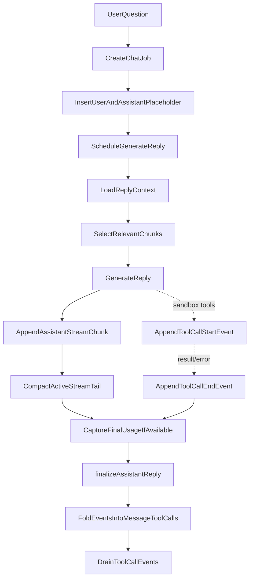
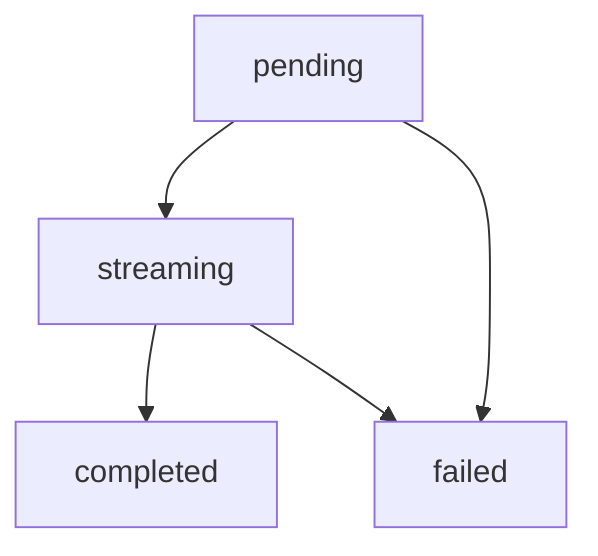
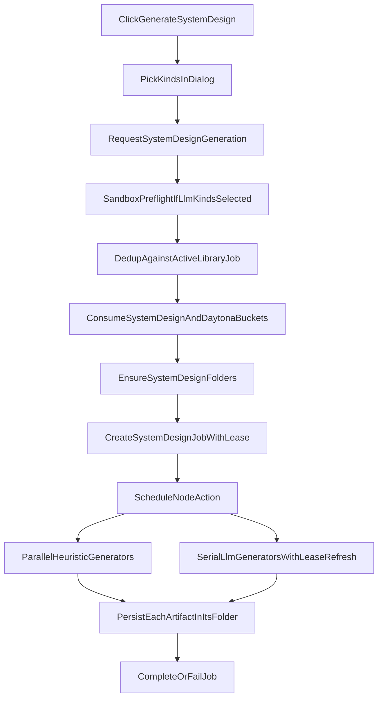

# Chat And Analysis Pipeline

## Purpose

This document describes the two AI interaction paths currently available in Systify:

- Chat — interactive Q&A through the current product modes:
  - `discuss` — no repository context
  - `library` — Library Ask, grounded in artifact chunks
  - `lab` — sandbox-backed answers grounded in the live source tree
- System Design generation — a sandbox-backed background job, triggered by the user clicking **Generate System Design** from the empty Library page, that writes a starter set of System Design artifacts (`manifest`, `readme_summary`, `architecture_overview`, `data_model_overview`, `api_surface_overview`, `deployment_overview`, `security_overview`, `operations_overview`).

Both are repository-centered, but they depend on different data sources and execution models. Chat and System Design generation are also complementary: System Design generation writes artifacts that later Library and Lab replies can cite.

## Differences Between the Two Paths

| Capability               | Chat (per mode)                                                                                                                                | System Design generation                                              |
| ------------------------ | ---------------------------------------------------------------------------------------------------------------------------------------------- | --------------------------------------------------------------------- |
| Main entry point         | `chat.sendMessage`                                                                                                                             | `systemDesign.requestSystemDesignGeneration`                          |
| Primary data source      | `discuss`: none · `library`: `artifactChunks` + artifact metadata · `lab`: live sandbox tools plus durable artifacts                           | live sandbox                                                          |
| Execution location       | Convex action                                                                                                                                  | Convex Node action + Daytona                                          |
| UI presentation          | stable history + active stream merge                                                                                                           | a starter set of System Design artifacts plus job state               |
| Availability requirement | `discuss`: always · `library`: repository has artifacts and indexed chunks · `lab`: repository has a usable sandbox                            | repository has a usable sandbox                                       |

## Chat Flow

### 1. The user sends a message

When `sendMessage` is called, the system first verifies:

- the thread exists
- the repository for that thread exists
- the repository owner matches the current signed-in user

It then creates three core records:

- one `chat` job
- one user message
- one assistant placeholder message

The assistant placeholder starts as:

- `role = assistant`
- `status = pending`
- `content = ""`

This allows the UI to immediately show a reply that is waiting to be generated.

### 2. Generate the assistant reply in the background

`internal.chat.generation.generateAssistantReply` takes over the rest of the flow. It starts by:

- marking the assistant message as `streaming`
- marking the job as `running`

### 3. Build the reply context

`getReplyContext` assembles the reply context based on the effective mode for the reply (`latestUserMessage.mode ?? thread.mode`, exposed on `ReplyContext.mode`):

- `discuss`: skips every repo-scoped lookup — returns empty `artifacts`, empty `chunks`, and no repo summaries. The early return is what makes `discuss` training-only by design even when the thread has a `repositoryId` attached.
- `library`: Library retrieval over `artifactChunks`, scoped to the active workspace and optional artifact context.
- `lab`: sandbox-backed execution through guarded tools, with durable artifacts available as reusable context.

In every mode, the context also includes recent conversation messages bounded by `MAX_CONTEXT_MESSAGES`. Discuss skips repository data, Library reads the processed artifact knowledge layer, and Lab can use the live sandbox via `read_file`, `list_dir`, and `run_shell`. Tool output is scrubbed for credential-shaped patterns before reaching the LLM. Tool response payloads also carry an audit signal in their `redactedTypes` field so integrators can see what kinds of content were redacted without learning the secret value.

### 4. Retrieve grounding context

Chunk retrieval for Library Ask runs over `artifactChunks`. `discuss` returns no chunks because it skips repo context entirely; `lab` relies on sandbox tools for current-source claims and can cite durable artifacts when useful.

Library Ask uses a two-step retrieval flow:

1. build a bounded candidate pool from the latest import snapshot
2. rerank that candidate pool locally before building the prompt

The candidate pool is assembled from:

- lexical hits from `artifactChunks.search_content`
- summary hits from `artifactChunks.search_summary`
- vector hits from `artifactChunks.by_embedding` when embeddings are available

This matters because Ask must stay scoped to the current workspace, repository, and optional artifact context. Old artifact chunk versions are replaced by the indexing pipeline rather than mixed into retrieval.

This is a bounded retrieval layer whose main goals are:

- reducing prompt size
- improving answer focus
- keeping read cost bounded without introducing embeddings yet

### 5. Generate the answer

If `OPENAI_API_KEY` exists, the system:

- uses `streamText`
- selects `OPENAI_MODEL` or falls back to `gpt-5.4-mini`
- builds a per-mode system prompt via `buildSystemPrompt(replyContext.mode)` so the model receives a different contract per mode
- builds a user prompt from artifacts, chunks, and the user question

If `OPENAI_API_KEY` is absent, the system falls back to a heuristic answer so it can still produce a response based on indexed data.

### 6. Stream, compact, and complete

The answer is no longer streamed directly into `messages.content`. Instead:

1. model output is accumulated in memory
2. a flushed delta is appended to `messageStreamChunks`
3. older tail chunks are periodically compacted into `messageStreams.compactedContent`
4. only the final durable write patches `messages.content`

When the provider exposes finalized token usage, the pipeline also writes usage and estimated cost fields during finalization:

- `messages.estimatedInputTokens`
- `messages.estimatedOutputTokens`
- `jobs.estimatedInputTokens`
- `jobs.estimatedOutputTokens`
- `jobs.estimatedCostUsd`

If usage is unavailable, or the model is not present in the local pricing table, the reply still succeeds and those fields remain empty.

When the flow completes, it updates:

- the assistant message `status = completed`
- `thread.lastAssistantMessageAt`
- the job `status = completed`
- and deletes the active stream state

If an error occurs midstream, both the assistant message and the job are marked failed.

### 7. Tool-call trace (Lab only)

When the reply runs in Lab and the AI SDK's `fullStream` surfaces `tool-call` / `tool-result` / `tool-error` events, the pipeline persists each event into a separate `messageToolCallEvents` table. This is the same hot/durable split that `messageStreamChunks` uses for text deltas (see `streaming-reply-optimization-system-design.md`):

1. `tool-call` arrives → `appendAssistantToolCallEvent` writes a `start` row keyed by the AI SDK's `toolCallId`
2. matching `tool-result` or `tool-error` arrives → a paired `end` row is written with the redacted `outputSummary`
3. the live `<ToolCallTrace>` component subscribes to `getMessageToolCallEvents` so the UI paints a "Reading X.ts…" ticker the moment the `start` row commits, without waiting for the tool to finish
4. at finalize time (or fail / stale recovery), `foldAndDrainToolCallEvents` pairs each `start` to its `end` by `toolCallId`, writes the result onto durable `messages.toolCalls`, and drains every event row in the same transaction so the live subscription cannot lag past the message's terminal state

Pairing by `toolCallId` (rather than by `toolName`) preserves multiple invocations of the same tool — e.g. two `read_file` calls in one reply appear as two distinct `messages.toolCalls` entries. Each event's `inputSummary` and `outputSummary` are passed through `redact()` and capped at `TOOL_CALL_EVENT_SUMMARY_MAX_CHARS` before insertion so a runaway tool result cannot push the message document past Convex's 1 MB row limit.

A defensive `MAX_TOOL_CALL_EVENTS_PER_MESSAGE` cap bounds reads and folds; if a buggy producer ever exceeds it, `tool_event_fold_truncated` is logged from finalize / fail / recover so the truncation is observable. The drain step still sweeps every row regardless of the read cap, so events never outlive their parent message.

For the security rationale behind redaction at every persistence point, and for the threat model that motivates the `redactedTypes` audit signal, see `sandbox-mode-security-system-design.md`.

## Message state model

The assistant reply state transition is roughly:

This state model lets the UI faithfully represent four different states: created-but-not-yet-answered, answering, answered, and failed.

## System Design Generation Flow

System Design generation is **user-initiated, not import-driven**. Imports no longer auto-trigger any analysis; they only seed the default System Design folders inside `artifactFolders`. When the user navigates to Library on a repository that has no artifact bodies yet, the empty Library page renders a **Generate System Design** CTA button. Clicking it opens a dialog that lets the user pick which kinds to publish; on submit, the dialog calls `requestSystemDesignGeneration` with the selected subset.

### Kinds and dispatch

Library System Design produces up to eight artifact kinds, split by generator type:

- **Heuristic** (no LLM, no sandbox) — `manifest`, `architecture_overview`. Derived from imported `repoFiles` rows. The `isEntryPoint` / `isConfig` / `isImportant` / `language` fields are computed at import time (`createRepoFileRecords` in `convex/lib/repoAnalysis.ts`) and cached on each row, so changes to those heuristic rules only affect newly imported or **re-synced** repos. To pick up updated rules on an existing repo, trigger Re-sync from the repository detail page.
- **LLM-backed** (uses sandbox tools) — `readme_summary`, `data_model_overview`, `api_surface_overview`, `deployment_overview`, `security_overview`, `operations_overview`. Each spins a `generateText` call against the sandbox-backed model with the same `read_file` / `list_dir` / `run_shell` tool factory the Lab chat path uses.

The dialog flags each kind with a **Free** or **~1 LLM call** badge driven by `SYSTEM_DESIGN_KIND_GENERATOR` in `convex/lib/systemDesign.ts`.

### 1. Request validation

`requestSystemDesignGeneration` (in `convex/systemDesign.ts`) performs the following checks in order:

1. **Identity + repository ownership** — `requireViewerIdentity` + `requireActiveRepositoryForOwner` reject archived, deleted, or non-owned repos with the standard error messages.
2. **Non-empty selection** — at least one kind must be checked.
3. **Sandbox preflight** — runs *only when at least one LLM-backed kind is selected*. Reads `repository.latestSandboxId` and passes it through `getSandboxAvailability`; rejects the whole request with the helper's user-facing message if the sandbox is missing, provisioning, archived, stopped, expired, or failed. Heuristic-only requests skip this check entirely.
4. **Idempotency dedup** — scans `jobs` by the `by_repositoryId_and_kind_and_status_and_leaseExpiresAt` index for an active (`queued` or `running`, lease still alive) `system_design` job that is *not* a Failure Mode Analysis. If one is found, the mutation returns that existing `jobId` instead of creating a duplicate. FMA jobs are filtered out via their `failure_mode_analysis:` `requestedCommand` prefix, so an in-flight FMA on the same repo does not block a Library generation.
5. **Rate limiting** — always consumes the per-owner `systemDesignRequests` bucket (10/hour by default). Additionally consumes the global `daytonaRequestsGlobal` bucket *only when an LLM-backed kind is selected*, mirroring the actual Daytona use.
6. **Folder seeding** — `ensureSystemDesignFolders` is idempotent and creates the default System Design folder tree if it does not already exist.

### 2. Create the job

The mutation inserts one `jobs` row with `kind: "system_design"`, `costCategory: "system_design"`, the selected `sandboxId` (when LLM kinds are present), an `outputSummary` summarising the selection, and a non-null `leaseExpiresAt = now + SYSTEM_DESIGN_JOB_LEASE_MS` (default 60 minutes).

The lease is set **at insert time** rather than only at the `queued → running` transition. This matters because the stale-job sweep (`opsNode.listStaleInteractiveJobs`) queries the `by_status_and_kind_and_leaseExpiresAt` index with `lt("leaseExpiresAt", now)`, which never matches rows where `leaseExpiresAt` is undefined. A pre-running job without a lease would be invisible to recovery if the Node action never started.

The job and the FMA flow share the `system_design` kind. Disambiguation is by `requestedCommand`: FMA writes the `failure_mode_analysis:<subsystem>` prefix; Library System Design jobs leave it unset. Both the active-job dedup and the stale-job recovery branch use the same `isFailureModeJob` predicate.

### 3. Run the generators

`runSystemDesignGeneration` (in `convex/systemDesignNode.ts`) transitions the job to `running` via `markGenerationStarted`, which refreshes the lease for a fresh window, then splits the work into two concurrent passes:

- **Heuristic pass** — runs all heuristic kinds in parallel via `Promise.all`. The shared `RepositorySnapshot` is loaded once via `listRepoFilesForHeuristics` (bounded by `take(2000)`; a `logWarn` fires if the take cap was reached).
- **LLM pass** — runs LLM-backed kinds serially in their submission order, refreshing the job lease via `refreshGenerationLease` *before each kind*. Serial execution is intentional: it honours both the per-sandbox tool budget and OpenAI rate limits.

Both passes run concurrently against each other so a long LLM session does not gate the cheap heuristic publication. Per-kind failures are isolated in a `try/catch`; the failing kind is logged with an `errorId` and skipped without affecting later kinds. After every kind completes (success or failure) the action updates `jobs.stage` / `jobs.progress` via `updateGenerationProgress`.

### 4. Persist the artifacts

`persistGeneratedArtifact` resolves the destination folder via the kind→folder map and `artifactFolders.systemKey`, then replaces any existing artifact of the same kind in that folder so re-running the publication overwrites rather than accumulates. The artifact is written through the standard `createArtifactInMutation` path so the chunking + embedding pipeline kicks in automatically.

The `source` field encodes how the artifact was produced and drives the freshness UI:

- Heuristic kinds carry `source: "heuristic"`. `createArtifactInMutation` leaves `lastVerifiedAt` unset — the freshness UI does not award a "verified" badge to heuristic output.
- LLM-backed kinds carry `source: "sandbox"` because they read live source through the sandbox tool factory. `createArtifactInMutation` stamps `lastVerifiedAt: now` on the row, which gates the "verified against current source" badge in the Library freshness UI. (`lastVerifiedAt` is the single signal the freshness UI reads — an artifact is "verified" iff this field is set.)

### 5. Finalize

After both passes complete, `completeGeneration` marks the job `completed` with a final `outputSummary` (`Generated X of Y documents.` / `; N failed.`). Progress and final status flow back to the UI through the standard job subscription.

If the action dies (process restart, panic) before `completeGeneration`, the daily cron `reconcileStaleInteractiveJobs` will eventually call `recoverStaleSystemDesignJob`, which fails the job with the standard stale-lease message — the lease semantics above guarantee the row is discoverable by the sweep.

## Sandbox Availability

Two distinct surfaces depend on a live Daytona sandbox: Lab mode and the LLM-backed kinds of the System Design generation background job. Both gate themselves through `convex/lib/repositorySandbox.ts`. If the sandbox:

- has passed its TTL
- is archived
- has failed
- is missing required remote path information

then Lab is unavailable and `requestSystemDesignGeneration` rejects requests *that include at least one LLM-backed kind*. A request that selects only heuristic kinds (`manifest`, `architecture_overview`) skips the sandbox preflight and runs even when no sandbox exists, so a freshly imported repo can publish the starter heuristic set immediately.

The frontend uses this state to tell the user to:

- sync the repository to provision a new sandbox, or
- switch to Discuss or Library for degraded but still useful work

Library mode is **not** gated on having artifacts. Any repository with a valid attached repo can open Library; if no artifacts exist yet, the page shows the **Generate System Design** CTA.

## How The Two Pipelines Complement Each Other

Chat and System Design generation are not mutually exclusive. They form layered capabilities:

- Chat (`discuss` / `library` / `lab`): fast, interactive, with cost and grounding scaling per mode
- System Design generation: slower and sandbox-dependent, but produces durable, repository-grounded prose covering the main system surfaces in one pass

Artifacts produced by System Design generation flow back into later Library Ask and Lab context, so the overall system forms a cumulative knowledge loop.

## Known Limitations

- Lab tooling (`read_file`, `list_dir`, `run_shell`) is gated only by daily cost cap (per-user and per-workspace) and the repo / sandbox lifecycle. `run_shell` is gated by a deny list of obviously destructive patterns, a 32 KiB output cap, a 60 s timeout ceiling, and a workdir pinned inside the repository.
- Chat and System Design generation are both AI features, but their outputs and tracking models are still split between thread replies and artifacts.
- The current System Design generation pass is a fixed starter set of overviews. Per-folder regeneration, additional artifact kinds, and partial re-runs are future work.

