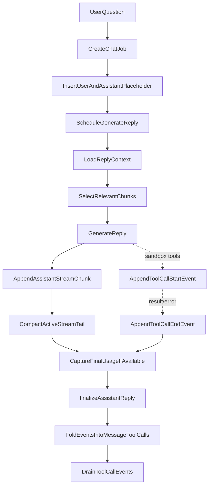
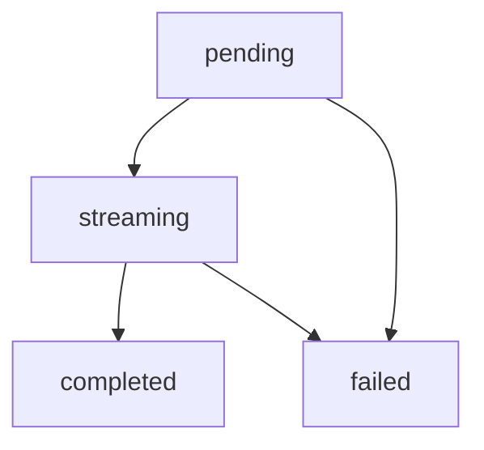
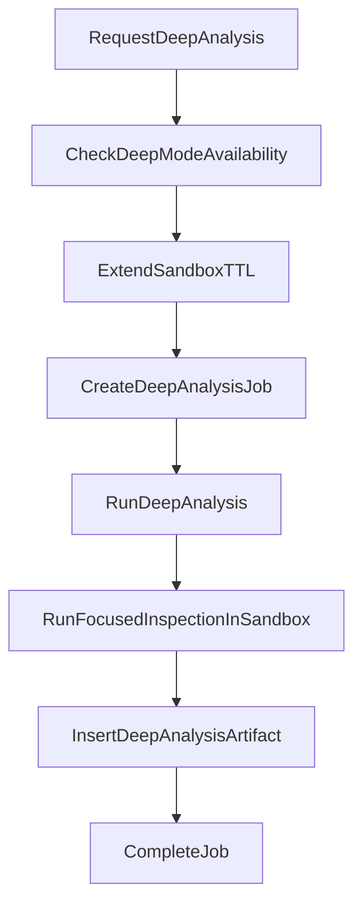

# Chat And Analysis Pipeline

## Purpose

This document describes the two AI interaction paths currently available in Systify:

- Chat — interactive Q&A through the current product modes:
  - `discuss` — no repository context
  - `ask` — Library Ask, grounded in artifact chunks
  - `lab` — sandbox-backed answers grounded in the live source tree
- Deep analysis — a sandbox-backed background job that produces a reusable `deep_analysis` artifact

Both are repository-centered, but they depend on different data sources and execution models. Chat and deep analysis are also complementary: deep analysis writes artifacts that later Library Ask and Lab replies can cite.

## Differences Between the Two Paths

| Capability               | Chat (per mode)                                                                                                                                | Deep analysis                               |
| ------------------------ | ---------------------------------------------------------------------------------------------------------------------------------------------- | ------------------------------------------- |
| Main entry point         | `chat.sendMessage`                                                                                                                             | `analysis.requestDeepAnalysis`              |
| Primary data source      | `discuss`: none · `ask`: `artifactChunks` + artifact metadata · `lab`: live sandbox tools plus durable artifacts                             | live sandbox                                |
| Execution location       | Convex action                                                                                                                                  | Convex Node action + Daytona                |
| UI presentation          | stable history + active stream merge                                                                                                           | a new deep-analysis artifact plus job state |
| Availability requirement | `discuss`: always · `ask`: repository has artifacts and indexed chunks · `lab`: repository has a usable sandbox                                | repository has a usable sandbox             |

## Chat Flow

### 1. The user sends a message

When `sendMessage` is called, the system first verifies:

- the thread exists
- the repository for that thread exists
- the repository owner matches the current signed-in user

It then creates three core records:

- one `chat` job
- one user message
- one assistant placeholder message

The assistant placeholder starts as:

- `role = assistant`
- `status = pending`
- `content = ""`

This allows the UI to immediately show a reply that is waiting to be generated.

### 2. Generate the assistant reply in the background

`internal.chat.generation.generateAssistantReply` takes over the rest of the flow. It starts by:

- marking the assistant message as `streaming`
- marking the job as `running`

### 3. Build the reply context

`getReplyContext` assembles the reply context based on the effective mode for the reply (`latestUserMessage.mode ?? thread.mode`, exposed on `ReplyContext.mode`):

- `discuss`: skips every repo-scoped lookup — returns empty `artifacts`, empty `chunks`, and no repo summaries. The early return is what makes `discuss` training-only by design even when the thread has a `repositoryId` attached.
- `ask`: Library retrieval over `artifactChunks`, scoped to the active workspace and optional artifact context.
- `lab`: sandbox-backed execution through guarded tools, with durable artifacts available as reusable context.

In every mode, the context also includes recent conversation messages bounded by `MAX_CONTEXT_MESSAGES`. Discuss skips repository data, Ask reads the processed artifact knowledge layer, and Lab can use the live sandbox via `read_file`, `list_dir`, and `run_shell`. Tool output is scrubbed for credential-shaped patterns before reaching the LLM. Tool response payloads also carry an audit signal in their `redactedTypes` field so integrators can see what kinds of content were redacted without learning the secret value.

### 4. Retrieve grounding context

Chunk retrieval for Library Ask runs over `artifactChunks`. `discuss` returns no chunks because it skips repo context entirely; `lab` relies on sandbox tools for current-source claims and can cite durable artifacts when useful.

Library Ask uses a two-step retrieval flow:

1. build a bounded candidate pool from the latest import snapshot
2. rerank that candidate pool locally before building the prompt

The candidate pool is assembled from:

- lexical hits from `artifactChunks.search_content`
- summary hits from `artifactChunks.search_summary`
- vector hits from `artifactChunks.by_embedding` when embeddings are available

This matters because Ask must stay scoped to the current workspace, repository, and optional artifact context. Old artifact chunk versions are replaced by the indexing pipeline rather than mixed into retrieval.

This is a bounded retrieval layer whose main goals are:

- reducing prompt size
- improving answer focus
- keeping read cost bounded without introducing embeddings yet

### 5. Generate the answer

If `OPENAI_API_KEY` exists, the system:

- uses `streamText`
- selects `OPENAI_MODEL` or falls back to `gpt-5.4-mini`
- builds a per-mode system prompt via `buildSystemPrompt(replyContext.mode)` so the model receives a different contract per mode
- builds a user prompt from artifacts, chunks, and the user question

If `OPENAI_API_KEY` is absent, the system falls back to a heuristic answer so it can still produce a response based on indexed data.

### 6. Stream, compact, and complete

The answer is no longer streamed directly into `messages.content`. Instead:

1. model output is accumulated in memory
2. a flushed delta is appended to `messageStreamChunks`
3. older tail chunks are periodically compacted into `messageStreams.compactedContent`
4. only the final durable write patches `messages.content`

When the provider exposes finalized token usage, the pipeline also writes usage and estimated cost fields during finalization:

- `messages.estimatedInputTokens`
- `messages.estimatedOutputTokens`
- `jobs.estimatedInputTokens`
- `jobs.estimatedOutputTokens`
- `jobs.estimatedCostUsd`

If usage is unavailable, or the model is not present in the local pricing table, the reply still succeeds and those fields remain empty.

When the flow completes, it updates:

- the assistant message `status = completed`
- `thread.lastAssistantMessageAt`
- the job `status = completed`
- and deletes the active stream state

If an error occurs midstream, both the assistant message and the job are marked failed.

### 7. Tool-call trace (Lab only)

When the reply runs in Lab and the AI SDK's `fullStream` surfaces `tool-call` / `tool-result` / `tool-error` events, the pipeline persists each event into a separate `messageToolCallEvents` table. This is the same hot/durable split that `messageStreamChunks` uses for text deltas (see `streaming-reply-optimization-system-design.md`):

1. `tool-call` arrives → `appendAssistantToolCallEvent` writes a `start` row keyed by the AI SDK's `toolCallId`
2. matching `tool-result` or `tool-error` arrives → a paired `end` row is written with the redacted `outputSummary`
3. the live `<ToolCallTrace>` component subscribes to `getMessageToolCallEvents` so the UI paints a "Reading X.ts…" ticker the moment the `start` row commits, without waiting for the tool to finish
4. at finalize time (or fail / stale recovery), `foldAndDrainToolCallEvents` pairs each `start` to its `end` by `toolCallId`, writes the result onto durable `messages.toolCalls`, and drains every event row in the same transaction so the live subscription cannot lag past the message's terminal state

Pairing by `toolCallId` (rather than by `toolName`) preserves multiple invocations of the same tool — e.g. two `read_file` calls in one reply appear as two distinct `messages.toolCalls` entries. Each event's `inputSummary` and `outputSummary` are passed through `redact()` and capped at `TOOL_CALL_EVENT_SUMMARY_MAX_CHARS` before insertion so a runaway tool result cannot push the message document past Convex's 1 MB row limit.

A defensive `MAX_TOOL_CALL_EVENTS_PER_MESSAGE` cap bounds reads and folds; if a buggy producer ever exceeds it, `tool_event_fold_truncated` is logged from finalize / fail / recover so the truncation is observable. The drain step still sweeps every row regardless of the read cap, so events never outlive their parent message.

For the security rationale behind redaction at every persistence point, and for the threat model that motivates the `redactedTypes` audit signal, see `sandbox-mode-security-system-design.md`.

## Message state model

The assistant reply state transition is roughly:

This state model lets the UI faithfully represent four different states: created-but-not-yet-answered, answering, answered, and failed.

## Deep Analysis Flow

### 1. Request deep analysis

`requestDeepAnalysis` first checks:

- that the repository belongs to the current signed-in user
- that `latestSandboxId` exists
- that the sandbox state allows deep mode

If the sandbox is unavailable, the mutation throws immediately instead of creating an analysis workflow that cannot run.

If validation succeeds, the mutation also extends `sandboxes.ttlExpiresAt` to at least 30 minutes in the future before queuing work. This reduces the race where the request is accepted but the sandbox gets swept before `runDeepAnalysis` starts.

### 2. Create the job

After validation passes, the system creates:

- one `deep_analysis` job
- and points `repository.latestAnalysisJobId` to it

### 3. Run focused inspection inside the sandbox

`analysisNode.runDeepAnalysis`:

- marks the job as running
- checks sandbox availability again
- calls `runFocusedInspection(remoteSandboxId, repoPath, prompt)`

This inspection is not a large direct LLM analysis over the whole repository. It first finds more relevant file paths inside the sandbox based on the prompt, then produces a focused inspection log.

### 4. Persist the artifact

The analysis result is ultimately written as:

- `artifacts.kind = deep_analysis`
- `source = sandbox`

That means deep analysis output does not exist only at execution time. It becomes reusable repository knowledge for later flows.

## Sandbox Availability

Two distinct surfaces depend on a live Daytona sandbox: Lab mode and the deep-analysis background job. Both gate themselves through `convex/lib/sandboxAvailability.ts`. If the sandbox:

- has passed its TTL
- is archived
- has failed
- is missing required remote path information

then Lab is unavailable and `requestDeepAnalysis` rejects new analysis requests.

The frontend uses this state to tell the user to:

- sync the repository to provision a new sandbox, or
- switch to Discuss or Library for degraded but still useful work

## How The Two Pipelines Complement Each Other

Chat and deep analysis are not mutually exclusive. They form layered capabilities:

- Chat (`discuss` / `ask` / `lab`): fast, interactive, with cost and grounding scaling per mode
- Deep analysis: slower and sandbox-dependent, but able to add observations closer to the live repository state

Artifacts produced by deep analysis flow back into later Library Ask and Lab context, so the overall system forms a cumulative knowledge loop.

## Known Limitations

- Lab tooling (`read_file`, `list_dir`, `run_shell`) is gated by the sandbox feature flag and per-viewer allowlist. `run_shell` is gated by a deny list of obviously destructive patterns, a 32 KiB output cap, a 60 s timeout ceiling, and a workdir pinned inside the repository.
- Chat and deep analysis are both AI features, but their outputs and tracking models are still split between thread replies and artifacts.
- Deep analysis is currently closer to focused file discovery plus a markdown report than to a full agentic repository-reasoning pipeline.

