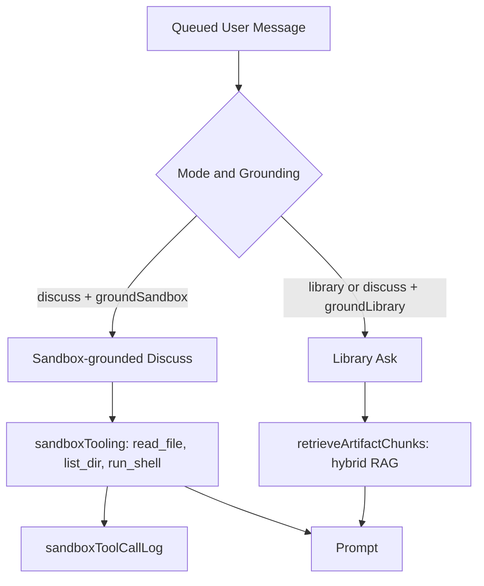

# Chat Context Retrieval System Design

## Purpose

This document explains the two distinct retrieval architectures Systify uses to ground chat replies. Both are bounded to the latest published import snapshot, but they differ entirely in mechanism: sandbox-grounded Discuss replies are tool-driven (no pre-loaded chunks), while Library Ask uses hybrid lexical + vector retrieval over `artifactChunks`.

## The Two Flows

Chat has only two modes — `discuss` and `library` — and each one resolves grounding differently:

- `discuss` with the per-message **sandbox grounding** toggle on: the model fetches what it needs through sandbox tools at generation time. No code chunks are loaded into the prompt up front.
- `discuss` with the per-message **Library grounding** toggle on, and `library` mode: artifacts are loaded and (for Library Ask) `artifactChunks` are retrieved via hybrid RAG.
- `discuss` with both toggles off: training-only chat — no repo lookup at all, even when the thread has a repository attached.

`convex/chat/context.ts:325-330` hardcodes `chunks: []` with an explicit comment for the repository-backed branch, and `convex/chat/context.ts:369` hardcodes `artifactChunks: []`. The actual `artifactChunks` retrieval happens later in the action via `convex/lib/artifactRag.ts:retrieveArtifactChunks`, not inside the context query.

## Chosen Design

### 1. Sandbox-grounded Discuss (tool-driven)

When the queued user message carries `groundSandbox: true` and the repository's latest sandbox is in `ready` state, `getReplyContext` surfaces a `sandboxTooling` handle (`sandboxId`, `remoteId`, `repoPath`) alongside an empty `chunks: []`.

The action wires that handle into `sandboxTooling` (`read_file`, `list_dir`, `run_shell`) so the LLM gateway can let the model pull whatever it needs from the live sandbox during generation. Nothing is pre-fetched.

Every tool execution writes an entry into `sandboxToolCallLog`, keyed by the same `sandboxId` the context query returned. That gives the audit log a single transactional anchor: the `(thread, sandbox, repository)` triple read at queue time is exactly the triple every tool call belongs to.

If the sandbox is unavailable (`provisioning`, `stopped`, `archived`, `failed`, or missing), `sandboxTooling` is left `undefined` and the action falls back to a no-tool reply — answering without tools is strictly better than streaming a mid-reply tool-call failure.

### 2. Library Ask (hybrid RAG)

Library mode (and Discuss with `groundLibrary: true`) loads a bounded artifact set in `getReplyContext`: scoped to `thread.artifactContext` when set, otherwise the latest docs artifacts across the documented kinds.

`artifactChunks` retrieval is then performed by `convex/lib/artifactRag.ts:retrieveArtifactChunks`, called from the reply action — not from the context query. The retriever:

- runs lexical search (`artifactChunkStore.searchContent` + `searchSummary`, scoped by `repositoryId`) and semantic search (vector search over `artifactChunks.by_embedding`) in parallel via `Promise.allSettled`
- requests a query embedding through `embedViaGateway` from the multi-provider LLM gateway, settling embedding spend into the per-user / per-repository daily-cap buckets
- fuses the two channels with Reciprocal Rank Fusion (`RRF_K = 60`) and returns the top-N candidates

The embedding call is wrapped in `Promise.allSettled`, so if the embedding provider fails or returns nothing, retrieval degrades gracefully to lexical-only — the `retrieval_mode` log field records `"hybrid"` vs `"lexical_only"` for each query. Chunks without embeddings simply never appear in the semantic channel and rely on the lexical channel.

### Note on `repoChunks` search indexes

`repoChunks.search_summary` and `repoChunks.search_content` are still defined on the schema, but **no code path currently queries them**. The sandbox-grounded Discuss path is tool-driven (no pre-loaded code chunks), and Library Ask retrieves from `artifactChunks`, not `repoChunks`. Future retrieval work over repository code would re-activate these indexes; today they are unread.

## Why Not Pre-load Code Chunks for Sandbox-grounded Discuss

A naive design would pre-fetch the top-K most relevant `repoChunks` into the prompt before the model runs. That was rejected because:

1. the sandbox already exposes the full repo through `read_file` / `list_dir` / `run_shell`, so the model can ask for exactly the files it needs based on the partial reasoning so far
2. pre-loading guesses at relevance before the model has even started reasoning, while tool calls let the model expand its view based on what it has just learned
3. two parallel knowledge sources (pre-loaded chunks + live tool calls) would have to be kept non-overlapping to avoid contradictions and wasted prompt tokens

The current contract is intentional: tool-driven for sandbox-grounded Discuss, artifact-grounded for Library, never both.

## Why Hybrid Over Lexical-Only for Library Ask

Pure lexical search misses paraphrased questions where the user's vocabulary doesn't overlap with the artifact text. Pure semantic search loses precision on exact symbol names and short technical phrases.

RRF over the two channels gets both: lexical wins on exact matches, semantic wins on paraphrases, and the rank-based fusion is robust to the very different score scales each side produces. The `RRF_K = 60` constant matches the published RRF defaults and gives sane behavior without per-channel tuning.

## Trade-Offs

This design accepts:

- two completely different retrieval paths to maintain (sandbox tools vs hybrid RAG)
- embedding-time cost for every Library Ask query (settled into the daily-cap buckets)
- unused `repoChunks.search_summary` / `search_content` indexes carried by the schema

That is a deliberate trade for:

- sandbox-grounded Discuss answers grounded in whatever the model decides it needs to read, not a pre-computed guess
- Library Ask recall that survives both exact-match and paraphrased questions
- a clean knowledge-source contract — artifacts vs live tool calls, never overlapping

## Result

The two retrieval architectures together give chat replies a mode-appropriate grounding source:

- sandbox-grounded Discuss reads the live repo through tools, with every call audited in `sandboxToolCallLog`
- Library Ask retrieves the most relevant `artifactChunks` via hybrid lexical + vector fusion, with graceful fallback to lexical-only when embeddings are unavailable
- both flows stay strictly inside the latest published snapshot of the repository

