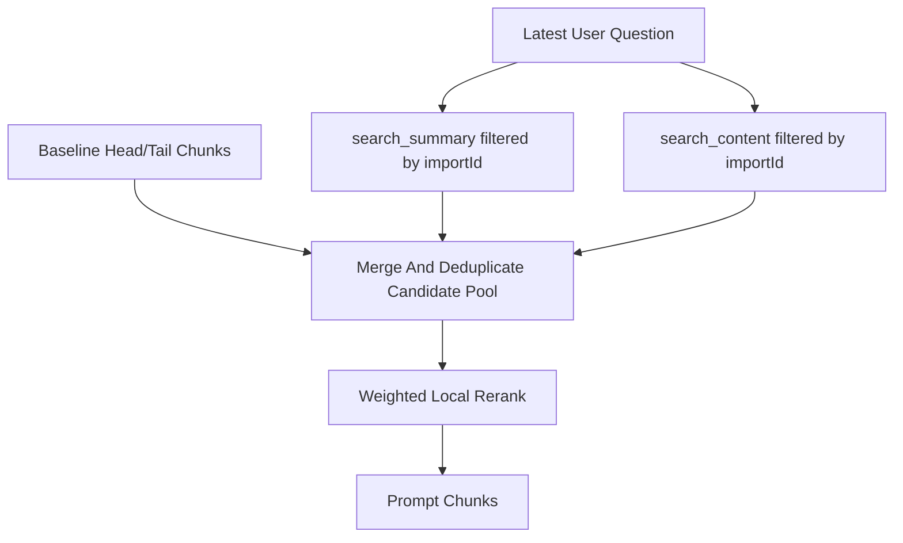

# Chat Context Retrieval System Design

## Purpose

This document explains why chat context retrieval now uses filtered Convex search indexes plus a bounded baseline candidate pool instead of a fixed `take(80)` chunk read.

## The Problem

Chat (specifically sandbox-grounded Discuss replies — the only chat path that loads code chunks; ungrounded `discuss` skips repo lookups entirely and `library` retrieves from `artifactChunks`) previously loaded the first 80 `repoChunks` from:

- `repoChunks.by_importId_and_path_and_chunkIndex`

and then reranked them only with substring matches on:

- `path`
- `summary`

That created two problems:

1. retrieval quality was mostly determined by path ordering, not the user's question
2. chunks outside the first slice of the latest import snapshot could never be considered

For larger repositories, this meant the same question kept seeing roughly the same files.

## Design Goals

The retrieval design optimizes for four properties:

1. stay strictly inside the latest published import snapshot
2. let the candidate pool change with the user's question
3. keep reads bounded and Convex-friendly
4. improve relevance without introducing embeddings yet

## Chosen Design

The new retrieval flow has two stages:

### 1. Snapshot-scoped search

`repoChunks` now defines two search indexes:

- `search_summary`
- `search_content`

Both indexes use `importId` as a filter field. At query time, retrieval always calls:

- `q.search(...).eq('importId', repository.latestImportId)`

This is the key correctness rule of the design. Query-aware retrieval is allowed to change which chunks are considered, but it is not allowed to cross the latest snapshot boundary.

### 2. Baseline fallback

Search results alone are not enough because some questions have weak terms, unusual vocabulary, or no useful lexical overlap with chunk text.

To keep fallback behavior stable, retrieval also loads a small baseline set from:

- the head of `by_importId_and_path_and_chunkIndex`
- the tail of the same index in descending order

This is better than a single head-only slice because it avoids a persistent bias toward only the lexicographically earliest files.

### 3. Merge before ranking

The candidate pool merges:

- summary search hits
- content search hits
- baseline chunks

Chunks are deduplicated by `_id` and capped at a fixed upper bound.

This keeps the hot path predictable:

- search is bounded with `.take(...)`
- fallback is bounded with `.take(...)`
- prompt assembly never depends on an unbounded scan

### 4. Weighted local rerank

After the candidate pool is built, `selectRelevantChunks` reranks locally with simple lexical weights:

- path hit: `+3`
- summary hit: `+2`
- content hit: `+1`

This keeps the implementation lightweight while still preferring more precise structural matches over looser content matches.

## Why Not Query By `repositoryId`

A tempting shortcut is to do question-driven lookups directly on repository-wide indexes such as:

- `by_repositoryId_and_path`
- `by_repositoryId_and_symbolName`

That was rejected for the short-term design for two reasons:

1. repository-scoped reads can reintroduce stale chunks from older imports if retrieval is not explicitly re-scoped back to the latest snapshot
2. `symbolName` is not yet a strong short-term signal in the current chunk generation path

In other words, repository-wide probing improves recall only if it does not weaken snapshot correctness. The chosen design keeps correctness first.

## Why Not Embeddings Yet

Embeddings would improve semantic recall, but they would also introduce:

- a new indexing pipeline
- a larger storage and sync surface
- more rollout complexity than this iteration needs

The current design deliberately stops at "better lexical retrieval with strong snapshot guarantees." It improves answer quality now without locking the system into a heavier retrieval architecture prematurely.

## Trade-Offs

This design adds:

- two search indexes
- more retrieval logic in `getReplyContext`
- a small amount of duplicated evidence between baseline and search hits

That is a deliberate trade for:

- much better recall on question-specific chunks
- bounded query cost
- no stale snapshot mixing

## Result

The new retrieval path gives sandbox-grounded chat a better fit for the current Systify architecture:

- candidate pools change with the user's question
- all retrieval stays inside `latestImportId`
- misses still fall back to a bounded baseline
- the system remains simple enough to evolve toward embeddings later

