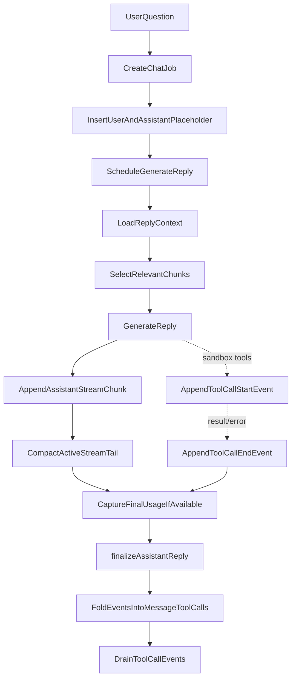
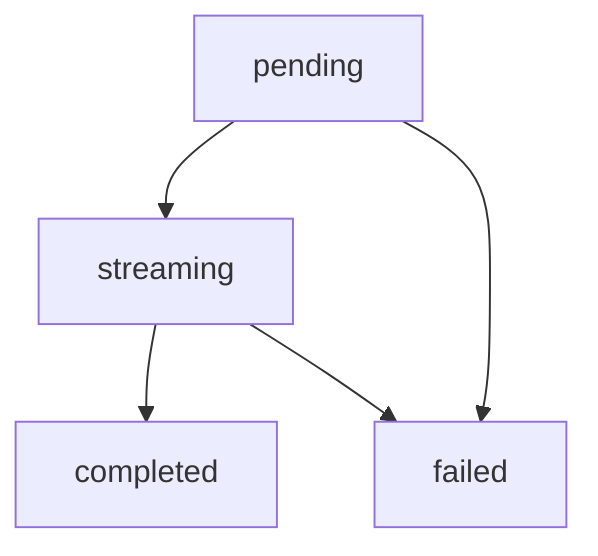
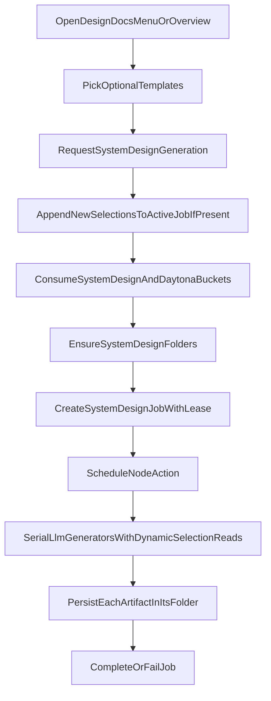

# Chat And Analysis Pipeline

## Purpose

This document describes the two AI interaction paths currently available in Systify:

- Chat — interactive Q&A across the two product modes plus per-message grounding toggles in Discuss:
  - `discuss` (ungrounded) — no repository context; LLM training-only chat
  - `discuss` with **Library grounding** (`messages.groundLibrary`) — artifact-grounded reply with `[A#]` citations against the repository's design artifacts
  - `discuss` with **Sandbox grounding** (`messages.groundSandbox`) — sandbox-backed answers grounded in the live source tree via guarded tools
  - `library` — Library Ask, an artifact-reader thread with chunked-RAG retrieval
- Design Docs generation (implemented internally as System Design generation) — a sandbox-backed background job, triggered from the Library's Design Docs menu / overview, that writes selected optional templates (`readme_summary`, `architecture_overview`, `architecture_diagram`, `data_model_overview`, `api_surface_overview`, `deployment_overview`, `security_overview`, `operations_overview`) as generated docs.

Both are repository-centered, but they depend on different data sources and execution models. Chat and Design Docs generation are also complementary: generated docs become Library artifacts that later Library Ask and sandbox-grounded Discuss replies can cite.

## Differences Between the Two Paths

| Capability               | Chat (per mode + grounding)                                                                                                                                                              | Design Docs generation                                                |
| ------------------------ | ---------------------------------------------------------------------------------------------------------------------------------------------------------------------------------------- | --------------------------------------------------------------------- |
| Main entry point         | `chat.sendMessage`                                                                                                                                                                       | `systemDesign.requestSystemDesignGeneration`                          |
| Primary data source      | `discuss` ungrounded: none · `discuss` + Library grounding: `artifactChunks` + artifact metadata · `discuss` + Sandbox grounding: live sandbox tools plus durable artifacts · `library`: `artifactChunks` + artifact metadata | live sandbox                                                          |
| Execution location       | Convex action                                                                                                                                                                            | Convex Node action + Daytona                                          |
| UI presentation          | stable history + active stream merge                                                                                                                                                     | selected generated docs plus job state                                |
| Availability requirement | `discuss` ungrounded: always · Library grounding: repository has artifacts and indexed chunks · Sandbox grounding: repository has a usable sandbox · `library`: repository has artifacts | repository has a usable sandbox                                       |

## Chat Flow

### 1. The user sends a message

When `sendMessage` is called, the system first verifies:

- the thread exists
- the repository for that thread exists
- the repository owner matches the current signed-in user

It then creates three core records:

- one `chat` job
- one user message
- one assistant placeholder message

The assistant placeholder starts as:

- `role = assistant`
- `status = pending`
- `content = ""`

This allows the UI to immediately show a reply that is waiting to be generated.

### 2. Generate the assistant reply in the background

`internal.chat.generation.generateAssistantReply` takes over the rest of the flow. It starts by:

- marking the assistant message as `streaming`
- marking the job as `running`

### 3. Build the reply context

`getReplyContext` assembles the reply context based on the effective mode for the reply (`latestUserMessage.mode ?? thread.mode`, exposed on `ReplyContext.mode`) plus the per-message `groundLibrary` / `groundSandbox` flags:

- ungrounded `discuss`: skips every repo-scoped lookup — returns empty `artifacts`, empty `chunks`, and no repo summaries. The early return is what makes ungrounded `discuss` training-only by design even when the thread has a `repositoryId` attached.
- `discuss` with Library grounding (`groundLibrary: true`): adds artifact chunks from `artifactChunks` for `[A#]` citations alongside the conversation history.
- `discuss` with Sandbox grounding (`groundSandbox: true`): adds guarded sandbox tools (`read_file`, `list_dir`, `run_shell`) so the LLM can read the live tree and emit `[path:line]` citations.
- `library`: Library retrieval over `artifactChunks`, scoped to the active repository and optional artifact context.

In every mode, the context also includes recent conversation messages bounded by `MAX_CONTEXT_MESSAGES`. Ungrounded Discuss skips repository data; Library Ask and Library-grounded Discuss read the processed artifact knowledge layer; Sandbox-grounded Discuss uses the live sandbox via `read_file`, `list_dir`, and `run_shell`. Tool output is scrubbed for credential-shaped patterns before reaching the LLM. Tool response payloads also carry an audit signal in their `redactedTypes` field so integrators can see what kinds of content were redacted without learning the secret value.

### 4. Retrieve grounding context

Chunk retrieval for Library Ask runs over `artifactChunks`. Ungrounded `discuss` returns no chunks because it skips repo context entirely; sandbox-grounded `discuss` relies on sandbox tools for current-source claims and can cite durable artifacts when useful.

Library Ask uses a two-step retrieval flow:

1. build a bounded candidate pool from the latest import snapshot
2. rerank that candidate pool locally before building the prompt

The candidate pool is assembled from:

- lexical hits from `artifactChunks.search_content`
- summary hits from `artifactChunks.search_summary`
- vector hits from `artifactChunks.by_embedding` when embeddings are available

This matters because Ask must stay scoped to the current repository and optional artifact context. Old artifact chunk versions are replaced by the indexing pipeline rather than mixed into retrieval.

This is a bounded retrieval layer whose main goals are:

- reducing prompt size
- improving answer focus
- keeping read cost bounded

The candidate pool uses vector retrieval via `artifactChunks.by_embedding` and the embed-gateway for relevance filtering when embeddings are available.

### 5. Generate the answer

The reply is dispatched through the multi-provider LLM gateway via `streamViaGateway`. Model selection uses a 3-tier resolver (see `convex/chat/modelSelection.ts:87-91`):

1. composer override (per-request model the user picked in the composer)
2. `threads.defaultModelName` (the thread's saved default)
3. `DEFAULT_PICK_BY_CAPABILITY` (a capability-based fallback chosen from the providers configured at runtime)

A `threads.lockedProvider` lock keeps subsequent picks within the same provider once a thread is bound to one. The dispatch also:

- builds a per-mode system prompt via `buildSystemPrompt(replyContext.mode)` so the model receives a different contract per mode
- builds a user prompt from artifacts, chunks, and the user question

If no provider credential is configured, the system falls back to a heuristic answer so it can still produce a response based on indexed data.

### 6. Stream, compact, and complete

The answer is no longer streamed directly into `messages.content`. Instead:

1. model output is accumulated in memory
2. a flushed delta is appended to `messageStreamChunks`
3. older tail chunks are periodically compacted into `messageStreams.compactedContent`
4. only the final durable write patches `messages.content`

When the provider exposes finalized token usage, the pipeline also writes usage and estimated cost fields during finalization:

- `messages.estimatedInputTokens`
- `messages.estimatedOutputTokens`
- `jobs.estimatedInputTokens`
- `jobs.estimatedOutputTokens`
- `jobs.estimatedCostUsd`

If usage is unavailable, or the model is not present in the local pricing table, the reply still succeeds and those fields remain empty.

When the flow completes, it updates:

- the assistant message `status = completed`
- `thread.lastAssistantMessageAt`
- the job `status = completed`
- and deletes the active stream state

If an error occurs midstream, both the assistant message and the job are marked failed.

### 7. Tool-call trace (sandbox-grounded only)

When the reply runs with Sandbox grounding and the AI SDK's `fullStream` surfaces `tool-call` / `tool-result` / `tool-error` events, the pipeline persists each event into a separate `messageToolCallEvents` table. This is the same hot/durable split that `messageStreamChunks` uses for text deltas (see `streaming-reply-optimization-system-design.md`):

1. `tool-call` arrives → `appendAssistantToolCallEvent` writes a `start` row keyed by the AI SDK's `toolCallId`
2. matching `tool-result` or `tool-error` arrives → a paired `end` row is written with the redacted `outputSummary`
3. the live `<ToolCallTrace>` component subscribes to `getMessageToolCallEvents` so the UI paints a "Reading X.ts…" ticker the moment the `start` row commits, without waiting for the tool to finish
4. at finalize time (or fail / stale recovery), `foldAndDrainToolCallEvents` pairs each `start` to its `end` by `toolCallId`, writes the result onto durable `messages.toolCalls`, and drains every event row in the same transaction so the live subscription cannot lag past the message's terminal state

Pairing by `toolCallId` (rather than by `toolName`) preserves multiple invocations of the same tool — e.g. two `read_file` calls in one reply appear as two distinct `messages.toolCalls` entries. Each event's `inputSummary` and `outputSummary` are passed through `redact()` and capped at `TOOL_CALL_EVENT_SUMMARY_MAX_CHARS` before insertion so a runaway tool result cannot push the message document past Convex's 1 MB row limit.

A defensive `MAX_TOOL_CALL_EVENTS_PER_MESSAGE` cap bounds reads and folds; if a buggy producer ever exceeds it, `tool_event_fold_truncated` is logged from finalize / fail / recover so the truncation is observable. The drain step still sweeps every row regardless of the read cap, so events never outlive their parent message.

For the security rationale behind redaction at every persistence point, and for the threat model that motivates the `redactedTypes` audit signal, see `sandbox-mode-security-system-design.md`.

## Message state model

The assistant reply state transition is roughly:

This state model lets the UI faithfully represent four different states: created-but-not-yet-answered, answering, answered, and failed.

## Design Docs Generation Flow

Design Docs generation is **user-initiated, not import-driven**. Imports no longer auto-trigger any analysis; they only seed the default internal System Design folders inside `artifactFolders`. The user opens the Design Docs menu / overview, picks optional templates, and submits the dialog. The dialog calls `requestSystemDesignGeneration` with the selected subset.

### Kinds and dispatch

Design Docs generation can produce up to eight LLM-backed templates: `readme_summary`, `architecture_overview`, `architecture_diagram`, `data_model_overview`, `api_surface_overview`, `deployment_overview`, `security_overview`, `operations_overview`. Users choose the templates they need; no template is mandatory. Every selected template is LLM-backed — no selected template skips Daytona. Each spins a `generateViaGateway` call against the sandbox-backed model with the same `read_file` / `list_dir` / `run_shell` tool factory the sandbox-grounded chat path uses.

### 1. Request validation

`requestSystemDesignGeneration` (in `convex/systemDesign.ts`) performs the following checks in order:

1. **Identity + repository ownership** — `requireViewerIdentity` + `requireActiveRepositoryForViewer` reject archived, deleted, or non-owned repos with the standard error messages.
2. **Feature + model access** — `generateSystemDesign`, `sandboxGrounding`, premium-model, and high-reasoning gates are checked before any job is created.
3. **Non-empty normalized selection** — at least one System Design kind must remain after filtering duplicates and non-System Design artifact kinds.
4. **Active-job merge** — scans `jobs` through the shared active-job helper for an active (`queued` or `running`, lease still alive) `system_design` job. If one is found, newly selected templates are appended to that existing job instead of creating a duplicate, and no new request-rate bucket is consumed.
5. **Rate limiting** — new jobs consume the per-owner `systemDesignRequests` bucket (10/hour by default) and the global `daytonaRequestsGlobal` bucket.
6. **Folder seeding** — `ensureSystemDesignFolders` is idempotent and creates the default System Design folder tree if it does not already exist.

Sandbox readiness is **not** checked up front in the mutation. The repository's sandbox status helpers `getRepositorySandboxStatus` / `requireRepositorySandbox` describe the latest sandbox row but do not trigger provisioning; the actual provisioning happens lazily inside the Node action: `runSystemDesignGeneration` calls `ensureSandboxReady` (see `convex/systemDesignNode.ts`), and if that throws a `SandboxPreparationError`, the job is marked failed with the helper's user-facing message instead of being rejected pre-insert.

### 2. Create the job

The mutation inserts one `jobs` row with `kind: "system_design"`, `costCategory: "system_design"`, the selected `sandboxId`, an `outputSummary` summarising the selection, and a non-null `leaseExpiresAt = now + SYSTEM_DESIGN_JOB_LEASE_MS` (default 60 minutes).

The lease is set **at insert time** rather than only at the `queued → running` transition. This matters because the stale-job sweep (`ops.listStaleInteractiveJobs`) queries the `by_status_and_kind_and_leaseExpiresAt` index with `lt("leaseExpiresAt", now)`, which never matches rows where `leaseExpiresAt` is undefined. A pre-running job without a lease would be invisible to recovery if the Node action never started.

### 3. Run the generators

`runSystemDesignGeneration` (in `convex/systemDesignNode.ts`) transitions the job to `running` via `markGenerationStarted`, which refreshes the lease for a fresh window, prepares the repository sandbox once, then runs the selected kinds serially in their submission order. The action re-reads the job's selections between generated docs so templates added while the job is active can be picked up by the same job. Serial execution is intentional: it honours both the per-sandbox tool budget and gateway concurrency limits.

Each kind is delegated to `runSystemDesignKind` (`convex/systemDesignKindRun.ts`), which refreshes the lease, checks the cache, reserves the usage budget / sandbox daily cap, calls the LLM gateway, runs the required-section and Mermaid quality gates, and hands a terminal outcome to publication settlement. Per-kind failures are isolated in the kind runner's `try/catch`; the failing kind is logged with an `errorId` and skipped without affecting later kinds. After every kind completes (success, cache hit, quality rejection, or failure) the action updates `jobs.stage` / `jobs.progress` via `updateGenerationProgress`.

### 4. Publication settlement

`finalizeKindPublication` resolves the destination folder via the kind→folder map and `artifactFolders.systemKey`, then replaces any existing artifact of the same kind in that folder so re-running the publication overwrites rather than accumulates. The artifact is written through the standard artifact write helper so the chunking + embedding pipeline kicks in automatically.

Every System Design kind is sandbox-grounded, so `createArtifactInMutation` stamps `lastVerifiedAt: now` at creation. (`lastVerifiedAt` is the single signal the freshness UI reads — an artifact is "verified" iff this field is set; sandbox-grounded chat replies can re-stamp it later on re-read.)

### 5. Finalize

After all kinds complete (success or failure), `completeGeneration` marks the job `completed` with a final `outputSummary` (`Generated X of Y documents.` / `; N failed.`). Progress and final status flow back to the UI through the standard job subscription.

If the action dies (process restart, panic) before `completeGeneration`, the 5-minute cron `reconcileStaleInteractiveJobs` will eventually call `recoverStaleSystemDesignJob`. Recovery re-queues the job while resume attempts remain; completed, cached, and quality-rejected kind runs are treated as terminal so the resumed action only pays for missing or transiently failed kinds. Once the resume cap is exhausted, the job is marked failed with the stale-lease message. The lease semantics above guarantee the row is discoverable by the sweep.

## Sandbox Availability

Two distinct surfaces depend on a live Daytona sandbox: sandbox-grounded Discuss replies and the LLM-backed templates of Design Docs generation. The Discuss composer uses repository-mode eligibility and `convex/lib/repositorySandbox.ts` to render current lifecycle copy, disabled reasons, and recoverable "prepares on send" states. Design Docs generation does not pre-check sandbox readiness in `requestSystemDesignGeneration`; provisioning happens lazily inside the Node action via `ensureSandboxReady`, and a `SandboxPreparationError` there fails the queued job with the helper's user-facing message rather than rejecting at insert.

If the latest sandbox:

- has passed its TTL
- is archived
- has failed
- is missing required remote path information

then Sandbox grounding may be unavailable or recoverable depending on the structured grounding verdict. `getRepositorySandboxStatus` / `requireRepositorySandbox` report the latest sandbox row but do **not** provision — they only describe state. Actual provisioning, wake, and clone work happens in the Node action that needs live source.

The frontend uses this state to tell the user to:

- keep Sandbox grounding selected when live source can be prepared lazily, or
- turn off Sandbox grounding and continue with ungrounded Discuss or Library for degraded but still useful work when the verdict is not recoverable

Library mode is **not** gated on having artifacts. Any repository with a valid attached repo can open Library; if no generated docs exist yet, the Design Docs overview presents optional templates.

## How The Two Pipelines Complement Each Other

Chat and Design Docs generation are not mutually exclusive. They form layered capabilities:

- Chat (`discuss` / `library`, with optional per-message Library / Sandbox grounding on Discuss): fast, interactive, with cost and grounding scaling per toggle
- Design Docs generation: slower and sandbox-dependent for selected templates, but produces durable, repository-grounded prose for the system surfaces the user chooses

Generated docs flow back into later Library Ask and sandbox-grounded Discuss context, so the overall system forms a cumulative knowledge loop.

## Known Limitations

- Sandbox tooling (`read_file`, `list_dir`, `run_shell`) is gated only by daily cost cap (per-user and per-repository) and the repo / sandbox lifecycle. `run_shell` is gated by a deny list of obviously destructive patterns, a 32 KiB output cap, a 60 s timeout ceiling, and a workdir pinned inside the repository.
- Chat and Design Docs generation are both AI features, but their outputs and tracking models are still split between thread replies and artifacts.
- Additional Design Docs templates and per-folder regeneration are future work.
