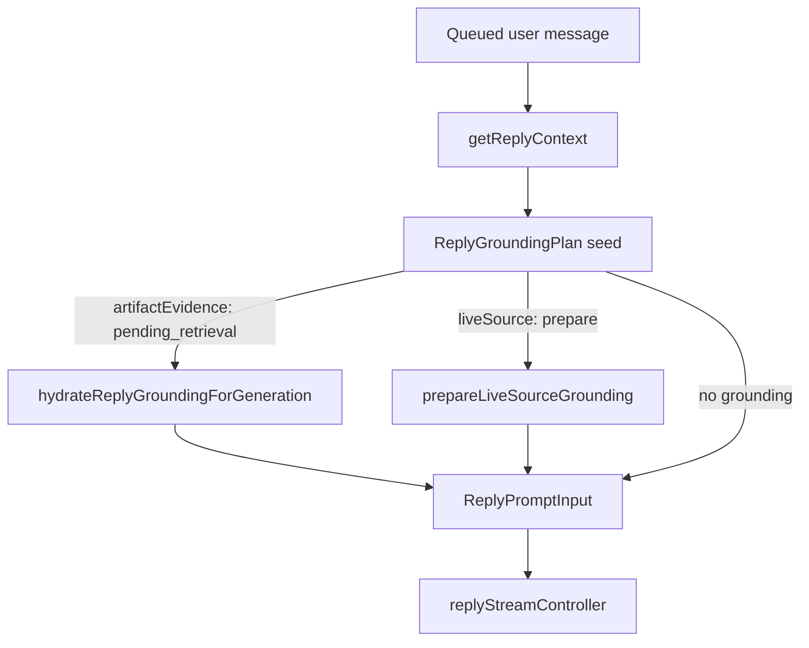

# Chat Context Retrieval System Design

## Purpose

This document explains how Systify grounds chat replies behind the Reply Grounding Module. The reply session does not interpret raw context fields such as `artifacts`, `artifactChunks`, `chunks`, or `sandboxTooling`. Instead, `getReplyContext` returns turn-level data plus a `ReplyGroundingPlan`, and the Node-side grounding module hydrates that plan into prompt evidence and prepared live-source tooling before generation.

## Grounding Plan

`internal.chat.context.getReplyContext` still owns the queue-time invariants:

- validate the thread
- validate the queued user message
- anchor `mode`, provider/model/reasoning, and grounding flags to that queued message
- load the bounded conversation window
- load viewer customization and the thread agent profile
- seed a `ReplyGroundingPlan`

The returned turn context is intentionally narrow:

- owner identity
- effective mode
- provider/model/reasoning
- agent profile
- user customization
- conversation messages
- `grounding: ReplyGroundingPlan`

The plan is then completed by `convex/chat/replyGroundingNode.ts`:

- `hydrateReplyGroundingForGeneration` resolves pending artifact retrieval into prompt artifact evidence and a citation map.
- `prepareLiveSourceGrounding` resolves live-source preparation into prepared sandbox tooling.



## Sources Of Truth

### 1. Ungrounded Discuss

`discuss` with both grounding toggles off is training-only chat.

Source of truth:

- `grounding.repository === null`
- `grounding.artifactEvidence.kind === "none"`
- `grounding.liveSource.kind === "none"`

Even when the thread has an attached repository, ungrounded Discuss performs no repository lookup and exposes no repository summary, artifacts, chunks, or live-source tooling to generation.

### 2. Library Grounding And Library Ask

`library` mode and `discuss` with `groundLibrary: true` are artifact-grounded.

Source of truth:

- `grounding.repository` contains the repository snapshot.
- `grounding.artifactEvidence.kind === "pending_retrieval"` after `getReplyContext`.
- `hydrateReplyGroundingForGeneration` calls `retrieveArtifactChunks`.
- Hydration returns `artifactEvidence.kind === "ready"` with:
  - `promptArtifacts`
  - `citationMap`

Scoped Library Ask keeps the selected artifact ids in `pending_retrieval.artifactScope`. If the explicit scope exists but resolves to no valid artifact for the repository owner, hydration returns ready empty evidence and does not broaden the search to the full repository.

Retrieved chunks are preferred over whole-artifact fallback rows. When no chunks are retrieved, the prompt falls back to the valid scoped artifacts or the latest docs artifacts. The citation map is built from the same ready artifact evidence the prompt renders, capped to the same `MAX_CONTEXT_ARTIFACTS` window.

### 3. Sandbox Grounding

`discuss` with `groundSandbox: true` is live-source grounded.

Source of truth:

- `grounding.repository` contains the repository snapshot.
- `grounding.liveSource.kind === "prepare"` after `getReplyContext`.
- `prepareLiveSourceGrounding` updates assistant progress, calls `ensureSandboxReady`, and writes the prepared tooling into `liveSource.readyHint`.

The context query no longer checks whether the latest sandbox row is already ready and no longer returns a top-level `sandboxTooling` handle. Sandbox availability is an action-side preparation concern. If preparation fails, the assistant message fails with:

```text
Live source couldn't be prepared. Retry the message.
```

The stream controller receives only:

```ts
groundingAudit: {
  ownerTokenIdentifier: string;
  sandboxTooling?: SandboxTooling;
}
```

That gives tool-call auditing the owner and sandbox id it needs without coupling the stream controller to the full Library/Discuss/Sandbox grounding shape.

## Inactive Repo Chunk Path

`repoChunks` and the old `ReplyContext.chunks` path are not active reply grounding. The reply generation path no longer selects `repoChunks`, no longer builds a chunk search query, and no longer passes relevant code excerpts into `buildUserPrompt`.

`repoChunks.search_summary` and `repoChunks.search_content` may still exist in schema history, but Library grounding uses `artifactChunks` RAG and Sandbox grounding uses live tools. Future source-code RAG would need a new design that does not revive the old wide `ReplyContext` shape.

## Why This Shape

The previous interface flattened conversation, repository summaries, artifact documents, retrieved artifact chunks, old repo chunks, and sandbox tooling into one broad context object. That forced `replySession.ts` to know which fields were valid under every mode and grounding flag combination.

The grounding plan localizes those decisions:

- mode and flags are resolved once at the query boundary
- artifact retrieval and citation evidence are produced together
- live-source preparation intent and prepared tooling are represented together
- prompt construction consumes ready grounding, not raw retrieval internals
- stream auditing consumes only the audit fields it needs

The result is a narrower reply session and a clearer source-of-truth contract for each grounding mode.
