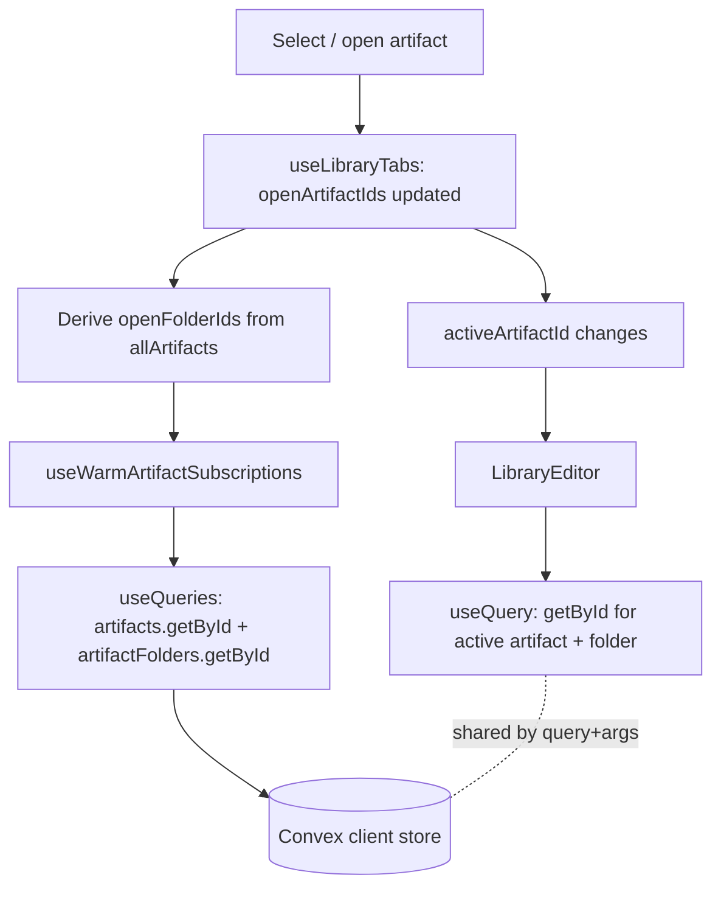

# Instant View Switching System Design

## Purpose

This document explains the architecture that makes switching between **chat threads** and **Library document tabs** in Systify feel **instantaneous**, while keeping the data fully live-reactive and free of any client-side staleness.

The pattern is one set of cooperating layers, applied in two places:

- **Bounded-set subscription retention** — keep a small, bounded set of recently-viewed views subscribed in the background. For chat threads the set is an MRU window over selected threads; for Library tabs it is the open-tab list (already capped by the tab strip).
- **Speculative prefetch** — start subscriptions on hover/focus before the user clicks (currently wired for chat threads via the sidebar; the Library tree could adopt the same hook without changes if a future use case warrants it).
- **Entrance-animation gating** — play the fade-in only the first time a view is shown in a session (currently wired in `ChatPanel`; not required in the Library editor because the editor does not run an entrance animation).

That separation removes the perceived loading flash for views users are most likely to revisit, without introducing a client-side cache or any stale-read risk.

## The Problem

The original code rendered the messages container behind a single `!isChatLoading` gate:

```tsx
{!isChatLoading && (
  <div className="...animate-in fade-in slide-in-from-bottom-2 duration-300...">
    {messages!.map(...)}
  </div>
)}
```

This compounded three independent problems into one visible flash on every thread switch:

1. **Subscription teardown.** When `selectedThreadId` changes, Convex's `useQuery` unsubscribes from the old `(query, args)` pair and starts a fresh subscription for the new one. Until the server responds, `messages === undefined`.
2. **Shell-loading coupling.** `isChatLoading` was a union of `isShellLoading` (a separate `useThreadCapabilities` query) and `messages === undefined`. Even when messages were already in the client store, the messages div was unmounted while capabilities reloaded.
3. **Forced re-animation.** Because the div was unmounted on every switch, the entrance animation replayed each time it re-mounted — adding a 300 ms visual delay even after the data was visible.

The combined effect: switching to a previously-viewed thread felt like a full re-load, not a navigation.

## Design Goals

The new architecture targets five properties, in priority order:

1. **Correctness first.** Never show stale data. Edits made server-side must appear immediately, including for threads not currently focused.
2. **Instant switching** for any thread the user is likely to revisit (most-recently-used set and hover-anticipated targets).
3. **Bounded fan-out.** The number of live background subscriptions must be small, fixed, and predictable.
4. **No client-side cache.** Do not maintain a separate copy of message data outside Convex's subscription store. Anything else creates a stale-read surface.
5. **Convex-idiomatic.** Use the APIs Convex provides (`useQueries`, `prewarmQuery`, subscription ref-counting) rather than working around them.

## Why Naïve Fixes Were Rejected

The history matters because each intermediate fix is a tempting wrong answer.

### Reject 1 — "Just skip the animation on revisit"

Tracking a `Set<ThreadId>` of seen threads and conditionally dropping the animation classes was the first fix attempted. It eliminated the 300 ms re-animation but did **not** address the underlying unmount-on-switch problem. Users still observed a blank flash before the un-animated content appeared, because the div was still being torn down and re-created.

This is necessary but not sufficient — it is preserved in the final design (see `seenThreads` below) for first-visit cases.

### Reject 2 — "Render whenever `messages` is truthy"

Changing the gate from `{!isChatLoading && ...}` to `{messages && ...}` decoupled the messages div from `isShellLoading`. This was a correct local improvement and is preserved. But it did not fix the bigger issue: when `useQuery`'s args change, `messages` itself transitions through `undefined` until Convex resolves the new subscription.

### Reject 3 — "Module-scoped per-thread cache"

A `Map<ThreadId, Doc<"messages">[]>` outside React, written during render whenever `liveMessages` was truthy, used as a fallback when `liveMessages` was `undefined`. This worked visually but introduced four anti-patterns:

- **Mutation during render.** Violates React's pure-render contract; fragile under Strict Mode and concurrent rendering.
- **Reinventing Convex.** Duplicates work Convex's own client should be doing — the right fix is to make Convex's store have the data, not to shadow it.
- **Stale-read surface.** After leaving a thread, server-side edits do not reach the module-level Map. Switching back shows old data, then swaps to live — a brief but real inconsistency.
- **Unbounded growth.** No LRU; the map grows with every distinct thread viewed.

The lesson: the right place to keep "data for the thread the user just left" alive is the **same place** that keeps "data for the thread the user is currently viewing" alive — Convex's subscription store. The only thing missing is an instruction to keep the subscription open.

## Chosen Design

The system uses three cooperating mechanisms, each owning one concern.

### Layer 1 — Bounded-set subscription retention

A "warm" hook takes a small array of ids that name views the user might switch back to, and registers a live `useQueries` subscription for each id's view-rendering queries. Convex de-duplicates subscriptions by `(query, args)`, so:

- When the view's primary component's `useQuery` runs for the active id, it shares the subscription already established by `useQueries`.
- When the user switches to another id in the bounded set, that view's data is already in the client's subscription store; the new `useQuery` reads it synchronously.

The hook is mounted at the lowest parent that survives all switches within the relevant scope.

This is **not a cache**. Every entry is a real, server-pushed subscription. Server-side edits stream in normally.

The bounded id list comes from different places depending on the view:

- **Chat threads.** A small companion hook (`useRecentThreads`) tracks the most-recently-used N (default 5) thread ids in MRU order, where index `[0]` is the active thread. Re-selecting a thread moves it to the front rather than appending; the list is capped so the working set stays bounded. The warm hook (`useWarmThreadSubscriptions`) warms `listMessagesPaginated` + `getActiveMessageStream` for each id.
- **Library tabs.** The tab strip is already the bounded set — `useLibraryTabs` maintains `openArtifactIds` capped at `MAX_OPEN_TABS` (10), with VS Code-style least-recently-used eviction. No separate MRU hook is needed; the open-tab list is fed directly to `useWarmArtifactSubscriptions`, which warms `artifacts.getById` for each tab plus `artifactFolders.getById` for each unique folder referenced by those tabs (the folder id is read off `ArtifactListItem.folderId` from the shell's already-loaded metadata query, so no extra round-trip is required to discover what to warm).

### Layer 2 — Speculative prefetch

For threads outside the MRU window, the sidebar uses `ConvexReactClient.prewarmQuery` to start a subscription on hover and on keyboard focus, with `extendSubscriptionFor: 8_000` ms. This:

- Catches the "the user is about to click this thread" case before the click happens.
- Has a short retention window so mass-hovering across a long sidebar does not fan out long-lived subscriptions.
- Shares the subscription with the active `useQuery` once the user does click (same `(query, args)` de-duplication).

This is encapsulated in `usePrewarmThread`, which returns a stable callback. It is defined in `src/hooks/use-prewarm-thread.ts` and wired to `onMouseEnter` / `onFocus` in `repository-threads-rail.tsx` (the sidebar rail) and `library-ask-thread-tabs.tsx` (the Library Ask thread tabs).

### Layer 3 — Entrance-animation gating

The 300 ms fade-in is genuinely valuable on the **first** time a thread is shown — it tells the user that new content has materialized. It is noise on every subsequent visit.

`ChatPanel` keeps a session-scoped `seenThreads: Set<ThreadId>` in component state. On the first time a thread's messages div is shown, the entrance animation classes are present; `onAnimationEnd` (filtered to the parent target so streaming-bubble animations do not trigger it) adds the thread id to the set. On subsequent renders, `skipEntrance` evaluates to `true` and the animation classes are omitted. `skipEntrance` is true when **either** (a) the thread is already in `seenThreads`, **or** (b) `conversationScroll.didPrepend` is true — once an older page has been prepended into the current thread, animating the wrapper would render a slide-in over messages that are mid-restore.

The set is keyed by `ThreadId`, not by message identity, so a thread that gains new messages while the user is away still skips the entrance animation on revisit — only the new bubbles animate (via their own per-bubble animation, when applicable).

The set is capped at 64 entries (`SEEN_THREADS_CAP`); when full, the oldest entry (by insertion order) is evicted so a long-running tab that visits hundreds of threads does not accumulate the id list indefinitely.

## Component Reference

### Chat threads

| File                                       | Role |
| ------------------------------------------ | ---- |
| `src/hooks/use-recent-threads.ts`          | MRU tracking of viewed thread ids. Updates state during render (React-documented derived-state pattern) so the new list is observable in the same render that observes the new active id. |
| `src/hooks/use-warm-thread-subscriptions.ts` | Holds live `useQueries` subscriptions for `listMessagesPaginated` + `getActiveMessageStream` across the MRU set. No data is consumed; the side-effect is the retention itself. |
| `src/hooks/use-prewarm-thread.ts`          | Stable callback that calls `prewarmQuery` for both queries with an 8 s extension. Used on hover/focus from the sidebar. |
| `src/components/repository-shell.tsx`      | Mounts `useRecentThreads(effectiveSelectedThreadId)` and feeds the result into `useWarmThreadSubscriptions`. |
| `src/components/repository-threads-rail.tsx` | Calls `usePrewarmThread()` and wires the callback to `onMouseEnter` / `onFocus` on each thread row in the sidebar rail. |
| `src/components/library-ask-thread-tabs.tsx` | Also calls `usePrewarmThread()` and wires the callback to `onMouseEnter` / `onFocus` on each Library Ask thread tab. |
| `src/components/chat-panel.tsx`            | Houses `seenThreads`/`skipEntrance` for entrance-animation gating. Renders messages behind `{messages && …}` (not `{!isChatLoading && …}`) so capability-query loading does not unmount the content. |

### Library tabs

| File                                       | Role |
| ------------------------------------------ | ---- |
| `src/hooks/use-library-tabs.ts`            | Owns the open-tab list. Already MRU-bounded at `MAX_OPEN_TABS` with least-recently-used eviction, so it doubles as the bounded id set fed to the warm hook — no separate retention hook required. |
| `src/hooks/use-warm-artifact-subscriptions.ts` | Holds live `useQueries` subscriptions for `artifacts.getById` per open tab and `artifactFolders.getById` per unique folder referenced by those tabs. Mirrors `useWarmThreadSubscriptions`; no data is consumed. |
| `src/components/library-shell.tsx`         | Derives the unique folder id set from `allArtifacts` (the metadata query already loaded for the tree and tab strip) and calls `useWarmArtifactSubscriptions(tabs.openArtifactIds, openFolderIds)`. |
| `src/components/library-editor.tsx`        | Reads `useQuery(api.artifacts.getById, { artifactId })` and `useQuery(api.artifactFolders.getById, …)`. With the warm hook upstream, these resolve synchronously for any open tab; `EditorSkeleton` only shows on the first-ever load of an artifact. |

## Runtime Flow

### Chat threads

```mermaid
flowchart TD
  hover[Hover thread in sidebar] --> prewarm[usePrewarmThread]
  prewarm --> prewarmQuery[client.prewarmQuery: 8s extension]
  prewarmQuery --> store[(Convex client store)]

  click[Click thread] --> navigate[Route update]
  navigate --> active[effectiveSelectedThreadId changes]
  active --> mru[useRecentThreads: MRU updated]
  mru --> warm[useWarmThreadSubscriptions]
  warm --> useQueries[useQueries: messages + stream for each MRU id]
  useQueries --> store

  active --> container[ChatContainer]
  container --> useQuery[useQuery: messages + stream for active id]
  useQuery -. shared by query+args .- store
  useQuery --> panel[ChatPanel]
  panel --> seen{Thread in seenThreads?}
  seen -- yes --> noAnim[Render without entrance animation]
  seen -- no --> anim[Render with animation]
  anim --> end[onAnimationEnd: add to seenThreads]
```

The critical property: by the time `ChatContainer.useQuery` runs for the new thread, **the subscription is already alive** because one of {MRU retention, hover prefetch, previous active state} has registered it.

### Library tabs



There is no separate MRU hook because the tab strip already enforces the bounded set, and no entrance-animation gate because the editor does not animate on mount. Speculative hover prefetch is not currently wired for the Library tree; if needed, the same pattern as `usePrewarmThread` would apply.

## Trade-offs and Limits

### Subscription budget

- **Chat threads.** Default upper bound: `N × 2 = 10` subscriptions held by the MRU retention layer, plus transient hover prefetches that drop after 8 s. Both `listMessagesPaginated` and `getActiveMessageStream` are small bounded queries; ten of each over a single multiplexed WebSocket is a negligible client and server cost.
- **Library tabs.** Upper bound is `MAX_OPEN_TABS + unique folders` — at most `10 + 10 = 20`, and in practice far fewer because most tabs share a handful of folders. `artifacts.getById` returns a single document and `artifactFolders.getById` returns a single folder row; the budget is comparable to chat.

If a future use case needs to extend either window, raise the `limit` parameter on `useRecentThreads` (or `MAX_OPEN_TABS` in `use-library-tabs.ts`) rather than introducing a second mechanism.

### First visit is still a loading state

A view the user has never opened in this session, never hovered, and is not in the bounded set will still show a brief loading state on click. This is unavoidable — there is no data to display instantly. The hover-prefetch layer mitigates the predictable case (user reads the sidebar before clicking); the bounded-set retention layer mitigates the revisit case.

For Library tabs specifically, the first artifact opened in a session always pays this cost; subsequent switches between any open tab are instant.

### Bounded set is session-scoped

`useRecentThreads`'s state lives in component state, not in storage — a page refresh resets it. The Library tab strip *does* persist across reloads (URL + localStorage), so on reload the warm hook re-establishes subscriptions for the restored tab set on first paint. Persisting MRU state for chat would couple that hook to a storage layer for marginal benefit — the user's first navigation after a reload re-populates the MRU naturally, and most "I want this instant" paths involve switching within a session.

### Hover prefetch is opportunistic

`prewarmQuery` is documented as a hint, not a guarantee — future Convex versions may defer or skip it under high load. The MRU retention layer is the authoritative mechanism; the prefetch is an optimization on top.

### Why we did not use `keepPreviousData`

Convex does not expose a `keepPreviousData` flag on `useQuery`. Implementing one in user space (e.g., storing the previous value in a ref while the new args resolve) would briefly show one view's data under another view's header — a correctness bug masquerading as a perf optimization. The subscription-retention approach has the same instant-feel without the swap. This applies equally to chat threads and Library tabs.

## Failure Modes and Recovery

| Scenario | Behavior |
| -------- | -------- |
| Thread is edited by another tab while in the MRU set | Update streams in over the live subscription; visible immediately if the user is on that thread, visible on switch if not. |
| Thread is deleted on the server | Subscription returns an empty / null result; UI handles this via the existing `RepositoryMissingState` and thread-list reconciliation. |
| Convex client loses its WebSocket | Subscriptions reconnect automatically; the MRU set is unchanged. On reconnect, all MRU subscriptions are re-established in parallel. |
| User opens many threads quickly (faster than MRU window can update) | State updates batch under React 18; the MRU array converges to the latest user-observed order. |
| `prewarmQuery` is deferred or skipped by Convex | The user pays a one-time loading state on click. The MRU layer still covers revisits. |

## Future Work

1. **Adaptive MRU size.** Track switch frequency and grow the MRU window for users who churn between many threads.
2. **Idle-time warming.** When the user is idle on the active thread, opportunistically prewarm the next few threads in `lastMessageAt` order.
3. **Cross-tab MRU sharing.** Use `BroadcastChannel` to share MRU state across tabs of the same repository, so opening a thread in tab A warms it for tab B.

These are explicitly out of scope for the initial design — the three-layer architecture is the foundation they would build on, and none is required for the "feels instant" UX bar.

## Summary

The instant-switching UX is achieved by three orthogonal mechanisms, each owning one cause of the original flash:

- **Bounded-set subscription retention** prevents the subscription-teardown gap for revisited views (chat MRU window, Library open-tabs list).
- **Hover/focus prefetch** prevents it for anticipated-but-not-yet-clicked views (currently chat sidebar only).
- **Animation gating** prevents the 300 ms entrance replay on revisit (currently chat only — the Library editor does not animate).

None of them introduces a client-side cache. None of them creates a stale-read surface. All of them use Convex's documented APIs in their intended way. The subscription store remains the single source of truth, and the same hook shape (`useQueries` over a bounded id list at a parent that survives view switches) is reused across both applications.
