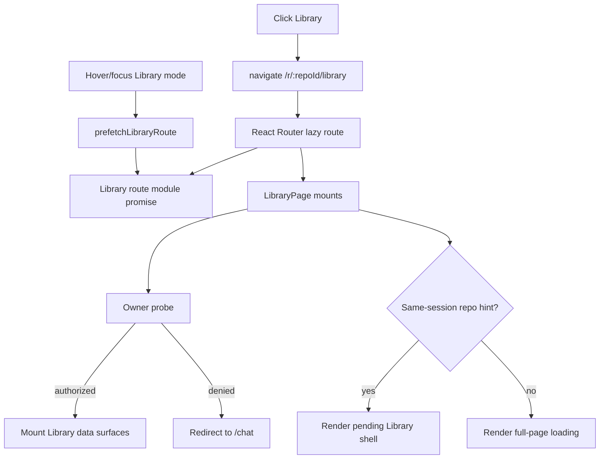

# Repository Mode Switching System Design

## Purpose

Systify has two repository-scoped service modes:

- **Discuss** at `/r/:repositoryId/discuss`
- **Library** at `/r/:repositoryId/library`

The URL, persisted thread mode, and user-facing label intentionally use the same vocabulary. Switching modes must feel like changing views inside one workspace, not like leaving the app and booting a new page.

This document defines the design for fast Discuss <-> Library switching while preserving the security rule that all repository, artifact, and thread data is authorized by Convex server functions.

## Problem

The current route model mounts a different page for each mode. A Discuss -> Library click changes the URL, unmounts the Discuss shell, lazy-loads the Library route chunk, and then lets `LibraryPage` start its own Convex subscriptions.

That produced a brief full-page loading state before the Library UI appeared. The loading state was technically correct, but it was too coarse:

1. The target route module might not have been downloaded yet.
2. `LibraryPage` waited for `listRepositoriesForSwitcher` and `listOwnedRepositoryIdsById`.
3. Until the owner probe resolved, it rendered a full `ScreenState`.

The important distinction: mode chrome can render before repo-scoped data is ready, but repo-scoped data must not.

## Design Goals

1. **Server-authoritative security.** The client never treats localStorage, URL params, or previous UI state as authorization.
2. **Instant mode intent.** When the user chooses Library, the visible chrome should move to Library immediately when there is a same-session repository hint.
3. **No stale data.** Do not use a module-level cache or keep-previous-data fallback that can show one mode's data under another mode's header.
4. **Bounded subscriptions.** Warm only small, predictable query sets.
5. **Canonical URLs.** Keep `/r/:repositoryId/discuss` and `/r/:repositoryId/library` as deep-linkable, refresh-safe routes.

## Chosen Design

### Layer 1: Route Chunk Prefetch

The route lazy import is shared through `src/route-prefetch.ts`.

`RepositoryModeSwitcher` calls the target mode prefetcher on hover and keyboard focus. React Router's lazy loader uses the same promise when navigation happens, so a deliberate click usually does not pay the route-module download cost.

This is an optimization only. If prefetch is skipped or the user clicks immediately, the route still loads normally.

### Layer 2: Pending Library Shell

`LibraryPage` still starts with server-side owner validation:

- `repositoryPreferences.listRepositoriesForSwitcher`
- `repositoryPreferences.listOwnedRepositoryIdsById`

Before `listOwnedRepositoryIdsById` resolves, the page may render a **pending Library shell** only when the browser has a same-session repository intent:

- `systify.activeRepositoryId === repositoryId`, or
- the repository already appears in the viewer's switcher result.

The pending shell is deliberately inert. It renders mode chrome and skeletons, but it does not mount artifact readers, folder navigators, Library Ask, or other repo-data surfaces. Those surfaces only mount after `isAuthorizedForRepository === true`.

If the owner probe returns false, the existing redirect behavior remains.

### Layer 3: Server-Side Authorization Remains Per Function

The pending shell is not an authorization mechanism. Every Convex function that returns repository, artifact, folder, sandbox, or thread data must continue deriving the viewer from `ctx.auth.getUserIdentity()` and checking ownership server-side.

This gives the best security posture:

- The frontend can optimize presentation.
- The backend remains the source of truth for data access.
- A stale URL or stale localStorage entry can at most show inert chrome before redirecting.

## Runtime Flow



## Why This Is Safe

The pending shell contains no repository artifacts, folders, thread messages, sandbox state, or generated content. It can show only generic Library chrome and skeleton placeholders.

The local repository hint is used only to decide between two loading presentations:

- full-page loading
- inert Library shell loading

It is never used to decide whether a data query is allowed. Data-bearing components remain gated on the server-confirmed `isAuthorizedForRepository === true` state.

## Performance Characteristics

- Route prefetch removes the first-time lazy chunk gap for hover/focus-driven switches.
- Pending shell removes the full-page visual blank for normal same-session mode switches.
- Data subscriptions are unchanged and remain live Convex subscriptions.
- No client-side data cache is introduced.
- Unauthorized deep links do not fan out artifact/thread queries while the owner probe is unresolved.

## Target Architecture

The long-term best shape is a shared route parent:

```txt
/r/:repositoryId/*
  RepositoryWorkspaceProvider
    AppSidebarLeft
    ModeSwitcher
    <Outlet />
      discuss -> DiscussSurface
      library -> LibrarySurface
```

That provider should own:

- repository owner validation
- repository switcher list
- viewer access
- mode eligibility
- active repository persistence

Discuss and Library would then consume the same verified workspace context. Mode switching would only swap the center/right mode surfaces, not recreate the entire repository workspace.

The current implementation is a smaller, compatible step toward that architecture: it preserves existing route boundaries and security checks while eliminating the most visible loading flash.

## Rejected Alternatives

### LocalStorage As Authorization

Rejected. localStorage is a first-paint hint only. It can be stale, user-editable, and out of sync with server ownership.

### Keep Previous Mode Data

Rejected. Showing Discuss data under Library chrome, or old Library artifact data under a new repository header, creates a correctness bug and a possible data confusion issue.

### Module-Level Data Cache

Rejected. It duplicates Convex's subscription store, risks stale reads, grows without a clear lifecycle, and is fragile under concurrent rendering.

### One Giant Repository Page

Rejected as the immediate step. A shared parent/provider is desirable, but Discuss and Library should remain separate surfaces with their own bundles and responsibilities.

## Implementation Reference

| File | Role |
| --- | --- |
| `src/route-prefetch.ts` | Shared lazy route module promises for Discuss and Library. |
| `src/router.tsx` | React Router lazy loaders consume the shared prefetch promises. |
| `src/components/repository-mode-switcher.tsx` | Prefetches the target route on hover/focus before navigation. |
| `src/pages/library.tsx` | Renders an inert pending Library shell for same-session repository switches while owner validation is unresolved. |

