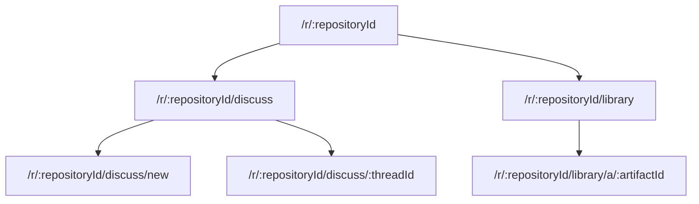
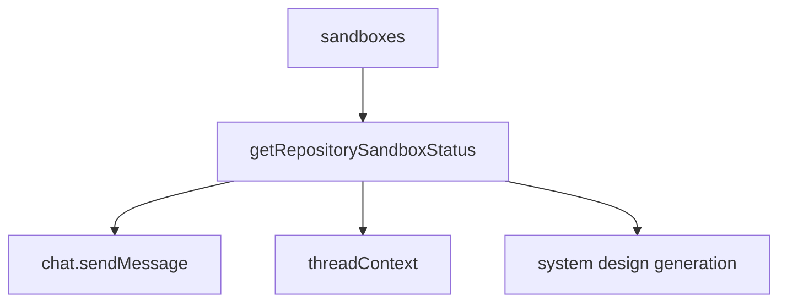

# Service Modes: Discuss, Library, and System Design

## Purpose

Systify exposes two top-level chat modes plus a background generator:

- **`discuss`** — free-form chat with two independent per-message grounding toggles:
  - **Library grounding** retrieves the repository's design artifacts and produces `[A#]` citations.
  - **Sandbox grounding** reads the live source tree through Daytona-hosted tools and produces `[path:line-line]` citations.
  - Both off → the reply is unbound LLM training-only chat.
- **`library`** — read-mostly artifact reader with an always-visible **Ask** panel running chunked-RAG over the repository's artifacts.
- **System Design generation** — background sandbox-backed job that writes the starter set of 8 System Design artifacts (`readme_summary`, `architecture_overview`, `architecture_diagram`, `data_model_overview`, `api_surface_overview`, `deployment_overview`, `security_overview`, `operations_overview`) into the Library for later citation. Every kind is LLM-backed — the generator opens a Daytona sandbox for every kind, including `architecture_diagram`, which carries an additional `validateMermaidBlock` quality gate so the published markdown is guaranteed to contain a parseable Mermaid block.

When a repository is attached, `library` becomes the default mode; otherwise `discuss` is the default.

## Routing Model

`/r/:repositoryId/discuss/new` is an explicit client-side Discuss draft route. The shell treats it as "no selected thread" while suppressing the normal most-recent-thread auto-open, so clicking **New thread** does not create an empty backend row. The first send calls `sendMessageStartingNewThread`; once the mutation returns, navigation `replace`s the draft URL with the canonical `/r/:repositoryId/discuss/:threadId`.

`library/a/:artifactId` is the only long-form artifact reader — the artifact owns the path, and chat citations, quick-open, tabs, and folder navigation all converge on it. The active Library Ask thread is secondary view-state, carried as an optional `?ask=:threadId` query param rather than its own route. Sandbox-grounded Discuss replies render inside the standard Discuss URL — Sandbox grounding is a per-message flag on Discuss, not a separate surface.

## Library Shell Composition

The Library page does not reuse the global chat shell. It mounts two separate sidebar components side-by-side around the document column:

- **`AppSidebarLeft`** (`src/components/app-sidebar.tsx:55`) — the shared repository sidebar. It branches internally on `effectiveChatMode`: in **Library** mode it renders `LibraryTree` (the artifact folder navigator); in **Discuss** mode it renders `RepositoryThreadsRail` (the vertical thread list). One component, two mode-specific content slots, scoped by `listThreads({ mode })` so a Library Ask thread can never leak into the Discuss rail.
- **`AppSidebarRight`** (`src/components/app-sidebar.tsx:181`) — the Library-mode-only right sidebar that carries `LibraryAskPanel`. The panel is a complete chat surface: an IDE-style thread tab strip on top (`LibraryAskThreadTabs`) — one tab per *open* thread, not the full list — over the conversation and the input. The `+` button opens a draft Ask state; the backend thread is created only when the user sends the first question. The clock button opens `LibraryAskHistoryPopover` as a popup beneath itself. Because the panel lives in the resizable sidebar, it gets its own stored width and a roomier default than the slim Discuss thread rail.

The Library page (`src/pages/library.tsx:193, 227`) mounts both sidebars side-by-side around the document column, so the folder tree, the editor, and the Ask panel are three peer surfaces of the same page.

The Library shell itself (`src/components/library-shell.tsx:13`) is a **single-column desktop layout**: it owns only the artifact tab strip (`LibraryTabs`) and the editor. The folder tree no longer lives inside the shell — it has moved to `AppSidebarLeft`'s Library-mode content slot. **Cmd+B** (around `src/components/library-shell.tsx:51, 60-64`) toggles the left sidebar, matching the Discuss muscle-memory; the previous separate "collapse icon rail" affordance is intentionally dropped in exchange for a single keybinding across all modes.

On narrow viewports the document column is the base layer and the left sidebar (carrying the folder tree in Library mode) moves into a Sheet; Library Ask rides inside the right sidebar's own Sheet, opened by the header's sidebar trigger. The Library tab-strip state (`useLibraryTabs`) is owned by the page and handed to both the document column and the right sidebar's Ask panel, so the artifact context stays in sync across the two. `Sidebar` mounts its children in exactly one place (docked `<aside>` *or* mobile Sheet, never both), so the Ask panel's cross-render local state (`useLibraryAskTabs`) is never split across two mounts.

The Ask thread strip is an *open set*, mirroring how the document column works: tabs are threads the user has explicitly opened (persisted per-repository in localStorage by `useLibraryAskTabs`, caching `{ id, title }` since `listThreads` is capped), the X closes a tab without deleting the thread, and the full searchable history — recall a past thread, pin it, or delete it — lives in `LibraryAskHistoryPopover` (anchored beneath the clock button rather than as a full-screen dialog). The *active* thread is the page-owned `?ask=` URL param. Thread deletion is intentionally confined to the history popover so it is never a stray click beside a close button; `LibraryAskPanel` owns the confirm-dialog flow so the deleted thread is dropped from the open set in one place.

## Library Access and the Empty State

Library is reachable whenever a repository is attached to the thread. It is **not** gated on the repository having at least one artifact: a freshly imported repository can open Library immediately. When no artifact bodies exist yet, the page renders a **Generate System Design** CTA button. Clicking it confirms and then calls `requestSystemDesignGeneration`, which queues a sandbox-backed job that writes the starter set of System Design artifacts into the default folders seeded at import time.

The Discuss composer surfaces the same CTA in its grounding toggle bar: when Library grounding is closed because the repository has zero artifacts (`library_no_artifact`), the toggle bar renders the dialog opener directly.

## Discuss Grounding Toggles

The Discuss composer exposes a two-axis toggle bar (`grounding-toggle-bar.tsx`) above the input. Per-message flags `messages.groundLibrary` and `messages.groundSandbox` are persisted on both the user message (as a record of what the user asked for) and the assistant placeholder (so the generation action can read them off the queued message). Library Mode messages do not consult these flags — Library's grounding is implicit in the mode.

Per-thread defaults live on `threads.defaultGroundLibrary` and `threads.defaultGroundSandbox`. Each send updates these so reopening the thread restores the toggle state the user last sent with. The composer's `setGroundLibrary` / `setGroundSandbox` state is keyed by `threadId`, so a verdict refresh from `repositoryModeEligibility.evaluate` does not stomp on a user's mid-session click.

## Composer Session

Discuss composer state is assembled by a shared Composer Session Module rather than by the repository shell or the rendering panel. The pure helper `src/lib/chat-composer-session.ts` resolves model route, access-disabled reasons, effective grounding availability, and send-request payloads. The React adapter `src/components/chat-shell-shared/use-chat-composer-session.ts` owns draft persistence, thread-keyed grounding state, model picker state, catalog readiness, send/cancel lifecycle, and the final `ChatComposerViewModel`.

`RepositoryShell` and `RepolessChatShell` provide surface-specific inputs to the same module. The repository adapter supplies repository id, active mode, grounding availability, viewer access, sync/read-only state, and the Generate System Design dialog opener. The repoless adapter fixes the surface to Discuss, disables grounding by construction, and supplies draft Agent Profile fields only for lazy first-send repoless thread creation.

`ChatPanel` consumes the resolved composer view model. It no longer decides model preference scope, model access disabled reason, grounding effective state, catalog readiness, or send payload shape. Its remaining responsibilities are rendering the conversation, scroll/older-message behavior, in-flight reply presentation, empty state, and laying out toolbar controls supplied by the composer.

Capability-based model selection routes the reply based on the (mode, groundSandbox) pair:

- `groundSandbox: true` → `sandbox` tier — tool-using replies benefit from stronger reasoning.
- `mode: "library"` → `library` tier.
- otherwise → `discuss` tier.

Within each tier the per-reply `(provider, modelName)` pair is collapsed by the 3-tier resolver in `convex/chat/modelSelection.ts:9-15`, which explicitly disclaims env-var overrides:

1. **Per-message override.** `overrideProvider + overrideModelName` from the queued user message (`messages.provider` / `messages.modelName`) — what the composer's model picker sent for *this* send. Revalidated against `MODEL_CATALOG` so a narrowed catalog degrades cleanly to the next tier instead of failing at the gateway.
2. **Thread default.** `threads.defaultModelName`, refreshed on every send, with the provider inferred via catalog lookup. Lets a re-opened thread restore the user's last pick without forcing them to re-select.
3. **Capability default.** Falls back to a hard-coded `DEFAULT_PICK_BY_CAPABILITY` entry sized so a fresh install with `OPENAI_API_KEY` set just works. Operator overrides land in `MODEL_CATALOG` (add an entry) — *not* via per-capability env vars.

## Per-Thread LLM Provider Lock

Each chat thread is locked to a single LLM provider for the lifetime of the conversation. The lock is written on the **first message** through `chat.sendMessage` (or `sendMessageStartingNewThread`) and is immutable afterwards.

- **What's locked**: `threads.lockedProvider` carries the provider literal (`openai` / `anthropic`). Once set, a send mutation whose picked provider disagrees is rejected with the structured `ConvexError` `{ code: "thread_provider_locked", ... }`.
- **What's not locked**: model *tier* inside the locked provider. A user can freely switch `gpt-5 → gpt-5-mini` mid-thread; only the provider literal is fixed. `threads.defaultModelName` carries the user's most recent pick and pre-fills the composer's picker when they reopen the thread.
- **Why backend-first**: the picker on the frontend filters the catalog by `lockedProvider` so a locked-out model is never offered, but the backend mutation is the source of truth. A frontend that bypassed the filter still cannot send under the wrong provider because the mutation rejects.
- **Why locked at all**: provider responses differ in reasoning-block shape, prompt-caching semantics, and tool-call envelope. Mixing Anthropic and OpenAI turns inside one history would corrupt the running context for the next reply. The lock surfaces that constraint as a product invariant rather than a silent failure mode.

Forking — letting a user branch a locked thread into a new thread that picks a different provider while keeping a back-pointer to the original — is reserved on `threads.forkedFromThreadId` for a future workflow; the column lands schema-side today so the addition is non-breaking when it ships.

System Design generation jobs (`jobs.provider` / `jobs.modelName`) snapshot the same `(provider, model)` pair at job creation and bake it onto the row. A stale-recovery auto-resume re-enqueues with the same pair so the per-kind artifact cache key (`{commitSha, provider, model, promptVersion}`) stays consistent across resume boundaries.

## Data Model

Library reads artifact metadata through a metadata-only query and fetches the markdown body only for the active editor tab. This keeps tree, tabs, and quick-open subscriptions small.

Artifact organization is represented by `artifactFolders`; the frontend computes visible folder counts from the already-loaded artifact metadata rather than asking the backend to scan artifacts per folder.

Library Ask retrieves from `artifactChunks`, which are separate rows so chunking and embedding churn does not rewrite the parent artifact document. Missing embeddings degrade to lexical retrieval instead of blocking Ask.

Sandbox sessions are stored in `sandboxSessions`, scoped to a repository, and linked to a repository sandbox when active. A repository has one reusable sandbox session shared across every Discuss thread that uses sandbox grounding, so thread switching never reprovisions compute. The `threads.sandboxSessionId` pointer is written lazily — only when a Discuss thread actually flips the Sandbox toggle on for the first time.

## Availability

Sandbox availability is centralized in `convex/lib/repositorySandbox.ts`. Callers must not decide sandbox-grounding readiness from `sandboxes.status` alone; availability also depends on TTL, `remoteId`, and `repoPath`.

`repositoryModeEligibility.evaluate` is the canonical "can the user use this mode / grounding axis right now?" surface. It exposes:

- `modes` — per-mode `{ discuss, library }` verdicts the top-level switcher consumes. The accompanying `defaultMode` is `library` whenever a repository is attached (only `discuss` for repoless threads), so opening a repository lands the user on the artifact reader rather than an empty Discuss thread.
- `grounding.library` / `grounding.sandbox` — the per-axis verdict the Discuss composer's toggle bar consumes. Each axis carries a structured `reason.code` (e.g. `library_no_artifact`, `sandbox_provisioning`, `sandbox_user_cap_exceeded`) so the UI can branch on it without regex-matching tooltip strings.
- `grounding.sandbox.isActivatable` — true when the sandbox is recoverable by a click (`missing` / `expired` / `failed`) and the cost-cap gate is open.

The pure resolver lives in `convex/lib/chatEligibility.ts`; `repositoryModeEligibility.ts` augments the resolver's string reasons with structured `{ code, message, retryAfterMs? }` objects so write-path callers can throw structured `ConvexError`s.

## Job Lifecycle

System Design generation and other sandbox-backed jobs must re-check repository liveness before writing durable artifacts. If a repository is archived or deletion has started, the job fails instead of publishing new knowledge.

Long-running jobs use leases. The contract for any `system_design`-kind Library generation job is:

- `leaseExpiresAt` is set at job-insert time, not only at the `queued → running` transition. This keeps the stale-job sweep (`by_status_and_kind_and_leaseExpiresAt` + `lt(leaseExpiresAt, now)`) able to recover a job that died before the Node action ran.
- The `queued → running` mutation refreshes the lease for a fresh window.
- Long actions refresh the lease *between* internally-serialised steps — for Library generation, this happens before each LLM-backed kind via `refreshGenerationLease` so a 5-kind publication does not overrun a single lease window.
- `recoverStaleSystemDesignJob` only fires when both `leaseExpiresAt` is set *and* has passed `now`, so a lease-less job (which is now impossible by construction) would not be falsely failed.

## Artifact Provenance

The Library freshness UI reads the optional `lastVerifiedAt` timestamp on each artifact. Every artifact is produced by a sandbox-grounded Library System Design generator, so `createArtifactInMutation` stamps `lastVerifiedAt: now` at creation, which gates the "verified against current source" badge.

`lastVerifiedAt` is the single signal the freshness UI consults — an artifact is "verified" iff this field is set. Sandbox-grounded Discuss sessions can re-stamp it on a re-read so a re-verified artifact transitions from "unverified" back to "verified".

A re-publication overwrites the previous artifact in the same folder, so the badge always reflects the most recent verification.

## Performance Rules

- Library list queries return metadata, not `contentMarkdown`.
- Folder listing is folder-only. Counts are derived from the artifact metadata already in memory.
- Sandbox grounding readiness uses the shared availability helper.
- Repository detail queries should stay status-oriented; full artifact bodies belong to artifact-specific reads.
- Import-drift derivation resolves the latest import SHA once per repository-scoped query, never per artifact — see the Artifact Import Drift System Design.
