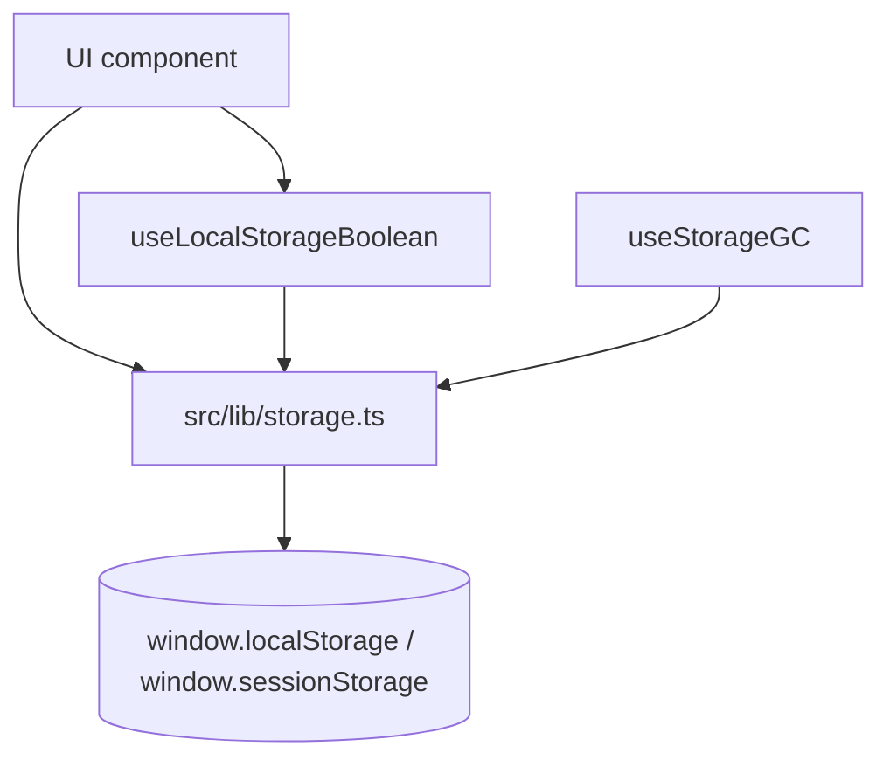

# Client Storage Architecture

This document is the implementation-level companion to
[`client-storage-strategy.md`](./client-storage-strategy.md). The strategy
doc answers "where should this new preference live?"; this one answers
"how do the helpers and hooks work, and what are their contracts?"

Read this when you are adding a new storage callsite, changing the
helpers, or debugging a storage-related behaviour.

## Module Layout

The stack is split into four layers, each with one job:

| File | Responsibility |
|------|----------------|
| `src/lib/storage.ts` | Leaf helpers — read / write / remove / enumerate for `localStorage` and `sessionStorage`, plus a cross-tab change listener. No React, no policy. |
| `src/hooks/use-persisted-state.ts` | `useLocalStorageBoolean` — typed boolean preference hook with conservative-write semantics and cross-tab sync. |
| `src/hooks/use-storage-gc.ts` | `useStorageGC` — reactive orphan sweeper for id-scoped keys. Mounted once in `RepositoryShell`. |
| `vitest.setup.ts` + `src/test-utils/storage.ts` | JSDOM polyfill installed once per test process, plus richer mocks tests can opt into. |

Each layer depends on at most one above it; `src/lib/storage.ts` has no
dependencies. New storage callsites should go through the leaf helpers;
new id-scoped prefixes should register with the GC hook rather than wire
their own cleanup callback.



## Helper API contract (`src/lib/storage.ts`)

All helpers accept a `kind: "local" | "session"` where it makes sense,
defaulting to `"local"` because that is the common case.

### Read / write / remove

```ts
readString(key, kind?): string | null
writeString(key, value, kind?): void
removeKey(key, kind?): void
```

Basic byte-level access. Reads return `null` on failure; writes are
no-ops. The caller treats storage as best-effort and never wraps these
in its own `try/catch`.

### Typed JSON

```ts
readJSON<T>(key, validate: (v: unknown) => v is T, kind?): T | null
writeJSON<T>(key, value, kind?): void
```

The validator is **required, not optional**. A schema-drifted stored
value parses successfully but fails validation, and the call returns
`null` — converting drift into a cache miss instead of a crashing
consumer. `writeJSON` only throws on cyclic structures (a caller bug);
quota and private-mode failures are swallowed.

### Enumeration and bulk delete

```ts
listKeysByPrefix(prefix, kind?): string[]
removeKeysByPrefix(prefix, kind?): void
```

`listKeysByPrefix` collects the matching keys into an array **before**
returning, so concurrent writes during iteration cannot corrupt the
result. `removeKeysByPrefix` forwards `kind` to the same enumeration so
the listing and the deletes always target the same area — this is the
fix for an earlier latent bug where the listing always scanned
`localStorage` regardless of `kind`.

### Cross-tab subscription

```ts
onLocalStorageChange(key, handler): () => void
```

Subscribes a handler to cross-tab writes for a single key. Returns an
unsubscribe function. **localStorage-only by design** — browsers never
fire `storage` events for `sessionStorage` (it is per-tab and never
broadcasts), so a `session` variant would be a no-op and is omitted.

### Error swallowing policy

Every helper wraps its underlying DOM call in `try/catch`. The intent:
callers can treat storage as best-effort without their own defensive
code. Concrete consequences:

- Private-browsing modes that throw on every `setItem` → writes silently
  no-op, state stays in-memory.
- Quota exceeded → same.
- A consumer that re-wraps the helper with its own try/catch becomes
  noisy duplication — explicitly called out in the strategy doc's
  Anti-Patterns list.

Tests that need to assert error paths spy on the underlying DOM methods
(see `use-persisted-state.test.ts` for the pattern).

## `useLocalStorageBoolean` contract

The hook is intentionally narrow — only `boolean` preferences — so the
surface stays small and the invariants are easy to test.

### Synchronous first paint

The hook reads `localStorage` in its lazy `useState` initializer, so the
first render already shows the persisted value. There is no
`isHydrated` flag and no two-render flicker. The prior implementation
that hydrated in `useEffect` is gone; tests now assert on the first
observation instead of via `waitFor`.

### Conservative write policy

The hook **does not** write `defaultValue` back to storage on first
mount when storage is empty. The naive write-on-every-change behaviour
would bloat `localStorage` with one entry per (key, defaultValue) the
user ever rendered — particularly bad for the per-folder open state in
`folder-navigator.tsx`, where a deep tree means dozens of branches per
repo. The orphan GC cannot distinguish such default-valued entries from
intentional choices, so they would accumulate indefinitely.

The invariant is enforced by a `hasUserSetRef` flag:

- Initialised to `parse(readString(key)) !== null` (true iff the key
  already has a real stored value).
- Set to `true` synchronously by the public setter, before the React
  state update is scheduled — so the write effect on the same render
  sees the correct flag.
- Re-evaluated on `key`/`defaultValue` change by the re-read effect.
- Re-evaluated by the cross-tab `storage` listener based on the
  incoming `newValue`.

The write effect short-circuits when the flag is `false`, so a fresh
mount with empty storage produces zero writes.

### "Follows changing default" semantic

A direct consequence of the conservative write: while no value has been
committed, the hook follows a changing `defaultValue` between renders.
Once the user (or another tab) commits, the stored value wins and
subsequent default changes are ignored. Two regression tests pin this
behaviour:

- `follows a changing defaultValue while no stored value exists`
- `locks against changing defaultValue once a value is explicitly set`

### Cross-tab synchronisation

`onLocalStorageChange` subscribes the hook to the same `key`. When
another tab writes, the listener fires, parses the new value, updates
`hasUserSetRef`, and calls `setValue`. A cross-tab `removeItem` arrives
as `newValue === null`, which the hook treats as "revert to default":
`hasUserSetRef` flips back to `false` so this tab does not re-assert
the cleared key on its next render.

### Failure mode

If `localStorage` throws on read or write, the hook degrades to
in-memory state: the user's session behaves correctly, but the value
does not persist across reload. The `falls back to in-memory state when
localStorage throws` test exercises this path.

## `useStorageGC` contract

Mounted once at the top of `RepositoryShell`. Sweeps orphan
`localStorage` keys whenever the live id sets change.

### Inputs

```ts
useStorageGC({
  liveRepositoryIds: ReadonlySet<string> | null,
  liveThreadIds: ReadonlySet<string> | null,
});
```

- `null` means **the upstream query is still loading**. The hook is a
  no-op in this state — sweeping against an empty live set on first
  mount would reap every cached key as an orphan.
- A non-null set is authoritative for that snapshot. Anything matching
  the registered prefixes whose owning id is not in the set is removed.

### Trigger paths

All three deletion paths share the same machinery because they all
observe the same `listRepositoriesForSwitcher` / live-thread
subscription:

- **Initial mount.** The first non-null snapshot reaps keys left over
  from prior sessions (e.g. a repository deleted on another device while
  this browser was closed).
- **Local deletion.** The mutation's reactivity drops the id from the
  local query cache; the live set shrinks; the sweep fires.
- **Cross-tab deletion.** Convex pushes the new snapshot to every open
  tab; the hook in each tab sweeps independently. No handshake
  required.

### Prefix registry

```ts
const WORKSPACE_SCOPED_PREFIXES = ["systify.library.tabs.", "systify.library.askTabs."];
const REPOSITORY_SCOPED_PREFIX = "systify.folderNav.open.";
```

Adding a new id-scoped key means adding its prefix here and **not**
writing a manual `removeKeysByPrefix` in the delete callback. A
mutation-side manual cleanup is redundant — the subscription update
triggers the same sweep one tick later — and creates two cleanup paths
to keep in sync.

### Explicit non-handling

`systify.activeRepositoryId` is intentionally NOT in the registry. It is
not id-scoped (one key, not per-repository) and is already handled by
the fallback effect in `useRepositoryPersistence` that promotes a
surviving repository when the active id disappears. See
[`repository-persistence-system-design.md`](./repository-persistence-system-design.md).

## sessionStorage vs localStorage

`sessionStorage` is supported by the same helpers but used for a much
narrower set of needs:

- **No cross-tab events.** Browsers never fire `storage` events for
  `sessionStorage`. The `onLocalStorageChange` helper is therefore
  localStorage-only.
- **No GC needed.** `sessionStorage` auto-clears on tab close, so a
  long-running orphan-sweep would have nothing to reap. Current callers
  (`systify.auth.returnTo`, `systify.github.pendingImport`) are
  one-shot flow flags that the consuming code clears explicitly after
  use.
- **One bounded use case.** "I need a flag to survive a redirect chain
  inside this tab." If the requirement is anything broader — multiple
  tabs need to see the same value, the value must survive a reload —
  `sessionStorage` is the wrong tool; choose between `localStorage` and
  the DB per the strategy doc.

## Testing infrastructure

JSDOM ships a partial `localStorage` — notably missing `clear()` — so
any storage-touching test would otherwise fail at the first cleanup.

### `vitest.setup.ts`

Runs once per test process. Installs an in-memory `Storage` polyfill on
both `window.localStorage` and `window.sessionStorage` only if the
runtime's implementation is unusable, and registers a global
`beforeEach` that clears both areas so each test starts with a clean
slate.

### `src/test-utils/storage.ts`

A typed companion that tests can opt into:

- `createMemoryStorage()` — same in-memory implementation as the setup,
  but typed against the DOM `Storage` interface.
- `installMockStorages()` — idempotent installer for tests that need to
  ensure the polyfill is in place after a `vi.unstubAllGlobals()`.
- `clearAllStorage()` — explicit clear helper.
- `createStorageEvent(key, newValue)` — synthetic `StorageEvent` for
  cross-tab sync tests; hand-rolled because some JSDOM versions reject
  `new StorageEvent("storage", { … })`.

### Why two implementations of `createMemoryStorage`

`vitest.setup.ts` is type-checked under `tsconfig.node.json`, which
deliberately does not include the DOM lib. Importing the DOM-typed
helper from `src/test-utils/` would force the node tsconfig to add
DOM, polluting other node-only files. The two implementations are kept
structurally identical and are tiny; any change to one must mirror to
the other.

## Adding a new storage callsite — checklist

1. **Classify** the data per [`client-storage-strategy.md`](./client-storage-strategy.md):
   device-local, repository-state, user-identity, or one-shot flow.
2. **Pick the area:** `localStorage` for device / repository state,
   `sessionStorage` for one-shot flow flags, DB (with localStorage
   cache) for identity.
3. **Go through `src/lib/storage.ts`** — never touch
   `window.localStorage` / `window.sessionStorage` directly. Use
   `readJSON` / `writeJSON` for non-string values; write a type guard.
4. **If the key is id-scoped** (`prefix.{repoId}.…`), add
   its prefix to `WORKSPACE_SCOPED_PREFIXES` or
   `REPOSITORY_SCOPED_PREFIX` in `use-storage-gc.ts`. Do not write a
   manual cleanup callback in the delete mutation.
5. **If the value is a boolean preference**, use
   `useLocalStorageBoolean` rather than rolling your own; you get
   conservative writes, cross-tab sync, and the "follows changing
   default" semantic for free.
6. **Test against `vitest.setup.ts`'s polyfill.** For richer test needs
   (synthetic storage events, spying on `setItem`), pull from
   `src/test-utils/storage.ts`.

## See also

- [`client-storage-strategy.md`](./client-storage-strategy.md) — placement policy and anti-patterns.
- [`repository-persistence-system-design.md`](./repository-persistence-system-design.md) — the specific two-layer design (localStorage cache + DB source of truth) for `systify.activeRepositoryId` and the orphan-cleanup contract for repository deletion.
