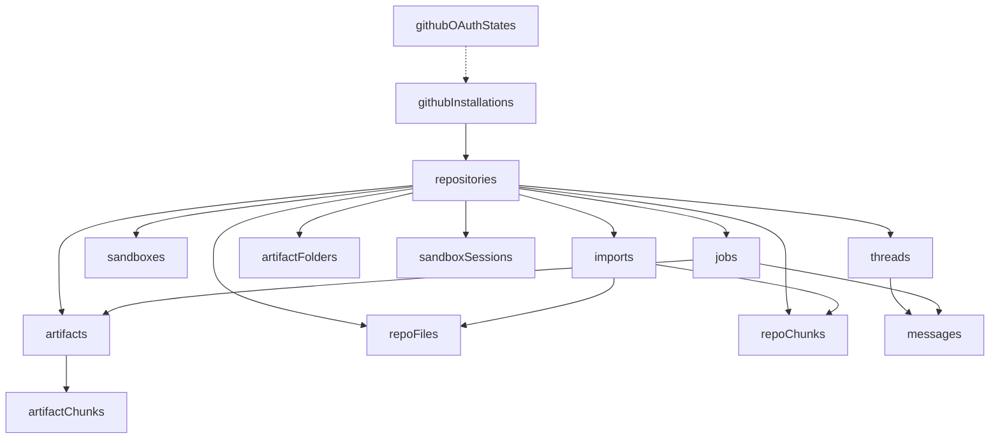

# Domain And Data Model

## Purpose

This document explains Systify's core domain entities, data responsibility boundaries, and how the current workflows are represented through tables and state fields.

## Design Principles

The current data model has three clear centers:

- **Code facts** — imports pin concrete trees (`imports.commitSha`), then `repoFiles` / `repoChunks` indexed from that snapshot. This is what sandbox-grounded tools ultimately reason about.
- **Narratives** — `artifacts` hold longer-lived prose (System Design overviews, failure-mode analyses, notes). They link to repos (and optionally threads) via `repositoryId` / `threadId` and citations in chat—not a substitute for chunk-level grounding.
- **Repository aggregate** — `repositories` is the long-lived aggregate root and the binding point for sandbox sessions, threads, artifacts, and the import pipeline. Threads may also exist repository-less (`threads.repositoryId` unset) for ungrounded Discuss before an attach.
- **Tenant isolation** — `ownerTokenIdentifier` scopes every viewer-owned row.
- **Workflow progress** — `imports`, `jobs`, `sandboxes`, `messages`, `sandboxSessions` carry lifecycle fields.

Discuss vs Library (behavioral SSOT boundary):

| Mode | Repo | Default focus |
| ---- | ----- | ------------- |
| `discuss` | Optional | Ungrounded or multi-topic ideation |
| `library` (“Library Ask”) | Required (`threads.repositoryId`) | Queries scoped to chunked artifacts |

### Traceability snapshot (minimal v1)

`artifacts` optionally record `alignedImportCommitSha`. When populated, Convex read paths compare that SHA against the owning repository’s **`latestImportId` → `imports.commitSha`** and surface a coarse **drift vs latest sync** flag for UI—not content-level reconciliation. See the Artifact Import Drift System Design for the full design, including the deliberately-deferred path-scoped variant.

Historical messages intentionally **stay put** after attach-repo or rare repo swaps: only downstream replies consume the new grounding.

## Core Entities

The `OAuthState -.-> Installation` edge is a dashed arrow because `githubOAuthStates` carries no foreign key to `githubInstallations`. The state row only encodes a one-shot CSRF token that the GitHub App callback validates before upserting an installation — the relation is causal (state precedes install), not stored.

### `repositories`

`repositories` is the aggregate root of the product. It defines a repository that can be imported, queried through chat, and analyzed, while also holding several "current latest state" pointers:

- `latestImportId`
- `latestImportJobId`
- `latestSandboxId`
- `defaultThreadId`

It also stores post-import summary data such as:

- `summary`
- `readmeSummary`
- `architectureSummary`
- `detectedLanguages`
- `packageManagers`
- `entrypoints`

This allows the frontend to render the main experience from repository-level metadata without rescanning lower-level records every time.

### `imports`

`imports` represents a single repository import or sync attempt. It is not the repository itself, but rather a lifecycle-aware execution record.

Its responsibilities include:

- recording the source URL and branch
- pointing to the associated `job`
- storing the commit SHA and completion time for that import

Import never provisions a Daytona sandbox — repository metadata and knowledge are pulled through the GitHub API directly into Convex. Sandboxes are provisioned lazily by the Discuss-mode sandbox grounding toggle and by LLM-backed Design Docs templates.

In other words, `repositories` is the long-lived entity, while `imports` is a one-off process snapshot.

### `sandboxes`

`sandboxes` records the Daytona-side sandbox mapping and TTL configuration, including:

- `remoteId`
- `repoPath`
- CPU, memory, and disk limits
- `ttlExpiresAt`
- auto-stop, auto-archive, and auto-delete intervals

Its existence lets the system distinguish between a live sandbox that can support Design Docs generation or sandbox-grounded Discuss and a repository that has only been indexed into static data.

### `jobs`

`jobs` is the shared tracking layer for all asynchronous workflows. Different `kind` values share the same table (see `convex/schema.ts:29`):

- `import`
- `index`
- `system_design`
- `chat`
- `cleanup`
- `sandbox_activation`

Each job carries:

- `status`
- `stage`
- `progress`
- `costCategory`
- `triggerSource`
- `provider` / `modelName` — LLM provider and model baked into the job at creation, so a System Design job's per-kind cache key (`artifacts.generatedByProvider/Model/promptVersion`) remains stable across resumes after action timeout

Because of this, the UI does not need to know the internal implementation of every background flow. It can render progress and result summaries directly from the job list.

### `artifacts`

`artifacts` stores outputs with long-term value relative to repositories (and optionally threads) rather than ephemeral stream state. Current artifact kinds include:

- `readme_summary`
- `architecture_overview`
- `architecture_diagram`
- `entrypoints`
- `dependency_overview`
- `data_model_overview`
- `api_surface_overview`
- `deployment_overview`
- `security_overview`
- `operations_overview`
- `trade_off_matrix`
- `migration_plan`
- `capacity_estimate`
- `design_review`

This table plays two roles:

1. Reusable knowledge produced by **Design Docs generation** (implemented internally as System Design generation): the user opts into optional templates, and the sandbox-backed job writes user-selected artifact kinds (`readme_summary`, `architecture_overview`, `architecture_diagram`, `data_model_overview`, `api_surface_overview`, `deployment_overview`, `security_overview`, `operations_overview`). Import itself no longer seeds artifact bodies — it only seeds the default folder tree so the Library has a place to put them.
2. Additional prose authored later by the user as Library notes, or produced by future per-folder generation jobs.

Artifacts may optionally carry **`alignedImportCommitSha`**: best-effort record of which import revision the prose was authored against—used alongside sandbox verification timestamps to distinguish "checked against sandbox" freshness from **import snapshot drift**.

LLM-generated artifacts additionally carry a provenance + idempotency triple — `generatedByProvider`, `generatedByModel`, and `promptVersion` — used as the System Design generator's cache lookup key. A cache hit against `(repositoryId, kind, alignedImportCommitSha, generatedByProvider, generatedByModel, promptVersion)` means we already produced this exact artifact for the same commit, with the same model, against the same prompt revision, so reusing it is safe. Bumping any of provider / model / promptVersion invalidates the cache.

Library navigators consume metadata-only subscriptions; the markdown body loads when an editor tab is active.

### `userPreferences`

`userPreferences` carries per-viewer key-value preferences. `lastActiveRepositoryId` is the canonical "current repository" pointer used by the repository shell to restore the viewer's last attached repository across devices; the frontend keeps a localStorage cache for first-paint, but on conflict the DB row wins. Threads can also exist repository-less — those live under the `/chat/:threadId` shell with `threads.repositoryId` undefined, and an **Attach Repository** action later sets the field in place without rewriting earlier messages.

### `artifactFolders` and `artifactChunks`

`artifactFolders` stores the user's organizational tree for feature-level artifacts. Folder listing is folder-only; the frontend derives visible counts from the already-loaded artifact metadata.

`artifactChunks` stores markdown-aware chunks for Library Ask. Chunks are separate rows because indexing and embedding churn should not rewrite the stable parent `artifacts` document.

### `repoFiles` and `repoChunks`

Together, these tables form the indexing layer:

- `repoFiles`: repository tree and file-level metadata
- `repoChunks`: fine-grained fragments used by chat and analysis

`repoChunks` is tied to a specific import snapshot through `importId` and `fileId`, which keeps old and new import data from being mixed together.

### `threads` and `messages`

Chat data follows a standard thread/message model:

- `threads` stores the title, mode, and last interaction timestamps. Current product modes are `discuss` and `library` — the same vocabulary appears in the persisted DB literal, the URL segment, and the UI label. Sandbox grounding is per-message inside Discuss (`messages.groundSandbox`), not a separate mode.
- `messages` stores role, status, content, mode, and error information

Threads also pin LLM provider state once the first assistant reply lands:

- `lockedProvider`: thread-level provider lock written on the first assistant reply and immutable thereafter. Once a thread has held a turn with OpenAI we refuse to mix Anthropic into the same conversation history (and vice versa) — provider responses differ in reasoning-block shape, prompt-caching semantics, and tool-call envelope, so switching mid-thread would corrupt the running context. The composer's model picker hides the locked-out provider's models, and `chat.send.sendMessage` rejects mismatched picks with `thread_provider_locked` as backend defense-in-depth.
- `defaultModelName`: last picked model name for this thread, used by the composer's 3-tier resolver (composer override → `threads.defaultModelName` → `DEFAULT_PICK_BY_CAPABILITY`) to pre-fill the picker.

Beyond the basics, `messages` carries a few optional fields that are only populated when the corresponding feature applies:

- `provider` / `modelName`: pinned at message insertion time so a later model picker change in the composer does not retroactively re-attribute an already-finished reply. User messages carry the pair too so the per-user cost rollup can attribute spend by the model the user chose even when the corresponding assistant reply never finalized.
- `citationMap`: numbered `[A#] -> artifactId` entries, written for artifact-grounded replies
- `toolCalls`: frozen tool-call trace for sandbox-grounded replies (folded from `messageToolCallEvents` at terminalization: finalize or any terminal failure/recovery path; see `chat/chat-and-analysis-pipeline.md` for the lifecycle)
- `estimatedInputTokens` / `estimatedOutputTokens`: usage data from the model provider, when available

All three stay unset on messages that do not need them, so older rows continue to validate without backfill.

An assistant message is not written all at once. It transitions through `pending` -> `streaming` -> `completed`, `failed`, or `cancelled`.

### `messageStreams`, `messageStreamChunks`, and `messageToolCallEvents`

These three tables hold ephemeral state for an in-flight assistant reply. They exist so the durable `messages` row is not rewritten on every streamed delta or tool-call event:

- `messageStreams`: one active stream header per in-flight reply (compacted prefix + tail metadata). Deleted in the same transaction that finalizes the reply.
- `messageStreamChunks`: append-only stream tail chunks keyed by `streamId` + `sequence`. Periodically compacted into the header so the active-stream query stays bounded.
- `messageToolCallEvents`: append-only `start` / `end` events for sandbox-mode tool invocations, keyed by the AI SDK's `toolCallId` plus a per-message dense `sequence`. Drives the live "Reading X.ts…" ticker, then folded onto `messages.toolCalls` and drained at finalize / fail / stale-recovery time.

See `streaming-reply-optimization-system-design.md` for the design reasoning behind splitting these out from `messages`.

### `sandboxSessions`

`sandboxSessions` tracks repository-level sandbox execution state: `starting`, `active`, `paused`, `stopped`, or `ended`. The session owns cost transparency (`spentCents`) and idle auto-pause state so sandbox compute is explicit and observable. A repository has at most one reusable sandbox session shared across every Discuss thread that flips the Sandbox grounding toggle on, so thread switching never reprovisions compute.

### `githubInstallations` and `githubOAuthStates`

These two tables form the state layer for the GitHub App integration:

- `githubOAuthStates`: the CSRF state used before the callback
- `githubInstallations`: the installation relationship and status for the current signed-in user

## Tenant Isolation

### `ownerTokenIdentifier` is the canonical owner key

Almost every business table stores `ownerTokenIdentifier`. It comes from Convex-authenticated `identity.tokenIdentifier`, which means:

- it does not rely on a user id passed from the frontend
- it does not rely on mutable display names or emails
- it uses the stable identifier returned by the auth provider as the ownership key

This design makes the following check pattern consistent across the codebase:

1. call `requireViewerIdentity()` first
2. load the target document
3. verify `document.ownerTokenIdentifier === identity.tokenIdentifier`

## Snapshot Strategy

Systify does not overwrite import data in place. Instead, it keeps each import as its own snapshot and then uses the repository's latest pointers to mark the currently active version.

This has two effects:

- the currently usable data is not disrupted before a new import finishes
- once the new import is complete, old `repoFiles`, `repoChunks`, and import artifacts can be cleaned up safely

As a result, `latestImportId` and `latestImportJobId` are key anchors for current read behavior.

## Main State Machines

### Repository Import State

`repositories.importStatus` describes the repository's current top-level import state:

- `idle`
- `queued`
- `running`
- `completed`
- `failed`

### Import State

`imports.status` is closer to the status of an individual import record:

- `queued`
- `running`
- `completed`
- `cancelled`
- `failed`

### Job State

`jobs.status` is the unified progress field across all background workflows:

- `queued`
- `running`
- `completed`
- `failed`
- `cancelled`

### Sandbox State

`sandboxes.status` describes the reconciliation result between the Daytona runtime and the Convex database:

- `provisioning`
- `ready`
- `stopped`
- `archived`
- `failed`

This state affects both deep mode availability and cleanup behavior.

### Message State

`messages.status` is primarily used for assistant replies:

- `pending`
- `streaming`
- `completed`
- `failed`
- `cancelled`

`cancelled` joins the terminal-state set alongside `completed` and `failed`, used when the owner stops their own in-flight reply via `chat.cancel.cancelInFlightReply`. Distinct from `failed` because the message body is not an error (partial content is still useful), the status label reads "Cancelled" (not "Failed") in the UI, and audit / metrics should distinguish user intent from upstream failures.

## Why This Model Works

The current data model separates three different responsibilities:

- long-lived product entities: `repositories`, `threads`
- process tracking: `imports`, `jobs`, `messages`
- reusable knowledge assets: `artifacts`, `repoFiles`, `repoChunks`

This split allows the UI, background workflows, and analysis features to share the same source of data without having to share the same update cadence.

## Known Limitations

- `repositories` aggregates many "latest state" fields, which makes reads convenient but also keeps it in an orchestration-heavy role.
- The workflow is still assembled mostly through status fields and the scheduler rather than an explicit domain-event model.
- `jobs` provides a unified tracking layer that simplifies the UI, but the details of each job kind still require reading the implementation.
- `jobs.kind = 'index'` is currently a reserved enum value; the codebase does not insert jobs with `kind: 'index'`, and indexing still happens inside the import pipeline.
- `artifacts.version` is currently always inserted as `1`, so artifact version management is not implemented yet.
- Import-drift indicators need `artifacts.alignedImportCommitSha`; rows without it stay silent until a writer fills the field.
