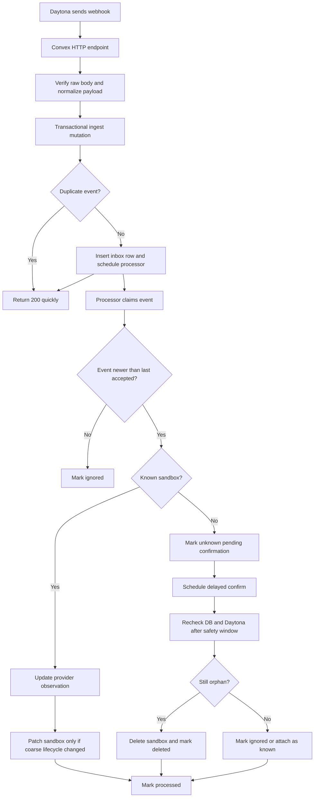
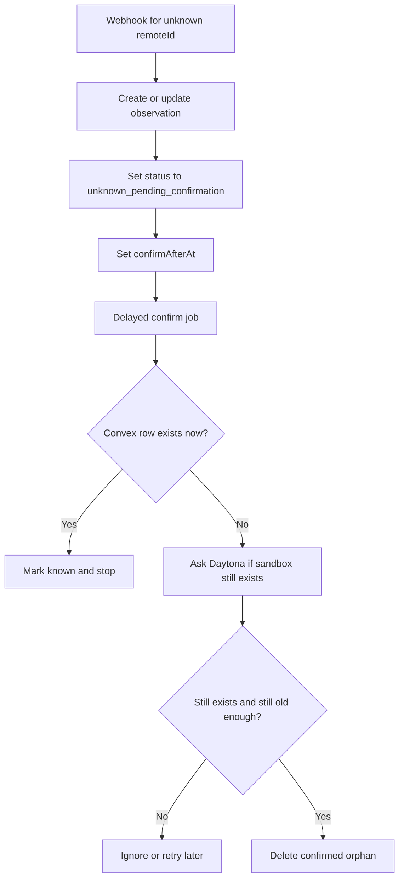

# Daytona Webhook Reconciliation System Design

## Purpose

This document explains the recommended long-term design for ingesting Daytona sandbox webhooks without weakening the existing cleanup and reconciliation model.

## Why This Needs A Design

Systify already has a safe baseline:

- DB-first sandbox provisioning
- request-path cleanup jobs
- cron reconciliation for known and unknown sandboxes

That baseline is reliable, but it is still eventually consistent. Daytona can change sandbox state before Convex notices.

Webhook ingestion is the natural next layer, but only if it preserves three things:

1. durability
2. idempotency
3. final reconciliation through cron

If webhook code skips those properties, the system becomes faster but less trustworthy.

## Why A Webhook Helps

In simple terms, Daytona owns the real sandbox and Convex owns our local record of that sandbox.

That means the two sides can temporarily disagree:

- Daytona may already know that a sandbox was created
- Daytona may already know that a sandbox stopped or was archived
- Convex may still be showing the older state until the next background check

Without a webhook, Systify learns about those changes later.

That delay is usually safe, but it has two costs:

1. the product reacts more slowly to real sandbox state changes
2. orphan sandboxes can stay around longer before cleanup notices them

The webhook exists so Daytona can tell Systify, "something changed right now."

That gives the system a faster signal, but not the final source of truth. The cron jobs still stay in place because webhook delivery itself can be delayed, duplicated, or missed.

The short version is:

- webhook = faster awareness
- cron = safety net

## Design Goals

The webhook design should optimize for:

1. fast acknowledgement to Daytona
2. safe duplicate handling
3. safe out-of-order handling
4. no immediate deletion of unknown remote sandboxes
5. low write contention on the main `sandboxes` table
6. repairability when processors fail or deploys interrupt in-flight work

## Security And Permission Contract

This webhook design assumes explicit provider-side and receiver-side boundaries.

### Daytona API key capabilities

Systify's Daytona integration uses one API key (`DAYTONA_API_KEY`) and requires
capabilities that match the operations in `convex/daytona.ts`:

- sandbox lifecycle management: create, get, list, stop, delete
- sandbox file access: clone repository, list files, download files
- sandbox command execution for focused inspection

The key should be scoped to the minimum Daytona permissions that satisfy these
capabilities. If Daytona's permission labels change by version, the capability
list above is the source of truth for re-validation.

### Webhook endpoint trust boundary

The webhook ingress accepts only Daytona sandbox lifecycle events and verifies:

- Svix signature headers (`svix-id`, `svix-timestamp`, `svix-signature`)
- endpoint signing secret (`DAYTONA_WEBHOOK_SIGNING_SECRET`)
- optional organization allowlist (`DAYTONA_WEBHOOK_ORGANIZATION_ID`)

Any failure in this chain must fail closed (401) and avoid mutating business
state.

### Secret storage and rotation

- `DAYTONA_API_KEY` and `DAYTONA_WEBHOOK_SIGNING_SECRET` live only in Convex
  runtime environment variables.
- Secrets are never read from frontend `.env`.
- Rotation should update provider and Convex env in a coordinated window and
  verify with a test delivery before completing rollout.

## Core Idea

The recommended shape is:

- a thin HTTP ingress
- a durable event inbox
- a separate provider-observation projection
- delayed confirmation for unknown remotes
- cron as the final backstop

In plain terms:

- `daytonaWebhookEvents` stores what arrived
- `sandboxRemoteObservations` stores the latest Daytona-side view
- `sandboxes` remains the app workflow state

## Main Flow

## Why Ingest Through A Mutation

The HTTP endpoint should not directly perform the full workflow.

Instead, after verification it should call one internal mutation that:

1. computes the dedupe key
2. inserts the inbox row
3. schedules the processor

Putting those steps in one mutation gives a cleaner durability boundary. The system does not have to reason about:

- an event row being written without downstream work being scheduled
- downstream work being scheduled without a durable event row

That is the safest fit for Convex.

## Data Responsibilities

### `daytonaWebhookEvents`

This is the durable inbox and audit log.

It should store:

- event identity
- dedupe key
- normalized event type
- remote sandbox ID
- organization ID
- event timestamp
- processing status
- retry metadata
- error metadata
- retention deadline

Its job is not to be the main read model. Its job is to make delivery and replay safe.

### `sandboxRemoteObservations`

This is the latest Daytona-side projection.

It should store:

- latest remote state
- latest accepted event timestamp
- first seen time
- last seen time
- whether the remote is known or still unclaimed
- the time after which an unknown remote may be confirmed as orphaned

This table exists because provider state can be relatively noisy. Keeping that noise out of `sandboxes` reduces contention and keeps the app-facing workflow model simpler.

### `sandboxes`

This remains the application lifecycle table.

It should only be patched when the webhook teaches the app something operationally important, such as:

- the sandbox has definitely stopped
- the sandbox has definitely been archived or destroyed
- the sandbox has definitely failed

It should not be rewritten for every provider observation.

## Handling Duplicates And Out-Of-Order Events

There are two separate problems:

### Duplicates

These are handled by the inbox dedupe key.

The implementation already uses the Svix `svix-id` header as the provider delivery ID for the dedupe key. The order is:

1. `svix-id` (the Svix provider delivery ID) — used by default
2. fallback derived key from `eventType + remoteId + eventTimestamp + normalizedState`, only when `svix-id` is missing

### Out-of-order delivery

This is handled by comparing the incoming event timestamp with `lastAcceptedEventAt`.

If an older event arrives late, the system should mark it ignored instead of letting it overwrite the more recent provider observation.

This rule is critical. Dedupe alone is not enough.

## Unknown Remote Confirmation

The most dangerous mistake would be deleting a sandbox as soon as a webhook arrives and Convex cannot find a matching row.

That can happen during a real race:

1. Daytona creates the sandbox
2. webhook is delivered quickly
3. Convex has not yet attached `remoteId` to the reserved sandbox row

The design therefore uses a delayed confirmation step.

This keeps the system safe under race conditions while still reducing orphan lifetime.

## Repair Loops

A webhook design is not complete unless it explains what happens when processing gets stuck.

Two additional background loops are recommended:

### Backlog repair

A cron periodically looks for inbox rows that are:

- `received`
- `retryable_error`
- `processing` past their lease expiry

It re-schedules them for processing.

### Retention cleanup

A cron deletes old processed inbox rows after a retention window.

Without this, the event journal will grow forever.

## Relationship To Existing Cron Jobs

The existing cron jobs still matter:

- `sweepExpiredSandboxes` reconciles known sandbox lifecycle
- `reconcileDaytonaOrphans` remains the broad safety-net scan

The webhook path improves reaction time.
The cron path preserves correctness.

The system should keep both.

## Result

This design keeps the current layered reliability model intact while adding a faster event-driven path:

- HTTP ingress stays small
- delivery becomes durable
- retries become safe
- unknown remotes are confirmed carefully
- the main `sandboxes` table stays cleaner
- cron still guarantees eventual convergence

That is why this design is a better long-term fit than a simpler "receive webhook and patch sandbox directly" approach.
