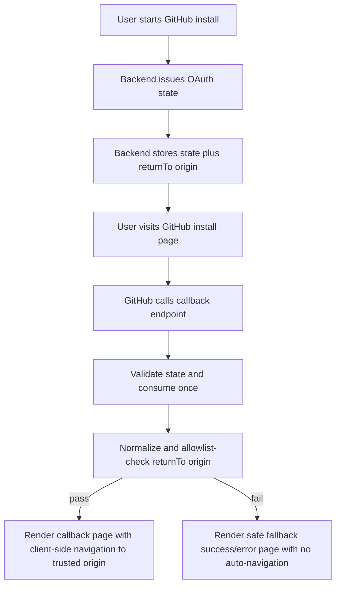

# GitHub Callback `returnTo` Allowlist System Design

## Purpose

This document explains why accepting arbitrary `returnTo` URLs in the GitHub callback flow creates an open-redirect phishing surface, and how an explicit allowlist design reduces that risk.

The scope is the callback redirect boundary, not general frontend navigation.

## Problem Statement

The callback path currently validates that `returnTo` is:

- a parseable absolute URL
- using `http` or `https`

That is necessary input validation, but it is not sufficient trust validation. If any origin is accepted, attackers can use Systify's callback endpoint as a trusted redirect hop.

## Why This Becomes A Phishing Chain

Open redirect issues are often underestimated because they do not always leak data directly. The real abuse pattern is trust laundering:

1. Attacker builds a link that starts on a legitimate Systify callback URL.
2. User sees a familiar domain and clicks.
3. Callback quickly redirects to attacker-controlled origin.
4. The destination page asks for credentials, MFA code, or sensitive actions.

The first hop on a trusted domain lowers user suspicion and can bypass lightweight domain checks in chat tools, ticket systems, or internal docs.

## Threat Model

### Assets to protect

- user trust in Systify auth/callback links
- integrity of installation and sign-in journeys
- operator confidence in outbound redirects

### Adversary capabilities

- craft callback URLs with attacker-chosen `returnTo`
- send links through social channels (email, chat, issue comments)
- exploit users' expectation that callback links are safe

### Out of scope for this design

- compromised DNS/TLS
- browser malware
- credential theft on unrelated origins without user interaction

## Security Design Goals

1. Prevent callback redirects to untrusted origins.
2. Keep preview and local development usable without weakening production.
3. Fail closed to safe fallback behavior when validation fails.
4. Keep implementation simple enough to audit and test.

## Core Decision: Origin Allowlist

Callback redirect targets must be validated against an explicit allowlist of origins. Being syntactically valid URL input is not enough.

Validation should require all of the following:

- absolute URL parse succeeds
- protocol is allowed for the environment (`https` in production; `http` only for local dev)
- normalized origin exactly matches an allowlisted origin

Exact match is intentional. Partial matching, suffix matching, and regex-heavy wildcard matching are easy to misconfigure.

## Recommended Architecture

## Allowlist Source Of Truth

Use one server-side environment variable as the source of truth, for example:

- `ALLOWED_RETURN_TO_ORIGINS`

Operational guidance:

- store as comma-separated origins (`https://app.example.com,https://preview.example.com`)
- parse lazily on first use and cache the normalized result (not at startup)
- keep production list minimal
- keep local dev entries explicit (`http://localhost:5173`)

Do not derive trust dynamically from request headers alone. Headers help routing, but they are not a safe trust policy.

## Validation Rules

### Rule 1: Parse and canonicalize

Parse with `URL`, use canonical `origin`, and reject malformed input.

### Rule 2: Protocol gate by environment

- production/staging: `https` only
- local development: allow explicit `http://localhost` or `http://127.0.0.1` entries

### Rule 3: Exact origin match

`origin` must be in allowlist as an exact string match.

### Rule 4: Fail closed

If validation fails:

- do not redirect to provided `returnTo`
- render the safe fallback page with no auto-navigation (the user sees a readable status page and stays put rather than being silently routed anywhere)
- log structured security event for investigation

## What This Defends Against

- callback endpoint abused as a trusted redirect trampoline
- phishing links that hide malicious final destination behind Systify domain
- accidental redirects to typo-squatted or unexpected preview domains
- policy drift where new environments quietly become redirect targets

## What This Does Not Defend Against

- social engineering on already-allowlisted but compromised domains
- phishing links that never touch callback flow
- stolen sessions caused by unrelated XSS or endpoint compromise

Allowlist is a high-value control, but it is one layer in defense in depth.

## Complementary Controls

- bind callback to one-time `state` and expiration
- keep callback responses non-verbose on failure
- add redirect telemetry and anomaly alerts
- optionally prefer relative in-app return paths when same-origin is enough

## Test Plan Requirements

At minimum, add tests for:

1. allowlisted production origin is accepted
2. non-allowlisted https origin is rejected
3. malformed or non-absolute input is rejected
4. `http` origin is rejected in production policy
5. local `http://localhost` origin is accepted only when explicitly allowlisted
6. missing/invalid state never causes fallback to attacker-provided origin

## Rollout Strategy

1. Introduce allowlist parsing and strict validation behind a feature flag if needed.
2. Add monitoring for rejected redirects to identify valid-but-missing origins.
3. Backfill allowlist entries for active preview workflows.
4. Enable strict mode by default and remove legacy permissive behavior.

## Residual Risk And Tradeoffs

- **Risk reduced:** phishing chain leverage through callback redirect drops significantly.
- **Tradeoff introduced:** operational overhead to maintain allowed origins.
- **Failure mode:** false rejects if allowlist is incomplete; mitigate with clear fallback UX and logging.

This tradeoff is generally favorable because the security boundary becomes explicit, auditable, and testable.
