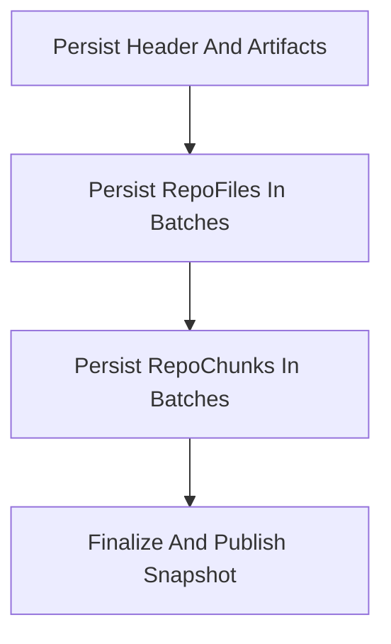

# Import Persistence System Design

## Purpose

This document explains why the import persistence flow uses staged writes plus a single finalize step instead of one large mutation.

## The Problem

An import produces three durable outputs:

- `repoFiles`
- `repoChunks`
- `artifacts`

It also needs to update the repository's published snapshot metadata, including:

- `latestImportId`
- `latestImportJobId`
- repository summaries
- detected languages and entrypoints

If all of that happens inside one mutation, two problems appear quickly:

1. large repositories push the transaction toward Convex mutation limits
2. retries can duplicate rows or replay side effects unless every write is idempotent

The system therefore needs a design that is both bounded and retry-safe.

## Design Goals

The persistence design optimizes for five properties:

1. retries must converge to one final snapshot
2. each write step must stay comfortably bounded
3. the UI must never see a half-published snapshot
4. cancellation must stop future work quickly
5. failure must not leave partial import data behind

## Chosen Design

The import persistence flow is split into four steps:

### 1. Header persistence

The first step writes only small, import-scoped metadata:

- import commit metadata
- job stage progress

This step is intentionally small so it is cheap to retry.

### 2. File batches

`repoFiles` are inserted in bounded batches. Deduplication is done by `importId + path`.

This gives each batch a stable idempotency key and avoids one oversized mutation.

### 3. Chunk batches

`repoChunks` are also inserted in bounded batches. Deduplication is done by `importId + path + chunkIndex`.

The chunk mutation resolves `fileId` inside the batch by querying the already persisted file rows. This avoids carrying a growing `fileIdsByPath` map through every action call as repositories scale up.

### 4. Finalize and publish

Only the final step is allowed to update repository-visible snapshot state:

- `latestImportId`
- `latestImportJobId`
- repository summaries (`summary`, `readmeSummary`, `architectureSummary`)
- detected languages
- package managers
- entrypoints
- `lastImportedAt` / `lastIndexedAt` / `lastSyncedCommitSha`

This makes finalize the only publish boundary. Finalize is intentionally **not** allowed to touch `latestSandboxId` — sandbox lifecycle is owned by sandbox-grounded Discuss and System Design via `ensureSandboxReady`, and the import pipeline never provisions one. See `repository-lifecycle.md` for the on-demand sandbox model.

## Why Publish Late

The most important design rule is:

> staged data may be written early, but published repository state may only change at finalize time.

Without that rule, the UI could observe a repository whose summary, README, or architecture text already points to the new import while `latestImportId` still points to the old file and chunk snapshot. That would create a mixed state where different reads describe different versions of the repository.

Late publish prevents that inconsistency. Readers either see:

- the old completed snapshot
- or the new completed snapshot

They never see an in-between version.

Sandbox state is intentionally outside this contract. Because import is GitHub-API-only and never touches `repositories.latestSandboxId`, the late-publish rule only has to cover the knowledge-base outputs above. Whatever sandbox the previous sandbox-grounded reply or System Design run provisioned keeps pointing where it was, and its own lifecycle (idle auto-stop, archive, deletion) is independent of import publication.

## Why Cleanup Runs On Failure And Cancellation

Batching introduces a new failure mode: some rows may already have been written when the workflow is cancelled or fails.

Those rows are not yet published, but they still consume storage and can confuse maintenance workflows if left behind. For that reason, the same cleanup path used for superseded snapshots is also reused for partial snapshots from failed or cancelled imports.

This gives the system a simple rule:

- completed old snapshots are cleaned up after a successful publish
- incomplete new snapshots are cleaned up after an unsuccessful publish

Sandbox cleanup is no longer part of this contract. Imports do not provision sandboxes, so there is nothing to clean up on import failure. Repository deletion is the path that schedules cleanup for every known sandbox belonging to the repository (typically created by sandbox-grounded Discuss or System Design).

## Idempotency Strategy

The system relies on document identity rather than "best effort" retries:

- artifacts upsert by `jobId + kind`
- files dedupe by `importId + path`
- chunks dedupe by `importId + path + chunkIndex`

It also guards import terminal states early so a retry cannot take an already completed, failed, or cancelled import and move it back into the running state.

## Trade-Offs

This design adds more mutations and more orchestration code than the old single-mutation approach. That is a deliberate trade:

- it costs a few more round trips
- but it sharply improves safety, retry behavior, and scale headroom

For this system, correctness and predictable recovery matter more than minimizing the number of mutation calls.

## Result

The staged-persist plus finalize-publish design gives Systify a cleaner snapshot boundary:

- writes are bounded
- retries are safe
- published state is consistent
- partial failures are recoverable

That combination is what makes the design a better fit for Convex-backed repository imports than a single large persistence mutation.