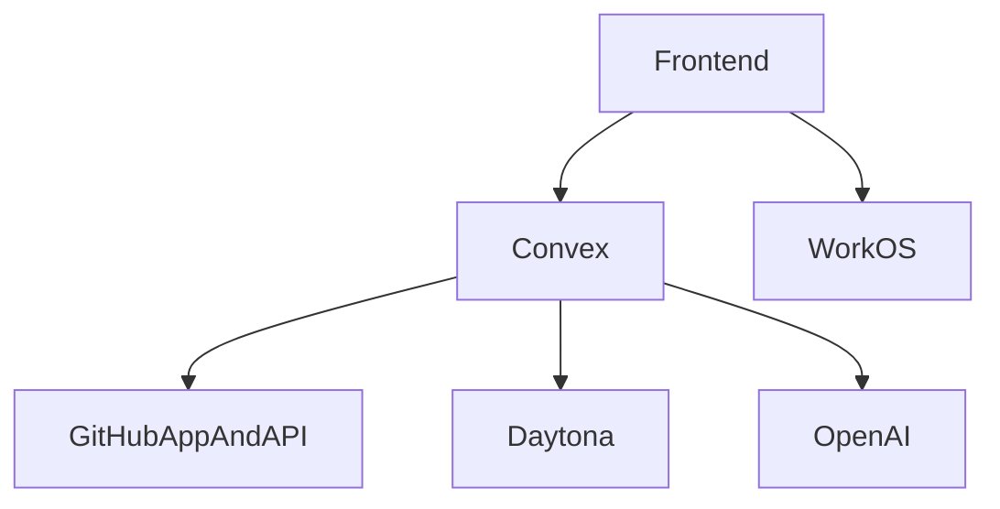
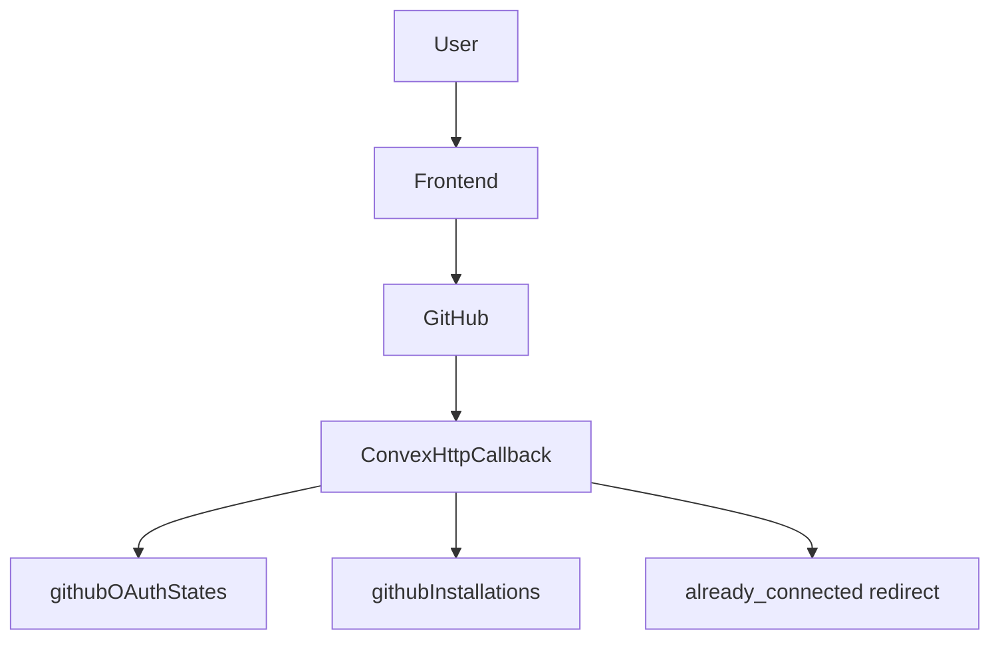
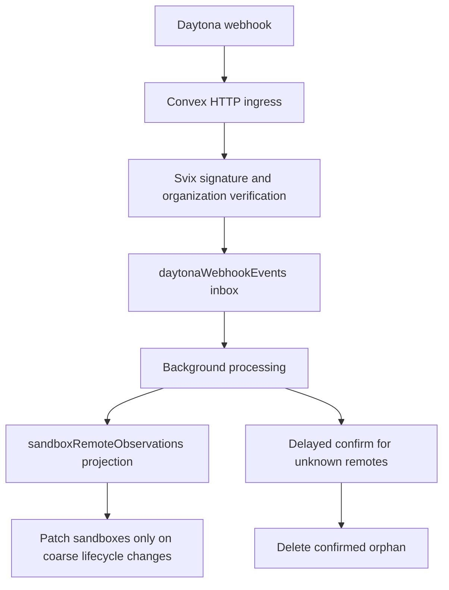
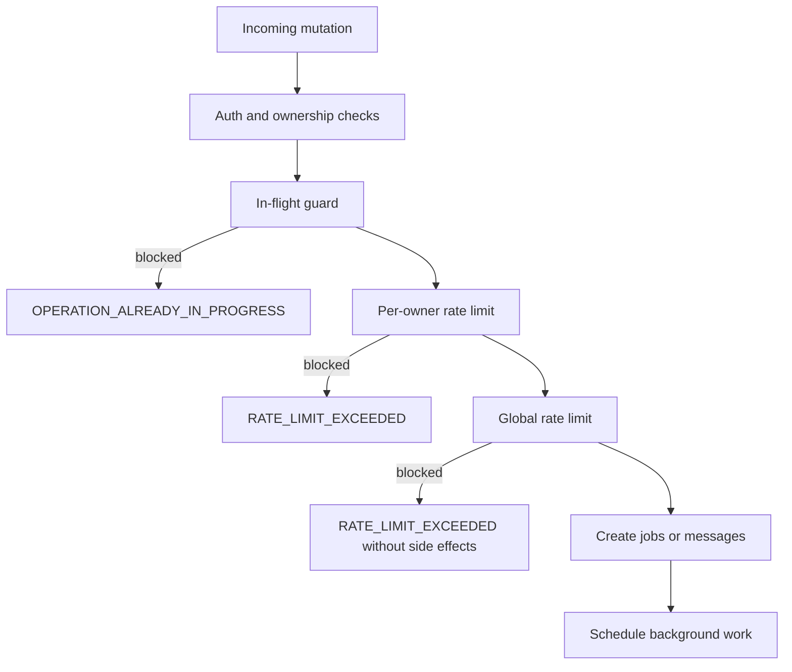

# Integrations And Operations

## Purpose

This document consolidates Systify's integration boundaries with external systems and the current operational design around runtime behavior, cleanup, and deployment.

## External Integration Overview

## WorkOS

### Role

WorkOS provides the browser-side sign-in experience and access token. Systify does not issue its own app tokens. Instead, it hands the WorkOS token to Convex for validation.

### Boundary

- the frontend uses `VITE_WORKOS_CLIENT_ID` and derives the callback URL from the current browser origin
- the backend uses `WORKOS_CLIENT_ID` to construct the custom JWT issuer and JWKS configuration

This gives the frontend and backend cleanly separated responsibilities:

- the frontend owns sign-in interaction
- Convex owns token validation

## GitHub App

The GitHub App is the core external dependency for repository access control.

### Main capabilities

- start the installation flow
- obtain installation access tokens
- verify repository access
- list repositories visible to the installation
- receive installation lifecycle webhooks

### Callback flow

The actual flow is:

1. The user starts GitHub App installation from the frontend.
2. The backend creates a random state and stores it in `githubOAuthStates` together with the frontend origin that started the flow.
3. GitHub redirects to `/api/github/callback` after installation.
4. The callback consumes the state and resolves the owner.
5. The callback fetches installation details from GitHub.
6. `saveInstallation` either:
  - connects or refreshes the same installation
  - or returns a conflict when the owner already has a different active installation
7. conflict redirects use `?github_error=already_connected` instead of silently replacing the existing connection.
8. callback redirects use the stored frontend origin when available.
9. if GitHub calls back without a usable state, the HTTP route returns an explicit error response instead of guessing a frontend URL.
10. if installation succeeds but no return target is available, the callback returns a small success page instead of a misleading 500 error.

### Webhook flow

`/api/github/webhook` currently handles installation lifecycle events such as:

- `deleted`
- `suspend`
- `unsuspend`

The webhook first verifies the payload with HMAC-SHA256 using `GITHUB_APP_WEBHOOK_SECRET`, then updates local installation state.

### Design points

- installation tokens are used instead of user personal access tokens
- both callback and webhook handling are centralized in Convex `http.ts`
- local `githubInstallations` records are a projection of GitHub permission state, not the sole source of truth
- the current product invariant is **one active GitHub installation per owner**
- a second different installation is treated as a product conflict, not as an implicit overwrite

## Daytona

Daytona provides the executable sandbox for repositories and is the core infrastructure behind import, Lab, and System Design generation.

### Daytona's role in the system

- provision sandboxes
- clone repositories
- list file trees
- download important file contents
- run focused inspection
- stop and delete sandboxes

### Sandbox resource model

Each sandbox is created with:

- CPU, memory, and disk configuration
- auto-stop, auto-archive, and auto-delete intervals
- `repoPath`
- `remoteId`

The Convex `sandboxes` table stores the local projection of the Daytona runtime so the system can:

- determine Lab and System Design generation availability
- display sandbox summaries
- execute later cleanup flows

When a user clicks **Generate System Design**, the request path now also extends the sandbox TTL before the background action is queued. This keeps the sandbox alive long enough for the System Design Node action to start and reduces request-versus-sweep races.

The import pipeline now writes the Convex-side sandbox row before calling Daytona create:

- a placeholder sandbox row is inserted with `status = provisioning`
- `imports.sandboxId` and `repositories.latestSandboxId` are pointed at that row immediately
- Daytona `remoteId`, resource limits, and paths are attached afterward to the same row

This removes the old crash window where Daytona could successfully create a sandbox but Convex had no corresponding record yet.

### Why import stops instead of immediately deleting the sandbox

After import finishes, the system stops the sandbox instead of deleting it immediately because:

- indexed data has already been persisted into Convex, so continuous CPU use is unnecessary
- Lab and System Design generation may still need a live repository environment
- Daytona can automatically wake the sandbox on later access

This is Systify's trade-off between cost and functionality.

### Why Daytona webhook exists

In plain language, Daytona knows the real sandbox state first, while Systify only knows what it has already recorded.

That creates a normal delay:

- Daytona may already know that a sandbox was created
- Daytona may already know that it stopped
- Daytona may already know that it was archived or deleted
- Systify may still be waiting for the next cleanup or reconciliation pass

If the system only checks later, it is still correct eventually, but it reacts more slowly and can leave orphan resources around longer than necessary.

The Daytona webhook exists to shorten that delay. It lets Daytona notify Systify as soon as something changes.

That does **not** mean the webhook replaces scheduled reconciliation. It only means:

- webhook gives faster notice
- cron keeps the system safe when notice is late or missing

### Daytona webhook convergence

Systify now also accepts Daytona sandbox lifecycle webhooks at `/api/daytona/webhook`.

The current flow is:

The webhook path is intentionally layered:

- the HTTP route stays thin and only verifies plus ingests
- `daytonaWebhookEvents` acts as the durable inbox for retries and debugging
- `sandboxRemoteObservations` stores the latest Daytona-side view without turning the main `sandboxes` table into a high-churn event log
- unknown remote sandboxes are never deleted immediately; they first wait through a safety window and a second confirmation step

This gives the system faster convergence without turning webhook delivery into a single point of correctness.

### Daytona permission and credential boundary

Systify currently uses a single Daytona API key (`DAYTONA_API_KEY`) for sandbox
operations. The key must be limited to the minimum capabilities required by the
backend integration:

- sandbox lifecycle operations (create/get/list/stop/delete)
- sandbox filesystem reads used during indexing and snapshot collection
- sandbox command execution used by Lab tools and the System Design generation flow

Webhook trust is separate from API-key trust:

- webhook authenticity is enforced through Svix signature verification with
  `DAYTONA_WEBHOOK_SIGNING_SECRET`
- optional org-level narrowing is enforced with
  `DAYTONA_WEBHOOK_ORGANIZATION_ID`
- both secrets live only in Convex runtime env and must not be exposed to the
  frontend bundle

## Sandbox Cleanup And Cron

### Orphan resource handling strategy

Handling orphan Daytona resources is treated as a first-class reliability and cost-control concern rather than a rare edge case.

The current system uses four layers:

- prevention: reserve the Convex sandbox row before calling Daytona create
- request-path correction: schedule cleanup jobs when a known sandbox fails or a repository is deleted
- webhook-driven convergence: ingest Daytona lifecycle events into a durable inbox and remote-state projection
- background reconciliation: periodically compare Convex state and Daytona reality, including remote sandboxes that have no matching DB row

This layered approach exists because sandbox lifecycle crosses two systems. Neither a single request path nor a single cron run can guarantee perfect cleanup on its own.

For a dedicated system-design explanation of this topic, see `orphan-resource-handling.md`.

### User- and system-triggered cleanup jobs

When a repository is deleted, or when the system proactively needs to clean up a sandbox, it creates a `cleanup` job that is ultimately handled by `opsNode.runSandboxCleanup`:

- if `remoteId` exists, delete the Daytona sandbox first
- if the sandbox is only a placeholder row with `remoteId = ''`, skip Daytona deletion gracefully
- in both cases, mark the local sandbox record as `archived`
- finally complete the cleanup job

This matters because a failed import can now leave behind a Convex-owned placeholder sandbox row even if Daytona provisioning never fully completed.

### Hourly sweep of expired sandboxes

`crons.ts` runs `sweepExpiredSandboxes` every hour. The job is not just about deletion. Its responsibility is reconciliation:

- if Daytona already reports the sandbox as archived or destroyed, the DB is marked archived
- if Daytona reports the sandbox as stopped, the system proactively deletes it
- if Daytona still reports it as started, the system stops it first and deletes it on the next cycle

That means cleanup logic considers:

- real Daytona state
- local Convex state
- TTL and cost control

### Label-based Daytona orphan reconciliation

`crons.ts` also runs `reconcileDaytonaOrphans` every 6 hours. This job handles the opposite direction: Daytona sandboxes that exist remotely but do not have a matching Convex row.

The action:

- lists Daytona sandboxes with the label `app = systify`
- checks whether each `remoteId` exists in Convex `sandboxes`
- ignores recently created sandboxes for a short safety window
- deletes old unmatched sandboxes from Daytona

This is the backstop for failures that happen after Daytona create succeeds but before Convex can attach the remote metadata.

### Webhook backlog repair and retention cleanup

Webhook delivery is not assumed to be perfect. Systify therefore also runs two maintenance loops:

- `repairDaytonaWebhookBacklog`: re-schedules inbox rows that are still `received`, are in `retryable_error`, or were left `processing` past their lease
- `cleanupOldDaytonaWebhookEvents`: deletes old inbox rows after the retention window so the durable inbox does not grow forever

These jobs make the webhook path durable instead of best-effort.

## OpenAI

### Role

OpenAI is currently used mainly for chat response generation across all current modes (`discuss` / `ask` / `lab`). If `OPENAI_API_KEY` is absent, the system falls back to a heuristic answer.

### Design implications

- OpenAI improves answer quality, but it is not the only requirement for product usability
- the real repository knowledge source still lives in Convex artifacts and chunks
- this fallback design preserves baseline usability even when the external model is unavailable
- when finalized usage is available, chat writes token counts to `messages` and `jobs`, plus `estimatedCostUsd` on the job
- cost estimation uses a small local pricing snapshot, so unknown models leave cost fields empty instead of breaking the reply path

## Rate Limiting And Lease Recovery

Systify uses the official `@convex-dev/rate-limiter` Convex component for request-level protection, plus lease-based in-flight guards for long-running interactive jobs.

### Request flow

This sequence is intentional: the system rejects the cheapest failure paths first, protects shared provider capacity second, and only creates database side effects after both checks have passed.

### Request buckets

- `importRequests`
  - default: `5 / hour`
  - mutations: `createRepositoryImport`, `syncRepository`
  - override: `RATE_LIMIT_IMPORT_PER_HOUR`
  - error: `RATE_LIMIT_EXCEEDED`
- `systemDesignRequests`
  - default: `10 / hour`
  - mutations: `requestSystemDesignGeneration`, `requestFailureModeAnalysis`
  - override: `RATE_LIMIT_SYSTEM_DESIGN_PER_HOUR`
  - error: `RATE_LIMIT_EXCEEDED`
- `chatRequestsPerOwner`
  - default: `30 / minute`, burst capacity `6`
  - mutations: `sendMessage`
  - overrides: `RATE_LIMIT_CHAT_PER_MINUTE`, `RATE_LIMIT_CHAT_BURST_CAPACITY`
  - error: `RATE_LIMIT_EXCEEDED`
- `chatRequestsGlobal`
  - default: `300 / minute`, burst capacity `60`, sharded
  - mutations: `sendMessage`
  - overrides: `RATE_LIMIT_GLOBAL_CHAT_PER_MINUTE`, `RATE_LIMIT_GLOBAL_CHAT_BURST_CAPACITY`
  - error: `RATE_LIMIT_EXCEEDED`
- `daytonaRequestsGlobal`
  - default: `30 / hour`, sharded
  - mutations: `createRepositoryImport`, `syncRepository`, `requestFailureModeAnalysis`, and `requestSystemDesignGeneration` *only when the request includes at least one LLM-backed kind*. Heuristic-only Library System Design requests skip this bucket because they do not touch Daytona.
  - override: `RATE_LIMIT_DAYTONA_GLOBAL_PER_HOUR`
  - error: `RATE_LIMIT_EXCEEDED`

### In-flight guards

- repository import / sync
  - guard source: `repositories.importStatus`
  - error: `OPERATION_ALREADY_IN_PROGRESS`
- Library System Design generation
  - guard source: active `jobs` rows where `kind === 'system_design'`, `status in ('queued', 'running')`, `leaseExpiresAt > now`, and `requestedCommand` does **not** start with `failure_mode_analysis:`. The FMA filter keeps a thread-scoped FMA job from blocking a repo-scoped Library generation.
  - lease override: `SYSTEM_DESIGN_JOB_LEASE_MS`
  - behavior: **idempotent** — returns the existing `jobId` instead of throwing, so the dialog can converge on the same job from a duplicate submit without an error toast.
- Failure Mode Analysis
  - guard source: active `jobs` rows where `kind === 'system_design'`, `status in ('queued', 'running')`, `leaseExpiresAt > now`, and `threadId === <current thread>`. Thread-scoped; an active Library System Design on the same repository does not block FMA.
  - lease override: `SYSTEM_DESIGN_JOB_LEASE_MS`
  - error: `OPERATION_ALREADY_IN_PROGRESS`
- chat replies
  - guard source: active `jobs` rows where `kind === 'chat'`, `status in ('queued', 'running')`, and `leaseExpiresAt > now`
  - lease override: `CHAT_JOB_LEASE_MS`
  - error: `OPERATION_ALREADY_IN_PROGRESS`

The `system_design` job kind is shared across Library generation and FMA. Both write `leaseExpiresAt` at insert time so the stale-job sweep can recover a row whose action never ran; the recovery branch dispatches on the `failure_mode_analysis:` `requestedCommand` prefix to pick the correct cleanup mutation.

### Recovery behavior

- `crons.ts` runs `reconcileStaleInteractiveJobs` every 5 minutes
- expired chat leases mark both the `jobs` row and assistant `messages` row as `failed`
- expired System Design generation leases mark the `jobs` row as `failed`
- structured Convex errors include `code`, `bucket`, `retryAfterMs`, and `message` so the frontend can show stable user-facing text

## Environment Variable Layers

### Frontend `.env`

These values are exposed to the browser:

- `VITE_CONVEX_URL`
- `VITE_WORKOS_CLIENT_ID`

### Convex runtime env

These values must exist in the Convex environment, not frontend `.env.local`:

- `WORKOS_CLIENT_ID`
- `GITHUB_APP_ID`
- `GITHUB_APP_SLUG`
- `GITHUB_APP_PRIVATE_KEY`
- `GITHUB_APP_WEBHOOK_SECRET`
- `OPENAI_API_KEY`
- `OPENAI_MODEL`
- `DAYTONA_API_KEY`
- `DAYTONA_API_URL`
- `DAYTONA_TARGET`
- `DAYTONA_WEBHOOK_SIGNING_SECRET`
- `DAYTONA_WEBHOOK_ORGANIZATION_ID`
- `RATE_LIMIT_IMPORT_PER_HOUR`
- `RATE_LIMIT_SYSTEM_DESIGN_PER_HOUR`
- `RATE_LIMIT_CHAT_PER_MINUTE`
- `RATE_LIMIT_CHAT_BURST_CAPACITY`
- `RATE_LIMIT_GLOBAL_CHAT_PER_MINUTE`
- `RATE_LIMIT_GLOBAL_CHAT_BURST_CAPACITY`
- `RATE_LIMIT_DAYTONA_GLOBAL_PER_HOUR`
- `CHAT_JOB_LEASE_MS`
- `SYSTEM_DESIGN_JOB_LEASE_MS`
- `DAYTONA_AUTO_STOP_MINUTES`
- `DAYTONA_AUTO_ARCHIVE_MINUTES`
- `DAYTONA_AUTO_DELETE_MINUTES`
- `DAYTONA_CPU_LIMIT`
- `DAYTONA_MEMORY_GIB`
- `DAYTONA_DISK_GIB`
- `DAYTONA_NETWORK_ALLOW_LIST`

### Why this split matters

- the frontend receives only public configuration
- sensitive credentials remain only in the Convex runtime
- GitHub, Daytona, and OpenAI secrets never leak into the frontend bundle

## Minimal Deployment Model

The minimum deployment structure implied by the current codebase is:

- frontend: a static site built from Vite
- backend: Convex cloud
- external dependencies: WorkOS, GitHub, Daytona, and OpenAI
- hosting/CD: Vercel Git integration calling `bun run build:vercel`
- SPA routing fallback: `vercel.json` rewrites client routes to `index.html` while leaving `/api/*` and file-extension asset requests alone

In other words, Systify does not require another always-on API server. Convex already fills the roles of application backend, scheduler, HTTP endpoint host, and database.

## Observations And Limitations

### Strengths

- External dependency boundaries are clear, and GitHub, Daytona, and OpenAI each have an explicit Node-side integration layer.
- Cleanup uses both jobs and cron, which balances proactive deletion with passive reconciliation.
- Environment-variable layering is clear, so sensitive credentials are not directly exposed to the frontend.

### Known limitations

- Both webhook and callback handling depend on Convex HTTP routes, so if integrations grow later, the system may need a clearer integration-module split.
- Daytona webhook verification now uses Svix signing on the raw body by validating `svix-id`, `svix-timestamp`, and `svix-signature` with `DAYTONA_WEBHOOK_SIGNING_SECRET`, then optionally enforcing the configured organization allowlist.
- Daytona cleanup is one of the most important cost-control paths, and failed sweeps or failed orphan reconciliation runs can still leave resources around temporarily.
- OpenAI is currently used mostly for chat, while the analysis pipeline is still centered on sandbox inspection, so the two paths have not yet converged into a single agent framework.

