# GitHub App Integration System Design

## Purpose

This document explains how Systify communicates with GitHub through its GitHub App, how a GitHub installation becomes trusted for a signed-in Systify owner, and how repository access is checked before import, sync, and sandbox-backed features.

The design covers the current implementation in:

- `convex/githubAppNode.ts`
- `convex/github.ts`
- `convex/http.ts`
- `convex/githubRepoFetcher.ts`
- `convex/importsNode.ts`
- `src/components/import-repo-dialog.tsx`

## Scope

The GitHub App integration owns:

- installing or reconnecting the GitHub App
- proving that a Systify owner controls the installation GitHub returned
- storing a local installation projection in Convex
- minting installation access tokens
- listing and searching repositories visible to the installation
- verifying repository access before import, sync, sandbox activation, or System Design generation
- fetching repository metadata and selected file contents through the GitHub API
- receiving installation lifecycle webhooks

It does not own:

- WorkOS sign-in
- Daytona sandbox lifecycle
- LLM generation
- repository knowledge persistence after the GitHub snapshot has been fetched

## High-Level Boundary

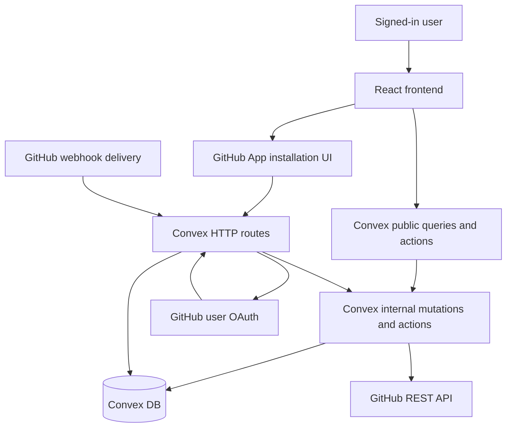

The important security shape is that the browser can carry GitHub callback parameters, but those parameters do not become trusted owner-scoped state until Convex validates them against Systify state and GitHub APIs.

## Runtime Components

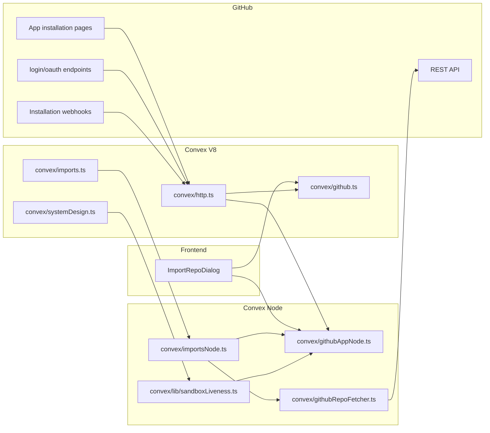

The split is intentional:

- HTTP ingress stays in `convex/http.ts`.
- persistent installation and OAuth-state rows stay in `convex/github.ts`.
- GitHub network calls that need Node runtime APIs stay in `convex/githubAppNode.ts` and `convex/githubRepoFetcher.ts`.
- import orchestration stays in `convex/importsNode.ts`.

## Data Model

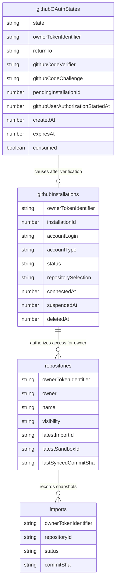

`githubOAuthStates` is a one-shot flow-control table. It is not long-term business data. It binds a GitHub callback to the Systify owner that started the install flow and carries the PKCE verifier needed for the GitHub user authorization step.

`githubInstallations` is Systify's local projection of GitHub installation state. It is useful for fast owner-scoped decisions, but the GitHub API remains the authority for current repository selection.

## End-to-End Install And Trust Flow

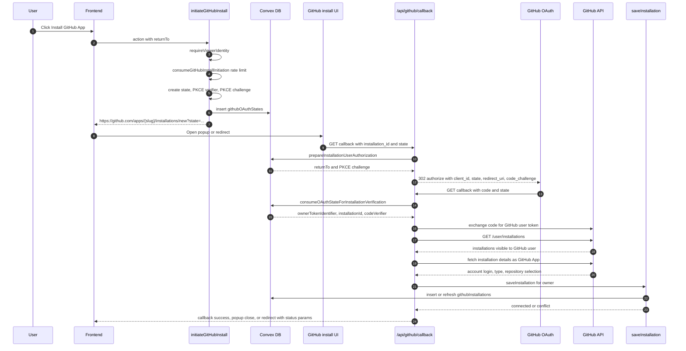

### Why There Are Two GitHub Round Trips

The installation callback and the user OAuth callback answer different questions:

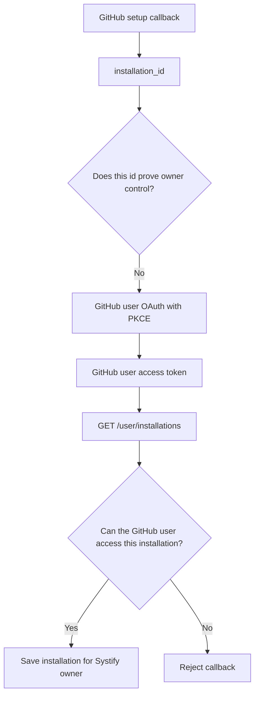

`installation_id` crosses through the browser and is treated as untrusted. The callback is only allowed to persist the installation after GitHub confirms that the OAuth-authenticated GitHub user can see that installation.

## Callback State Machine

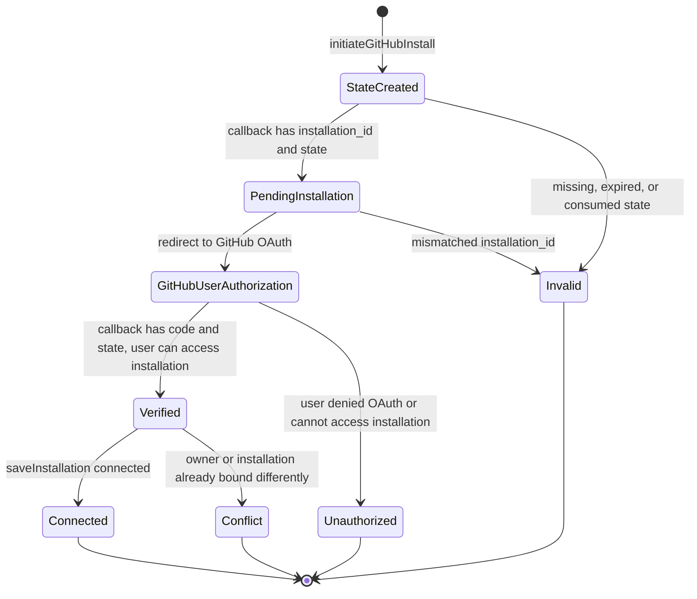

The state row expires after 10 minutes and is consumed once. A scheduled cleanup removes expired OAuth states in batches.

## Callback Branches

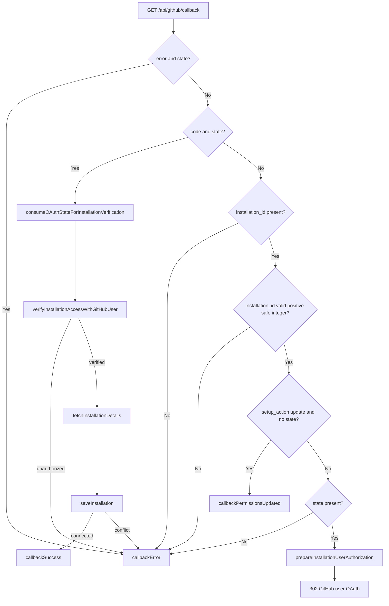

The update branch is intentionally read-only. GitHub can redirect back after the user adjusts repository permissions without a Systify state. Because that callback is unauthenticated, Systify does not mutate local installation rows in that branch. The frontend refreshes repository visibility by calling GitHub-backed actions again.

## Installation Conflict Rules

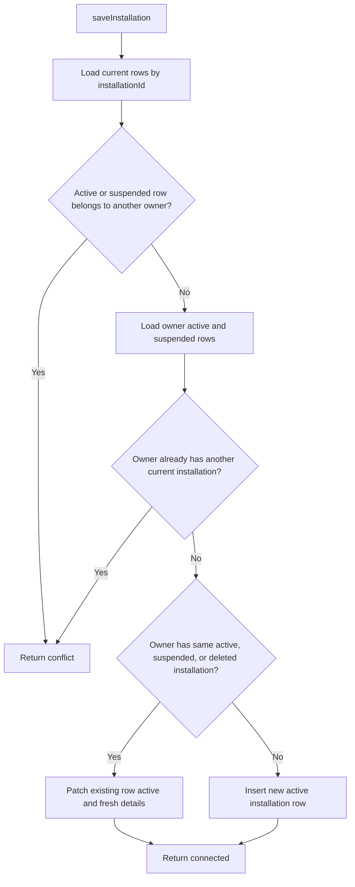

The product invariant is one current GitHub installation per Systify owner, where current means `active` or `suspended`. A second different current installation is a conflict, not an implicit replacement. A foreign `active` or `suspended` row also conflicts. A foreign `deleted` row is historical and is never patched or revived by another owner's OAuth flow.

## Installation Lifecycle

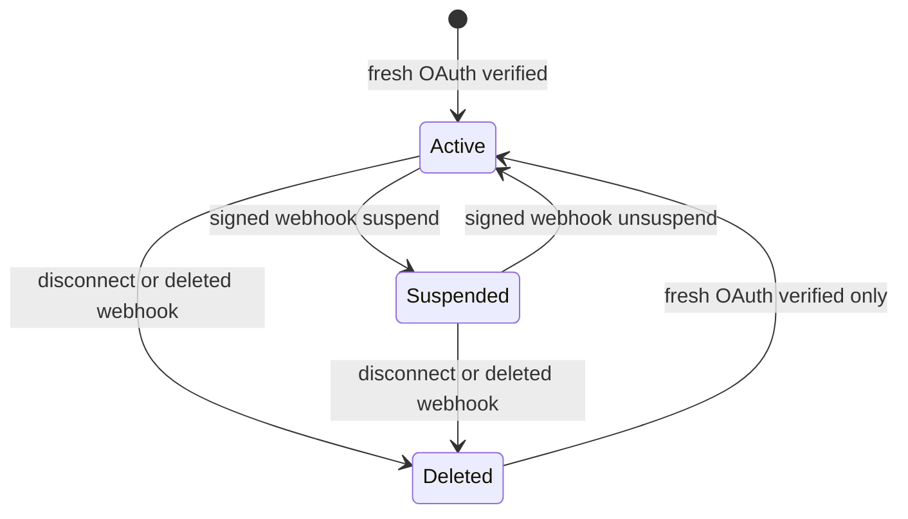

`deleted` is terminal for webhook processing. Signed webhooks may project provider lifecycle changes for current rows, but they do not establish a new owner authorization proof. A deleted row can become usable again only when the same owner completes the fresh OAuth-verified installation flow and `saveInstallation` updates that owner-scoped row.

## Repository Discovery Flow

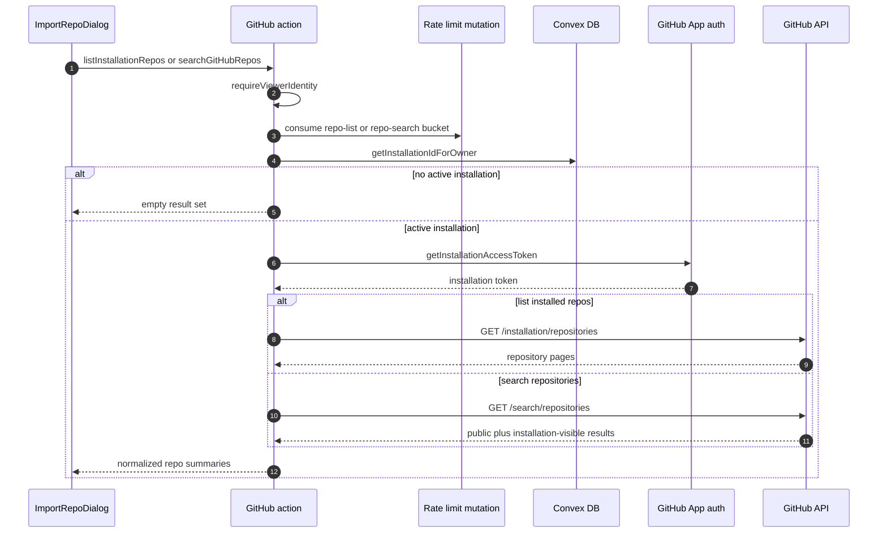

Repository listing is page-limited so a signed-in user cannot force Systify to walk an unbounded GitHub pagination chain. Search input is trimmed, minimum-length checked, maximum-length checked, and server-side rate-limited before reaching GitHub.

## Repository Access Check Flow

```mermaid
flowchart TD
  Caller[Frontend, import pipeline, or sandbox liveness]
  Identity[Resolve Systify owner]
  Installation[Get active installationId for owner]
  Token[Mint GitHub installation token]
  RepoProbe[GET /repos/{owner}/{repo}]
  Accessible{HTTP 200?}
  Denied{HTTP 403 or 404?}
  OtherError{Other GitHub error?}
  Allow[Return accessible with visibility and default branch]
  FixSelection[Return actionable repo-selection error]
  ApiError[Return GitHub API error]

  Caller --> Identity
  Identity --> Installation
  Installation -->|missing| FixSelection
  Installation --> Token
  Token --> RepoProbe
  RepoProbe --> Accessible
  Accessible -->|Yes| Allow
  Accessible -->|No| Denied
  Denied -->|Yes| FixSelection
  Denied -->|No| OtherError
  OtherError --> ApiError
```

This probe is used in two forms:

- `verifyRepoAccess` is a public action for early UI feedback before import records are created.
- `checkRepoAccess` is an internal action used by import and sandbox-backed flows before they spend more resources.

The same GitHub probe protects import, sync, sandbox-grounded Discuss, and System Design generation. Losing GitHub access after import does not grant later sandbox-backed access.

## Import And Sync GitHub API Flow

```mermaid
sequenceDiagram
  autonumber
  participant User as User
  participant FE as Frontend
  participant Mut as createRepositoryImport or syncRepository
  participant Intake as repositoryImportWorkflow
  participant DB as Convex DB
  participant Job as importsNode.runImportPipeline
  participant App as githubAppNode
  participant Fetcher as githubRepoFetcher
  participant GH as GitHub REST API
  participant Persist as import persistence mutations

  User->>FE: Submit GitHub repo URL
  FE->>App: verifyRepoAccess
  App->>GH: GET /repos/{owner}/{repo} with installation token
  GH-->>App: accessible or denied
  FE->>Mut: create import or sync
  Mut->>Intake: start import intake
  Intake->>DB: create or restore repository/default thread as needed; create job and import records
  Intake->>DB: schedule runImportPipeline
  Job->>DB: load owner installation
  Job->>App: checkRepoAccess
  App->>GH: GET /repos/{owner}/{repo}
  GH-->>App: metadata and access result
  Job->>Fetcher: fetchRepositorySnapshot
  Fetcher->>GH: GET /repos/{owner}/{repo}
  Fetcher->>GH: GET /repos/{owner}/{repo}/commits/{branch}
  Fetcher->>GH: GET /repos/{owner}/{repo}/git/trees/{treeSha}?recursive=1
  Fetcher->>GH: GET /repos/{owner}/{repo}/git/blobs/{sha}
  Fetcher-->>Job: bounded repository snapshot
  Job->>Persist: write files, chunks, summaries, and import metadata in batches
  Persist->>DB: finalize latest import pointer
```

Import and sync are GitHub-API-only. They do not clone the repository, provision Daytona, or patch `repositories.latestSandboxId`.

## Snapshot Fetch Shape

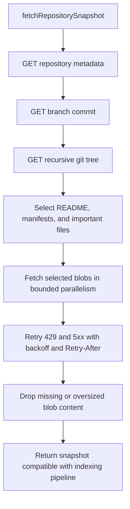

The tree request supplies file paths, file types, sizes, and blob SHAs. Blob fetches are intentionally limited to the README, package manifests, and a small set of heuristic important files so the import pipeline avoids cloning or reading an entire monorepo into Convex actions.

## Installation Token Flow

```mermaid
flowchart TD
  Caller[GitHub API caller]
  Owner[ownerTokenIdentifier]
  Lookup[getInstallationIdForOwner]
  HasInstallation{Active installation exists?}
  Jwt[create GitHub App JWT]
  TokenReq[POST /app/installations/{installationId}/access_tokens]
  Token[Installation access token]
  Null[Return null or fail with connect GitHub message]
  GitHubCall[Call GitHub API with installation token]

  Caller --> Owner
  Owner --> Lookup
  Lookup --> HasInstallation
  HasInstallation -->|No| Null
  HasInstallation -->|Yes| Jwt
  Jwt --> TokenReq
  TokenReq --> Token
  Token --> GitHubCall
```

Installation tokens are short-lived GitHub App tokens. They are used instead of personal access tokens and are scoped by the user's GitHub App repository selection.

## Webhook Flow

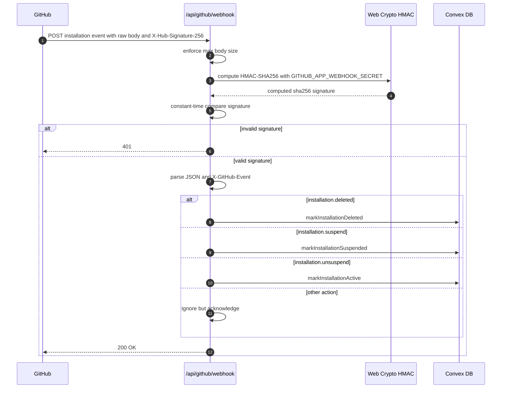

The webhook receiver treats installation lifecycle events as provider-state projection only. It does not try to mirror every repository-selection update into Convex. Repository selection is re-read on demand from GitHub when the UI lists repositories or when access is checked.

Lifecycle transitions are intentionally narrow:

- `suspend` only changes `active` rows to `suspended`.
- `unsuspend` only changes unambiguous `suspended` rows to `active`.
- `deleted` only changes `active` or `suspended` rows to `deleted`.
- `deleted` rows are terminal for webhooks and never become `active` from `unsuspend`.

If an `unsuspend` webhook maps to more than one current owner for the same installation id, Systify logs the ambiguity and leaves all rows unchanged. The system fails closed because a webhook proves provider lifecycle, not which Systify owner should receive a usable binding.

## Trust Boundaries

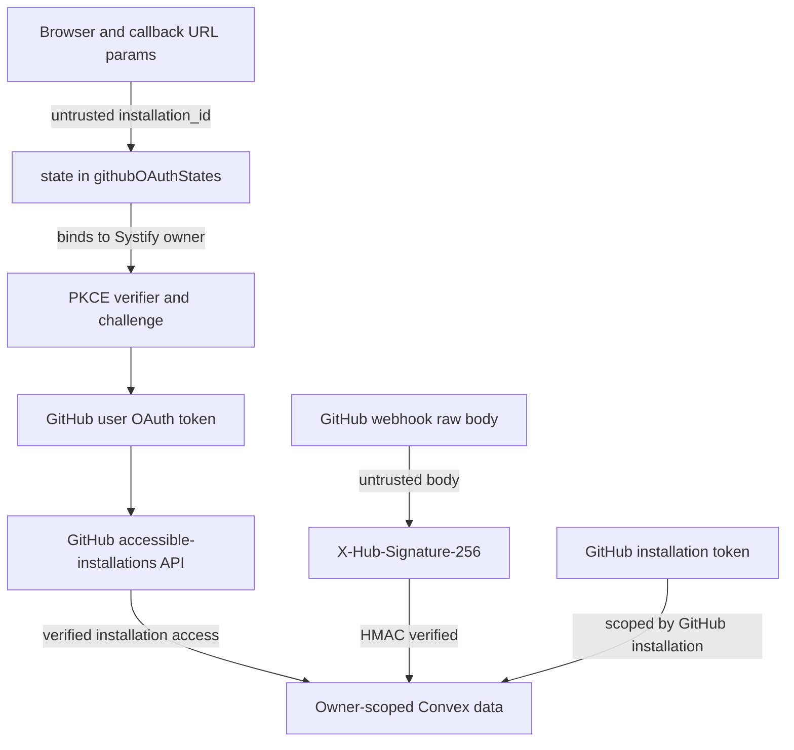

The core rules are:

- frontend-provided user ids are never used for authorization
- `ctx.auth.getUserIdentity()` is the source of the Systify owner
- `installation_id` is not proof of control
- callback state must be one-time, unexpired, and owner-bound
- GitHub user OAuth plus accessible-installations verifies ownership of the installation returned by GitHub
- webhook payloads must pass HMAC verification before mutating installation state
- repository access is checked against GitHub before expensive work starts

## Failure Handling

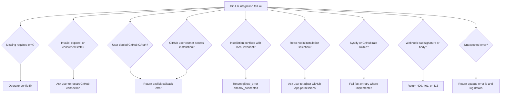

Callback responses are explicit status pages or redirects with explicit query parameters. The system does not guess a frontend target when state or return targets are missing.

## Environment Variables

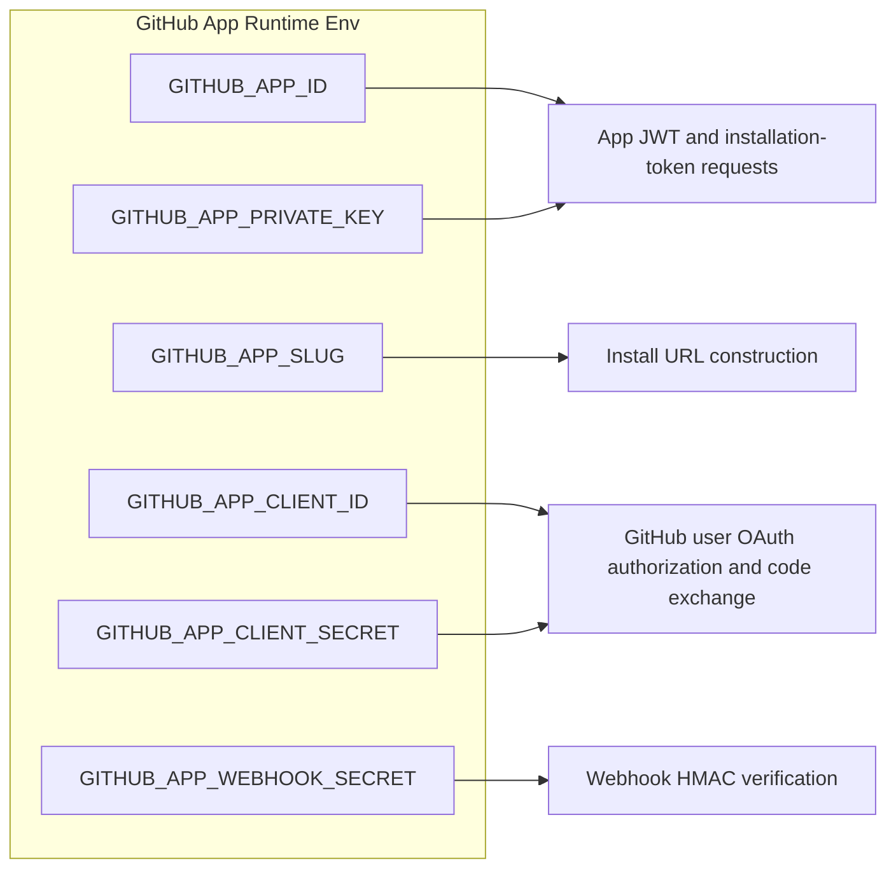

`GITHUB_APP_CLIENT_ID` and `GITHUB_APP_CLIENT_SECRET` are required because Systify uses GitHub App user OAuth to verify that the GitHub user can access the installation id returned by the setup callback.

## Operational Invariants

- A Systify owner can have at most one current GitHub App installation, where current means `active` or `suspended`.
- A current installation id cannot be silently rebound to a different current owner.
- Callback `installation_id` is untrusted until verified by GitHub user OAuth and accessible-installations.
- Installation lifecycle webhooks update local status but do not create authorization proof or replace on-demand GitHub access checks.
- Deleted installation rows are webhook-terminal and can become usable only through a fresh OAuth-verified save for that owner.
- Import and sync read GitHub directly and never provision Daytona sandboxes.
- Sandbox-backed flows still re-check GitHub access before provisioning or using a sandbox.
- GitHub network-heavy paths consume server-side rate-limit buckets before calling GitHub.
- Expired OAuth state rows are cleanup data, not domain state.

## Related Documents

- `core/auth-and-access.md`
- `integrations/integrations-and-operations.md`
- `github-callback-returnto-allowlist-system-design.md`
- `repository/repository-lifecycle.md`
- `repository-remote-freshness-check-system-design.md`
- `sandbox-mode-security-system-design.md`
