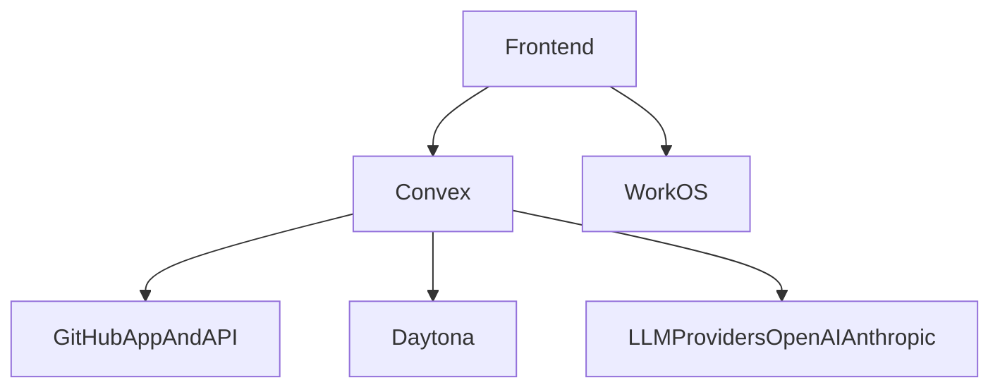
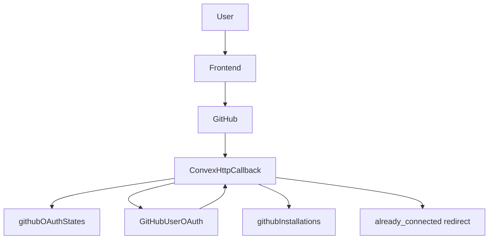
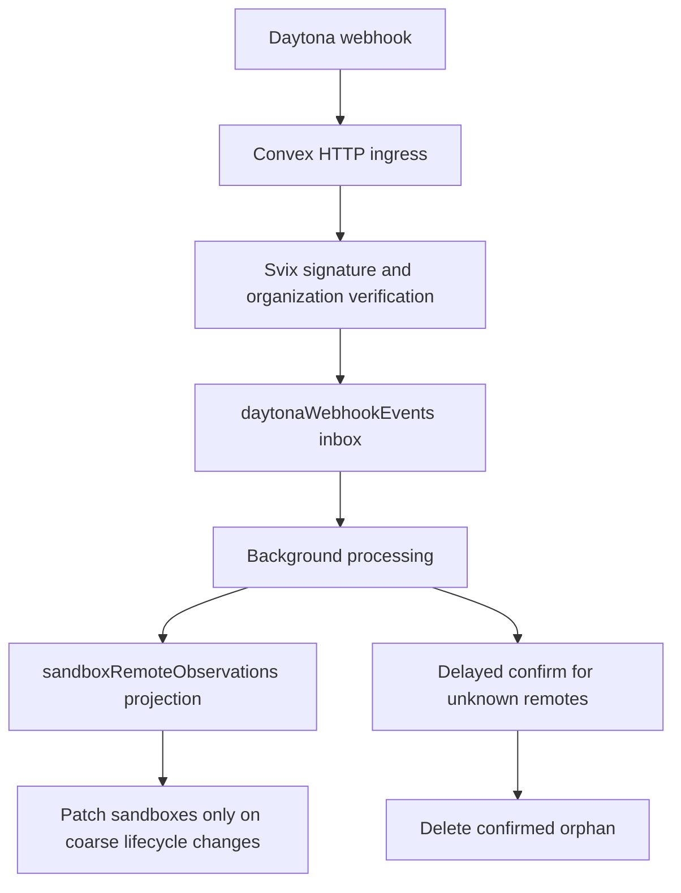
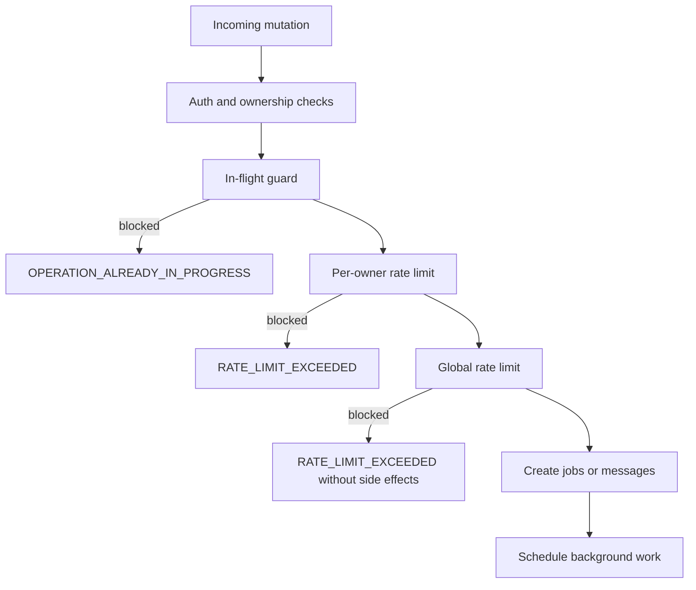

# Integrations And Operations

## Purpose

This document consolidates Systify's integration boundaries with external systems and the current operational design around runtime behavior, cleanup, and deployment.

## External Integration Overview

## WorkOS

### Role

WorkOS provides the browser-side sign-in experience and access token. Systify does not issue its own app tokens. Instead, it hands the WorkOS token to Convex for validation.

### Boundary

- the frontend uses `VITE_WORKOS_CLIENT_ID` and derives the callback URL from the current browser origin
- the backend uses `WORKOS_CLIENT_ID` to construct the custom JWT issuer and JWKS configuration

This gives the frontend and backend cleanly separated responsibilities:

- the frontend owns sign-in interaction
- Convex owns token validation

## GitHub App

The GitHub App is the core external dependency for repository access control.

### Main capabilities

- start the installation flow
- obtain installation access tokens
- verify repository access
- list repositories visible to the installation
- receive installation lifecycle webhooks

### Callback flow

The actual flow is:

1. The user starts GitHub App installation from the frontend.
2. The backend creates a random state plus a GitHub OAuth PKCE verifier / challenge and stores them in `githubOAuthStates` together with the frontend origin that started the flow.
3. GitHub redirects to `/api/github/callback` after installation.
4. The callback validates the Systify state and records the callback `installation_id` as pending. It does not save the installation yet, because callback ids are not proof that the Systify owner controls the GitHub installation.
5. The callback redirects through GitHub user OAuth using the stored PKCE challenge.
6. The OAuth callback exchanges the `code` for a GitHub user access token and verifies the pending installation with GitHub's accessible-installations API.
7. Only after that verification passes does the callback fetch installation details from GitHub.
8. `saveInstallation` either:
  - connects or refreshes the same owner-scoped installation
  - or returns a conflict when the owner already has a different active or suspended installation
9. conflict redirects use `?github_error=already_connected` instead of silently replacing the existing connection.
10. callback redirects use the stored frontend origin when available.
11. if GitHub calls back without a usable state, the HTTP route returns an explicit error response instead of guessing a frontend URL.
12. if installation succeeds but no return target is available, the callback returns a small success page instead of a misleading 500 error.

### GitHub installation trust boundary

The callback path is intentionally defensive because `installation_id` is an external identifier crossing from GitHub through the user's browser into Convex. The system does not treat that id as authorization evidence.

Defenses:

- `githubOAuthStates.state` binds the callback to the Systify owner that started the flow.
- PKCE-backed GitHub user OAuth binds the callback to the GitHub user currently authorizing the flow.
- GitHub's accessible-installations API verifies that the GitHub user can access the pending installation id before it is saved.
- `saveInstallation` rejects foreign active or suspended rows in the same mutation, so even a verified installation cannot be silently rebound away from another current Systify owner.
- callback errors use explicit failure pages / redirect parameters rather than falling back to guessed frontend targets.

### Webhook flow

`/api/github/webhook` currently handles installation lifecycle events such as:

- `deleted`
- `suspend`
- `unsuspend`

The webhook first verifies the payload with HMAC-SHA256 using `GITHUB_APP_WEBHOOK_SECRET`, then updates local installation state. This only synchronizes provider lifecycle; it does not establish authorization proof for a Systify owner. Deleted rows are terminal for webhook handling and can become usable again only through the fresh OAuth-verified callback flow.

Webhook projection fails closed when local state is ambiguous. In particular, if an `unsuspend` event finds multiple current owners for the same installation id, Systify logs a warning and leaves all rows unchanged rather than guessing which owner should receive active access.

### Design points

- installation tokens are used instead of user personal access tokens
- both callback and webhook handling are centralized in Convex `http.ts`
- local `githubInstallations` records are a projection of GitHub permission state, not the sole source of truth
- URL parameters, webhook payloads, and GitHub installation ids are external inputs; they must be verified against Systify state, GitHub signatures, or GitHub APIs before they affect owner-scoped data
- the current product invariant is **one current GitHub installation per owner**, where current means active or suspended
- a second different installation is treated as a product conflict, not as an implicit overwrite

## Daytona

Daytona provides the executable sandbox for repositories and is the core infrastructure behind **sandbox-grounded Discuss** and **System Design generation**. Repository import is intentionally sandbox-free — it runs against the GitHub API only.

### Daytona's role in the system

- provision sandboxes on demand (Sandbox grounding activation, LLM-backed System Design)
- clone repositories at provisioning time
- list file trees and download files for LLM tool calls (`read_file`, `list_dir`)
- run shell commands for sandbox-grounded replies and focused inspection
- stop and delete sandboxes

### Sandbox resource model

Each sandbox is created with:

- CPU, memory, and disk configuration
- auto-stop, auto-archive, and auto-delete intervals
- `repoPath`
- `remoteId`

The Convex `sandboxes` table stores the local projection of the Daytona runtime so the system can:

- determine sandbox-grounded Discuss and System Design generation availability
- display sandbox summaries
- execute later cleanup flows

When a user clicks **Generate System Design**, the request mutation (`convex/systemDesign.ts:115-211`) enqueues the background job and returns; it does **not** extend the sandbox TTL inline. Sandbox liveness (probe, wake, or fresh provision) happens later inside `ensureSandboxReady` in the Node action — that's where the Daytona-side lifecycle is refreshed.

### On-demand sandbox provisioning

`ensureSandboxReady` (in `convex/lib/sandboxLiveness.ts`) is the single orchestrator for "make a sandbox usable for this repository right now". It is called from:

- `sandboxActivationNode.runSandboxActivation` — first Sandbox grounding activation on a repository (or any subsequent reactivation after archive)
- `systemDesignNode.runSystemDesignGeneration` — System Design generation whenever the user-selected kinds include at least one LLM-backed kind

The helper probes Daytona for the current sandbox state, wakes a stopped sandbox where possible, or provisions a fresh one — and patches `repositories.latestSandboxId` to the result. The Convex-side sandbox row is written before Daytona's `create` call (via `reserveOnDemandSandboxRow`) so cleanup can still find the resource if provisioning fails mid-flight.

Repository import never reserves a sandbox row, never calls `provisionSandbox`, and never patches `latestSandboxId`. Users on ungrounded Discuss or Library who never activate Sandbox grounding and never run System Design generation incur zero Daytona cost.

### Why Daytona webhook exists

In plain language, Daytona knows the real sandbox state first, while Systify only knows what it has already recorded.

That creates a normal delay:

- Daytona may already know that a sandbox was created
- Daytona may already know that it stopped
- Daytona may already know that it was archived or deleted
- Systify may still be waiting for the next cleanup or reconciliation pass

If the system only checks later, it is still correct eventually, but it reacts more slowly and can leave orphan resources around longer than necessary.

The Daytona webhook exists to shorten that delay. It lets Daytona notify Systify as soon as something changes.

That does **not** mean the webhook replaces scheduled reconciliation. It only means:

- webhook gives faster notice
- cron keeps the system safe when notice is late or missing

### Daytona webhook convergence

Systify now also accepts Daytona sandbox lifecycle webhooks at `/api/daytona/webhook`.

The current flow is:

The webhook path is intentionally layered:

- the HTTP route stays thin and only verifies plus ingests
- `daytonaWebhookEvents` acts as the durable inbox for retries and debugging
- `sandboxRemoteObservations` stores the latest Daytona-side view without turning the main `sandboxes` table into a high-churn event log
- unknown remote sandboxes are never deleted immediately; they first wait through a safety window and a second confirmation step

This gives the system faster convergence without turning webhook delivery into a single point of correctness.

### Daytona permission and credential boundary

Systify currently uses a single Daytona API key (`DAYTONA_API_KEY`) for sandbox
operations. The key must be limited to the minimum capabilities required by the
backend integration:

- sandbox lifecycle operations (create/get/list/stop/delete)
- sandbox filesystem reads used by sandbox-grounded tools and the System Design generation flow
- sandbox command execution used by sandbox-grounded tools and the System Design generation flow

Webhook trust is separate from API-key trust:

- webhook authenticity is enforced through Svix signature verification with
  `DAYTONA_WEBHOOK_SIGNING_SECRET`
- optional org-level narrowing is enforced with
  `DAYTONA_WEBHOOK_ORGANIZATION_ID`
- both secrets live only in Convex runtime env and must not be exposed to the
  frontend bundle

## Sandbox Cleanup And Cron

### Orphan resource handling strategy

Handling orphan Daytona resources is treated as a first-class reliability and cost-control concern rather than a rare edge case.

The current system uses four layers:

- prevention: reserve the Convex sandbox row before calling Daytona create
- request-path correction: schedule cleanup jobs when a known sandbox fails or a repository is deleted
- webhook-driven convergence: ingest Daytona lifecycle events into a durable inbox and remote-state projection
- background reconciliation: periodically compare Convex state and Daytona reality, including remote sandboxes that have no matching DB row

This layered approach exists because sandbox lifecycle crosses two systems. Neither a single request path nor a single cron run can guarantee perfect cleanup on its own.

For a dedicated system-design explanation of this topic, see `sandbox/orphan-resource-handling.md`.

### User- and system-triggered cleanup jobs

When a repository is deleted, or when the system proactively needs to clean up a sandbox, it creates a `cleanup` job that is ultimately handled by `opsNode.runSandboxCleanup`:

- if `remoteId` exists, delete the Daytona sandbox first
- if the sandbox is only a placeholder row with `remoteId = ''`, skip Daytona deletion gracefully
- in both cases, mark the local sandbox record as `archived`
- finally complete the cleanup job

This matters because a failed on-demand provision (from Sandbox grounding activation or System Design generation) can leave behind a Convex-owned placeholder sandbox row even if Daytona provisioning never fully completed.

### Hourly sweep of expired sandboxes

`crons.ts` runs `sweepExpiredSandboxes` every hour. The job is not just about deletion. Its responsibility is reconciliation:

- if Daytona already reports the sandbox as archived or destroyed, the DB is marked archived
- if Daytona reports the sandbox as stopped, the system proactively deletes it
- if Daytona still reports it as started, the system stops it first and deletes it on the next cycle

That means cleanup logic considers:

- real Daytona state
- local Convex state
- TTL and cost control

### Label-based Daytona orphan reconciliation

`crons.ts` also runs `reconcileDaytonaOrphans` every 6 hours. This job handles the opposite direction: Daytona sandboxes that exist remotely but do not have a matching Convex row.

The action:

- lists Daytona sandboxes with the label `app = systify`
- checks whether each `remoteId` exists in Convex `sandboxes`
- ignores recently created sandboxes for a short safety window
- deletes old unmatched sandboxes from Daytona

This is the backstop for failures that happen after Daytona create succeeds but before Convex can attach the remote metadata.

### Webhook backlog repair and retention cleanup

Webhook delivery is not assumed to be perfect. Systify therefore also runs two maintenance loops:

- `repairDaytonaWebhookBacklog`: re-schedules inbox rows that are still `received`, are in `retryable_error`, or were left `processing` past their lease
- `cleanupOldDaytonaWebhookEvents`: deletes old inbox rows after the retention window so the durable inbox does not grow forever

These jobs make the webhook path durable instead of best-effort.

### Sandbox sessions and idle auto-pause

The `sandboxSessions` table tracks per-repository, per-owner sandbox usage windows so the system can surface "you have an active session" UI, accumulate `spentCents`, and pause idle sandboxes proactively. Each row carries `status` (`starting` / `active` / `paused`), `lastActivityAt`, `idleAutoPauseMinutes`, and the running `spentCents` tally.

The `auto pause idle sandbox sessions` cron (`crons.ts`) runs every minute and pauses sessions whose `lastActivityAt` exceeds `idleAutoPauseMinutes` (default `10`, overridable via `SANDBOX_SESSION_IDLE_AUTO_PAUSE_MINUTES`). This keeps cost-bearing sandboxes from accruing spend after the user has wandered off.

### Sandbox activation flow

When a user enables Sandbox grounding on a Discuss thread (or reactivates after archive), `repositories.requestSandboxActivation` enqueues a `sandbox_activation` job and schedules `sandboxActivationNode.runSandboxActivation`. The Node action runs `ensureSandboxReady` (in `convex/lib/sandboxLiveness.ts`) — the single orchestrator for "make a sandbox usable for this repository right now" — which probes Daytona, wakes a stopped sandbox where possible, or provisions a fresh one. The same `sandbox_activation` job kind is what the in-flight guard above uses to dedupe duplicate activation triggers.

### Audit log retention sweep

The `cleanup expired sandbox tool call logs` cron (`crons.ts`) runs every 24 hours and walks `sandboxToolCallLog` rows oldest-first, deleting rows past the 90-day retention window. The handler self-reschedules when a batch is full so a backlog drains across multiple ticks rather than breaching the per-mutation write budget.

### GitHub OAuth state cleanup

The `cleanup expired github oauth states` cron (`crons.ts`) runs every 12 hours and purges `githubOAuthStates` rows whose 10-minute TTL has expired. Without this sweep the table would grow unbounded over time.

## Sandbox cost caps

In addition to request-rate buckets, Systify enforces **per-user** and **per-repository** daily spend caps on sandbox-grounded work (Discuss-mode Sandbox grounding replies and every System Design kind, which is always LLM-backed).

- `SANDBOX_DAILY_CAP_PER_USER_USD` — default `5` USD / day per user
- `SANDBOX_DAILY_CAP_PER_REPOSITORY_USD` — default `50` USD / day per repository

Buckets are fixed windows aligned to UTC midnight and are denominated internally in cents so the rate-limiter token arithmetic stays integer. They are read fresh every call (no module-scope cache) so deploy-time env changes take effect without a restart.

There are two flavors of cap interaction:

- **Pre-check (peek-only)** — `computeSandboxCostCapEvaluation` in `convex/lib/chatEligibility.ts` peeks the bucket without consuming it. Used by the chat composer / mode switcher to render disabled CTAs with structured reason codes (`sandbox_user_cap_exceeded`, `sandbox_repository_cap_exceeded`).
- **Hard pre-check (assert)** — `convex/systemDesign.ts:756` (`assertSandboxDailyCostBudget`) blocks `requestSystemDesignGeneration` outright when the projected estimate would push the bucket over the cap.

Actual spend is settled post-hoc by `consumeSandboxDailyCost` once the gateway returns the real `totalCostUsd`, so the cap reflects observed cost rather than the upfront estimate.

## LLM providers (OpenAI, Anthropic)

### Role

LLM providers (OpenAI and Anthropic) power chat response generation across the two chat modes (`discuss` / `library`) and every LLM-backed System Design kind. All provider calls flow through the **LLM gateway** in `convex/lib/llmGateway.ts` (`streamViaGateway` / `generateViaGateway` / `embedViaGateway`) — provider SDKs (`@ai-sdk/openai`, `@ai-sdk/anthropic`) MUST NOT be imported anywhere else in `convex/`. The gateway owns catalog validation, per-user rate / concurrency acquisition, provider dispatch, retry, usage normalization, and cost computation, so no call site can bypass the chokepoint. Provider selection comes from a 3-tier resolver (`convex/chat/modelSelection.ts:9-91`): composer per-message override → `threads.defaultModelName` → `DEFAULT_PICK_BY_CAPABILITY`. The thread-level `threads.lockedProvider` field pins a provider for the lifetime of a thread once any reply has settled.

If neither `OPENAI_API_KEY` nor `ANTHROPIC_API_KEY` is set, the system falls back to a heuristic answer.

### Design implications

- LLM providers improve answer quality, but they are not the only requirement for product usability
- the real repository knowledge source still lives in Convex artifacts and chunks
- this fallback design preserves baseline usability even when external models are unavailable
- when finalized usage is available, chat writes token counts to `messages` and `jobs`, plus `estimatedCostUsd` on the job
- cost estimation uses a small local pricing snapshot, so unknown models leave cost fields empty instead of breaking the reply path

## Rate Limiting And Lease Recovery

Systify uses the official `@convex-dev/rate-limiter` Convex component for request-level protection, plus lease-based in-flight guards for long-running interactive jobs.

### Request flow

This sequence is intentional: the system rejects the cheapest failure paths first, protects shared provider capacity second, and only creates database side effects after both checks have passed.

### Request buckets

- `importRequests`
  - default: `5 / hour`
  - mutations: `createRepositoryImport`, `syncRepository`
  - override: `RATE_LIMIT_IMPORT_PER_HOUR`
  - error: `RATE_LIMIT_EXCEEDED`
- `systemDesignRequests`
  - default: `10 / hour`
  - mutations: `requestSystemDesignGeneration`
  - override: `RATE_LIMIT_SYSTEM_DESIGN_PER_HOUR`
  - error: `RATE_LIMIT_EXCEEDED`
- `chatRequestsPerOwner`
  - default: `30 / minute`, burst capacity `6`
  - mutations: `sendMessage`
  - overrides: `RATE_LIMIT_CHAT_PER_MINUTE`, `RATE_LIMIT_CHAT_BURST_CAPACITY`
  - error: `RATE_LIMIT_EXCEEDED`
- `chatRequestsGlobal`
  - default: `300 / minute`, burst capacity `60`, sharded
  - mutations: `sendMessage`
  - overrides: `RATE_LIMIT_GLOBAL_CHAT_PER_MINUTE`, `RATE_LIMIT_GLOBAL_CHAT_BURST_CAPACITY`
  - error: `RATE_LIMIT_EXCEEDED`
- `daytonaRequestsGlobal`
  - default: `30 / hour`, sharded
  - mutations: `requestSandboxActivation` and `requestSystemDesignGeneration` — both **always** consume this bucket because every System Design kind is LLM-backed and opens a Daytona sandbox (see `convex/systemDesign.ts:171` and `convex/lib/systemDesign.ts:74-89`). `createRepositoryImport` / `syncRepository` do **not** consume this bucket — import runs against the GitHub API only.
  - override: `RATE_LIMIT_DAYTONA_GLOBAL_PER_HOUR`
  - error: `RATE_LIMIT_EXCEEDED`

### In-flight guards

The shared helper is `findActiveJob` in `convex/lib/jobs.ts`. It indexes by `(scope, kind, status, leaseExpiresAt)` and uses `gte("leaseExpiresAt", now)` (not strict `>`), so a row whose lease lands exactly on `now` still counts as active.

- repository import / sync
  - guard source: `repositories.importStatus`
  - error: `OPERATION_ALREADY_IN_PROGRESS`
- Sandbox grounding activation
  - guard source: active `jobs` rows where `kind === 'sandbox_activation'`, `status in ('queued', 'running')`, and `leaseExpiresAt >= now`
  - lease override: `SANDBOX_ACTIVATION_JOB_LEASE_MS`
  - behavior: **idempotent** — `requestSandboxActivation` returns the existing `jobId` when one is in flight.
- Library System Design generation
  - guard source: active `jobs` rows where `kind === 'system_design'`, `status in ('queued', 'running')`, and `leaseExpiresAt >= now`.
  - lease override: `SYSTEM_DESIGN_JOB_LEASE_MS`
  - behavior: **idempotent** — returns the existing `jobId` instead of throwing, so the dialog can converge on the same job from a duplicate submit without an error toast.
- chat replies
  - guard source: active `jobs` rows where `kind === 'chat'`, `status in ('queued', 'running')`, and `leaseExpiresAt >= now`
  - lease override: `CHAT_JOB_LEASE_MS`
  - error: `OPERATION_ALREADY_IN_PROGRESS`

The `system_design` job kind is used exclusively by Library generation. The row writes `leaseExpiresAt` at insert time so the stale-job sweep can recover a row whose action never ran; recovery dispatches directly to `recoverStaleSystemDesignJob`.

### Recovery behavior

- `crons.ts` runs `reconcileStaleInteractiveJobs` every 5 minutes
- expired chat leases mark both the `jobs` row and assistant `messages` row as `failed`
- expired System Design generation leases mark the `jobs` row as `failed`
- structured Convex errors include `code`, `bucket`, `retryAfterMs`, and `message` so the frontend can show stable user-facing text

## Environment Variable Layers

### Frontend `.env`

These values are exposed to the browser:

- `VITE_CONVEX_URL`
- `VITE_WORKOS_CLIENT_ID`

### Convex runtime env

These values must exist in the Convex environment, not frontend `.env.local`:

- `WORKOS_CLIENT_ID`
- `GITHUB_APP_ID`
- `GITHUB_APP_SLUG`
- `GITHUB_APP_PRIVATE_KEY`
- `GITHUB_APP_WEBHOOK_SECRET`
- `OPENAI_API_KEY`
- `ANTHROPIC_API_KEY`
- `OPENAI_MODEL` *(listed but unused — legacy; model defaults live in `convex/chat/modelSelection.ts`)*
- `SANDBOX_DAILY_CAP_PER_USER_USD`
- `SANDBOX_DAILY_CAP_PER_REPOSITORY_USD`
- `DAYTONA_API_KEY`
- `DAYTONA_API_URL`
- `DAYTONA_TARGET`
- `DAYTONA_WEBHOOK_SIGNING_SECRET`
- `DAYTONA_WEBHOOK_ORGANIZATION_ID`
- `RATE_LIMIT_IMPORT_PER_HOUR`
- `RATE_LIMIT_SYSTEM_DESIGN_PER_HOUR`
- `RATE_LIMIT_CHAT_PER_MINUTE`
- `RATE_LIMIT_CHAT_BURST_CAPACITY`
- `RATE_LIMIT_GLOBAL_CHAT_PER_MINUTE`
- `RATE_LIMIT_GLOBAL_CHAT_BURST_CAPACITY`
- `RATE_LIMIT_DAYTONA_GLOBAL_PER_HOUR`
- `CHAT_JOB_LEASE_MS`
- `SYSTEM_DESIGN_JOB_LEASE_MS`
- `DAYTONA_AUTO_STOP_MINUTES`
- `DAYTONA_AUTO_ARCHIVE_MINUTES`
- `DAYTONA_AUTO_DELETE_MINUTES`
- `DAYTONA_CPU_LIMIT`
- `DAYTONA_MEMORY_GIB`
- `DAYTONA_DISK_GIB`
- `DAYTONA_POST_CLONE_BLOCK_NETWORK`

### Why this split matters

- the frontend receives only public configuration
- sensitive credentials remain only in the Convex runtime
- GitHub, Daytona, and LLM provider (OpenAI / Anthropic) secrets never leak into the frontend bundle

## Minimal Deployment Model

The minimum deployment structure implied by the current codebase is:

- frontend: a static site built from Vite
- backend: Convex cloud
- external dependencies: WorkOS, GitHub, Daytona, and LLM providers (OpenAI, Anthropic)
- hosting/CD: Vercel Git integration calling `bun run build:vercel`
- SPA routing fallback: `vercel.json` rewrites client routes to `index.html` while leaving `/api/*` and file-extension asset requests alone

In other words, Systify does not require another always-on API server. Convex already fills the roles of application backend, scheduler, HTTP endpoint host, and database.

## Observations And Limitations

### Strengths

- External dependency boundaries are clear, and GitHub, Daytona, and the LLM providers (OpenAI, Anthropic) each have an explicit Node-side integration layer — LLM calls are funneled through the single `convex/lib/llmGateway.ts` chokepoint.
- Cleanup uses both jobs and cron, which balances proactive deletion with passive reconciliation.
- Environment-variable layering is clear, so sensitive credentials are not directly exposed to the frontend.

### Known limitations

- Both webhook and callback handling depend on Convex HTTP routes, so if integrations grow later, the system may need a clearer integration-module split.
- Daytona webhook verification now uses Svix signing on the raw body by validating `svix-id`, `svix-timestamp`, and `svix-signature` with `DAYTONA_WEBHOOK_SIGNING_SECRET`, then optionally enforcing the configured organization allowlist.
- Daytona cleanup is one of the most important cost-control paths, and failed sweeps or failed orphan reconciliation runs can still leave resources around temporarily.
- LLM providers are currently used mostly for chat, while the analysis pipeline is still centered on sandbox inspection, so the two paths have not yet converged into a single agent framework.
