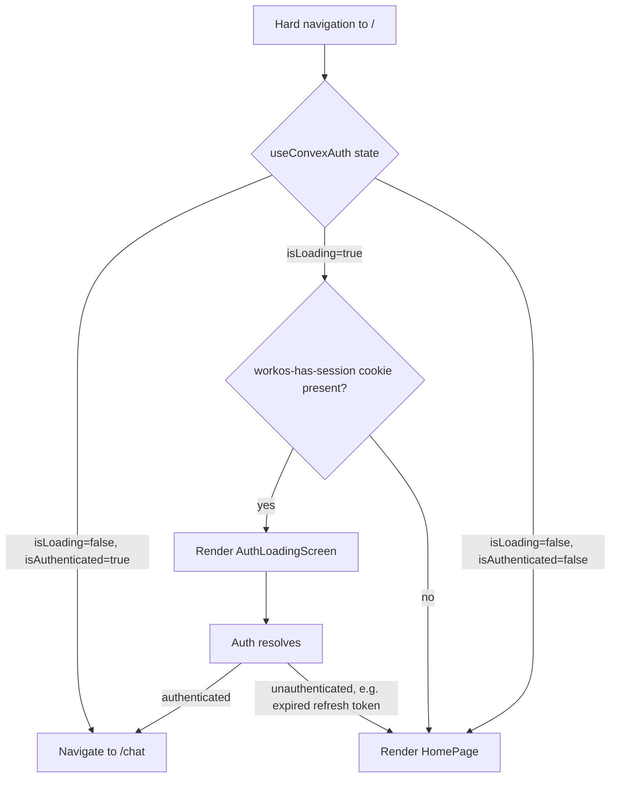

# Landing Route Auth Hint System Design

## Purpose

This document explains why `/` — the landing route — briefly flashes the marketing `HomePage` for returning signed-in users in a Vite SPA, and how a synchronous WorkOS session-cookie hint suppresses that flash without compromising the first-time-visitor experience.

The scope is the render decision at `LANDING_PATH` (`/`). It is not a redesign of protected route guards or post-login redirect targets.

## Problem Statement

`LandingRoute` serves two audiences from one URL:

- **Anonymous visitor:** sees the marketing `HomePage`.
- **Authenticated user:** is redirected to `/chat` (the `DEFAULT_AUTHENTICATED_PATH`).

The auth signal (`useConvexAuth` → `{ isLoading, isAuthenticated }`) is asynchronous. On first render after a hard navigation to `/`, the state is `{ isLoading: true, isAuthenticated: false }` — even for users with an active WorkOS session — until WorkOS hydrates the session and the Convex auth bridge completes its token exchange.

Without a synchronous predictor of auth state, the only thing the router can paint during that loading window is `HomePage`. Returning signed-in users therefore see a flash of marketing content before the redirect to `/chat` fires. This is a small but visible regression in perceived quality, and it scales with how many users return to `/` (bookmarks, root navigation, app icon).

## Solution Constraints

- **Vite SPA, no SSR or edge middleware.** A server cookie check + `302` before the HTML reaches the client is unavailable.
- **Anonymous-first paint must remain instant.** The landing page is the entry point for first-time visitors; it cannot be gated behind auth hydration.
- **The auth provider is the source of truth for navigation.** Whatever predictor we use must not be allowed to redirect the user; only the resolved async state may.
- **Single WorkOS client, single origin.** Cookies set by the WorkOS server on this origin are visible only to this app.

## Alternatives Considered

### Server-side redirect

Inspect the auth cookie on the edge and `302` to `/chat` before HTML is sent. This is what Next.js / Remix apps typically do. **Rejected** because the project is a Vite SPA; there is no HTML-serving server in the request path.

### Block render until auth resolves

Show a loading screen unconditionally while `isLoading` is true. **Rejected** because anonymous visitors — who never had a session and form the conversion-sensitive majority — would see a spinner instead of the landing page. That trades the rare flash for a universal regression.

### Re-route `/` to `/chat`, move landing to `/home`

Make `/` always navigate to `/chat`; introduce `/home` for the marketing page. **Rejected** because it relocates the flash rather than removing it: anonymous users would land on `/`, hit the auth loading screen, and only then be redirected to `/home`. The most performance-sensitive group is now strictly worse off, and existing inbound links to `/` lose their direct landing-page meaning.

### Synchronous auth hint via WorkOS cookie (chosen)

`@workos-inc/authkit-js` writes a `workos-has-session` cookie on the app origin during the OAuth callback and clears it on sign-out. The SDK itself reads this cookie synchronously on boot (see `hasSessionCookie` in `create-client.ts`) to decide whether to attempt a session refresh. We use the same signal — purely as a render hint — to predict auth state during the `isLoading` window. The async auth state still controls navigation; the hint only changes what we paint before that state resolves.

## Core Decision

`LandingRoute` applies a three-branch render policy:

1. `isLoading === false && isAuthenticated === true` → `Navigate` to `/chat`.
2. `isLoading === true && hasWorkOSSessionHint()` → render `AuthLoadingScreen`.
3. otherwise → render `HomePage`.

The hint is **advisory, not authoritative**. It never causes navigation. If the cookie is present but the session ultimately fails to hydrate, the user falls through to `HomePage` once `isLoading` resolves with `isAuthenticated === false` — never to a protected route.

## Architecture

## Implementation

### Hint helper — `src/lib/auth-session-hint.ts`

`hasWorkOSSessionHint()` synchronously reads `document.cookie`, matches `workos-has-session=<value>`, and returns `true` when the value is non-empty. It accepts both formats the SDK emits — the legacy `"1"` value and the modern dot-separated client-ID list — without validating against the configured client ID. The single-client / single-origin assumption makes that match unnecessary.

The helper is pure DOM + regex; no React, no env reads, no I/O. That keeps it cheap to call on every `LandingRoute` render and trivial to unit-test under jsdom.

### Render decision — `src/router-layouts.tsx`

`LandingRoute` consults the helper only inside the loading branch. The existing comment about rendering `HomePage` immediately for unauthenticated visitors is preserved; the new branch sits between the resolved-authenticated check and the unconditional `HomePage` fallthrough so the original anonymous-fast-path is untouched.

`AuthLoadingScreen` is reused from the existing protected-route loading flow — same copy, same component — so returning users see consistent "Reconnecting your session and loading your account." messaging across `/` and `/chat`.

## Render State Matrix

| User state                     | Cookie present | First paint at `/` | Subsequent transition         |
| ------------------------------ | -------------- | ------------------ | ----------------------------- |
| First-time visitor             | no             | `HomePage`         | none                          |
| Anonymous, returning           | no             | `HomePage`         | none                          |
| Returning, session valid       | yes            | `AuthLoadingScreen`| `Navigate` to `/chat`         |
| Returning, refresh-token stale | yes            | `AuthLoadingScreen`| Falls through to `HomePage`   |
| Just signed out                | cleared        | `HomePage`         | none                          |
| Sign-in in progress            | yes            | `AuthLoadingScreen`| `Navigate` to `/chat` on success |

## Why The Cookie Is Trustworthy For This Purpose

- Written by the WorkOS authentication server in the response to the OAuth callback on the app's own origin. The browser scopes it to that origin.
- Cleared by the WorkOS server on sign-out (and naturally on session expiration via `Max-Age` / `Expires`).
- The exact same signal `@workos-inc/authkit-js` itself trusts to decide whether to start a session refresh on boot. Using it for a render hint is no weaker than the SDK's own assumptions about cookie integrity.
- The hint is consumed only as a render-side predictor. A compromised or forged cookie can at worst cause the loading screen to appear briefly for an unauthenticated visitor; it cannot grant access to any protected resource because navigation still depends on `useConvexAuth` resolving authoritatively.

## Failure Modes

- **Stale cookie, refresh fails.** Cookie says "had a session" but `useConvexAuth` resolves to unauthenticated. User sees a brief `AuthLoadingScreen` before falling through to `HomePage`. Worse than the no-cookie case, better than a redirect loop. Acceptable.
- **Cookie value empty after clear.** Some browsers expose `workos-has-session=` until the entry is fully evicted. The helper treats empty values as "no hint" so a just-signed-out user sees the landing page immediately rather than a loading flash.
- **Auth provider hangs (`isLoading` never resolves).** The user remains on `AuthLoadingScreen` indefinitely. This is the same failure mode as the existing `AuthCallbackRoute` and is not made worse by this design.
- **WorkOS SDK contract change.** If the cookie name or shape changes in a future SDK version, the helper silently returns `false` and the system degrades to the prior flash behavior — never worse than before. This is detectable in QA (the loading branch becomes unreachable) but not in production telemetry. The helper's source comment names the dependency explicitly so future SDK upgrades flag it.

## Test Plan

### Helper unit tests (`src/lib/auth-session-hint.test.ts`, jsdom)

1. No cookies set → `false`.
2. `workos-has-session=<clientId>` → `true`.
3. Legacy `workos-has-session=1` → `true`.
4. Dot-separated client-ID list → `true`.
5. Empty cookie value → `false`.
6. Other cookies present, no session cookie → `false`.
7. Other cookies precede the session cookie → `true`.

### Integration tests (`src/App.test.tsx`, jsdom + React Testing Library)

1. `isLoading=true` with `workos-has-session` set → `AuthLoadingScreen` rendered, `HomePage` not rendered.
2. `isLoading=true` without the cookie → `HomePage` rendered immediately.
3. Existing tests for resolved auth states (signed-in redirect to `/chat`, signed-out renders `HomePage`, callback flow, return-to allowlist) remain unchanged.

The shared `afterEach` expires every cookie set during a test so the hint cannot leak between cases.

## Residual Risk And Tradeoffs

- **Risk reduced:** Returning signed-in users no longer see a marketing-page flash before redirect to `/chat`. The improvement is largest on slow networks and cold caches.
- **Tradeoff introduced:** When a session ultimately fails to refresh, the user briefly sees the auth loading screen before the page falls through to `HomePage`. The regression is bounded (one render cycle) and rare.
- **Operational dependency:** Behavior depends on `@workos-inc/authkit-js` continuing to set `workos-has-session` on the app origin. SDK upgrades should re-confirm this contract; the source comment in `auth-session-hint.ts` is the canonical pointer.

## Out Of Scope

- Protected route guarding for direct `/chat` access (handled by `ProtectedLayout`).
- Cross-tab session synchronization — relies on browser cookie semantics, not on this hint.
- Server-side render parity — explicitly excluded; this is an SPA-only design.
- Recovering from `useConvexAuth` hangs — same behavior as existing routes; not regressed by this design.
