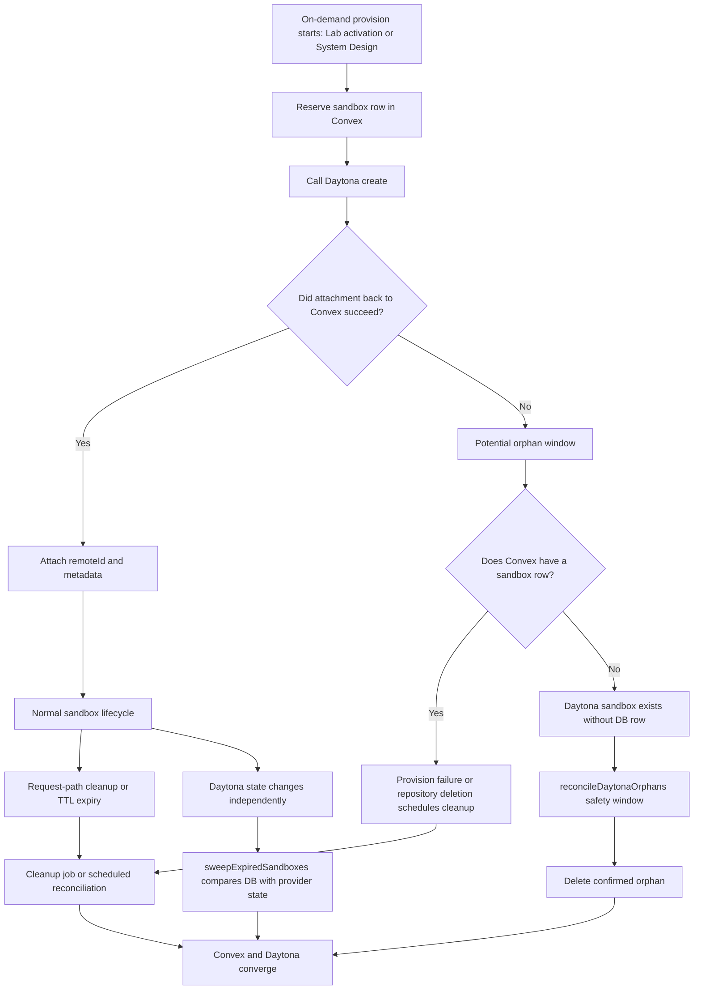

# Orphan Resource Handling

## Purpose

This document explains how Systify handles orphan external resources, why this is a core system-design concern, and how the current cleanup architecture is layered to stay safe under crashes, retries, and third-party failures.

The main focus today is Daytona sandboxes, because they are the most important external resource with both cost and lifecycle risk.

## What Counts As An Orphan Resource

In this system, an orphan resource is any external runtime object whose lifecycle is no longer correctly reflected in Convex state.

The two most important cases are:

- Daytona has a sandbox, but Convex has no matching sandbox row
- Convex has a sandbox row that still expects cleanup, but the Daytona-side resource was never deleted or is no longer in the expected state

This is not just a correctness issue. It is also a cost-control issue, because Daytona resources can continue consuming storage or runtime budget after the product has logically stopped needing them.

## Why This Is A System-Design Problem

Orphan handling exists because sandbox lifecycle crosses system boundaries:

- Convex owns workflow orchestration, application state, and cleanup scheduling
- Daytona owns the actual sandbox resource and reports its real runtime state

Any design that spans those boundaries must assume that failures can happen between steps:

- the process can crash
- the network can fail
- a provider API can time out
- retries can duplicate work
- deployment changes can interrupt in-flight actions

Because of that, orphan handling cannot depend on a single request path completing perfectly.

## Lifecycle Diagram

## Design Principles

### 1. Record Intent Before External Creation

The system should create the Convex-side ownership record before creating the external resource whenever possible.

For Daytona sandboxes, this means the on-demand sandbox path (`ensureSandboxReady` → `reserveOnDemandSandboxRow` → `provisionSandbox`) first writes a placeholder `sandboxes` row in Convex and only then calls Daytona create. This prevents the worst orphan class, where the provider has a live resource but the application has no durable record that it ever intended to own it. Repository import does not provision sandboxes, so the principle applies only to Lab activation and System Design generation paths.

### 2. Treat Provider State As Real, Local State As A Projection

Convex stores the application's local projection of sandbox state, but Daytona is still the source of truth for whether a sandbox actually exists, is stopped, is archived, or has already been deleted.

That means cleanup design must support reconciliation rather than assuming local state is always correct.

### 3. Separate Fast Cleanup From Eventual Reconciliation

The system should try to clean up resources immediately on known failure paths, but it must also have background reconciliation for everything that slips through.

Systify therefore uses both:

- request-path cleanup, for known failures and repository deletion
- scheduled reconciliation, for drift between Convex and Daytona

### 4. Make Cleanup Idempotent

Cleanup logic must be safe to run more than once.

This matters because retries, duplicate events, overlapping deletion flows, and cron-driven retries are all normal in distributed lifecycle management.

### 5. Prefer Safety Windows Over Immediate Destruction For Unknown Resources

If the system sees a Daytona sandbox that does not yet have a matching Convex row, it should not assume the sandbox is immediately orphaned. There may still be a race between provider creation and database attachment.

That is why orphan deletion should only happen after a safety window and a second confirmation step.

## Why Faster Signals Matter

It helps to think about the system as two sides:

- Daytona has the real sandbox
- Convex has our local record of that sandbox

Those two sides are allowed to be briefly out of sync.

For example:

- Daytona may already know that a sandbox stopped
- Convex may still show the older state until a later check

That gap is the main reason webhook ingestion is useful. The webhook does not make cleanup "more correct" than reconciliation. It makes cleanup react sooner.

That matters because earlier awareness can mean:

- less time spent showing stale sandbox status
- less time spent waiting to detect orphan resources
- less time paying for resources that should already be reclaimed

## Main Failure Modes

### Daytona Create Succeeds, But Convex Does Not Finish Attachment

This is the classic orphan case:

1. Convex starts on-demand sandbox orchestration (Lab activation or System Design generation)
2. Daytona successfully creates a sandbox
3. the action crashes before remote metadata is attached back to Convex

Without protection, Daytona keeps a live sandbox while Convex cannot discover it by normal DB queries.

### Cleanup Was Scheduled, But Remote Delete Failed

A repository can enter deletion or on-demand provisioning failure cleanup correctly, but Daytona delete may still fail because of timeout, transient provider issues, or interrupted execution.

In that case Convex still needs retryable cleanup and later reconciliation.

### Provider State Changes Without A Matching Local Transition

Daytona can move a sandbox through stopped, archived, or destroyed states due to provider lifecycle automation. Convex may still be holding an older local status until a later cleanup path or reconciliation pass updates it.

### Deletion And On-Demand Provisioning Can Race

A repository may enter deletion while an on-demand sandbox provision (Lab activation, System Design generation) is still in flight. The system must allow that flow to cancel cleanly while still ensuring any already-owned sandbox is discoverable and reclaimable. Repository import cannot race with deletion at the sandbox layer, because the import pipeline never owns one.

## Current Architecture

### Layer 1: Prevention Through DB-First Provisioning

The on-demand sandbox path (`reserveOnDemandSandboxRow` inside `ensureSandboxReady`) reserves the Convex `sandboxes` row before calling Daytona create.

That placeholder row:

- establishes ownership early
- lets `repositories.latestSandboxId` point at a durable record
- gives later cleanup flows something concrete to find even if provisioning fails mid-flight

This is the first and most important orphan-prevention layer. Repository import does not exercise this path — it never provisions a sandbox, so it cannot orphan one.

### Layer 2: Request-Path Cleanup

When the system already knows a sandbox should be reclaimed, it creates a cleanup job.

This happens on paths such as:

- repository deletion
- on-demand provisioning failure (Lab activation, System Design generation) after a sandbox row has been reserved

`opsNode.runSandboxCleanup` then performs the operational delete step. If the sandbox row never received a Daytona `remoteId`, cleanup skips provider deletion gracefully and archives the local row. That keeps placeholder rows from becoming local orphan state.

### Layer 3: Scheduled Reconciliation For Known Sandboxes

`sweepExpiredSandboxes` periodically checks sandboxes whose TTL has expired and compares Convex state with Daytona reality.

It handles cases such as:

- Daytona already archived or destroyed the sandbox
- Daytona stopped the sandbox and it should now be proactively deleted
- Daytona still shows the sandbox as started and it must be stopped first

This protects against stale local projections for sandboxes Convex already knows about.

### Layer 4: Scheduled Reconciliation For Unknown Remote Sandboxes

`reconcileDaytonaOrphans` periodically lists Daytona sandboxes by label and looks for remote sandboxes that do not have a matching Convex row.

This is the catch-all backstop for the opposite failure mode:

- Daytona has a sandbox
- Convex has no matching sandbox row

The reconciliation job uses a safety window before deletion so the system does not accidentally destroy a sandbox that is only temporarily ahead of Convex attachment.

## Current Reliability Model

The current design is intentionally layered:

1. prevent the easiest orphan class
2. react immediately on known failure paths
3. reconcile known resources in the background
4. reconcile unknown remote resources in the background

This means the current system is not purely synchronous. It is an eventual-convergence design:

- request paths handle what they can immediately
- background jobs converge local and remote state over time

That trade-off is intentional. It is safer than assuming a single import or delete action can always complete end to end.

## Operational Invariants

The current design tries to preserve these invariants:

- every sandbox that Systify intends to own should get a Convex row before provider creation
- no cleanup path should require a sandbox to have a non-empty `remoteId`
- provider deletion should be safe to retry
- unknown Daytona sandboxes should only be deleted after a confirmation window
- cron-based reconciliation must remain in place even if faster mechanisms are added later

## Webhook-Enhanced Convergence

Systify now adds Daytona webhook ingestion on top of the earlier three cleanup layers.

The webhook layer improves convergence speed, but it still does not replace reconciliation. The current shape is:

- webhook endpoint for Daytona sandbox events
- `daytonaWebhookEvents` as a durable inbox for idempotency, retries, and debugging
- `sandboxRemoteObservations` as a provider-state projection separated from the main `sandboxes` table
- delayed confirmation for unknown remote sandbox events
- existing cron jobs kept as the final backstop

In other words:

- webhooks improve reaction time
- reconciliation preserves correctness

The system still keeps both.

## What This Document Does Not Cover

- provider-specific implementation details for webhook signature verification
- snapshot or volume orphan handling
- incident runbooks or manual remediation playbooks

Those belong in implementation plans or operations-specific documents rather than this high-level design explanation.

## Further Reading

- `repository-lifecycle.md`
- `integrations-and-operations.md`
- `plans/03-daytona-orphan-protection.md`
- `plans/09-daytona-webhook-reconciliation.md`
