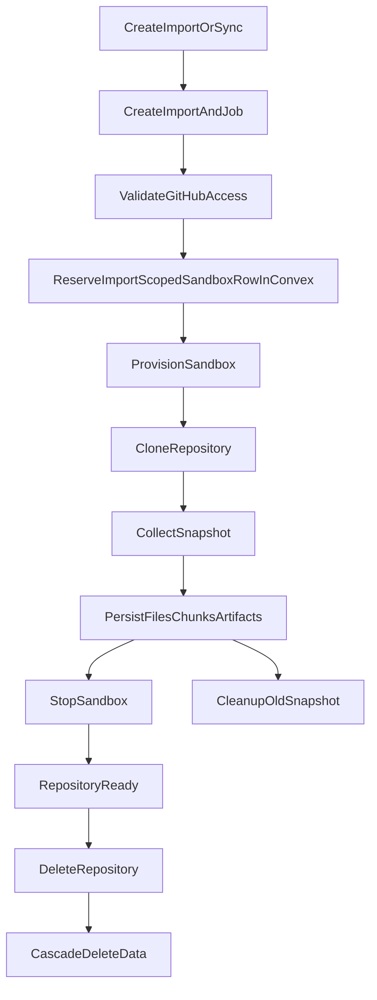

# Repository Lifecycle

## Purpose

This document describes the full lifecycle of a repository, from import to indexing, sync, cleanup, and final deletion.

## Lifecycle Overview

## Entry Points

The repository lifecycle currently has three main entry points:

- `createRepositoryImport`
- `syncRepository`
- `deleteRepository`

Both import and sync ultimately route into the same `importsNode.runImportPipeline`, while deletion goes through sandbox cleanup and cascade delete.

## Import / Sync Flow

### 1. Create process records

Whether this is the first import or a later sync, the system first creates:

- one `jobs` record with `kind = import`
- one `imports` record

The first import also creates:

- one `repositories` record
- one default `threads` record

This lets the UI show a queued workflow immediately instead of waiting for the full background process to finish before the repository appears.

### 2. Schedule work into the Node runtime

After the import is created, Convex schedules `internal.importsNode.runImportPipeline`. The heavy work happens there because it needs:

- the GitHub API
- the Daytona SDK
- repository clone and scan operations

### 3. Validate first instead of spending resources first

The first important decision in `runImportPipeline` is to perform a GitHub access check before provisioning a sandbox:

- find the active installation for the current owner
- call the GitHub API to confirm that the installation can access the target repository
- detect the repository's actual visibility at the same time

This order matters because it avoids the wasteful case where sandbox resources are created for a repository that is not actually accessible.

### 4. Reserve an import-scoped sandbox row, then provision the sandbox

Only after repository access is confirmed does the system:

- insert a placeholder `sandboxes` row with `status = provisioning`
- point `imports.sandboxId` to that placeholder row
- call Daytona to create a new sandbox
- attach resource limits, TTL, `remoteId`, and `repoPath` back onto the same sandbox row

`repositories.latestSandboxId` is intentionally not changed here. It continues to point at the last completed sandbox so sandbox-mode reads and analysis jobs do not lose the previous usable environment while a sync is still cloning, scanning, or persisting.

This order is intentional. If the workflow crashes after Daytona create succeeds but before the rest of import completes, Convex still owns an import-scoped sandbox record that later cleanup logic can find without replacing the repository's last known good sandbox pointer.

### 5. Clone and snapshot

After the sandbox is created, the system:

- obtains an installation access token
- clones the repository inside the sandbox
- captures the current branch and commit SHA
- scans the file tree
- selects important file contents
- builds a repository snapshot

At this point Daytona is the source of execution, while Convex remains the source of state.

### 6. Generate reusable indexed data

The data generated from the snapshot falls into three main categories:

- `repoFiles`
- `repoChunks`
- `artifacts`

Artifacts currently include at least:

- a repository manifest
- a README summary
- an architecture overview

So import is not just "pull the repository." It builds the knowledge base used by later chat and analysis flows.

### 7. Persist the new snapshot in staged batches

The generated data is not written in one giant transaction anymore. Instead, the system persists it in smaller steps:

1. write import-scoped artifacts and header metadata
2. write `repoFiles` in batches
3. write `repoChunks` in batches
4. finalize the import in one publish step

This order is intentional:

- each batch stays below Convex mutation limits
- retries can deduplicate previously written rows
- the repository does not expose the new snapshot until finalize succeeds

### 8. Finalize and publish the snapshot

Only the finalize step is allowed to switch the repository to the new snapshot. At that point the system:

- marks the import and job as completed
- updates repository summary fields and latest pointers
- writes `lastImportedAt`, `lastIndexedAt`, and `lastSyncedCommitSha`
- changes the sandbox state to `ready`
- points `repositories.latestSandboxId` at the new sandbox
- queues cleanup for the previously published sandbox, if one existed

This is the moment the repository officially becomes ready for interaction on the new snapshot.

### 9. Stop the sandbox, but do not delete it immediately

After a successful import, the system attempts to stop the sandbox immediately. The goal is not to remove it, but to:

- release CPU and memory
- preserve the repository contents on disk
- keep the sandbox available for future deep mode wake-up

So an import completing does not mean the sandbox disappears. It enters a low-cost standby state.

### 10. Clean up superseded or partial snapshots

If the repository already had an older completed import, the system cleans up that older snapshot in the background:

- old `repoFiles`
- old `repoChunks`
- artifacts produced by the old import job

This keeps the latest import snapshot as the main knowledge source while preventing unbounded data accumulation.

The same cleanup path is also reused for cancelled or failed imports that had already written part of the new snapshot. That prevents half-persisted rows from lingering after the workflow exits early.

## How Repository Detail Is Assembled

`getRepositoryDetail` aggregates the data needed by the UI:

- the repository itself
- recent jobs
- recent threads
- import artifacts and recent deep-analysis artifacts
- file count
- a sandbox summary
- `deepModeAvailable`
- `hasRemoteUpdates`

This lets the frontend get most of what the main screen needs in a single query.

## How Sync Differs From the First Import

They share most of the same pipeline, but their meaning is different:

- the first import may need to create the repository and default thread
- sync rebuilds the import snapshot for an existing repository
- sync clears `latestRemoteSha` first so the UI's update indicator disappears immediately

In other words, sync is not a patch to the repository. It is a controlled re-run of the import process.

## Deletion Flow

### 1. Tombstone the repository

`deleteRepository` does not delete everything immediately. It first writes `deletionRequestedAt` onto the repository.

This tombstone serves two purposes:

- it prevents new import or processing work from continuing
- it lets background workflows detect the deletion and cancel or finish gracefully

### 2. Schedule sandbox cleanup first

When deleting a repository, the system schedules cleanup jobs for all sandboxes before deleting table rows directly. This is because:

- remote Daytona sandboxes must be explicitly deleted
- cleanup jobs need enough database context to execute correctly

### 3. Cascade delete

After that, `cascadeDeleteRepository` removes data in batches:

- `messages`
- `threads`
- `artifacts`
- `repoChunks`
- `repoFiles`
- `imports`
- `sandboxes`
- `jobs`
- and finally `repositories`

If sandbox cleanup is still in progress, cascade delete reschedules itself until it can finish safely.

## Failure And Cancellation Behavior

### Import failure

If any part of the pipeline fails:

- `imports.status = failed`
- the associated job is marked failed
- the sandbox is marked failed if it already exists
- `repository.importStatus = failed` only when there is no previous completed import

If a sandbox row had already been reserved, the system also schedules sandbox cleanup so the failed import does not leave either:

- a Daytona sandbox still running without DB tracking
- or a Convex placeholder sandbox row stuck forever in a failed state

Cleanup is scheduled for the failed import's sandbox, not for every sandbox on the repository. This preserves the last completed sandbox on sync failure. Cleanup can handle both normal sandboxes and placeholder rows. If the row never received a Daytona `remoteId`, cleanup archives it without attempting a remote delete.

### Import cancellation

If the repository has already entered the deletion flow, the import pipeline is cancelled instead of continuing or being marked as a normal failure.

This distinction tells the UI and later workflows that:

- this is not a system error
- the data lifecycle has ended

## Current Architecture Characteristics

### Strengths

- Import and sync share the same pipeline, which keeps the behavior consistent.
- Snapshot switching is explicit, which avoids half-updated states.
- Repository deletion uses tombstoning before cascade delete, reducing collisions with background work.

### Known Limitations

- The import pipeline is currently a centralized orchestration action and may need to be split into clearer domain services as it grows.
- Although `index` exists as a job kind in the schema, indexing is still mostly embedded inside the import pipeline rather than operating as a separate workflow.
- Deep mode availability depends on sandbox state and TTL, so the user experience is affected by the resource reclamation cycle.

