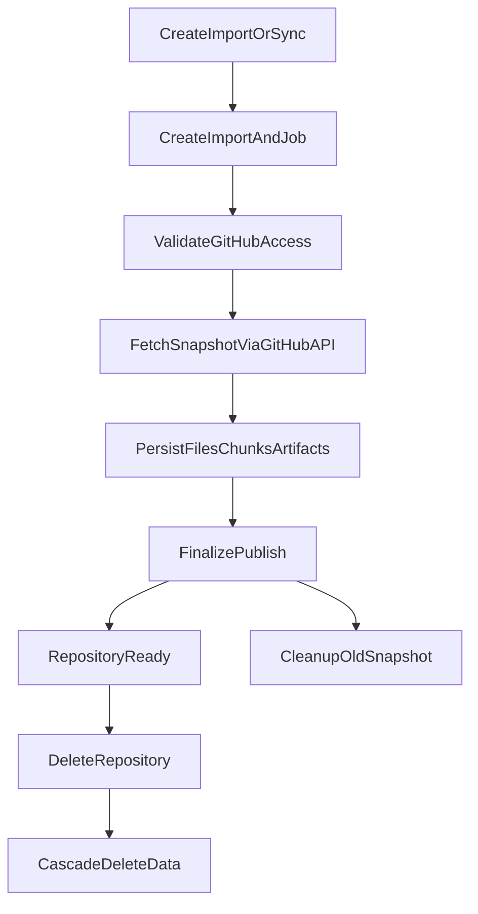

# Repository Lifecycle

## Purpose

This document describes the full lifecycle of a repository, from import to indexing, sync, cleanup, and final deletion.

## Lifecycle Overview

## Where the sandbox lives in this picture

Repository import is intentionally **sandbox-free**. The pipeline never provisions a Daytona sandbox, never clones the repository onto a Daytona disk, and never touches `repositories.latestSandboxId`. All knowledge produced by import (`repoFiles`, `repoChunks`) is built from GitHub API responses.

A Daytona sandbox is only provisioned on demand by features that genuinely need a live filesystem:

- **Sandbox-grounded Discuss** — provisioned the first time the user activates the Sandbox grounding toggle on a repository (via `requestSandboxActivation` → `sandboxActivationNode.runSandboxActivation`).
- **System Design generation** — every kind is LLM-backed and runs through `ensureSandboxReady` inside `systemDesignNode.runSystemDesignGeneration`.

`ensureSandboxReady` (in `convex/lib/sandboxLiveness.ts`) is the single source of truth for "make a sandbox usable for this repository right now". It probes Daytona, wakes a stopped sandbox, or provisions a fresh one as needed, and patches `repositories.latestSandboxId` to the result. Import never sets that pointer — whatever sandbox the previous sandbox-grounded reply or System Design run left there stays there.

## Entry Points

The repository lifecycle currently has three main entry points:

- `createRepositoryImport`
- `syncRepository`
- `deleteRepository`

Both import and sync ultimately route into the same `importsNode.runImportPipeline`, while deletion goes through sandbox cleanup and cascade delete.

## Import / Sync Flow

### 1. Create process records

Whether this is the first import or a later sync, the system first creates:

- one `jobs` record with `kind = import`
- one `imports` record

The first import also creates:

- one `repositories` record
- one default `threads` record

This lets the UI show a queued workflow immediately instead of waiting for the full background process to finish before the repository appears.

### 2. Schedule work into the Node runtime

After the import is created, Convex schedules `internal.importsNode.runImportPipeline`. The heavy work happens there because it needs:

- the GitHub API (REST endpoints under `https://api.github.com`)
- the GitHub App installation token plumbing in `githubAppNode.ts`

The pipeline does **not** import the Daytona SDK; that integration is reserved for the on-demand sandbox path.

### 3. Validate before fetching

The first decision in `runImportPipeline` is to verify GitHub access:

- find the active installation for the current owner
- call `checkRepoAccess` to confirm that the installation can read the target repository
- detect the repository's actual visibility at the same time and write it back to `repositories.visibility`

This permission probe runs before any snapshot fetching. A repository that is not included in the installation's repo selection fails fast with a "go fix your repo selection" message, costing only a single GitHub API round trip.

### 4. Fetch the repository snapshot via the GitHub API

After access is confirmed, `runImportPipeline` calls `fetchRepositorySnapshot` (in `convex/githubRepoFetcher.ts`). That helper issues a small, bounded fan-out of GitHub API requests:

- `GET /repos/{owner}/{repo}` — metadata, default branch, visibility
- `GET /repos/{owner}/{repo}/commits/{branch}` — head commit SHA and its tree SHA
- `GET /repos/{owner}/{repo}/git/trees/{treeSha}?recursive=1` — the full recursive file tree (paths, types, sizes, blob SHAs)
- `GET /repos/{owner}/{repo}/git/blobs/{sha}` — parallel reads for the README, the package manifests (`package.json`, `pyproject.toml`, `Cargo.toml`), and up to a dozen heuristic "important" files

The helper retries 429 / 5xx responses with exponential backoff and respects `Retry-After`. Per-blob fetches degrade gracefully: a missing or oversized blob drops that file's content from the snapshot without failing the import. The snapshot has the same shape the old sandbox-clone path produced, so downstream consumers (`buildRepositoryManifest`, `createChunkRecords`) work unchanged.

### 5. Generate reusable indexed data

The fetched snapshot is converted into three durable outputs:

- `repoFiles` — one row per tree entry, with `language`, `isEntryPoint`, `isConfig`, `isImportant` annotations
- `repoChunks` — line-bounded chunks of the README and important files for retrieval / dependency detection

Artifacts (System Design, failure-mode analyses) are populated separately via the `Generate System Design` flow, not by import.

### 6. Persist the new snapshot in staged batches

The generated data is written in bounded steps rather than one giant transaction:

1. write import-scoped artifacts and header metadata
2. write `repoFiles` in batches keyed by `importId + path`
3. write `repoChunks` in batches keyed by `importId + path + chunkIndex`
4. finalize the import in one publish step

Each batch stays below Convex mutation limits, retries deduplicate previously written rows, and the repository does not expose the new snapshot until finalize succeeds.

### 7. Finalize and publish the snapshot

Only the finalize step is allowed to switch the repository to the new snapshot. At that point the system:

- marks the import and job as `completed`
- updates the repository's summary, README summary, architecture summary, detected languages, package managers, entrypoints, and file count
- writes `lastImportedAt`, `lastIndexedAt`, and `lastSyncedCommitSha`
- promotes `latestImportId` / `latestImportJobId` to the new import

Finalize does **not** touch `repositories.latestSandboxId`. Any sandbox previously provisioned by sandbox-grounded Discuss or System Design keeps pointing where it was, and its cleanup is driven by those features' own lifecycles, not by the import.

### 8. Clean up superseded or partial snapshots

If the repository already had an older completed import, the system cleans up that older snapshot in the background:

- old `repoFiles`
- old `repoChunks`
- artifacts produced by the old import job

This keeps the latest import snapshot as the main knowledge source while preventing unbounded data accumulation.

The same cleanup path is also reused for cancelled or failed imports that had already written part of the new snapshot. That prevents half-persisted rows from lingering after the workflow exits early.

## How Repository Detail Is Assembled

`getRepositoryDetail` aggregates the data needed by the UI:

- the repository itself
- recent jobs
- recent threads
- import artifacts and recent deep-analysis artifacts
- file count
- a sandbox summary
- `deepModeAvailable`
- `hasRemoteUpdates`

This lets the frontend get most of what the main screen needs in a single query.

## How Sync Differs From the First Import

They share most of the same pipeline, but their meaning is different:

- the first import may need to create the repository and default thread
- sync rebuilds the import snapshot for an existing repository
- sync clears `latestRemoteSha` first so the UI's update indicator disappears immediately

In other words, sync is not a patch to the repository. It is a controlled re-run of the import process. Because the pipeline is GitHub-API-only, a sync never disturbs a sandbox that sandbox-grounded Discuss or System Design previously provisioned.

## Deletion Flow

### 1. Tombstone the repository

`deleteRepository` does not delete everything immediately. It first writes `deletionRequestedAt` onto the repository.

This tombstone serves two purposes:

- it prevents new import or processing work from continuing
- it lets background workflows detect the deletion and cancel or finish gracefully

### 2. Schedule sandbox cleanup first

When deleting a repository, the system schedules cleanup jobs for all sandboxes before deleting table rows directly. This is because:

- remote Daytona sandboxes must be explicitly deleted
- cleanup jobs need enough database context to execute correctly

These sandboxes originate from sandbox-grounded Discuss / System Design / `ensureSandboxReady`, not from the import pipeline — but they are still scoped to the repository and must be released on deletion.

### 3. Cascade delete

After that, `cascadeDeleteRepository` removes data in batches:

- `messages`
- `threads`
- `artifacts`
- `repoChunks`
- `repoFiles`
- `imports`
- `sandboxes`
- `jobs`
- and finally `repositories`

If sandbox cleanup is still in progress, cascade delete reschedules itself until it can finish safely.

## Failure And Cancellation Behavior

### Import failure

If any part of the pipeline fails:

- `imports.status = failed`
- the associated job is marked `failed` with the wrapped error message and a Reference ID for log lookup
- `repository.importStatus = failed` only when there is no previous completed import (a sync failure does not knock a previously-completed repository out of `completed`)
- partial `repoFiles` / `repoChunks` / artifact rows from the failed attempt are cleaned via `cleanupSupersededImportSnapshot`

The failure path no longer needs to clean up any sandbox: the import pipeline never reserved one. The simpler error model is one of the main reliability wins of the GitHub-API-only path — Daytona quota exhaustion, provisioning timeouts, and clone errors are no longer import failure modes.

### Import cancellation

If the repository has already entered the deletion flow, the import pipeline is cancelled instead of continuing or being marked as a normal failure.

This distinction tells the UI and later workflows that:

- this is not a system error
- the data lifecycle has ended

## Current Architecture Characteristics

### Strengths

- Import and sync share the same pipeline, which keeps the behavior consistent.
- Snapshot switching is explicit, which avoids half-updated states.
- Repository deletion uses tombstoning before cascade delete, reducing collisions with background work.
- Import is sandbox-free, so Daytona availability never blocks Discuss / Library access for a freshly imported repository.

### Known Limitations

- The import pipeline is currently a centralized orchestration action and may need to be split into clearer domain services as it grows.
- Although `index` exists as a job kind in the schema, indexing is still mostly embedded inside the import pipeline rather than operating as a separate workflow.
- `repositories.fileCount` and per-file annotations come from a single GitHub Trees API call; very large monorepos that exceed the API's truncation threshold land a partial tree (logged, not fatal).
- Sandbox-grounded Discuss and System Design availability depend on sandbox state and TTL, so the user experience for those features is affected by the resource reclamation cycle — but ungrounded Discuss and Library remain available regardless.
