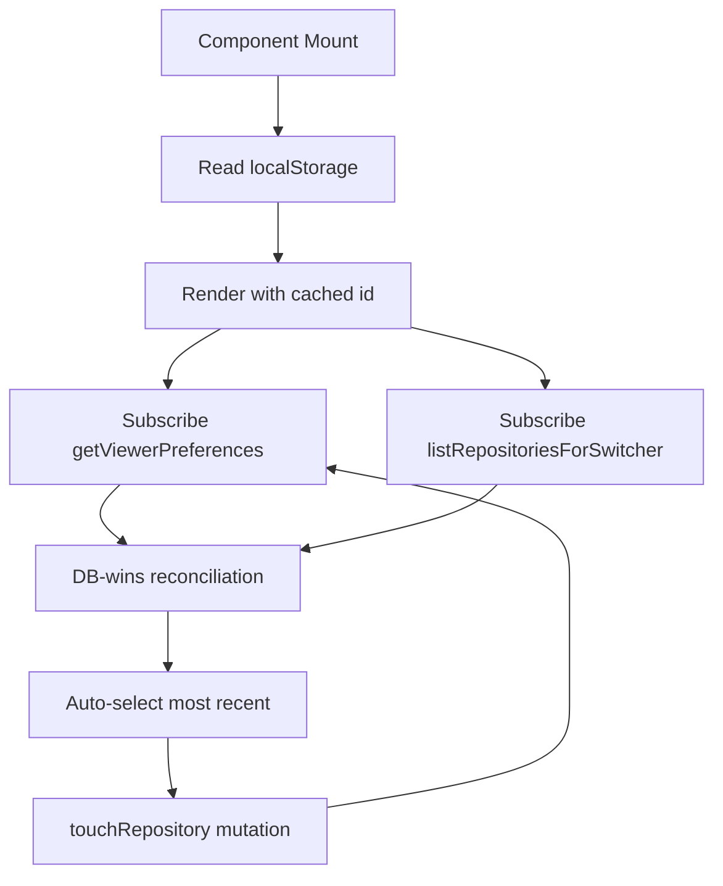

# Repository Persistence System Design

## Purpose

This document explains how Systify remembers which repository is "currently
active" for a viewer across sessions, browsers, and devices. It describes
why the system stores that selection in two places, which one is the source
of truth, and how reconciliation works on load and on switch.

## The Problem

`RepositoryShell` needs an "active repository" before it can render: the
sidebar highlights it, thread queries scope to it, and the
redirect-to-most-recent-thread effect depends on it. The selection has
three competing requirements:

1. **Instant first paint.** Waiting for a Convex query before deciding which
   repository is active produces a visible flash and a delayed sidebar.
2. **Cross-device continuity.** A user who switches repositories on one
   browser expects the next browser / device to land in the same repository
   on next sign-in.
3. **Resilience to deletion.** If the previously active repository was
   deleted (locally or on another device), the UI must recover instead of
   getting stuck on a dangling id.

A pure-localStorage design solves (1) and (3) but fails (2): each browser
remembers its own pick and they never converge. A pure-DB design solves (2)
and (3) but fails (1): the shell renders blank until the preference query
resolves.

## Design Goals

The persistence design optimizes for four properties:

1. render the shell on first paint without waiting for Convex
2. converge to one selection across devices for the same viewer
3. recover gracefully when the stored selection is invalid
4. keep the source-of-truth boundary unambiguous so future preferences can
   reuse the same pattern

## Chosen Design

The selection lives in two places with explicit roles:

- `userPreferences.lastActiveRepositoryId` is the **canonical** selection.
- `localStorage["systify.activeRepositoryId"]` is a **first-paint cache**.

The DB always wins on conflict. The cache exists only to eliminate the
first-paint flash.



### Storage layout

`convex/schema.ts` keeps the `userPreferences` table keyed by
`ownerTokenIdentifier`:

```ts
userPreferences: defineTable({
  ownerTokenIdentifier: v.string(),
  lastActiveRepositoryId: v.optional(v.id("repositories")),
  lastActiveRepositoryUpdatedAt: v.optional(v.number()),
}).index("by_ownerTokenIdentifier", ["ownerTokenIdentifier"]);
```

The table is intentionally per-viewer rather than per-repository because
"current repository" is a property of the viewer, not the repository.
Future viewer-level preferences (default chat mode, theme, last opened
thread per repository) extend this table without reshaping the repository
data model.

### Atomic write boundary

Every "the user just activated this repository" event funnels through one
mutation: `repositoryPreferences.touchRepository`. Inside that mutation,
the writes move together inside the same Convex transaction:

1. `repositories.lastAccessedAt = now` — drives the sidebar's recency
   ordering and the "most recently accessed repository" fallback.
2. `repositories.lastMode = mode` *(when the caller passes a settled mode
   URL)* — so the next repository-landing redirect returns the user to the
   mode they were last using in this repository.
3. `userPreferences.lastActiveRepositoryId = repositoryId` — the canonical
   cross-device selection.

Atomicity matters. If these writes were separate mutations, a
mid-transition reader could observe a repository that ranks first by
`lastAccessedAt` while the preference still points elsewhere — every
client-side reconciliation rule has to assume both writes are coherent.

The shared upsert helper is in `convex/lib/userPreferences.ts`
(`upsertLastActiveRepository`). The *userPreferences* write is
idempotent: calling `touchRepository` repeatedly on the same repository
short-circuits `upsertLastActiveRepository` so subscriptions on
`getViewerPreferences` stay stable. The *repository* patch, however,
always runs — `lastAccessedAt` is bumped to `Date.now()` on every call
(and `lastMode` is patched when `mode` is supplied and differs from the
stored value), because the sidebar's recency ordering and the
most-recent-repository fallback both depend on that timestamp moving
forward on every explicit user activation.

`mode` is intentionally optional. Callers that only know the repository
changed (URL → state sync on first paint) omit it so the stored mode is not
clobbered with whatever the *previous* repository was showing; callers that
observe a settled mode URL (`/r/:rid/discuss`, `/r/:rid/library`) pass it
so the repository remembers the user's pick.

### Read path

`convex/userPreferences.ts` exports `getViewerPreferences`. It loads the
viewer's row through `loadViewerPreferences` (in
`convex/lib/userPreferences.ts`), validates that the stored
`lastActiveRepositoryId` still exists and still belongs to the viewer, and
exposes `null` for the field when validation fails. The frontend therefore
never sees a dangling id; it only ever sees one of:

- `null` — the viewer has no preference yet (first visit, or every cache
  miss before any explicit switch)
- `{ lastActiveRepositoryId: null, ... }` — preference exists but its
  repository was deleted (rare; usually pre-empted by the cascade below)
- `{ lastActiveRepositoryId: Id<"repositories">, ... }` — a valid selection

### Frontend reconciliation

`src/components/chat-shell-shared/use-repository-persistence.ts` owns five
ordered effects:

1. **First-paint cache.** `useState` initializer reads
   `localStorage["systify.activeRepositoryId"]` synchronously so the first
   render already has a repository id.
2. **localStorage mirror.** A `useEffect` watches `activeRepositoryId`
   and writes it back to `localStorage["systify.activeRepositoryId"]`
   whenever it changes (or removes the key when the id becomes `null`).
   This is what keeps the first-paint cache aligned with the
   reconciled state across every subsequent mount, including after
   DB-wins reconciliation, fallback seeding, and URL → state sync.
3. **DB-wins reconciliation** (live, not one-shot). Whenever both the
   owned-repository id set (from `listAllOwnerRepositoryIds`) and
   `getViewerPreferences` are resolved, if the DB carries a different
   selection than the local state *and* that repository still exists,
   the local state is updated to match the DB. No write is issued — the
   DB is already authoritative. Because the effect re-runs on every
   change to `viewerPreferences`, a switch from another tab propagates
   here the moment Convex pushes the row update.
4. **Fallback + seeding.** If the active id is missing or no longer valid,
   pick the most recently accessed repository (from the switcher's 20-row
   recency window) and call `touchRepository` on it. This both promotes
   the fallback into the DB (so a brand-new browser converges immediately
   on next load) and bumps `lastAccessedAt` so the sidebar order matches
   the actual selection.
5. **URL → state sync.** When the URL carries a `:repositoryId`, treat it
   as canonical: adopt it into local state and call `touchRepository` so
   the DB selection matches the user's just-followed link. A URL pointing
   at a missing repository bounces to `DEFAULT_AUTHENTICATED_PATH`.

The reconciliation effect does not need a one-shot guard against stale
in-flight `viewerPreferences` snapshots because `touchRepository` carries
an [optimistic update](https://docs.convex.dev/client/react/optimistic-updates)
(`applyTouchRepositoryOptimistic` in `src/lib/repository-mutations.ts`)
that mirrors the server-side mutation locally: `lastActiveRepositoryId`
and the matching `repositories.lastAccessedAt` row are updated in the
local Convex query cache the moment the user clicks. The reconciliation
effect therefore observes a coherent local snapshot during the in-flight
window and never bounces. This is what makes live cross-tab propagation
work.

### Deletion cascade

`repositories.deleteRepository` clears
`userPreferences.lastActiveRepositoryId` (via
`clearLastActiveRepositoryIfMatches` in `convex/lib/userPreferences.ts`)
if it pointed at the deleted repository. Without this, a stale id would
persist in the DB until the next `getViewerPreferences` call dropped it on
read; the cascade keeps the table internally consistent and avoids relying
on the read-time defense under steady-state operation.

The read-time defense in `loadViewerPreferences` is still kept as
defense-in-depth for any code path that bypasses the public
`deleteRepository` mutation.

### Orphan cleanup

The active-repository pointer is only one of several localStorage entries
scoped to a repository — the Library tab strip
(`systify.library.tabs.{repoId}`), the Ask tab strip
(`systify.library.askTabs.{repoId}`), the composer draft for a repository
(`systify.composer.draft.repository.{repoId}`), and the folder navigator's
per-node open state (`systify.folderNav.open.{repoId}.{nodeId}`) are also
keyed by id. When the owning repository is deleted, those keys would
otherwise accumulate in the user's browser indefinitely.

`useStorageGC` (in `src/hooks/use-storage-gc.ts`) is mounted by
`RepositoryShell` and sweeps the prefixes against the live id set coming
from `listAllOwnerRepositoryIds` (the *complete* owned set, capped at
1000) — not the `listRepositoriesForSwitcher` query that powers the
sidebar dropdown. The shell wires this up explicitly with an inline
comment at `src/components/repository-shell.tsx:71-78`: GC needs the full
owned set so that repositories sitting outside the switcher's 20-row
recency window aren't mistakenly treated as deleted and have their
scoped keys garbage-collected. The hook handles three trigger paths
uniformly:

- **Initial load.** The first non-null snapshot of the live id set
  garbage-collects any keys left over from a previous session (e.g. the
  user deleted a repository on another device while this browser was
  closed).
- **Local deletion.** When the user deletes a repository in this tab, the
  mutation's reactivity drops the id from the local query cache, the live
  id set shrinks, and the sweep runs.
- **Cross-tab deletion.** Convex pushes the updated repository list
  snapshot to every open tab. The same hook runs in every tab and reaps
  the orphan keys without an additional handshake.

The hook is intentionally a no-op while the upstream query is still
loading, so a fresh mount does not mistakenly treat every cached key as an
orphan during the initial query window. The active-repository pointer
(`systify.activeRepositoryId`) is *not* swept by this hook — the fallback
effect in `useRepositoryPersistence` already resets it to a surviving
repository, which is sufficient.

## Why DB Wins On Conflict

The reconciliation rule "DB beats cache" is the heart of this design.
Three scenarios make it concrete:

- **Cross-device switch.** Device A switches to Repository X, the mutation
  writes `lastActiveRepositoryId = X`. Device B opens the app: cache says
  the old repository, DB says X. Reconciliation adopts X.
- **Cleared cache.** User clears localStorage on Device A. Cache is empty,
  DB still has X. Reconciliation adopts X without a flash because the
  fallback effect waits for `viewerPreferences` before running.
- **Stale cache after deletion.** Device A's cache points at a repository
  deleted on Device B. The DB-wins pass sees no valid replacement (the
  preference was cascade-cleared on B), the fallback effect picks the most
  recent surviving repository and writes it back as the new preference.

The opposite rule — cache beats DB — would let a single browser pin the
selection forever even after the user explicitly switched somewhere else.
That is exactly the bug the previous localStorage-only design had.

## Why Not Pure DB

The cache is preserved (rather than dropped in favor of "wait for the
query") for two reasons:

1. **First paint matters.** The shell's sidebar, thread list, and
   redirect-to-most-recent effect all depend on the active repository.
   Rendering a skeleton until a query resolves produces a visibly worse
   load experience for a value that almost always matches the cache.
2. **Auth bootstrap latency.** During the WorkOS → Convex token handoff
   `getViewerPreferences` cannot resolve. The cache lets the shell render
   the previous selection while auth completes; reconciliation then
   adopts the DB value if it differs.

These benefits are essentially free because the cache is purely an
optimization: every conflict is resolved in the DB's favor, so an
out-of-date cache only ever costs a single re-render.

## Why Not Embed The Selection On `repositories`

An alternative considered was storing the canonical selection back onto
`repositories` itself — for example, picking the row with the maximum
`lastAccessedAt` and treating that as "current repository". Earlier
iterations of the design implicitly relied on this.

The problem is that `lastAccessedAt` and "current repository" are not the
same concept. `lastAccessedAt` can be bumped by indirect flows (import
finalize, system-design generation completion) that should *not* imply a
viewer-visible "current" change. Folding the two together couples
unrelated concerns and forces every writer of `lastAccessedAt` to reason
about whether it should also affect the cross-device selection.

A dedicated `userPreferences` row makes the boundary explicit: only
`touchRepository` writes `lastActiveRepositoryId`, and every call site of
`touchRepository` is already an explicit "the user activated this
repository" signal.

## Failure Modes And Bounds

- **Mutation failure on switch.** The persistence hook issues
  `touchRepository` with `.catch(...)` so a transient network failure
  doesn't break the optimistic UI. The DB stays on the previous value
  until the next successful switch; localStorage carries the new value
  locally. Reconciliation on next mount would normally reset to the DB
  value — this is acceptable because the *user-visible* outcome is "your
  switch didn't sync," which matches reality.
- **localStorage disabled.** All reads and writes are wrapped in
  try/catch. Without a cache, the first paint shows whatever the fallback
  resolves to; once `getViewerPreferences` lands, reconciliation behaves
  the same as a fresh device.
- **Multiple tabs.** Convex pushes the updated `viewerPreferences` row to
  every open tab in real time. The reconciliation effect re-runs on every
  `viewerPreferences` change, so a switch in tab A propagates to tab B
  live — no remount, navigation, or reload required. The race that used
  to need a one-shot guard (an in-flight stale push overwriting the
  user's local switch in the same tab) is neutralised by the optimistic
  update on `touchRepository`: the local query cache carries the new
  selection from the moment the user clicks, so the reconciliation effect
  never observes a "stale DB / fresh local" diff. localStorage stays
  consistent because every tab mirrors the same canonical id back to disk
  after each reconciliation.
- **In-flight switch.** When the user explicitly switches repositories,
  `touchRepository`'s optimistic update writes the new
  `viewerPreferences` value into the local Convex cache before the
  mutation reaches the server. The reconciliation effect therefore
  observes "DB = user's pick" during the entire in-flight window and
  cannot bounce the user back. If the optimistic update is ever rolled
  back (e.g. the mutation throws), Convex restores the prior cache value
  and the reconciliation effect realigns local state with the server's
  truth.

## Trade-Offs

The design accepts three trade-offs:

- **One extra subscription per shell mount** for `getViewerPreferences`.
  Cost is bounded by Convex's query semantics; the row is at most one
  document and only changes on explicit user action.
- **Up to three writes per switch instead of one.** All writes are inside
  one Convex transaction so total round-trips stay at one; the cost is
  two additional document mutations per switch.
- **A small reconciliation surface in the frontend.** The cache + DB
  model has more states to reason about than either pure design, but the
  rules are bounded ("DB always wins on conflict; cache only fills the
  first-paint gap") and live in a single hook.

## Summary

The viewer's current repository is canonically a Convex
`userPreferences.lastActiveRepositoryId` row, written atomically with
`repositories.lastAccessedAt` (and optionally `repositories.lastMode`)
inside `touchRepository`. localStorage is a first-paint cache only. On
every mount, the shell renders with the cache, adopts the DB value when it
differs, and seeds the DB from a fallback when no preference exists yet.
Cross-device continuity, instant first paint, and resilience to deletion
all coexist because the source-of-truth boundary is explicit.
