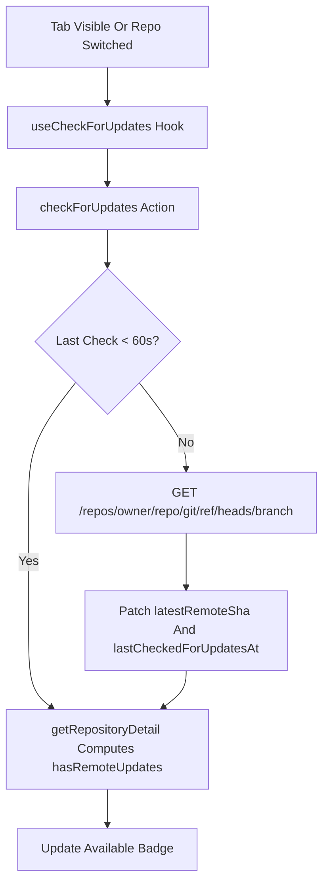

# Repository Remote Freshness Check System Design

## Purpose

This document explains how Systify decides whether an indexed repository is out of date with respect to its GitHub remote, and why that decision is driven by client-triggered checks plus two stored SHAs rather than webhooks, cron, or a persisted "stale" flag.

## The Problem

A repository is indexed at one point in time, but the upstream GitHub branch keeps moving. The product needs to surface "new commits available, consider syncing" without:

- standing up another webhook ingress for GitHub push events
- burning GitHub API quota when nobody is looking at the repo
- letting the UI claim "Update available" after the user has already started a sync

Three signals are needed to answer "is this repo behind the remote?":

1. the commit SHA of the snapshot Systify has indexed
2. the commit SHA of the remote default branch right now
3. how recently signal 2 was refreshed

## Design Goals

The freshness check optimizes for five properties:

1. cost scales with user attention, not with repository count
2. the badge appears soon after the user looks at the repository
3. the badge disappears immediately after the user starts a sync
4. derived "is stale" cannot drift from the underlying SHAs
5. multiple tabs or devices cannot multiply API calls

## Chosen Design



### Three fields on the repository row

The repository row carries the entire freshness state in three optional fields:

- `lastSyncedCommitSha` — the HEAD commit captured by the last successful import
- `latestRemoteSha` — the most recent SHA observed at the remote default branch
- `lastCheckedForUpdatesAt` — when the most recent remote check ran

Every other piece of state in the freshness flow is derived from these three.

### Comparison is computed at read time

`hasRemoteUpdates` is not stored on the repository. The pure predicate lives in `convex/lib/repositoryAccess.ts` and is called from every read site (`getRepositoryDetail`, the inventory query, and `getImportedRepoSummaries`) so they cannot drift:

```ts
export function hasRemoteUpdates(repository: RepositoryFreshnessFields | null | undefined): boolean {
  return (
    !!repository?.latestRemoteSha &&
    !!repository.lastSyncedCommitSha &&
    repository.latestRemoteSha !== repository.lastSyncedCommitSha
  );
}
```

The flag is only true when both SHAs are known and they differ. Until at least one remote check has succeeded, the field stays false.

### Client triggers the check

`useCheckForUpdates` is a React hook owned by the application shell. It calls the `checkForUpdates` action on two events:

- the selected `repositoryId` changes (the user picks a different repo in the sidebar)
- the document `visibilityState` becomes `visible` (the user comes back to the tab)

There is no interval, no `setTimeout`, no background cron. When nobody is looking at the repository, no work happens.

### Server-side throttle

The action skips the GitHub call when `Date.now() - lastCheckedForUpdatesAt < 60_000`. This is the only throttle in the system. The hook fires freely; the action decides whether to actually hit GitHub.

### Lightweight ref-only fetch

The remote check uses GitHub's Git refs endpoint:

```
GET https://api.github.com/repos/{owner}/{repo}/git/ref/heads/{branch}
```

The response is roughly 200 bytes and contains exactly the SHA needed. No commit metadata, no tree, no diff is fetched.

The action prefers an installation token (5,000 req/hour per installation) and falls back to unauthenticated requests (60 req/hour) only when the token cannot be obtained. Token failure is a warning, not a fatal error.

### Sync clears `latestRemoteSha`

`syncRepository` queues an import with `clearLatestRemoteSha: true`. The shared `queueImportWorkflow` then patches the repository:

```ts
await ctx.db.patch(args.repositoryId, {
  importStatus: "queued",
  ...(args.clearLatestRemoteSha ? { latestRemoteSha: undefined } : {}),
});
```

Once `latestRemoteSha` is undefined, `hasRemoteUpdates` becomes false on the next subscription push. The "Update available" badge disappears the moment the user clicks Sync, even though `lastSyncedCommitSha` will not change until import finalize.

## Why Not Webhooks

GitHub push webhooks would deliver real-time freshness signals, but the cost is structural:

- another HTTP ingress with signature verification
- another shared secret per installation to provision and rotate
- per-installation lifecycle (create on install, remove on uninstall)
- traffic that arrives whether or not anyone is looking at the repository

"Knowledge base may be slightly behind" is not a real-time signal. Surfacing it within a few seconds of the user opening the repo is sufficient. The recurring infrastructure cost of a second webhook channel is not justified by that requirement.

## Why Not Background Cron

A periodic poll would touch the GitHub API regardless of user attention. With N repositories and any reasonable interval, the unauthenticated 60 req/hour limit is exhausted almost immediately and even the 5,000 req/hour installation budget is consumed by repositories that no one is looking at.

Tightening the interval still does not match webhook latency, and loosening it produces no improvement over the existing on-focus check. The current design pushes the cost onto the moments when freshness actually matters to a human.

## Why Throttle at the Server, Not the Client

Client-side debouncing inside `useCheckForUpdates` would only deduplicate within one browser context. The same repository can be open in:

- multiple browser tabs of the same user
- different devices for the same user

Putting the throttle in the action gives one authoritative gate for all of those cases. The hook stays simple ("fire on these two events") and the server alone decides whether the call is cheap.

## Why `hasRemoteUpdates` Is Derived, Not Stored

A persisted "isStale" boolean would need two writers: the remote check (when it observes new commits) and the import finalize step (when it catches up). Two writers means two failure modes for the flag to disagree with the SHAs.

By computing the flag from the SHAs at read time, the SHAs are the single source of truth. There is no flag to repair, no migration to add when the rule changes, and no possibility of "isStale = true but SHAs match."

## Why Sync Clears `latestRemoteSha`

`lastSyncedCommitSha` is only updated at import finalize. If sync did nothing to the freshness state on entry, both SHAs would remain at their pre-sync values throughout cloning, snapshotting, and persistence. `hasRemoteUpdates` would stay true for the entire sync, so the "Update available" badge would persist while the user has already acted on it.

Clearing `latestRemoteSha` at sync queue time drops `hasRemoteUpdates` to false immediately. The next remote check after sync rewrites the field with whatever the remote currently is. If the remote moved again during the sync, the badge correctly reappears against the new `lastSyncedCommitSha`.

## When the Check Is Skipped

The action returns early without contacting GitHub when any of the following hold:

- the repository row no longer exists
- the repository has never been synced (`lastSyncedCommitSha` is undefined)
- the repository has no `defaultBranch`
- the repository is being deleted (`deletionRequestedAt` set)
- the repository is archived (`archivedAt` set)
- the repository is mid-import (`importStatus` is `queued` or `running`)
- the throttle window has not yet elapsed

Each of these is a state where either the comparison would be meaningless or the user cannot act on the result.

If the caller is not the repository owner, the action throws rather than returning early. Ownership is an authorization failure, not a state that can be silently skipped — the client should not be issuing the check at all.

## Trade-Offs

### What this design accepts

- freshness is bounded by user attention, not by clock time
- a repository nobody opens can lag the remote indefinitely
- the first time a user opens a repository in a session, they may briefly see the previous check's SHA before the new one lands
- the throttle window means a user who refreshes within 60 seconds will not see a fresher result

### What this design avoids

- no second webhook ingress, signature path, or shared secret to manage
- no background polling cost paid for unattended repositories
- no schema column whose value must be reconciled with the SHAs
- no full repo or commit-list fetch on each check

## Result

The freshness check stays inside one small action plus one hook, and persists exactly three fields on the repository row. Every UI state — "Update available", "Knowledge ready", or no badge at all — is derived from those fields rather than mirrored into a separate flag. The cost of telling the user "your repo is behind" scales with how often a human actually opens the repository.
