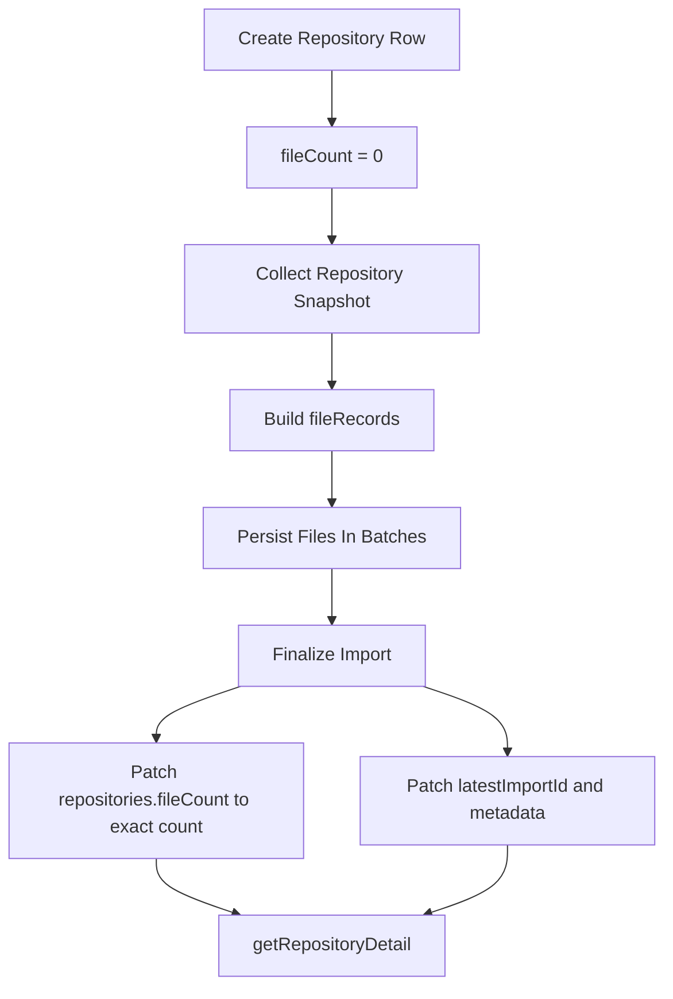

# Repository File Count Design

## Purpose

This document explains how Systify removes the `getRepositoryDetail` file-count read amplification using a clean steady-state design, without adding migration logic for old repositories.

## The Problem

`getRepositoryDetail` is a live Convex query used by the main repository screen. Today it computes the displayed file count by reading up to `401` rows from `repoFiles` on every re-run.

That is wasteful because the UI only needs one derived value:

- the exact file count when it is below `400`
- or the capped label `400+`

As the subscription re-runs for unrelated repository-detail changes, this turns into avoidable read amplification.

## Design Goals

The design should preserve four properties:

1. remove the hot-path `repoFiles` sampling read
2. publish `fileCount` at the same snapshot boundary as `latestImportId`
3. keep the repository schema simple and non-nullable
4. separate exact data from display formatting

## Chosen Design

The design uses a denormalized field on `repositories`:

- add `repositories.fileCount` as a required numeric field
- initialize it to `0` when a repository row is created
- write it only during `finalizeImportCompletion`
- read it directly in `getRepositoryDetail`

This design intentionally skips migration-specific code:

- no dual-read fallback
- no backfill worker
- no migration-safe rollout

The assumption is that older repositories are removed before the cutover.

## Why Finalize-Time Publish Matters

`fileCount` belongs to the same logical snapshot as:

- `latestImportId`
- `latestImportJobId`
- repository summaries
- detected languages and entrypoints

If `fileCount` were updated earlier than finalize, the UI could observe a mixed state where repository metadata still points to the old snapshot while the file count already reflects the new one.

Publishing `fileCount` only at finalize keeps the snapshot boundary clean.

## Why The Field Should Be Required

Because this change does not need to preserve old data, the schema should use the simpler steady-state shape immediately.

That means:

- `repositories.fileCount` is always present
- `getRepositoryDetail` does not need null handling
- test fixtures and new writes all use one consistent shape

This is easier to maintain than carrying an optional field that only exists to support a rollout that the system has explicitly chosen not to do.

## Flow



## Read Path

```mermaid
flowchart TD
  A[getRepositoryDetail] --> B[Read repository.fileCount exact value]
  B --> C[Return fileCount exact number]
  B --> D[Return fileCountLabel for UI]
  D --> E{fileCount >= 400?}
  E -- Yes --> F[400+]
  E -- No --> G[String(fileCount)]
```

## Why No Migration Logic

In a mature system, this change might ship with a dual-read rollout or a batched backfill. Systify does not need that here because the requirement explicitly does not include preserving old repository rows.

That lets the system adopt the cleaner steady-state model immediately instead of carrying temporary compatibility code.

## Trade-Off

The trade-off is explicit:

- the implementation is cleaner and easier to reason about
- but existing repository rows must be removed before this schema is treated as valid data

Given the stated constraint, that trade is acceptable.

## Result

This design removes the unnecessary `repoFiles` read from the repository-detail hot path, keeps snapshot publication consistent, and uses a cleaner long-term data model without spending extra complexity on migration code.
