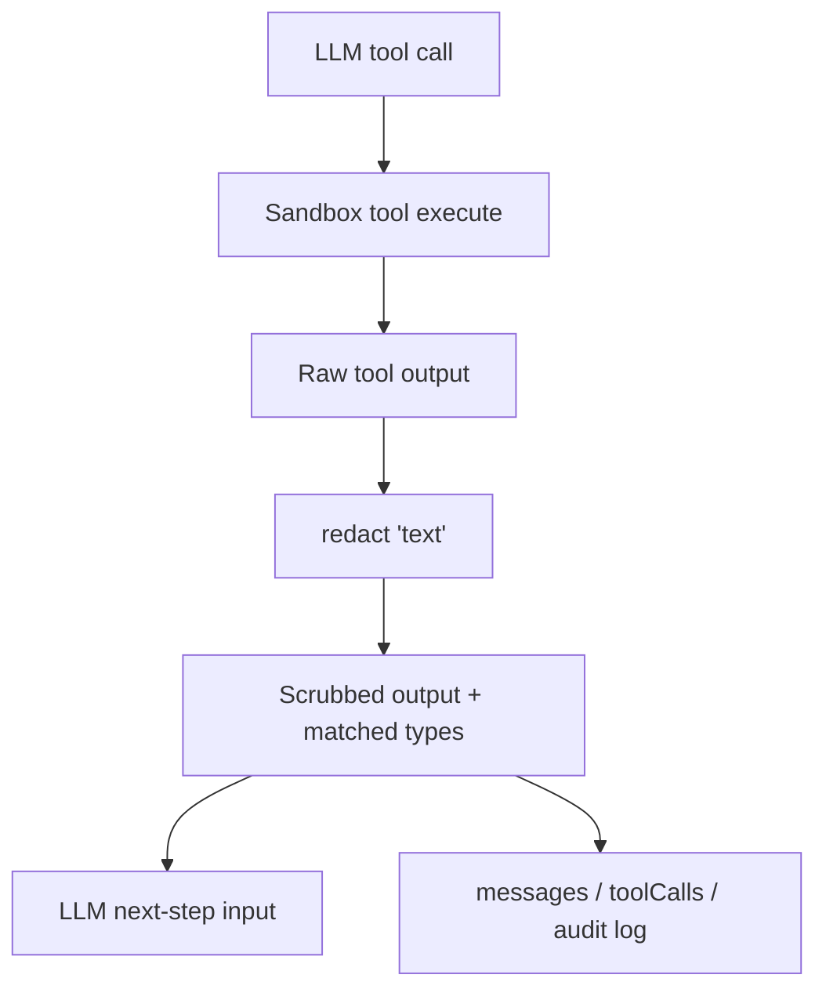

# Sandbox Mode Security System Design

## Purpose

This document explains the security model for Systify's `sandbox` chat mode, in which an LLM is given shell-like tools (`read_file`, `list_dir`, `run_shell`) over a Daytona-hosted clone of the user's repository.

The scope is the boundary between sandbox tool output and persisted message content. Network isolation, sandbox lifecycle, and Daytona's own isolation properties are out of scope here.

## Problem Statement

The sandbox is ephemeral — it is created for analysis, used for one or more chat turns, then deleted. A naive reading of that lifecycle suggests that nothing inside the sandbox needs to be protected, because the sandbox itself is short-lived.

That reading is wrong. The threat is not that the sandbox is breached. The threat is that **content read by the LLM inside the sandbox flows into the LLM's response, and the response is persisted to the Convex `messages` table**.

Anything the LLM reads can become a permanent artifact in the durable chat history. Sandbox deletion does not retroactively scrub `messages`.

Two concrete classes of leakage motivate this design:

1. Credentials embedded into `.git/config` by the clone step itself.
2. Secrets hard-coded into source files by upstream contributors.

## Threat Model

### Assets to protect

- The Systify GitHub App installation access token used to clone private repos.
- Third-party secrets accidentally committed into customer repositories (API keys, JWTs, bearer tokens).
- The integrity of `messages` as a record that can be safely shown to teammates and stored long-term.

### Adversary capabilities

The relevant adversary is not a malicious user attacking Systify. It is the combination of:

- An LLM with shell access that has no concept of "sensitive file."
- Repository contents that may contain secrets the customer has not noticed.
- Persistence behavior that writes any tool output that informs an answer into a durable, queryable table.

In other words, the adversary is the system itself behaving normally.

### Out of scope

- Daytona container escape.
- Network exfiltration from inside the sandbox (covered separately by Daytona network isolation).
- Compromise of the Convex deployment.
- Pre-existing secrets already present in `messages` before this design lands.

## Why The Ephemeral-Sandbox Argument Fails

The intuitive argument is:

> The sandbox is deleted after analysis. We do not run the customer's service inside it. So no real secrets exist there.

This argument breaks in two places:

**First**, the sandbox is not empty when it starts. The clone step itself writes a credential into the sandbox — see "Confirmed Leak Path" below. This credential is not a customer secret; it is Systify's own GitHub App token.

**Second**, even when the sandbox starts clean, the cloned repository may contain hard-coded secrets that the customer either did not know about or did not consider sensitive. The LLM has no way to distinguish a secret from a normal string. Once it reads such a string, the string can appear verbatim in the assistant message, which is then written to `messages` and to the audit log.

In both cases, the leak point is downstream of the sandbox. Deleting the sandbox does nothing.

## Confirmed Leak Path: `.git/config`

The current clone implementation in `convex/daytona.ts:204-227` calls:

```ts
await sandbox.git.clone(
  args.url,
  "repo",
  args.branch,
  undefined,
  args.token ? "x-access-token" : undefined,
  args.token,
);
```

The Daytona SDK forwards the username/password pair to `git clone` over HTTPS. Git's default behavior is to persist the credential into `.git/config` on the cloned remote URL:

```ini
[remote "origin"]
    url = https://x-access-token:<INSTALLATION_TOKEN>@github.com/owner/repo.git
```

The token is a GitHub App installation access token (`convex/githubAppNode.ts:110-129`). It is valid for one hour and scoped to whatever repositories the installation has been granted. That scope is small relative to a personal access token, but it is not negligible — for a multi-repo installation it covers every repo the customer has granted Systify.

Git writes the token into `.git/config` during the clone, where it would sit for the lifetime of the sandbox. An LLM running `run_shell` (Plan 08) could then issue `cat .git/config` or `git remote -v`, see the token in the result, and emit it as part of its answer — at which point the answer would be persisted to `messages`.

This is the dominant near-term threat. It is independent of customer behavior — the customer cannot avoid it by keeping their repo clean. Layer 1 below removes the token by overwriting the remote URL immediately after the clone returns; the mitigation is implemented inside `cloneRepositoryInSandbox` in `convex/daytona.ts`.

## Hard-Coded Secrets In Source Files

Once `.git/config` is handled, the next class of leakage is secrets hard-coded into committed source files:

```ts
// Pattern: sk_live_[A-Za-z0-9]{24}
const STRIPE_SECRET = "sk_live_…";
```

These files have unremarkable paths. No path-based blocklist can catch them. The only defense is content-based: scan tool output for high-confidence secret patterns and replace matches with a sentinel before the output reaches the LLM and before it reaches `messages`.

The relevant patterns for Systify are:

- GitHub tokens (`gh[pousr]_…`) — directly relevant given Systify's domain.
- JWTs (`eyJ…\.eyJ…\.[…]`) — common in modern auth code.
- Generic Bearer tokens (`Bearer\s+…{20,}`) — catches a wide tail of API auth.

AWS, Slack, Stripe, and similar provider-specific patterns are nice-to-have but not load-bearing for this product. They can be added without changing the design.

## Design Goals

1. Remove the unconditional `.git/config` token leak before sandbox tools see any production traffic.
2. Make secret scrubbing happen at the boundary between tool execution and LLM input, so that no path-aware logic in the tool layer can be bypassed by reading "innocent" files.
3. Apply the same scrubbing at the boundary between tool execution and durable storage (`messages`, audit log).
4. Avoid building a path-based blocklist that suggests a stronger guarantee than it provides.

## Chosen Design

The design has two layers, applied in order.

### Layer 1: Eliminate the `.git/config` token at clone time

After `sandbox.git.clone(...)` succeeds, `cloneRepositoryInSandbox` immediately rewrites the remote URL to remove credentials:

```ts
await sandbox.process.executeCommand(
  `git remote set-url origin ${posixSingleQuote(args.url)}`,
  "repo",
);
```

Where `args.url` is the canonical HTTPS URL without embedded credentials, and `posixSingleQuote` wraps it in `'…'` (escaping any embedded single quotes via the standard close-escape-reopen idiom) so a less-sanitized future caller cannot break out of the command.

This scrub runs unconditionally — it is hardening at the clone layer — and is awaited *before* the post-clone branch / SHA inspection commands, so a downstream failure cannot leave a tokened URL in `.git/config`.

This is preferred over alternatives because:

- It is a single command, runs once at clone time, and has no ongoing cost.
- It keeps the rest of the clone path unchanged — no migration to SSH, no new credential helper.
- It removes the credential from the only place it would otherwise persist.
- After scrubbing, subsequent `git fetch` / `git pull` will fail without credentials, which is the desired posture for a read-only analysis sandbox.

If the sandbox later needs to fetch additional refs, it should request a fresh installation token at that time and pass it via `GIT_ASKPASS` or a one-shot `-c http.extraheader`, never by re-embedding into the URL.

### Layer 2: Output redaction

The `redact(text)` function in `convex/chat/redaction.ts` scans tool output for credential-shaped patterns and replaces matches with `[REDACTED:<type>]`. The current registry covers `github_token`, `jwt`, `aws_access_key`, `slack_token`, and `bearer_token`. Patterns are applied in "specific before general" order so a `Bearer eyJ…` header redacts to `Bearer [REDACTED:jwt]` rather than collapsing the whole header into one opaque sentinel — strictly more useful for the LLM's downstream reasoning.

Redaction is applied at two points:

1. Before the tool result is returned to the LLM. This prevents the LLM from reasoning over or quoting the secret. Implemented inside `executeReadFile` (file content) and `executeListDir` (entry names, aggregated to the result level so the entry shape stays stable for Plan 06's tool-call ticker).
2. Before any tool input or output is written to `messages.toolCalls`, `messageToolCallEvents`, or `sandboxToolCallLog`. The persistence path is delivered by Plan 06 (live ticker + `messages.toolCalls`) and Plan 12 (`sandboxToolCallLog`); both plans lift the existing `redactedTypes` field directly rather than re-running redaction.

`redact()` returns both the scrubbed text and a sorted, de-duplicated list of matched pattern types. The matched-types list is informational — it lets the LLM and audit consumers know that something was filtered without exposing what. The returned slugs are typed as a closed `RedactionType` union so adding a pattern requires widening the union *and* the registry, which the compiler enforces.

### What is deliberately not in scope

A path-based blocklist (`.env`, `.aws/credentials`, `secrets/`, etc.) is not part of the chosen design.

The reasoning is:

- `.env` files are not committed to repositories under normal practice and therefore do not appear in clones.
- `~/.aws/credentials` lives in the home directory, not the cloned repo path.
- `secrets/` directories are typically gitignored.
- A blocklist that mostly catches files that would not be present anyway provides false reassurance.

The two classes of secret that actually appear in cloned repositories — `.git/config` credentials and hard-coded secrets in source files — are addressed by Layer 1 and Layer 2 respectively. A path blocklist would not catch either.

If a future threat justifies it (for example, allowing users to upload arbitrary files into the sandbox), a focused blocklist can be added at that time.

## Defense In Depth Boundary



The key property is that no path leads from `raw` to `llmInput` or `durable` without passing through `redact`. This is enforced inside the tool execute function rather than at the call site, so callers cannot accidentally bypass it.

## Trade-Offs

The chosen design accepts the following trade-offs:

- Redaction is regex-based and will both miss obfuscated secrets and occasionally false-positive on plausible-looking strings. This is acceptable because the alternative — a perfect classifier — does not exist, and the path-block alternative has worse coverage.
- Removing the credential from `.git/config` means subsequent `git fetch` inside the sandbox will fail without explicit re-auth. This is desired, not a defect.
- Per-pattern redaction means each new high-value pattern costs a regex and a test. This is cheap.

## Result

The security boundary has a small, defensible surface:

- **Clone-time scrubbing**: The clone step does not leave a Systify credential in `.git/config`. After `sandbox.git.clone(...)` returns, `cloneRepositoryInSandbox` overwrites the remote URL via `git remote set-url origin <canonical-url>`, with the URL POSIX-single-quoted for shell-injection defense. The scrub runs unconditionally (hardening, not feature-gated) and runs before any subsequent post-clone command.
- **Post-clone egress block**: After the scrub, `cloneRepositoryInSandbox` calls `sandbox.updateNetworkSettings({ networkBlockAll: true })` on the running container. From that point until the sandbox is destroyed, sandbox-side outbound traffic is dropped at the iptables layer. The deny list and the prompt's "no network egress" wording become *short-circuits*; the iptables rule is the load-bearing block. Tool calls (`read_file`, `list_dir`, `executeCommand`) are unaffected because they ride Daytona's control plane, not the sandbox's outbound path. The call is gated by `DAYTONA_POST_CLONE_BLOCK_NETWORK` (default: truthy / fail-closed) — see the per-tier posture table below for when to set it falsy. Tests in `convex/daytona.test.ts` pin the ordering (scrub before block before inspection), the fail-closed propagation on SDK rejection, the falsy-value skip-and-warn path, and the typo → secure-default fallback.
- **Redaction layer**: All sandbox tool output passes through `redact()` before reaching the LLM. Each success envelope carries a `redactedTypes` field — a sorted, de-duplicated list of matched pattern slugs — so future audit consumers can record *that* something was filtered without learning *what*. Error envelopes do not carry this field, keeping the error surface minimal.
- **No path blocklist**: The design does not lean on a path blocklist whose coverage would be largely illusory.

## Implementation

Layer 1 lives in `convex/daytona.ts` — the `cloneRepositoryInSandbox` function plus the private `posixSingleQuote` helper. Layer 2 lives in `convex/chat/redaction.ts` (the `redact()` function and the closed-set `RedactionType` union) and is wired into `convex/chat/sandboxTools.ts` at the `executeReadFile` and `executeListDir` return paths.

Test coverage:

- `convex/daytona.test.ts` pins clone-time scrub ordering (scrub before branch / SHA inspection), POSIX single-quoting of the URL substitution, and the unconditional behavior on public-repo clones.
- `convex/chat/redaction.test.ts` covers each pattern, the "specific before general" ordering, large-input behavior up to the 64 KiB `read_file` cap, and the no-self-match invariant on the `[REDACTED:type]` sentinel.
- `convex/chat/sandboxTools.test.ts` covers the integration: `read_file` and `list_dir` results carry `redactedTypes`; `bytesReturned` / `totalBytes` keep their pre-redaction values; `list_dir` aggregates redaction signals to the result level so entry shape stays stable; error envelopes do not carry `redactedTypes`.

Future plans extend Layer 2 by lifting `redactedTypes` directly into durable persistence: Plan 06 records it on `messages.toolCalls`, and Plan 12 lifts it into `sandboxToolCallLog.redactedFields`. The closed-set `RedactionType` union ensures those consumers stay in sync with the registry at the type-system level.

## Per-tier posture (Daytona)

Daytona gates `sandbox.updateNetworkSettings(...)` by organization tier, so the network-layer egress block is not uniformly available. Systify's posture explicitly differs between tiers; the same code base supports both via `DAYTONA_POST_CLONE_BLOCK_NETWORK`.

| Tier        | `DAYTONA_POST_CLONE_BLOCK_NETWORK` | Network-layer block? | Load-bearing defense against egress-based exfiltration                                                                                                                                  | Acceptable for                                                                                                |
| ----------- | ---------------------------------- | -------------------- | --------------------------------------------------------------------------------------------------------------------------------------------------------------------------------------- | ------------------------------------------------------------------------------------------------------------- |
| **3 / 4**   | `true` (default)                   | ✓ enforced           | iptables rule on the sandbox container; the deny list and prompt are short-circuits.                                                                                                   | Production. Public and private repositories. Multi-tenant deployments accepting third-party code.             |
| **1 / 2**   | `false` (operator-set)             | ✗ unavailable        | system prompt forbidding egress, `COMMAND_DENY_LIST` short-circuits, `redact()` chokepoint, throwaway sandbox lifecycle, unprivileged execution, token scrub keeping `.git/config` clean. | Personal / dev deployments with disclosed posture. Operator's own private repos. Public repos in any deployment. |

Three properties make the Tier 1/2 fallback meaningfully safer than "permissive egress with nothing else":

1. **Throwaway lifecycle**: sandboxes are provisioned on demand by Lab activation or LLM-backed System Design generation, auto-stop within minutes of idleness, and auto-delete within 48 hours. Even a successful exfiltration attempt has a small window of compounding access — there is no long-lived sandbox to reuse.
2. **Token scrub stays unconditional**: the GitHub installation token in `.git/config` is overwritten the moment `git clone` returns, so a successful curl-out from inside the sandbox cannot exfiltrate the token (which would have given the attacker access to *every* repo in the App installation, not just the one being analysed).
3. **`redact()` runs on every tool envelope**: even if the LLM successfully reads `.env` via `read_file`, the secret is replaced with a `[REDACTED:…]` sentinel before the LLM sees it. The closed-set `RedactionType` union prevents an attacker from suppressing a redaction by widening the type union.

The Tier 1/2 posture is **not safe for accepting third-party private repositories without disclosure**. Operators using Systify as a hosted service for unknown customers must upgrade to Tier 3+ and set `DAYTONA_POST_CLONE_BLOCK_NETWORK=true`. The structured `post_clone_network_block_skipped` warn emitted on every Tier 1/2 sandbox clone (Lab activation or LLM-backed System Design generation) exists precisely so that a future operator running a deployment audit can detect the degraded posture in logs without re-reading code.
