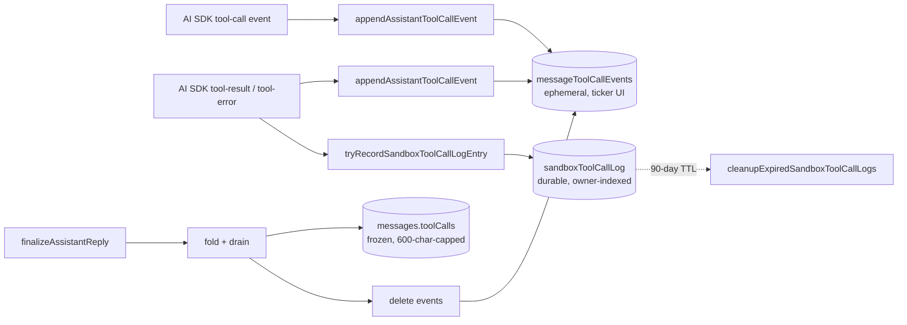
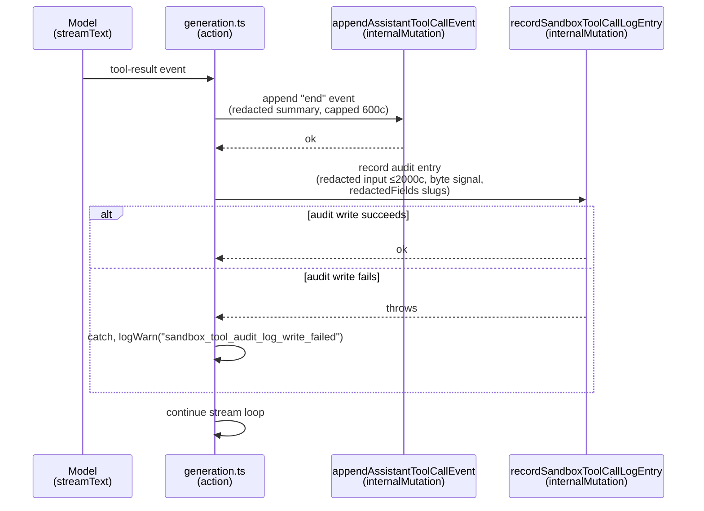

# Sandbox Tool-Call Audit Log System Design

## Purpose

This document explains the design of `sandboxToolCallLog` — the durable audit trail of every sandbox tool execution. It complements but does not replace the live UI feed (`messageToolCallEvents`) or the per-message frozen trace (`messages.toolCalls`).

The companion `sandbox-mode-security-system-design.md` covers the *content* boundary (how secrets are kept out of the message body). The companion `sandbox-mode-system-design.md` covers the *runtime* boundary (what the LLM can do inside a sandbox). This document covers the *recording* boundary — what evidence we keep about what the LLM actually did, and for how long.

## Why A Separate Table

The chat pipeline already persists each tool call in two places:

- `messageToolCallEvents` — ephemeral `start` / `end` events that drive the live ticker. Drained at finalize / fail / stale-recovery.
- `messages.toolCalls` — frozen, length-capped trace folded from the events at finalize time. Lives as long as the parent message.

Both serve the chat UI. Neither is suitable as the compliance / debugging record:

| Concern                | `messages.toolCalls`                                     | `sandboxToolCallLog`                                  |
| ---------------------- | -------------------------------------------------------- | ----------------------------------------------------- |
| Lifetime               | Bound to parent message; user delete erases it.          | 90 days regardless of parent state.                   |
| Storage shape          | Capped redacted summaries (≤ 600 chars per field).       | Pre-redaction byte size + redaction signal slugs.     |
| Index for forensics    | None (lookup must traverse `messages` by user).          | `by_owner_and_time` for "user X did Y between A,B".  |
| Failure semantics      | Required for the reply to finalize.                      | Best-effort; log warning, do not fail the reply.      |

Trying to make `messages.toolCalls` carry both jobs would mean either (a) keeping it forever and bloating message rows, or (b) widening the cascade-delete behaviour and losing audit value mid-window. The two consumers have genuinely different lifetimes; one table per consumer is cheaper than overloading.

## Threat / Use Cases

The audit log answers questions the chat UI cannot:

1. **Compliance review.** "Show every file user X read between dates A and B." Needs an owner-scoped index that survives thread / repository deletes.
2. **Incident investigation.** "After the security alert at 14:30, which users had run `run_shell` in the prior hour?" Needs cross-user time-range queries.
3. **Behavioural debugging.** "Why did the model loop on this thread?" Needs the *attempted* tool calls — including the ones that returned `path_outside_repo` — independent of the assistant message that may have been deleted by the user.
4. **Redaction-coverage validation.** "Across the last 30 days, how many tool calls produced output that triggered `github_token` redaction?" Needs the redaction-signal slugs preserved as a queryable column, not buried in an opaque blob.

The threat model the audit log is *not* designed for:

- It does not store full tool output. `messages.toolCalls` already does, with stronger redaction caps. Replicating it here would double the per-call storage cost without adding investigative power — the questions above all answer by metadata, not by re-reading what the tool returned.
- It does not protect against an attacker with Convex DB access. That is out of scope for this layer; Convex deployment isolation handles it.
- It does not double as a billing or rate-limit ledger. The `rateLimit` + cost-cap module in `convex/lib/rateLimit.ts` owns those.

## Design Goals

The audit log is optimized for five properties:

1. **Survives parent deletes.** A user-initiated thread / repository delete must not erase the compliance trail mid-window.
2. **Bounded growth.** A single fixed retention (90 days) plus a daily cleanup cron keeps table size predictable as usage scales.
3. **Best-effort writes.** A persistent audit-log infrastructure failure must not cascade into user-visible reply failures. The tool effect already happened by the time the audit row is being written; failing the reply post-hoc cannot un-do it.
4. **Cheap queries on the canonical question.** "What did user X do between A and B" must be an indexed lookup, not a table scan.
5. **Closed-set redaction signals.** The audit row records *that* a secret category was redacted (e.g. `github_token`), not the secret itself. This is enough for "did the redaction layer fire on this call?" without re-introducing the leak vector.

## Chosen Design

### Three-table architecture



The three tables have non-overlapping responsibilities:

- `messageToolCallEvents` is *transient* state that drives the live UI. Drained at finalize.
- `messages.toolCalls` is the *frozen* per-message trace. Bound to the message lifetime; user-visible.
- `sandboxToolCallLog` is the *durable* compliance record. Outlives the message; not user-visible.

### Append point

The audit write happens in `convex/chat/generation.ts` inside the `tool-result` and `tool-error` handlers, immediately *after* the matching `messageToolCallEvents` row is appended. This ordering is deliberate:

- The event write is required for the live ticker; failing the reply on its failure is correct.
- The audit-log write is best-effort; failing the reply on its failure would defeat the "tool effect already happened" rationale.

By placing the audit write *after* the event write, an event-write failure aborts before any audit work runs (no half-state); an audit-log-write failure logs a warning and the reply continues.

```ts
case "tool-result": {
  // 1. Event row — durable for the message lifetime, required for finalize
  await ctx.runMutation(internal.chat.streaming.appendAssistantToolCallEvent, { ... });

  // 2. Audit row — durable for 90 days, independent transaction, best-effort
  if (replyContext.sandboxTooling) {
    await tryRecordSandboxToolCallLogEntry(ctx, { ... });
  }
}
```

The gate on `replyContext.sandboxTooling` is the source of truth for "this reply is in sandbox mode with a real sandbox attached" — the same gate that decides whether to wire tools into `streamText` in the first place. A stray `tool-result` without a sandbox is malformed and is not audited.

### Why best-effort

The audit log records what *did* happen, not what *should* happen. By the time we are writing an audit row, three things are already true:

1. The LLM has already consumed the tool result.
2. The Daytona compute has already been spent.
3. The event row has already been written and is visible to the live ticker.

A persistent audit-log infrastructure failure at this point cannot un-do any of those. It can only deny the user the eventual assistant reply — without compensating value, since the audit record they would have generated is already lost.

Best-effort recording therefore degrades to "the reply succeeds and ops sees a `sandbox_tool_audit_log_write_failed` warning" rather than "the reply fails and the user sees a generic error." Metrics surface a sustained warning rate, which is the operational signal compliance teams need.

This is the same posture taken by `daytonaWebhooks.cleanupOldWebhookEvents` and other bookkeeping mutations: log warnings, do not fail the user-facing path.

### Why no cascade-delete

A user who deletes their thread or repository does *not* implicitly request that the audit log be erased. The audit log exists precisely to outlive ad-hoc user actions:

- For compliance, retaining the trail past parent deletion is the *expected* behaviour.
- For incident investigation, dangling references (`messageId` pointing at a now-missing message) are still informative — "there was a thread, the user did X in it, then deleted it" is itself a useful signal.
- For "right to be forgotten" workflows, an explicit `delete user data` operation is the right entry point — not an incidental side-effect of `deleteThread`.

The 90-day TTL is the only cleanup path. A test in `sandboxToolCallLog.test.ts` pins this contract: an audit row survives `ctx.db.delete(threadId)` and `ctx.db.delete(messageId)` and is still reachable by the owner-and-time index.

## Schema

```ts
sandboxToolCallLog: defineTable({
  ownerTokenIdentifier: v.string(),
  threadId: v.id("threads"),
  messageId: v.id("messages"),
  sandboxId: v.id("sandboxes"),
  toolName: v.string(),
  inputJson: v.string(),
  outputBytes: v.number(),
  durationMs: v.number(),
  errorCode: v.optional(v.string()),
  redactedFields: v.array(v.string()),
})
  .index("by_owner_and_time", ["ownerTokenIdentifier"])
  .index("by_message", ["messageId"]),
```

Field-by-field rationale:

- **`ownerTokenIdentifier`** — owner-scoping is the canonical query dimension; combined with the implicit `_creationTime` secondary sort on the `by_owner_and_time` index, it answers "what did user X do, newest first" without an extra field.
- **`threadId` / `messageId` / `sandboxId`** — foreign keys into the parent rows. They may dangle after parent deletion (intentional, see "Why no cascade-delete"). `sandboxId` is surfaced via `ReplyContext.sandboxTooling.sandboxId` so the audit row is keyed against a specific sandbox lifecycle, not a remote Daytona id that may be reassigned.
- **`toolName`** — `read_file` / `list_dir` / `run_shell`. Free-form `v.string()` (rather than a closed union) so future tools do not require a schema migration here.
- **`inputJson`** — the redacted, JSON-stringified tool input. Capped server-side at `SANDBOX_TOOL_CALL_LOG_INPUT_MAX_CHARS = 2000`. Distinct from the UI-summary cap (600) because audit recording wants more of long `run_shell` invocations preserved — those are exactly the inputs compliance audits care about.
- **`outputBytes`** — UTF-8 byte length of the JSON-stringified envelope (pre-redaction). The audit log deliberately does not duplicate the output payload; `messages.toolCalls.outputSummary` already stores a 600-char redacted summary. This field records the volume signal (e.g. for "this `read_file` was unusually large").
- **`durationMs`** — wall-clock time between the AI SDK's `tool-call` event and its matching `tool-result` / `tool-error`, measured by the action.
- **`errorCode`** — optional. Three populated forms:
  - the tool's structured error code on a `{ ok: false }` envelope (`path_outside_repo`, `command_blocked`, `command_timeout`, …);
  - `"tool_error"` on AI SDK `tool-error` events (the tool's `execute` threw);
  - `"unknown_tool_error"` on a malformed `{ ok: false }` envelope without an `errorCode`.
  Absent on success.
- **`redactedFields`** — the success envelope's `redactedTypes` slugs (closed set in `convex/chat/redaction.ts`). Empty on error envelopes (no payload to redact). Stored as `v.array(v.string())` rather than a literal union so the redaction registry can grow without forcing a schema migration.

### Index choices

- `by_owner_and_time` (`["ownerTokenIdentifier"]`) — the canonical audit query. The implicit `_creationTime` secondary sort delivers the time component without an extra field.
- `by_message` (`["messageId"]`) — pivot from a specific assistant message into the calls it ran. Useful when an audit consumer started from a `messages.toolCalls` entry and wants the un-capped audit detail.
- The cleanup cron does **not** use a custom index. It walks `_creationTime` ascending (Convex's default order) and `.take(BATCH_SIZE)` — the oldest rows arrive first, and once it hits a row whose `_creationTime >= cutoff` every subsequent row is even fresher, so iteration stops. This avoids a third index on what is otherwise a pure write-amortisation field.

## Retention Design

### 90-day TTL

Implemented in `convex/chat/sandboxToolCallLog.ts:cleanupExpiredSandboxToolCallLogs` and registered as a 24-hour cron in `convex/crons.ts`.

Strategy:

```ts
const cutoff = Date.now() - SANDBOX_TOOL_CALL_LOG_RETENTION_MS;
const candidates = await ctx.db
  .query("sandboxToolCallLog")
  .order("asc")
  .take(SANDBOX_TOOL_CALL_LOG_CLEANUP_BATCH_SIZE);

let deletedCount = 0;
for (const candidate of candidates) {
  if (candidate._creationTime >= cutoff) break; // ascending → all subsequent rows are fresher
  await ctx.db.delete(candidate._id);
  deletedCount += 1;
}

if (deletedCount === SANDBOX_TOOL_CALL_LOG_CLEANUP_BATCH_SIZE) {
  await ctx.scheduler.runAfter(0, ..., {}); // self-reschedule to drain backlog
}
```

The properties this gives:

- **Bounded per-invocation work.** `SANDBOX_TOOL_CALL_LOG_CLEANUP_BATCH_SIZE = 100` keeps each transaction comfortably inside Convex's per-mutation write budget. Mirrors `daytonaWebhooks.cleanupOldWebhookEvents` (100) and `github.cleanupExpiredOAuthStates` (50).
- **Backlog draining.** A full batch triggers a follow-up tick. A backlog (e.g. after a multi-day cron outage) drains across multiple ticks rather than breaching the write budget.
- **Steady-state efficiency.** Once the table is in retention-equilibrium, each daily run deletes the day's worth of newly-expired rows — typically a single batch with `rescheduled: false`.

### Why not a `retentionExpiresAt` field

`daytonaWebhookEvents` carries a per-row `retentionExpiresAt` and indexes it. That pattern is more flexible (different retention per row) and uses a precise `q.lt("retentionExpiresAt", now)` range scan.

The audit log uses a single fixed retention, so the simpler `_creationTime`-based approach wins:

- one less field per row (~24 bytes × N rows × 90 days);
- no separate index;
- the cleanup cost is identical (`take(100)` returns the oldest 100 rows in either approach).

If a future plan needs per-row retention (e.g. errored calls retained longer for debugging), adding `retentionExpiresAt` is a strict additive migration.

## Write Path



Two independent transactions, sequenced so an event-row failure aborts cleanly and an audit-row failure does not abort at all.

## Trust Contract Between Layers

The recording boundary assumes:

- **`redact()` is the single chokepoint for content redaction.** The audit log records *which* slug categories matched (`redactedFields`), but not the redacted payload — `messages.toolCalls.outputSummary` does that. A failure of `redact()` to scrub a secret would surface as a leaked-token-in-`messages` incident, not a leaked-token-in-`sandboxToolCallLog` incident, because we deliberately do not store the output here.
- **The tool-call event correlation is authoritative for `durationMs`.** The audit entry uses `occurredAt - toolCallMap.startedAt` from the same in-process map the event writer builds. No DB round-trip per tool result.
- **The schema's `v.array(v.string())` for `redactedFields` is loose by design.** The closed-set `RedactionType` union (`convex/chat/redaction.ts`) is the source of truth for which slugs *can* appear; a future redaction pattern is added by widening that union plus a registry entry — no audit-log schema change. Defensive filtering in `extractAuditMetadataFromToolOutput` drops non-string entries so a buggy upstream cannot inject malformed values into the audit row.
- **Best-effort means observable, not silent.** Every audit-write failure must produce a `sandbox_tool_audit_log_write_failed` warning carrying enough context (`threadId`, `messageId`, `sandboxId`, `toolName`, error message) for compliance correlation. Metrics aggregate this into a SLO-trackable signal.

## Failure Modes And Their Mitigations

| Failure mode                                                              | Where it is handled                                                              |
| ------------------------------------------------------------------------- | -------------------------------------------------------------------------------- |
| Audit-log mutation throws (transient Convex error)                        | `tryRecordSandboxToolCallLogEntry` catches and emits `sandbox_tool_audit_log_write_failed` |
| `part.output` shape is malformed (not `{ok, errorCode, redactedTypes}`)   | `extractAuditMetadataFromToolOutput` falls through to empty fields; row still written |
| `redactedTypes` contains non-string entries                               | `.filter((entry): entry is string => ...)` defensively drops them                |
| `outputBytes` arithmetic produces NaN / negative (buggy upstream)         | `Math.max(0, Math.floor(...))` in the mutation handler                           |
| Pathological `inputJson` (huge `run_shell` command)                       | `capAuditInputJson` truncates at 2000 chars with `…[truncated]` marker           |
| Cleanup cron runs while Convex write capacity is constrained              | `take(BATCH)` keeps each invocation bounded; self-reschedule drains the rest     |
| Cron missed for several days (backlog of expired rows)                    | First post-outage run hits the batch cap → reschedules → drains across ticks    |
| User deletes thread mid-window (audit row references missing parent)     | Intentional — audit row survives, dangling fk is documented behaviour            |
| Tool result lands after `cancelInFlightReply` aborted the stream          | Outer `if (wasCancelled \|\| generationAborted) break` skips both the event and audit writes |

## Observability

The audit log produces three observability signals:

- **`recordSandboxToolCallLogEntry` writes (success path)** — implicit; the row's existence is the signal.
- **`logInfo("chat", "sandbox_tool_call_log_cleanup", ...)`** — fired by the cleanup cron when at least one row was deleted, carrying `deletedCount`, `rescheduled`, and the `cutoff` timestamp.
- **`logWarn("chat", "sandbox_tool_audit_log_write_failed", ...)`** — fired by `tryRecordSandboxToolCallLogEntry` on any underlying mutation failure. Aggregated as a metric so a sustained failure rate becomes a SLO violation.

The `sandbox_tool_audit_log_write_failed` warning carries enough context (`threadId`, `messageId`, `sandboxId`, `toolName`, error message) to correlate against the original chat reply when reconciling audit gaps.

## Open Questions / Future Work

- **Compliance-strict mode.** If a regulatory regime requires guaranteed audit-log durability (i.e. failing the reply when the audit write fails), the change is a single-flag flip inside `tryRecordSandboxToolCallLogEntry`. The current best-effort posture is the pragmatic default; the strict-mode wiring is a one-file change away.
- **Per-row retention.** A future change that wants to keep errored / blocked calls longer than 90 days for incident debugging can add an optional `retentionExpiresAt` field, populate it on insert, and switch the cleanup query to a range scan on a new index. The current design does not preclude this.
- **Audit query API.** The indexes are in place but no public query is shipped. The first audit consumer (metrics or a future internal dashboard) will define the query shape. Adding it later is purely additive.
- **Differentiating SDK errors from envelope errors.** Today both end up in `errorCode` (the SDK error uses the literal `"tool_error"`; envelope errors use the tool's structured code). If a future audit consumer needs to count them separately without value-sniffing, an `errorSource: "sdk" | "envelope"` field is the cleanest extension. Not currently required by any consumer.
- **`outputBytes` interpretation.** Recorded as the byte length of the JSON-stringified envelope (pre-redaction), not the raw tool output. This is uniform across all tools but includes envelope wrapper overhead. The existing field is well-defined in code; if a future audit consumer needs the *file* / *command output* size specifically, adding an optional `payloadBytes` field is a strict additive migration.

## Implementation Pointers

- Mutation + helpers: `convex/chat/sandboxToolCallLog.ts`
  - Constants: `SANDBOX_TOOL_CALL_LOG_RETENTION_MS`, `SANDBOX_TOOL_CALL_LOG_CLEANUP_BATCH_SIZE`, `SANDBOX_TOOL_CALL_LOG_INPUT_MAX_CHARS`.
  - Pure helpers: `capAuditInputJson`, `countUtf8Bytes`, `extractAuditMetadataFromToolOutput`.
  - Internal mutations: `recordSandboxToolCallLogEntry`, `cleanupExpiredSandboxToolCallLogs`.
  - Action-side wrapper: `tryRecordSandboxToolCallLogEntry`.
- Schema: `convex/schema.ts` — `sandboxToolCallLog` table with `by_owner_and_time` and `by_message` indexes.
- Append site: `convex/chat/generation.ts` — `tool-result` and `tool-error` handlers, gated on `replyContext.sandboxTooling`.
- Context surface: `convex/chat/context.ts` — `ReplyContext.sandboxTooling.sandboxId`.
- Cron registration: `convex/crons.ts` — `cleanup expired sandbox tool call logs`.
- Tests: `convex/sandboxToolCallLog.test.ts` — pure-helper boundary cases, mutation shape, index ordering, cross-tenant fence, retention TTL, batch + reschedule, survival across cascade.
