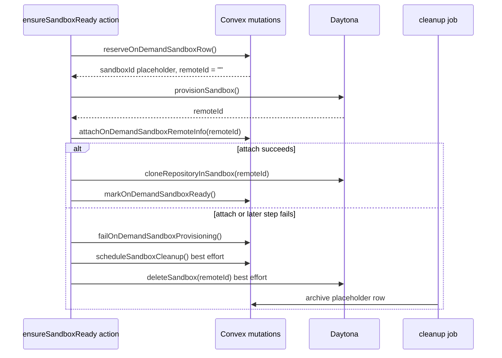

# Sandbox Provisioning Cleanup System Design

## Purpose

This document explains how Systify cleans up Daytona sandboxes when on-demand
provisioning fails after Daytona has already created the remote resource.

The focused failure case is:

1. Convex reserves a local `sandboxes` placeholder row.
2. Daytona successfully creates a remote sandbox and returns `remoteId`.
3. Convex fails before `attachOnDemandSandboxRemoteInfo` persists that
   `remoteId` to the placeholder row.

Without an explicit direct-delete fallback, the cleanup job only sees the local
row's empty `remoteId`, archives the row, and leaves the Daytona sandbox running
until orphan reconciliation eventually discovers it by labels. That is correct
eventual convergence, but it is too slow for a known resource that the action
still has in memory.

## Scope

In scope:

- On-demand sandbox provisioning through `ensureSandboxReady`.
- Sandbox activation and Design Docs generation, which both depend on
  on-demand Daytona sandboxes.
- Failure cleanup after `provisionSandbox` has returned a Daytona `remoteId`.

Out of scope:

- Repository import. Import does not provision Daytona sandboxes.
- Normal TTL expiry and repository-deletion cleanup.
- Unknown orphan reconciliation by label, except as a backstop.
- Sandbox tool execution security, covered by
  `sandbox-mode-system-design.md` and `sandbox-mode-security-system-design.md`.

## Design Goals

The failure path should preserve four properties:

1. **Fast remote cleanup.** If the action knows the Daytona `remoteId`, it
   should try to delete that remote immediately.
2. **Local state convergence.** The local placeholder row should still move
   through the existing cleanup job path so observers do not see a permanent
   `failed` or `provisioning` record.
3. **Idempotency.** Direct remote delete and cleanup jobs may overlap. That is
   acceptable because Daytona delete is treated as idempotent for already-gone
   remotes.
4. **Backstop preservation.** Cron and webhook reconciliation remain in place
   for failures that happen before the action learns a `remoteId`, or after
   direct cleanup itself fails.

## Provisioning Flow

The important detail is that `remoteId` exists in two places at different
times:

- **In memory** immediately after `provisionSandbox` returns.
- **In Convex** only after `attachOnDemandSandboxRemoteInfo` commits.

The cleanup job can only read Convex state. Therefore it cannot be the only
cleanup mechanism for failures that happen between those two moments.

## Cleanup Responsibilities

### `ensureSandboxReady` action

The action owns the immediate failure cleanup because it is the only runtime
that still has the fresh `remoteId` when attach persistence fails.

On failure after `provisionSandbox` returns, it does three things:

1. Marks the local provisioning attempt failed through
   `failOnDemandSandboxProvisioning`.
2. Schedules normal sandbox cleanup on a best-effort basis.
3. Calls `deleteSandbox(remoteIdForCleanup)` directly on a best-effort basis.

The direct Daytona delete must not be conditional on whether a cleanup job was
queued. A queued cleanup job proves only that the local row exists; it does not
prove that the row contains the remote id needed to delete the provider
resource.

### Cleanup job

The cleanup job remains responsible for local convergence:

- deleting the remote sandbox when the local row has a `remoteId`
- archiving placeholder rows that have no `remoteId`
- completing or failing the `cleanup` job lifecycle

It deliberately continues to archive placeholder rows without calling Daytona
when `remoteId` is empty. That behavior is still correct for placeholder-only
rows. The provisioning action's direct-delete fallback covers the special case
where the remote id is known in memory but not persisted.

### Reconciliation

Reconciliation remains the final safety net:

- `sweepExpiredSandboxes` handles known sandboxes whose provider state drifted.
- `reconcileDaytonaOrphans` lists Daytona sandboxes by Systify labels and
  deletes confirmed unknown remotes after a safety window.
- Daytona webhooks improve reaction time but do not replace either cron
  backstop.

The direct-delete fallback reduces the orphan window for a known failure. It
does not remove the need for reconciliation because the action can still crash
before reaching its catch block, or Daytona delete can fail transiently.

## Failure Matrix

| Failure point | Remote id persisted in Convex? | Who can delete the Daytona remote immediately? | Backstop |
| --- | --- | --- | --- |
| Before `provisionSandbox` returns | No remote exists or no id is known | Nobody; no known remote to delete | Label-based orphan reconciliation if Daytona created one anyway |
| After `provisionSandbox`, before attach commit | No | The action, using `remoteIdForCleanup` | Label-based orphan reconciliation |
| After attach commit, before clone or ready commit | Yes | The action and the cleanup job | Cleanup retry plus reconciliation |
| During cleanup job remote delete | Yes if attach committed | Cleanup retry | `sweepExpiredSandboxes` and orphan reconciliation |
| After local row is archived but remote still exists | Maybe no matching active row | Orphan reconciler | Label-based orphan reconciliation |

## Invariants

- Repository import never provisions a Daytona sandbox.
- On-demand provisioning reserves a Convex row before calling Daytona create.
- A fresh remote id returned by Daytona must be retained in memory until the
  action either marks the sandbox ready or attempts best-effort cleanup.
- Direct remote cleanup must run whenever `remoteIdForCleanup` is set, even if a
  cleanup job is queued.
- Cleanup-job scheduling must not be allowed to prevent direct remote cleanup.
- Cleanup jobs must remain safe for rows whose `remoteId` is empty.
- Daytona delete must be treated as retryable and idempotent.
- Reconciliation must remain enabled because direct cleanup is best effort.

## Implementation Pointers

- Orchestration:
  - `convex/lib/sandboxLiveness.ts`
  - `ensureSandboxReady`
  - `provisionAndClone`
  - `scheduleSandboxCleanupBestEffort`
  - `deleteRemoteSandboxBestEffort`
- Local row lifecycle:
  - `convex/imports.ts`
  - `reserveOnDemandSandboxRow`
  - `attachOnDemandSandboxRemoteInfo`
  - `failOnDemandSandboxProvisioning`
  - `markOnDemandSandboxReady`
- Cleanup job lifecycle:
  - `convex/ops.ts`
  - `scheduleSandboxCleanup`
  - `markSandboxCleanupRunning`
  - `completeSandboxCleanup`
  - `failSandboxCleanup`
  - `convex/opsNode.ts`
  - `runSandboxCleanup`
- Regression coverage:
  - `convex/sandboxLiveness.test.ts`
  - "deletes a fresh Daytona remote when attach persistence aborts before saving remoteId"

## Related Documents

- `orphan-resource-handling.md`
- `daytona-webhook-reconciliation-system-design.md`
- `sandbox-mode-runbook.md`
- `architecture/system-design-generation.md`
