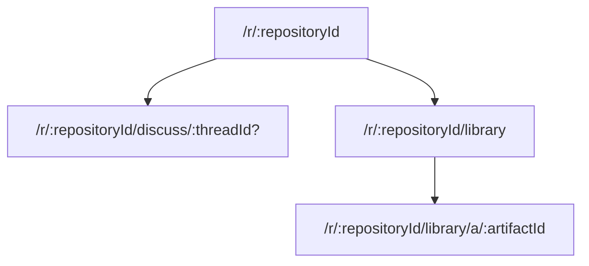
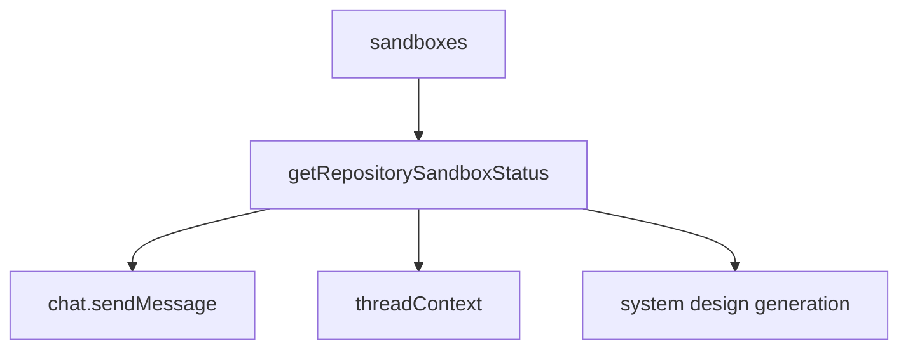

# Service Modes: Discuss, Library, and System Design

## Purpose

Systify exposes two top-level chat modes plus a background generator:

- **`discuss`** — free-form chat with two independent per-message grounding toggles:
  - **Library grounding** retrieves the repository's design artifacts and produces `[A#]` citations.
  - **Sandbox grounding** reads the live source tree through Daytona-hosted tools and produces `[path:line-line]` citations.
  - Both off → the reply is unbound LLM training-only chat.
- **`library`** — read-mostly artifact reader with an always-visible **Ask** panel running chunked-RAG over the repository's artifacts.
- **System Design generation** — background sandbox-backed job that writes the starter set of System Design artifacts (`readme_summary`, `architecture_overview`, `data_model_overview`, `api_surface_overview`, `deployment_overview`, `security_overview`, `operations_overview`) into the Library for later citation.

`discuss` is the canonical default mode; `library` requires an attached repository.

## Routing Model

`library/a/:artifactId` is the only long-form artifact reader — the artifact owns the path, and chat citations, quick-open, tabs, and folder navigation all converge on it. The active Library Ask thread is secondary view-state, carried as an optional `?ask=:threadId` query param rather than its own route. Sandbox-grounded Discuss replies render inside the standard Discuss URL — Sandbox grounding is a per-message flag on Discuss, not a separate surface.

## Library Shell Composition

The Library page does not reuse the global chat shell. It mounts `AppSidebar` in its `libraryAsk` variant — the sidebar's content slot renders the full **Library Ask** panel in place of the repository thread rail. The page itself reconstructs only the remaining chrome (header, repository switcher) plus the Library shell.

In the `libraryAsk` variant the sidebar carries a complete chat surface: an IDE-style thread tab strip on top (`LibraryAskThreadTabs`) — one tab per *open* thread, not the full list — over the conversation and the input. The `+` button starts a thread; the clock button opens `LibraryAskHistoryPopover` as a popup beneath itself. Because the panel lives in the resizable sidebar, it gets its own stored width and a roomier default than the slim Discuss thread rail.

The Library shell is then a two-column desktop layout:

- **Left — Document**: the artifact tab strip (`LibraryTabs`) and the editor.
- **Right — Folder tree**: the artifact folder navigator, collapsible via Cmd+B.

On narrow viewports the document column is the base layer and the folder tree moves into a Sheet; Library Ask rides inside the sidebar's own Sheet, opened by the header's sidebar trigger. The Library tab-strip state (`useLibraryTabs`) is owned by the page and handed to both the document column and the sidebar's Ask panel, so the artifact context stays in sync across the two. `Sidebar` mounts its children in exactly one place (docked `<aside>` *or* mobile Sheet, never both), so the Ask panel's cross-render local state (`useLibraryAskTabs`) is never split across two mounts.

The Ask thread strip is an *open set*, mirroring how the document column works: tabs are threads the user has explicitly opened (persisted per-repository in localStorage by `useLibraryAskTabs`, caching `{ id, title }` since `listThreads` is capped), the X closes a tab without deleting the thread, and the full searchable history — recall a past thread, pin it, or delete it — lives in `LibraryAskHistoryPopover` (anchored beneath the clock button rather than as a full-screen dialog). The *active* thread is the page-owned `?ask=` URL param. Thread deletion is intentionally confined to the history popover so it is never a stray click beside a close button; `LibraryAskPanel` owns the confirm-dialog flow so the deleted thread is dropped from the open set in one place.

`RepositoryThreadsRail` is the single *vertical* thread-list implementation, used by the sidebar's default `threads` variant for Discuss. Both thread surfaces scope their query to one mode (`listThreads({ mode })`): a Library Ask thread surfacing in the Discuss sidebar would be a mode leak.

`AppSidebar`'s props are a discriminated union on `variant` (`threads` vs `libraryAsk`), so each variant only accepts the callbacks it actually uses — the type system enforces the composition boundary rather than callers passing no-op handlers.

## Library Access and the Empty State

Library is reachable whenever a repository is attached to the thread. It is **not** gated on the repository having at least one artifact: a freshly imported repository can open Library immediately. When no artifact bodies exist yet, the page renders a **Generate System Design** CTA button. Clicking it confirms and then calls `requestSystemDesignGeneration`, which queues a sandbox-backed job that writes the starter set of System Design artifacts into the default folders seeded at import time.

The Discuss composer surfaces the same CTA in its grounding toggle bar: when Library grounding is closed because the repository has zero artifacts (`library_no_artifact`), the toggle bar renders the dialog opener directly.

## Discuss Grounding Toggles

The Discuss composer exposes a two-axis toggle bar (`grounding-toggle-bar.tsx`) above the input. Per-message flags `messages.groundLibrary` and `messages.groundSandbox` are persisted on both the user message (as a record of what the user asked for) and the assistant placeholder (so the generation action can read them off the queued message). Library Mode messages do not consult these flags — Library's grounding is implicit in the mode.

Per-thread defaults live on `threads.defaultGroundLibrary` and `threads.defaultGroundSandbox`. Each send updates these so reopening the thread restores the toggle state the user last sent with. The composer's `setGroundLibrary` / `setGroundSandbox` state is keyed by `threadId`, so a verdict refresh from `repositoryModeEligibility.evaluate` does not stomp on a user's mid-session click.

Capability-based model selection routes the reply based on the (mode, groundSandbox) pair:

- `groundSandbox: true` → `sandbox` tier (default `gpt-5`) — tool-using replies benefit from stronger reasoning.
- `mode: "library"` → `library` tier (default `gpt-5-mini`).
- otherwise → `discuss` tier (default `gpt-5-mini`).

Each tier can be pinned via `OPENAI_MODEL_SANDBOX` / `OPENAI_MODEL_LIBRARY` / `OPENAI_MODEL_DISCUSS`. A global `OPENAI_MODEL` is the fallback when no per-capability override is set.

## Data Model

Library reads artifact metadata through a metadata-only query and fetches the markdown body only for the active editor tab. This keeps tree, tabs, and quick-open subscriptions small.

Artifact organization is represented by `artifactFolders`; the frontend computes visible folder counts from the already-loaded artifact metadata rather than asking the backend to scan artifacts per folder.

Library Ask retrieves from `artifactChunks`, which are separate rows so chunking and embedding churn does not rewrite the parent artifact document. Missing embeddings degrade to lexical retrieval instead of blocking Ask.

Sandbox sessions are stored in `sandboxSessions`, scoped to a repository, and linked to a repository sandbox when active. A repository has one reusable sandbox session shared across every Discuss thread that uses sandbox grounding, so thread switching never reprovisions compute. The `threads.sandboxSessionId` pointer is written lazily — only when a Discuss thread actually flips the Sandbox toggle on for the first time.

## Availability

Sandbox availability is centralized in `convex/lib/repositorySandbox.ts`. Callers must not decide sandbox-grounding readiness from `sandboxes.status` alone; availability also depends on TTL, `remoteId`, and `repoPath`.

`repositoryModeEligibility.evaluate` is the canonical "can the user use this mode / grounding axis right now?" surface. It exposes:

- `availableModes` — the modes the top-level switcher should enable.
- `grounding.library` / `grounding.sandbox` — the per-axis verdict the Discuss composer's toggle bar consumes. Each axis carries a structured `reason.code` (e.g. `library_no_artifact`, `sandbox_provisioning`, `sandbox_user_cap_exceeded`) so the UI can branch on it without regex-matching tooltip strings.
- `grounding.sandbox.isActivatable` — true when the sandbox is recoverable by a click (`missing` / `expired` / `failed`) and the cost-cap gate is open.

The pure resolver lives in `convex/lib/chatEligibility.ts`; `repositoryModeEligibility.ts` augments the resolver's string reasons with structured `{ code, message, retryAfterMs? }` objects so write-path callers can throw structured `ConvexError`s.

## Job Lifecycle

System Design generation and other sandbox-backed jobs must re-check repository liveness before writing durable artifacts. If a repository is archived or deletion has started, the job fails instead of publishing new knowledge.

Long-running jobs use leases. The contract for any `system_design`-kind job (Library publication or Failure Mode Analysis) is:

- `leaseExpiresAt` is set at job-insert time, not only at the `queued → running` transition. This keeps the stale-job sweep (`by_status_and_kind_and_leaseExpiresAt` + `lt(leaseExpiresAt, now)`) able to recover a job that died before the Node action ran.
- The `queued → running` mutation refreshes the lease for a fresh window.
- Long actions refresh the lease *between* internally-serialised steps — for Library generation, this happens before each LLM-backed kind via `refreshGenerationLease` so a 5-kind publication does not overrun a single lease window.
- `recoverStaleSystemDesignJob` only fires when both `leaseExpiresAt` is set *and* has passed `now`, so a lease-less job (which is now impossible by construction) would not be falsely failed.

Library generation and Failure Mode Analysis both ride `kind: "system_design"`. Disambiguation is by `requestedCommand`: FMA writes `failure_mode_analysis:<subsystem>`, Library generation leaves it unset. The active-job dedup, the stale-recovery branch, and the UI's "in-flight" pill all share the same predicate so an FMA on the same repo does not block a Library generation, and vice versa.

## Artifact Provenance

The Library freshness UI reads the optional `lastVerifiedAt` timestamp on each artifact. Every artifact is produced by a sandbox-grounded generator (Library System Design + Failure Mode Analysis), so `createArtifactInMutation` stamps `lastVerifiedAt: now` at creation, which gates the "verified against current source" badge.

`lastVerifiedAt` is the single signal the freshness UI consults — an artifact is "verified" iff this field is set. Sandbox-grounded Discuss sessions can re-stamp it on a re-read so a re-verified artifact transitions from "unverified" back to "verified".

A re-publication overwrites the previous artifact in the same folder, so the badge always reflects the most recent verification.

## Performance Rules

- Library list queries return metadata, not `contentMarkdown`.
- Folder listing is folder-only. Counts are derived from the artifact metadata already in memory.
- Sandbox grounding readiness uses the shared availability helper.
- Repository detail queries should stay status-oriented; full artifact bodies belong to artifact-specific reads.
- Import-drift derivation resolves the latest import SHA once per repository-scoped query, never per artifact — see the Artifact Import Drift System Design.
