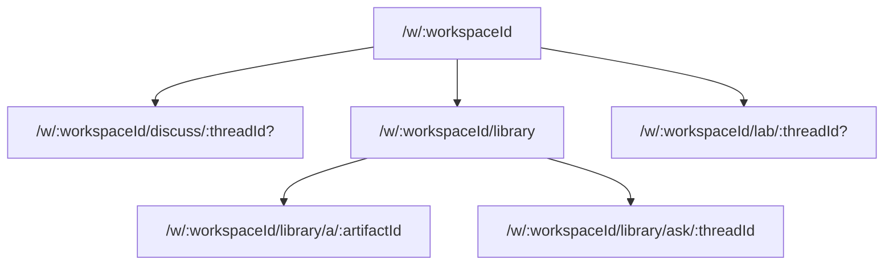
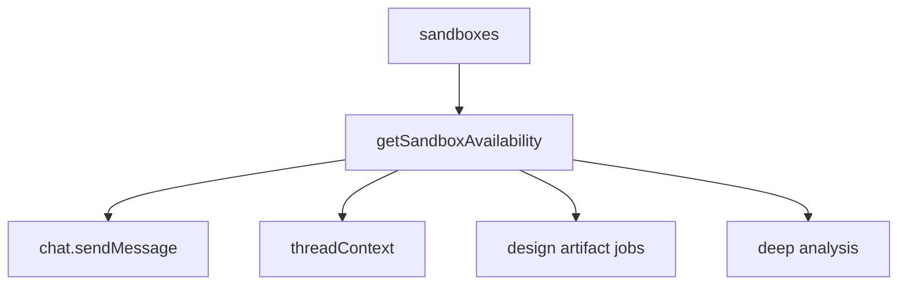

# Service Modes, Library, And Lab System Design

## Purpose

Systify uses three product-level service modes:

- `discuss`: free-form discussion with no repository grounding.
- `library`: read and ask over persisted artifacts.
- `lab`: sandbox-backed work against the live repository tree.

These modes are the canonical user-facing architecture. Older `docs` and `sandbox` terminology is not part of the current product model.

## Routing Model

`library/a/:artifactId` is the only long-form artifact reader. Chat citations, quick-open, tabs, and folder navigation all converge on this route.

## Data Model

Library reads artifact metadata through a metadata-only query and fetches the markdown body only for the active editor tab. This keeps tree, tabs, and quick-open subscriptions small.

Artifact organization is represented by `artifactFolders`; the frontend computes visible folder counts from the already-loaded artifact metadata rather than asking the backend to scan artifacts per folder.

Library Ask retrieves from `artifactChunks`, which are separate rows so chunking and embedding churn does not rewrite the parent artifact document. Missing embeddings degrade to lexical retrieval instead of blocking Ask.

Lab sessions are stored in `labSessions`, scoped to a workspace, and linked to a repository sandbox when active. A workspace has one reusable Lab session so switching Lab threads does not reprovision compute.

## Availability

Sandbox availability is centralized in `convex/lib/sandboxAvailability.ts`. Callers must not decide Lab readiness from `sandboxes.status` alone; availability also depends on TTL, `remoteId`, and `repoPath`.

## Job Lifecycle

Deep analysis and sandbox-backed design jobs must re-check repository liveness before writing durable artifacts. If a repository is archived or deletion has started, the job fails instead of publishing new knowledge.

Long-running jobs use leases. Actions refresh the lease before and after external sandbox work so stale-job recovery does not race normal completion.

## Performance Rules

- Library list queries return metadata, not `contentMarkdown`.
- Folder listing is folder-only. Counts are derived from the artifact metadata already in memory.
- Lab readiness uses the shared availability helper.
- Repository detail queries should stay status-oriented; full artifact bodies belong to artifact-specific reads.

