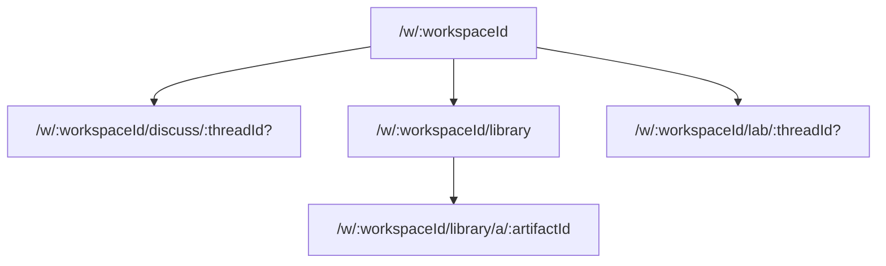
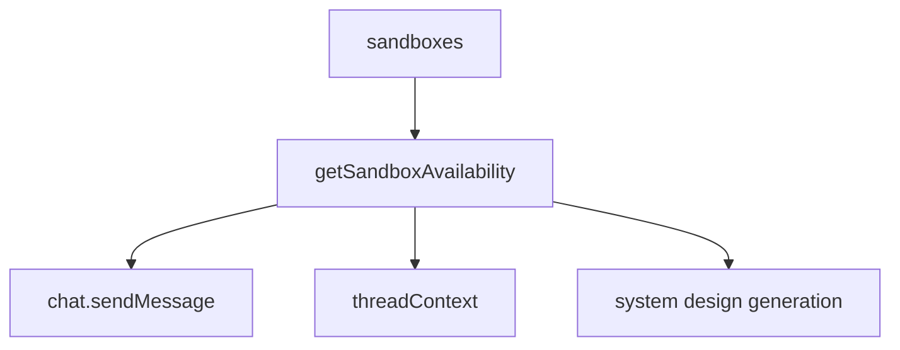

# Service Modes, Library, And Lab System Design

## Purpose

Systify uses three product-level service modes:

- `discuss`: free-form discussion with no repository grounding.
- `library`: read and ask over persisted artifacts.
- `lab`: sandbox-backed work against the live repository tree.

These modes are the canonical user-facing architecture. Older `docs` and `sandbox` terminology is not part of the current product model.

## Routing Model

`library/a/:artifactId` is the only long-form artifact reader — the artifact owns the path, and chat citations, quick-open, tabs, and folder navigation all converge on it. The active Library Ask thread is secondary view-state, carried as an optional `?ask=:threadId` query param on either Library URL rather than its own route; the legacy `/library/ask/:threadId` route redirects to the `?ask=` form.

## Library Shell Composition

The Library page does not reuse the global chat shell. It mounts `AppSidebar` in its `libraryAsk` variant — the sidebar's content slot renders the full **Library Ask** panel in place of the workspace thread rail. The page itself reconstructs only the remaining chrome (header, workspace switcher) plus the Library shell.

In the `libraryAsk` variant the sidebar carries a complete chat surface: an IDE-style thread tab strip on top (`LibraryAskThreadTabs`) — one tab per *open* thread, not the full list — over the conversation and the input. The `+` button starts a thread; the clock button opens `LibraryAskHistoryPopover` as a popup beneath itself. Because the panel lives in the resizable sidebar, it gets its own stored width and a roomier default than the slim Discuss/Lab thread rail.

The Library shell is then a two-column desktop layout:

- **Left — Document**: the artifact tab strip (`LibraryTabs`) and the editor.
- **Right — Folder tree**: the artifact folder navigator, collapsible via Cmd+B.

On narrow viewports the document column is the base layer and the folder tree moves into a Sheet; Library Ask rides inside the sidebar's own Sheet, opened by the header's sidebar trigger. The Library tab-strip state (`useLibraryTabs`) is owned by the page and handed to both the document column and the sidebar's Ask panel, so the artifact context stays in sync across the two. `Sidebar` mounts its children in exactly one place (docked `<aside>` *or* mobile Sheet, never both), so the Ask panel's cross-render local state (`useLibraryAskTabs`) is never split across two mounts.

The Ask thread strip is an *open set*, mirroring how the document column works: tabs are threads the user has explicitly opened (persisted per-workspace in localStorage by `useLibraryAskTabs`, caching `{ id, title }` since `listThreads` is capped), the X closes a tab without deleting the thread, and the full searchable history — recall a past thread, pin it, or delete it — lives in `LibraryAskHistoryPopover` (anchored beneath the clock button rather than as a full-screen dialog). The *active* thread is the page-owned `?ask=` URL param. Thread deletion is intentionally confined to the history popover so it is never a stray click beside a close button; `LibraryAskPanel` owns the confirm-dialog flow so the deleted thread is dropped from the open set in one place.

`WorkspaceThreadsRail` remains the single *vertical* thread-list implementation, used by the sidebar's default `threads` variant for Discuss and Lab. Both thread surfaces still scope their query to one mode (`listThreads({ mode })`): a Library Ask thread surfacing in the Discuss sidebar would be a mode leak.

`AppSidebar`'s props are a discriminated union on `variant` (`threads` vs `libraryAsk`), so each variant only accepts the callbacks it actually uses — the type system enforces the composition boundary rather than callers passing no-op handlers.

## Library Access and the Empty State

Library is reachable whenever the workspace has an attached repository. It is **not** gated on the repository having at least one artifact: a freshly imported repository can open Library immediately. When no artifact bodies exist yet, the page renders a **Generate System Design** CTA button. Clicking it confirms and then calls `requestSystemDesignGeneration`, which queues a sandbox-backed job that writes the starter set of System Design artifacts (`manifest`, `readme_summary`, `architecture_overview`, `data_model_overview`, `api_surface_overview`, `deployment_overview`, `security_overview`, `operations_overview`) into the default folders seeded at import time.

## Data Model

Library reads artifact metadata through a metadata-only query and fetches the markdown body only for the active editor tab. This keeps tree, tabs, and quick-open subscriptions small.

Artifact organization is represented by `artifactFolders`; the frontend computes visible folder counts from the already-loaded artifact metadata rather than asking the backend to scan artifacts per folder.

Library Ask retrieves from `artifactChunks`, which are separate rows so chunking and embedding churn does not rewrite the parent artifact document. Missing embeddings degrade to lexical retrieval instead of blocking Ask.

Lab sessions are stored in `labSessions`, scoped to a workspace, and linked to a repository sandbox when active. A workspace has one reusable Lab session so switching Lab threads does not reprovision compute.

## Availability

Sandbox availability is centralized in `convex/lib/sandboxAvailability.ts`. Callers must not decide Lab readiness from `sandboxes.status` alone; availability also depends on TTL, `remoteId`, and `repoPath`.

## Job Lifecycle

System Design generation and other sandbox-backed jobs must re-check repository liveness before writing durable artifacts. If a repository is archived or deletion has started, the job fails instead of publishing new knowledge.

Long-running jobs use leases. The contract for any `system_design`-kind job (Library publication or Failure Mode Analysis) is:

- `leaseExpiresAt` is set at job-insert time, not only at the `queued → running` transition. This keeps the stale-job sweep (`by_status_and_kind_and_leaseExpiresAt` + `lt(leaseExpiresAt, now)`) able to recover a job that died before the Node action ran.
- The `queued → running` mutation refreshes the lease for a fresh window.
- Long actions refresh the lease *between* internally-serialised steps — for Library generation, this happens before each LLM-backed kind via `refreshGenerationLease` so a 5-kind publication does not overrun a single lease window.
- `recoverStaleSystemDesignJob` only fires when both `leaseExpiresAt` is set *and* has passed `now`, so a lease-less job (which is now impossible by construction) would not be falsely failed.

Library generation and Failure Mode Analysis both ride `kind: "system_design"`. Disambiguation is by `requestedCommand`: FMA writes `failure_mode_analysis:<subsystem>`, Library generation leaves it unset. The active-job dedup, the stale-recovery branch, and the UI's "in-flight" pill all share the same predicate so an FMA on the same repo does not block a Library generation, and vice versa.

## Artifact Provenance

The `artifacts.source` field is the input to the freshness UI:

- `source: "heuristic"` — derived from imported repo metadata (no LLM). Translated by `createArtifactInMutation` to `producedIn: "legacy"`; the Library freshness UI does not award a "verified" badge.
- `source: "sandbox"` — produced by an LLM session that read live source through the sandbox tool factory (the `data_model_overview`, `api_surface_overview`, `deployment_overview`, `security_overview`, `operations_overview` kinds of Library System Design, and all Failure Mode Analysis outputs). Translated to `producedIn: "lab"` + `lastVerifiedAt: now`, which gates the "verified against current source" badge.
- `source: "llm"` — reserved for pure-LLM artifacts that did not read live source. Currently unused; future generators that do not need sandbox tools would write this.

A re-publication overwrites the previous artifact in the same folder, so the badge always reflects the most recent verification.

## Performance Rules

- Library list queries return metadata, not `contentMarkdown`.
- Folder listing is folder-only. Counts are derived from the artifact metadata already in memory.
- Lab readiness uses the shared availability helper.
- Repository detail queries should stay status-oriented; full artifact bodies belong to artifact-specific reads.
- Import-drift derivation resolves the latest import SHA once per repository-scoped query, never per artifact — see the Artifact Import Drift System Design.

