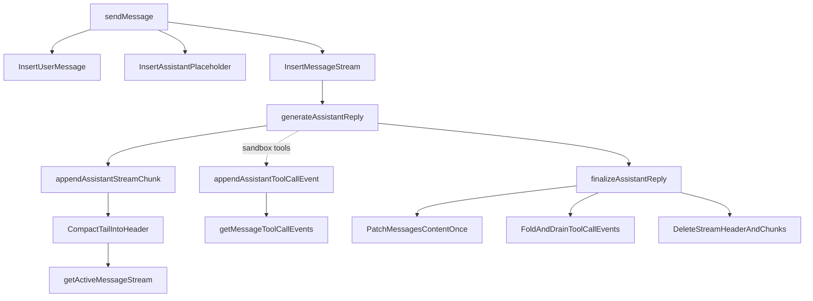
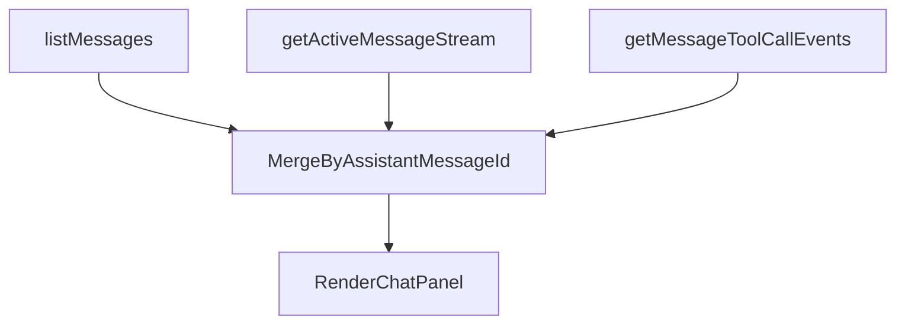
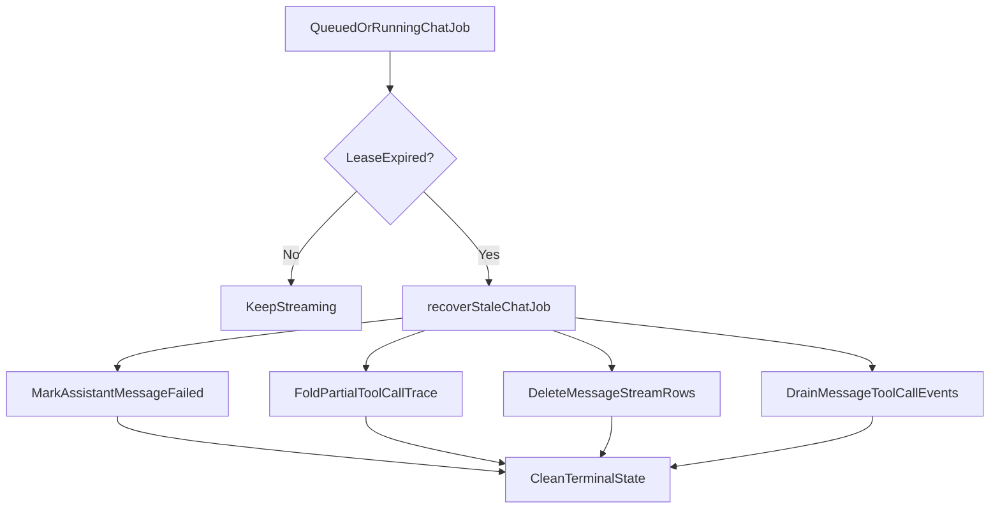

# Streaming Reply Optimization System Design

## Purpose

This document explains the long-term streaming architecture now used by Systify chat.

The design separates:

- durable chat history
- high-frequency in-flight stream state

That split improves maintainability, failure recovery, and streaming performance at the same time.

## The Problem

The old design streamed directly into `messages.content`.

That meant one `messages` row had to serve two very different jobs:

1. a stable historical record for the thread
2. a hot write target for every streamed delta

This created predictable pressure:

- every flush rewrote a growing string
- every flush re-invalidated `listMessages`
- stable history and hot stream state had no clean boundary

## Design Goals

The long-term design optimizes for five properties:

1. keep durable history and hot streaming state separate
2. make high-frequency writes small and bounded
3. keep the UI live without reloading the whole chat history query
4. make stale-job recovery leave no orphan stream state behind
5. keep the steady-state model simple enough to reason about

## Chosen Design

The system now uses four layers:

- `messages` for durable chat history (text, status, citation map, finalized tool-call trace)
- `messageStreams` for one active stream header
- `messageStreamChunks` for append-only stream tail chunks
- `messageToolCallEvents` for ephemeral tool-call `start` / `end` events (sandbox mode only)

The key rule is:

> `messages.content` is only written at terminalization time, not on every delta. The same applies to `messages.toolCalls`, which is folded from `messageToolCallEvents` only at finalize / fail / stale-recovery time.

## Data Model

### Durable layer

`messages` stays the source of truth for:

- chronological chat history
- final assistant content
- coarse status transitions such as `pending`, `streaming`, `completed`, and `failed`

### Hot layer

`messageStreams` stores one active stream row per in-flight assistant reply:

- `assistantMessageId`
- `compactedContent`
- `compactedThroughSequence`
- `nextSequence`
- timing metadata

`messageStreamChunks` stores the append-only tail:

- `streamId`
- `sequence`
- `text`

`messageToolCallEvents` stores append-only tool-call lifecycle events for sandbox-mode replies:

- `messageId`
- `toolCallId` (the AI SDK correlation key — pairs each `start` event to its matching `end`)
- `sequence` (per-message dense monotonic counter, allocated at insert)
- `type` (`"start"` | `"end"`)
- `toolName`
- redacted `inputSummary` / `outputSummary` (length-capped at `TOOL_CALL_EVENT_SUMMARY_MAX_CHARS`)
- optional `errorCode` for failed tool invocations
- `occurredAt` wall-clock timestamp

Why a separate table for tool events instead of an array on `messages`: every patch on a Convex document rewrites the full row. Two writes per tool call (`start` + `end`) on a `messages.toolCalls` array would re-marshal the entire `messages` row each time and contend with the durable `content` patch. The dedicated table follows the same write-amplification reasoning that motivated splitting `messageStreamChunks` out from `messages.content`.

## Runtime Flow

## Why Compaction Exists

If every delta stayed forever in `messageStreamChunks`, the active-stream query would eventually become expensive again.

So the design periodically compacts the oldest tail chunks into `messageStreams.compactedContent`.

That gives the system a useful balance:

- appends stay small and cheap
- the active query stays bounded
- finalization can still reconstruct the full answer reliably

## Frontend Read Boundary

The UI now reads three sources:

`listMessages` is now responsible for stable history and placeholder rows (including the finalized `messages.toolCalls` trace once a sandbox reply has settled).

`getActiveMessageStream` is responsible only for the live in-flight assistant text.

`getMessageToolCallEvents` powers the live ticker. It is gated by the `"skip"` sentinel for non-streaming messages so the historical chat list never opens one subscription per assistant bubble — only the in-flight reply (at most one per thread) holds an active query. Once the message status flips to `completed` / `failed`, the UI silently switches to the persisted `messages.toolCalls` array and the live subscription is dropped.

This prevents the whole history query from becoming the transport mechanism for every streamed delta or tool event.

## Failure Recovery

The cleanup rule is simple:

- if a reply completes, durable content is written and hot state is deleted
- if a reply fails or stalls, the durable row is marked failed (with any partial tool-call trace folded onto `messages.toolCalls`) and hot state is deleted

That prevents orphan `messageStreams`, `messageStreamChunks`, or `messageToolCallEvents` from accumulating after failures. A tool whose `start` event committed but whose `end` event never arrived folds into a `messages.toolCalls` entry with `endedAt === startedAt`, which the trace UI renders as "interrupted" so the user can tell the model didn't finish that call.

The lease-refresh heuristic in `appendAssistantStreamChunk` and `appendAssistantToolCallEvent` (refresh once half the lease window has elapsed) keeps long-running tool steps — e.g. a 15s file fetch from a cold sandbox — from being incorrectly marked stale. Without it, a slow tool with no intervening text deltas could drift past `leaseExpiresAt` while the reply is genuinely healthy.

## Why This Fits Convex Better

This design avoids two poor fits for Convex:

1. repeatedly rewriting a growing hot document
2. storing an unbounded array on one document

Instead, it uses:

- a stable durable row
- bounded append-only child rows
- explicit cleanup and compaction

That is a better match for Convex's document model and reactive invalidation behavior.

## Trade-Offs

The trade-off is extra moving parts:

- more tables
- more lifecycle code
- a UI merge step

That added complexity is deliberate, because it buys:

- lower write amplification
- lower history-query invalidation frequency
- cleaner stale-job cleanup
- a more maintainable steady-state boundary

## Result

The result is a cleaner long-term architecture:

- `messages` remains readable durable history
- the active stream is isolated to a dedicated hot surface
- final assistant content is written once
- the UI stays live without turning the whole history query into a stream transport layer
