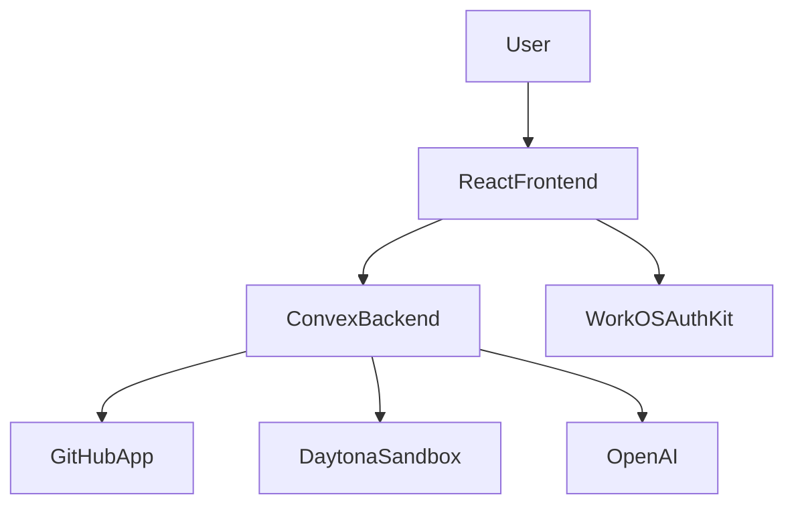
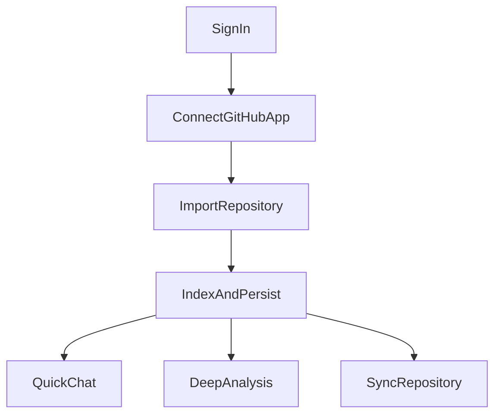

# System Overview

## Purpose

This document describes the overall system boundaries of Systify. Its goal is to give readers a clear high-level picture of how the product is put together before they dive into the data model, authentication, workflows, and integration details.

## Product Positioning

Systify is a repository-centered architecture analysis product. A user first authorizes repository access through a GitHub App, then the system imports the repository into a Daytona sandbox, extracts files and chunks, persists them into Convex, and finally offers two analysis experiences:

- Chat with three selectable modes — `discuss` (no repo context, training-only), `docs` (grounded in design artifacts), and `sandbox` (grounded in the live sandbox source tree with integrated tools for reading files and running shell commands).
- Deep analysis: a sandbox-backed background job that performs focused inspection directly against the sandboxed repository and writes a reusable `deep_analysis` artifact, which later `docs`/`sandbox` chat replies can cite.

## Main Runtime Boundaries

### Frontend

The frontend is a single-page React application built with Vite, routed with the React Router data router, and styled with Tailwind plus shadcn UI components. The entry point is `src/main.tsx`, where the main providers are layered in this order:

1. `ErrorBoundary`
2. `ThemeProvider`
3. `AuthKitProvider`
4. `ConvexProviderWithAuthKit`
5. `App`

`src/App.tsx` no longer declares the route table directly. Instead, it creates the router once with `createAppRouter()` and renders it through `<AppRouter router={router} />`.

The route table lives in `src/router.tsx`, where `appRoutes` is turned into the browser data router and defines:

- `/` through `AppLayout`
- the landing experience through `LandingRoute`
- the authenticated `/chat` surface through `ProtectedLayout`
- lazy loading for the chat page via `loadChatRoute`

Layout composition and route-guard behavior now live in `src/router-layouts.tsx`, which centralizes `AppLayout`, `LandingRoute`, and `ProtectedLayout`.

### Application Shell

The main application shell is still centered on `src/components/repository-shell.tsx`, but it no longer owns all product-level orchestration directly. The component now coordinates several extracted hooks:

- `useRepositoryActions`: sync, repository deletion, thread deletion, deep analysis, and message sending
- `useRepositorySelection`: effective repository selection and repository-loading state
- `useCheckForUpdates`: lightweight remote-commit checks on focus and repository switch
- `useGitHubConnection`, `useAsyncCallback`, `useRelativeTime`, and `useIsMobile`: focused frontend utilities used elsewhere in the shell and surrounding UI

`RepositoryShell` still coordinates the sidebar, top bar, tabs, and dialog state, but the orchestration logic is less concentrated than before.

### Backend

The backend is built entirely on Convex, with no separate Express or Nest API layer. The logic is split across five entry types:

- `query`: reads frontend-facing data such as repositories, threads, messages, and artifacts
- `mutation`: creates imports, sends messages, requests deep analysis, and deletes data
- `action` / `internalAction`: runs Node-runtime work such as GitHub App, Daytona, and OpenAI logic
- `httpAction`: handles GitHub callbacks plus GitHub and Daytona webhooks
- `cron`: periodically cleans up sandboxes and repairs webhook backlog

That means Convex simultaneously serves as the application database, application backend, background job scheduler, and a small set of HTTP integration endpoints.

## Core Modules

### 1. Auth

- The frontend uses WorkOS AuthKit for sign-in.
- After the frontend obtains an access token, it passes it into Convex through `ConvexProviderWithAuthKit`.
- Convex validates the token as a custom JWT in `convex/auth.config.ts`.
- Queries, mutations, and actions typically enforce sign-in through `requireViewerIdentity()`.

### 2. Repository import and indexing

- The user submits a GitHub repository URL.
- The system verifies that the current signed-in user has an active GitHub App installation.
- It creates `repositories`, `imports`, `jobs`, and a default `threads` record.
- `importsNode.runImportPipeline` then runs in the Node runtime to:
  - validate repository access
  - provision a sandbox
  - clone the repository
  - scan files and important content
  - generate manifest, README, and architecture artifacts
  - write results back into `repoFiles`, `repoChunks`, and `artifacts`

### 3. Chat and analysis

- The chat flow creates a `chat` job, a user message, and an assistant placeholder message.
- `internal.chat.generation.generateAssistantReply` loads context and produces a reply either through OpenAI streaming or a heuristic fallback.
- Durable chat history lives in `messages`, while active in-flight stream state lives in `messageStreams` and `messageStreamChunks`.
- When provider usage is available, chat finalization also writes token counts to `messages` and `jobs`, plus an estimated job cost.
- Deep analysis creates a `deep_analysis` job and runs focused inspection against the sandbox.

### 4. GitHub integration

- The system uses GitHub App installations rather than personal access tokens.
- Both the callback and webhook are handled in Convex `http.ts`.
- Installation state is stored in `githubInstallations`.
- CSRF state is stored in `githubOAuthStates`.
- The current product model allows at most one active installation per owner; a second different installation is treated as a conflict instead of replacing the first one.

### 5. Sandbox lifecycle

- A repository import provisions a Daytona sandbox.
- The system reserves the Convex sandbox row before calling Daytona so cleanup can still find the resource if provisioning fails mid-flight.
- After import completes, the system proactively stops the sandbox to save resources.
- The sandbox can still be reawakened later for deep analysis.
- Deep-analysis requests extend sandbox TTL before queuing the background action so a valid sandbox is less likely to expire between request acceptance and execution start.
- Daytona webhook ingestion writes a durable event inbox plus a remote-observation projection so Convex can converge faster when Daytona state changes.
- Cron-based reconciliation still handles expired sandboxes, Daytona-side orphan resources, and stuck webhook backlog, making sandbox cleanup a core reliability concern rather than a best-effort background task.

## Main User Flows

## Data And Control Flow Summary

1. The frontend owns UI state and user interaction.
2. Convex owns identity enforcement, data consistency, workflow scheduling, and persistence.
3. GitHub determines repository access and installation state.
4. Daytona provides the live execution environment for repository analysis.
5. OpenAI participates only in response and analysis generation; it is not the source of truth.

## Current Architecture Characteristics

### Strengths

- The backend is centralized in Convex, giving the system clear data and workflow boundaries.
- The relationships between repositories, jobs, sandboxes, and artifacts are explicit and easy to trace.
- GitHub and Daytona are each wrapped as clear integration boundaries.

### Trade-Offs

- `RepositoryShell` still carries a large amount of UI orchestration even after the hook extraction, so frontend state boundaries remain fairly centralized.
- Both chat and deep analysis depend on the quality of imported data and sandbox availability.
- The system still relies mainly on table status fields plus the scheduler; only Daytona webhook handling currently uses an explicit inbox-and-projection pattern.

## Further Reading

- `domain-and-data-model.md`
- `auth-and-access.md`
- `repository-lifecycle.md`
- `chat-and-analysis-pipeline.md`
- `integrations-and-operations.md`
- `orphan-resource-handling.md`

