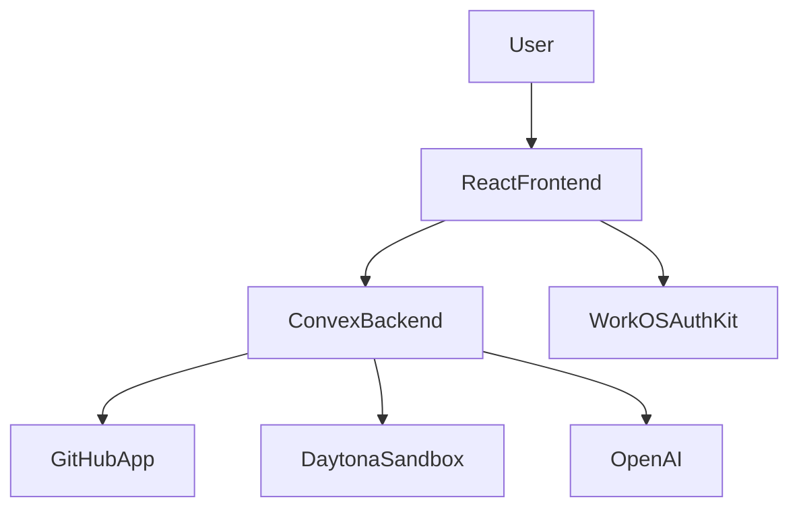
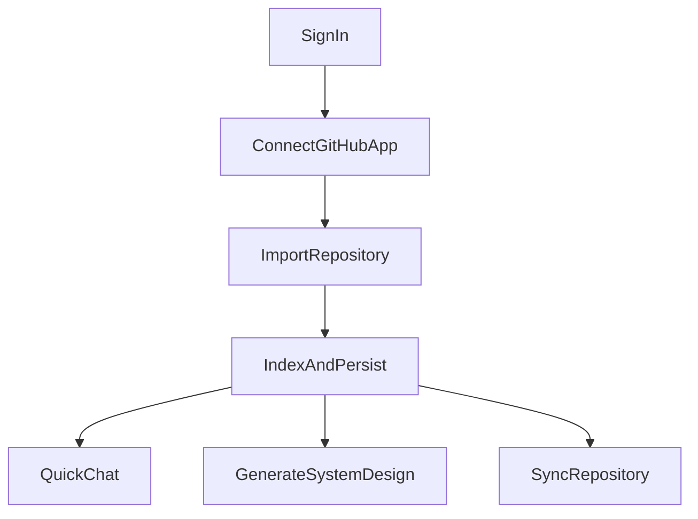

# System Overview

## Purpose

This document describes the overall system boundaries of Systify. Its goal is to give readers a clear high-level picture of how the product is put together before they dive into the data model, authentication, workflows, and integration details.

## Product Positioning

Systify is an architecture analysis workspace that treats **live imported code as the eventual source of truth (SSOT)**: indexing reads the GitHub API directly, while Lab and System Design tooling operate on Daytona-hosted clones provisioned on demand. Users may **begin without attaching a repository** (Discuss on a Home workspace) and later bind a repo so import, Library, Lab, and RAG surfaces come online. **`artifacts`** are markdown (and optionally structured traces) alongside the codebase: explanatory, citable outputs—not a substitute for the tree chunks in `repoFiles` / `repoChunks`. Over time artifacts can expose **minimal import-level drift cues** (`alignedImportCommitSha` vs the repository’s latest import SHA) separate from Lab “verification” freshness (`lastVerifiedAt`).

The product separates **Discuss** from **Library** by task:

| Surface | Primary job |
| ------- | ----------- |
| **Discuss** | Open-ended exploration across topics; artifact rail is ancillary—long-form reading is biased toward Library. |
| **Library** | Artifact-first: the **opened artifact** anchors context; Ask chat is chunked-RAG against artifacts for that repo. Threads for Library Ask stay next to Ask in layout. |

**Attach repository** attaches the GitHub **`repositories`** record to the thread’s **`workspaces`** row (workspace gains `repositoryId`); Sandbox and Lab reuse that workspace binding—they are **not** “thread-only decoration.” Attaching **does not rewrite** historical messages; only newer replies gain the new grounding via `getReplyContext`. Swapping the bound repo mid-thread is discouraged; UI may expose it behind an explicit confirmation that scrollback stays on the older context unless the user forks to a new thread.

After GitHub authorization, the system imports repositories directly through the GitHub API (no sandbox involved), extracts files and chunks into Convex, and offers three foreground service modes plus background analysis. Sandboxes are provisioned lazily — only when Lab or System Design actually needs a live filesystem:

- **Discuss**: free-form chat; defaults to **no repo** until the user attaches one to the workspace.
- **Library**: read and edit artifact markdown plus **Ask** (hybrid retrieval over artifact chunks), with layout favoring documents on one side and thread + Ask on the other.
- **Lab**: sandbox-backed exploration and guarded tools against the live tree.
- **System Design generation**: a sandbox-backed job kicked off from the **Generate System Design** button on an empty Library page. It inspects the repository and emits a starter set of System Design artifacts (`manifest`, `readme_summary`, `architecture_overview`, `data_model_overview`, `api_surface_overview`, `deployment_overview`, `security_overview`, `operations_overview`) for Library Ask / Lab citations.

## Main Runtime Boundaries

### Frontend

The frontend is a single-page React application built with Vite, routed with the React Router data router, and styled with Tailwind plus shadcn UI components. The entry point is `src/main.tsx`, where the main providers are layered in this order:

1. `ErrorBoundary`
2. `ThemeProvider`
3. `AuthKitProvider`
4. `ConvexProviderWithAuthKit`
5. `App`

`src/App.tsx` no longer declares the route table directly. Instead, it creates the router once with `createAppRouter()` and renders it through `<AppRouter router={router} />`.

The route table lives in `src/router.tsx`, where `appRoutes` is turned into the browser data router and defines:

- `/` through `AppLayout`
- the landing experience through `LandingRoute`
- the authenticated `/chat` surface through `ProtectedLayout`
- lazy loading for the chat page via `loadChatRoute`

Layout composition and route-guard behavior now live in `src/router-layouts.tsx`, which centralizes `AppLayout`, `LandingRoute`, and `ProtectedLayout`.

### Application Shell

The main application shell is still centered on `src/components/repository-shell.tsx`, but it no longer owns all product-level orchestration directly. The component now coordinates several extracted hooks:

- `useRepositoryActions`: sync, repository deletion, thread deletion, System Design generation, and message sending
- `useRepositorySelection`: effective repository selection and repository-loading state
- `useCheckForUpdates`: lightweight remote-commit checks on focus and repository switch
- `useGitHubConnection`, `useAsyncCallback`, `useRelativeTime`, and `useIsMobile`: focused frontend utilities used elsewhere in the shell and surrounding UI

`RepositoryShell` still coordinates the sidebar, top bar, tabs, and dialog state, but the orchestration logic is less concentrated than before.

### Backend

The backend is built entirely on Convex, with no separate Express or Nest API layer. The logic is split across five entry types:

- `query`: reads frontend-facing data such as repositories, threads, messages, and artifacts
- `mutation`: creates imports, sends messages, requests System Design generation, and deletes data
- `action` / `internalAction`: runs Node-runtime work such as GitHub App, Daytona, and OpenAI logic
- `httpAction`: handles GitHub callbacks plus GitHub and Daytona webhooks
- `cron`: periodically cleans up sandboxes and repairs webhook backlog

That means Convex simultaneously serves as the application database, application backend, background job scheduler, and a small set of HTTP integration endpoints.

## Core Modules

### 1. Auth

- The frontend uses WorkOS AuthKit for sign-in.
- After the frontend obtains an access token, it passes it into Convex through `ConvexProviderWithAuthKit`.
- Convex validates the token as a custom JWT in `convex/auth.config.ts`.
- Queries, mutations, and actions typically enforce sign-in through `requireViewerIdentity()`.

### 2. Repository import and indexing

- The user submits a GitHub repository URL.
- The system verifies that the current signed-in user has an active GitHub App installation.
- It creates `repositories`, `imports`, `jobs`, and a default `threads` record.
- `importsNode.runImportPipeline` then runs in the Node runtime to:
  - validate repository access via the GitHub App installation
  - fetch the repository snapshot through the GitHub API (`fetchRepositorySnapshot` in `githubRepoFetcher.ts`) — metadata, recursive tree, README, package manifests, important file contents
  - seed the default System Design folder tree for the repository
  - write `repoFiles` and `repoChunks` for retrieval
- Import is **sandbox-free**. The Daytona SDK is not touched at all by the pipeline; `repositories.latestSandboxId` is left unchanged so any sandbox previously provisioned by Lab or System Design stays put.
- Import does **not** generate any artifact bodies on its own. The user later opts into artifact creation by clicking **Generate System Design** from the empty Library page.

### 3. Chat and analysis

- The chat flow creates a `chat` job, a user message, and an assistant placeholder message.
- `internal.chat.generation.generateAssistantReply` loads context and produces a reply either through OpenAI streaming or a heuristic fallback.
- Durable chat history lives in `messages`, while active in-flight stream state lives in `messageStreams` and `messageStreamChunks`.
- When provider usage is available, chat finalization also writes token counts to `messages` and `jobs`, plus an estimated job cost.
- Library Ask retrieves artifact chunks from `artifactChunks`; Lab uses the repository sandbox through guarded tools.
- System Design generation creates a `system_design` job and runs focused inspection against the sandbox to produce a starter set of System Design artifacts (`manifest`, `readme_summary`, `architecture_overview`, `data_model_overview`, `api_surface_overview`, `deployment_overview`, `security_overview`, `operations_overview`).

### 4. GitHub integration

- The system uses GitHub App installations rather than personal access tokens.
- Both the callback and webhook are handled in Convex `http.ts`.
- Installation state is stored in `githubInstallations`.
- CSRF state is stored in `githubOAuthStates`.
- The current product model allows at most one active installation per owner; a second different installation is treated as a conflict instead of replacing the first one.

### 5. Sandbox lifecycle

- Sandboxes are provisioned **lazily**. Repository import never touches Daytona; users who only use Discuss or Library never incur sandbox cost.
- A sandbox is provisioned on the first activation of Lab on a repository (`requestSandboxActivation` → `sandboxActivationNode.runSandboxActivation`), or when System Design generation includes at least one LLM-backed kind (`systemDesignNode.runSystemDesignGeneration`, gated by `ensureSandboxReady`).
- `ensureSandboxReady` (in `convex/lib/sandboxLiveness.ts`) is the single orchestrator for "make a sandbox usable for this repository right now". It probes Daytona, wakes a stopped sandbox, or provisions a fresh one and patches `repositories.latestSandboxId` to the result.
- Cost-control affordances live on the on-demand path: the Lab status bar shows the per-session running cost from `labSessions.spentCents`, and System Design's heuristic-only generations skip Daytona entirely.
- Daytona webhook ingestion writes a durable event inbox plus a remote-observation projection so Convex can converge faster when Daytona state changes.
- Cron-based reconciliation still handles expired sandboxes, Daytona-side orphan resources, and stuck webhook backlog, making sandbox cleanup a core reliability concern rather than a best-effort background task.

## Main User Flows

## Data And Control Flow Summary

1. The frontend owns UI state and user interaction.
2. Convex owns identity enforcement, data consistency, workflow scheduling, and persistence.
3. GitHub determines repository access and installation state.
4. Daytona provides the live execution environment for repository analysis.
5. OpenAI participates only in response and analysis generation; it is not the source of truth.

## Current Architecture Characteristics

### Strengths

- The backend is centralized in Convex, giving the system clear data and workflow boundaries.
- The relationships between repositories, jobs, sandboxes, and artifacts are explicit and easy to trace.
- GitHub and Daytona are each wrapped as clear integration boundaries.

### Trade-Offs

- `RepositoryShell` still carries a large amount of UI orchestration even after the hook extraction, so frontend state boundaries remain fairly centralized.
- Library depends on artifact indexing quality; Lab and System Design generation depend on sandbox availability.
- The system still relies mainly on table status fields plus the scheduler; only Daytona webhook handling currently uses an explicit inbox-and-projection pattern.

## Further Reading

- `domain-and-data-model.md`
- `auth-and-access.md`
- `repository-lifecycle.md`
- `chat-and-analysis-pipeline.md`
- `integrations-and-operations.md`
- `orphan-resource-handling.md`

