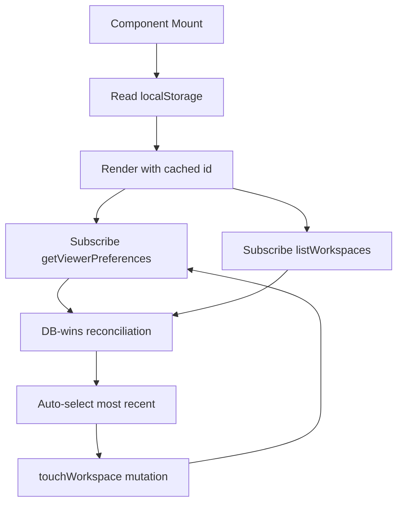

# Workspace Persistence System Design

## Purpose

This document explains how Systify remembers which workspace is "currently
active" for a viewer across sessions, browsers, and devices. It describes
why the system stores that selection in two places, which one is the source
of truth, and how reconciliation works on load and on switch.

## The Problem

`RepositoryShell` needs an "active workspace" before it can render: the
sidebar highlights it, thread queries scope to it, and the
redirect-to-most-recent-thread effect depends on it. The selection has
three competing requirements:

1. **Instant first paint.** Waiting for a Convex query before deciding which
   workspace is active produces a visible flash and a delayed sidebar.
2. **Cross-device continuity.** A user who switches workspaces on one
   browser expects the next browser / device to land in the same workspace
   on next sign-in.
3. **Resilience to deletion.** If the previously active workspace was
   deleted (locally or on another device), the UI must recover instead of
   getting stuck on a dangling id.

A pure-localStorage design solves (1) and (3) but fails (2): each browser
remembers its own pick and they never converge. A pure-DB design solves (2)
and (3) but fails (1): the shell renders blank until the preference query
resolves.

## Design Goals

The persistence design optimizes for four properties:

1. render the shell on first paint without waiting for Convex
2. converge to one selection across devices for the same viewer
3. recover gracefully when the stored selection is invalid
4. keep the source-of-truth boundary unambiguous so future preferences can
   reuse the same pattern

## Chosen Design

The selection lives in two places with explicit roles:

- `userPreferences.lastActiveWorkspaceId` is the **canonical** selection.
- `localStorage["systify.activeWorkspaceId"]` is a **first-paint cache**.

The DB always wins on conflict. The cache exists only to eliminate the
first-paint flash.



### Storage layout

`convex/schema.ts` adds a `userPreferences` table keyed by
`ownerTokenIdentifier`:

```ts
userPreferences: defineTable({
  ownerTokenIdentifier: v.string(),
  lastActiveWorkspaceId: v.optional(v.id("workspaces")),
  lastActiveWorkspaceUpdatedAt: v.optional(v.number()),
}).index("by_ownerTokenIdentifier", ["ownerTokenIdentifier"]);
```

The table is intentionally per-viewer rather than per-workspace because
"current workspace" is a property of the viewer, not the workspace. Future
viewer-level preferences (default chat mode, theme, last opened thread per
workspace) extend this table without reshaping the workspace data model.

### Atomic write boundary

Every "the user just activated this workspace" event funnels through one
mutation: `workspaces.touchWorkspace`. Inside that mutation, two writes
move together inside the same Convex transaction:

1. `workspaces.lastAccessedAt = now` — drives the sidebar's recency
   ordering and the "most recently accessed workspace" fallback.
2. `userPreferences.lastActiveWorkspaceId = workspaceId` — the canonical
   cross-device selection.

Atomicity matters. If these two writes were separate mutations, a
mid-transition reader could observe a workspace that ranks first by
`lastAccessedAt` while the preference still points elsewhere — every
client-side reconciliation rule has to assume both writes are coherent.

The shared upsert helper is in `convex/lib/userPreferences.ts`. It is
idempotent: calling `touchWorkspace` repeatedly on the same workspace skips
the patch entirely so subscriptions on `getViewerPreferences` stay stable.

### Read path

`convex/userPreferences.ts` exports `getViewerPreferences`. It loads the
viewer's row, validates that the stored `lastActiveWorkspaceId` still
exists and still belongs to the viewer, and exposes `null` for the field
when validation fails. The frontend therefore never sees a dangling id; it
only ever sees one of:

- `null` — the viewer has no preference yet (first visit, or every cache
  miss before any explicit switch)
- `{ lastActiveWorkspaceId: null, ... }` — preference exists but its
  workspace was deleted (rare; usually pre-empted by the cascade below)
- `{ lastActiveWorkspaceId: Id<"workspaces">, ... }` — a valid selection

### Frontend reconciliation

`src/components/repository-shell.tsx` runs three effects in order:

1. **First-paint cache.** `useState` initializer reads
   `localStorage["systify.activeWorkspaceId"]` synchronously so the first
   render already has a workspace id.
2. **DB-wins reconciliation** (live, not one-shot). Whenever both
   `listWorkspaces` and `getViewerPreferences` are resolved, if the DB
   carries a different selection than the local state *and* that workspace
   still exists, the local state is updated to match the DB. No write is
   issued — the DB is already authoritative. Because the effect re-runs on
   every change to `viewerPreferences`, a switch from another tab
   propagates here the moment Convex pushes the row update.
3. **Fallback + seeding.** If the active id is missing or no longer valid,
   pick the most recently accessed workspace and call `touchWorkspace` on
   it. This both promotes the fallback into the DB (so a brand-new browser
   converges immediately on next load) and bumps `lastAccessedAt` so the
   sidebar order matches the actual selection.

The reconciliation effect previously needed a one-shot `useRef` guard to
prevent a stale in-flight `viewerPreferences` snapshot from bouncing the
user back during their own explicit switch. The guard is no longer needed
because `touchWorkspace` carries an
[optimistic update](https://docs.convex.dev/client/react/optimistic-updates)
that mirrors the server-side mutation locally: `lastActiveWorkspaceId` and
the matching `workspaces.lastAccessedAt` row are updated in the local
Convex query cache the moment the user clicks. The reconciliation effect
therefore observes a coherent local snapshot during the in-flight window
and never bounces. Removing the guard is what unlocks live cross-tab
propagation.

### Deletion cascade

`workspaces.deleteWorkspace` clears
`userPreferences.lastActiveWorkspaceId` if it pointed at the deleted
workspace. Without this, a stale id would persist in the DB until the next
`getViewerPreferences` call dropped it on read; the cascade keeps the
table internally consistent and avoids relying on the read-time defense
under steady-state operation.

The read-time defense in `loadViewerPreferences` is still kept as
defense-in-depth for legacy rows or any code path that bypasses the public
`deleteWorkspace` mutation.

### Orphan cleanup

The active-workspace pointer is only one of several localStorage entries
scoped to a workspace or repository — the Library tab strip
(`systify.library.tabs.{wsId}`), the Ask tab strip
(`systify.library.askTabs.{wsId}`), and the folder navigator's
per-node open state (`systify.folderNav.open.{repoId}.{nodeId}`) are also
keyed by id. When the owning workspace or repository is deleted, those
keys would otherwise accumulate in the user's browser indefinitely.

`useStorageGC` (in `src/hooks/use-storage-gc.ts`) is mounted by
`RepositoryShell` and sweeps the prefixes against the live id sets coming
from the same `listWorkspaces` / `listRepositories` queries the shell
already subscribes to. The hook handles three trigger paths uniformly:

- **Initial load.** The first non-null snapshot of the live id sets
  garbage-collects any keys left over from a previous session (e.g. the
  user deleted a workspace on another device while this browser was
  closed).
- **Local deletion.** When the user deletes a workspace or repository in
  this tab, the mutation's reactivity drops the id from the local query
  cache, the live id set shrinks, and the sweep runs.
- **Cross-tab deletion.** Convex pushes the updated `listWorkspaces` /
  `listRepositories` snapshot to every open tab. The same hook runs in
  every tab and reaps the orphan keys without an additional handshake.

The hook is intentionally a no-op while the upstream query is still loading
(`liveWorkspaceIds === null`), so a fresh mount does not mistakenly treat
every cached key as an orphan during the initial query window. The
active-workspace pointer (`systify.activeWorkspaceId`) is *not* swept by
this hook — the fallback effect in `RepositoryShell` already resets it to
a surviving workspace, which is sufficient.

## Why DB Wins On Conflict

The reconciliation rule "DB beats cache" is the heart of this design.
Three scenarios make it concrete:

- **Cross-device switch.** Device A switches to Workspace X, the mutation
  writes `lastActiveWorkspaceId = X`. Device B opens the app: cache says
  the old workspace, DB says X. Reconciliation adopts X.
- **Cleared cache.** User clears localStorage on Device A. Cache is empty,
  DB still has X. Reconciliation adopts X without a flash because the
  fallback effect waits for `viewerPreferences` before running.
- **Stale cache after deletion.** Device A's cache points at a workspace
  deleted on Device B. The DB-wins pass sees no valid replacement (the
  preference was cascade-cleared on B), the fallback effect picks the most
  recent surviving workspace and writes it back as the new preference.

The opposite rule — cache beats DB — would let a single browser pin the
selection forever even after the user explicitly switched somewhere else.
That is exactly the bug the previous localStorage-only design had.

## Why Not Pure DB

The cache is preserved (rather than dropped in favor of "wait for the
query") for two reasons:

1. **First paint matters.** The shell's sidebar, thread list, and
   redirect-to-most-recent effect all depend on the active workspace.
   Rendering a skeleton until a query resolves produces a visibly worse
   load experience for a value that almost always matches the cache.
2. **Auth bootstrap latency.** During the WorkOS → Convex token handoff
   `getViewerPreferences` cannot resolve. The cache lets the shell render
   the previous selection while auth completes; reconciliation then
   adopts the DB value if it differs.

These benefits are essentially free because the cache is purely an
optimization: every conflict is resolved in the DB's favor, so an
out-of-date cache only ever costs a single re-render.

## Why Not Embed The Selection On `workspaces`

An alternative considered was storing the canonical selection back onto
`workspaces` itself — for example, picking the row with the maximum
`lastAccessedAt` and treating that as "current workspace". This is what the
previous design implicitly relied on.

The problem is that `lastAccessedAt` and "current workspace" are not the
same concept. `lastAccessedAt` is also bumped by import flows
(`ensureRepositoryWorkspace`) and other indirect paths that should *not*
imply a viewer-visible "current" change. Folding the two together couples
unrelated concerns and forces every writer of `lastAccessedAt` to reason
about whether it should also affect the cross-device selection.

A dedicated `userPreferences` row makes the boundary explicit: only
`touchWorkspace` writes `lastActiveWorkspaceId`, and every call site of
`touchWorkspace` is already an explicit "the user activated this
workspace" signal.

## Failure Modes And Bounds

- **Mutation failure on switch.** `handleSwitchWorkspace` issues
  `touchWorkspace` with `.catch(() => {})` so a transient network failure
  doesn't break the optimistic UI. The DB stays on the previous value
  until the next successful switch; localStorage carries the new value
  locally. Reconciliation on next mount would normally reset to the DB
  value — this is acceptable because the *user-visible* outcome is "your
  switch didn't sync," which matches reality.
- **localStorage disabled.** All reads and writes are wrapped in
  try/catch. Without a cache, the first paint shows whatever the fallback
  resolves to; once `getViewerPreferences` lands, reconciliation behaves
  the same as a fresh device.
- **Multiple tabs.** Convex pushes the updated `viewerPreferences` row to
  every open tab in real time. The reconciliation effect re-runs on every
  `viewerPreferences` change, so a switch in tab A propagates to tab B
  live — no remount, navigation, or reload required. The race that used
  to need a one-shot guard (an in-flight stale push overwriting the
  user's local switch in the same tab) is neutralised by the optimistic
  update on `touchWorkspace`: the local query cache carries the new
  selection from the moment the user clicks, so the reconciliation
  effect never observes a "stale DB / fresh local" diff. localStorage
  stays consistent because every tab mirrors the same canonical id back
  to disk after each reconciliation.
- **In-flight switch.** When the user explicitly switches workspaces,
  `touchWorkspace`'s optimistic update writes the new
  `viewerPreferences` value into the local Convex cache before the
  mutation reaches the server. The reconciliation effect therefore
  observes "DB = user's pick" during the entire in-flight window and
  cannot bounce the user back. If the optimistic update is ever rolled
  back (e.g. the mutation throws), Convex restores the prior cache
  value and the reconciliation effect realigns local state with the
  server's truth.

## Trade-Offs

The design accepts three trade-offs:

- **One extra subscription per shell mount** for `getViewerPreferences`.
  Cost is bounded by Convex's query semantics; the row is at most one
  document and only changes on explicit user action.
- **Two writes per switch instead of one.** Both writes are inside one
  Convex transaction so total round-trips stay at one; the cost is one
  additional document mutation per switch.
- **A small reconciliation surface in the frontend.** The cache + DB
  model has more states to reason about than either pure design, but the
  rules are bounded ("DB always wins on conflict; cache only fills the
  first-paint gap") and live in a single component.

## Summary

The viewer's current workspace is canonically a Convex
`userPreferences.lastActiveWorkspaceId` row, written atomically with
`workspaces.lastAccessedAt` inside `touchWorkspace`. localStorage is a
first-paint cache only. On every mount, the shell renders with the cache,
adopts the DB value when it differs, and seeds the DB from a fallback
when no preference exists yet. Cross-device continuity, instant first
paint, and resilience to deletion all coexist because the source-of-truth
boundary is explicit.
